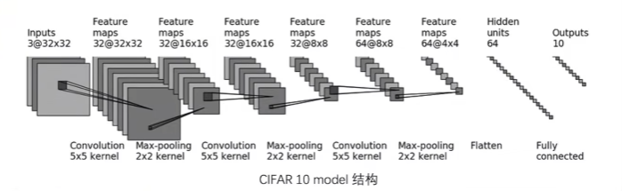
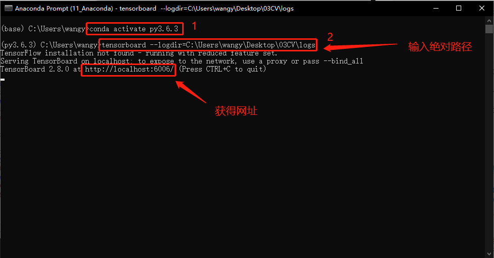
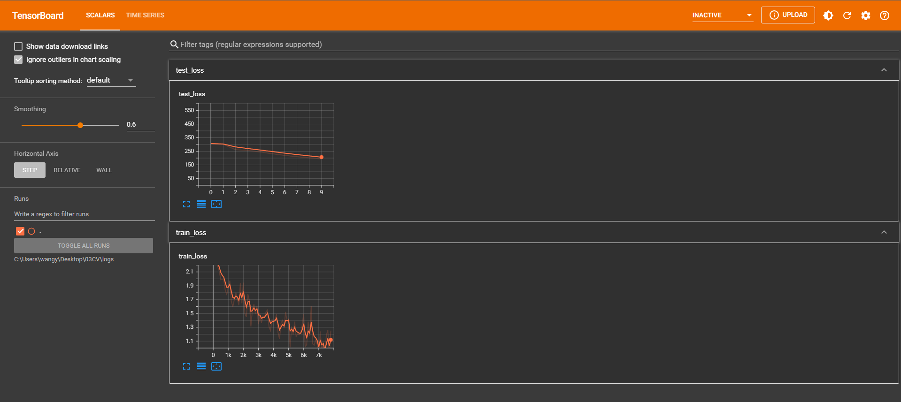

# 1.CIFAR 10 model 网络模型

① 下面用 CIFAR 10 model网络来完成分类问题，网络模型如下图所示。


# 2. DataLoader加载数据集
```python
import torchvision
from torch import nn
from torch.utils.data import DataLoader

# 准备数据集
train_data = torchvision.datasets.CIFAR10("./dataset",train=True,transform=torchvision.transforms.ToTensor(),download=True)       
test_data = torchvision.datasets.CIFAR10("./dataset",train=False,transform=torchvision.transforms.ToTensor(),download=True)       

# length 长度
train_data_size = len(train_data)
test_data_size = len(test_data)
# 如果train_data_size=10，则打印：训练数据集的长度为：10
print("训练数据集的长度：{}".format(train_data_size))
print("测试数据集的长度：{}".format(test_data_size))

# 利用 Dataloader 来加载数据集
train_dataloader = DataLoader(train_data_size, batch_size=64)        
test_dataloader = DataLoader(test_data_size, batch_size=64)
```
```
Files already downloaded and verified
Files already downloaded and verified
训练数据集的长度：50000
测试数据集的长度：10000

```
# 3. 测试网络正确
```python
import torch
from torch import nn

# 搭建神经网络
class Tudui(nn.Module):
    def __init__(self):
        super(Tudui, self).__init__()        
        self.model1 = nn.Sequential(
            nn.Conv2d(3,32,5,1,2),  # 输入通道3，输出通道32，卷积核尺寸5×5，步长1，填充2    
            nn.MaxPool2d(2),
            nn.Conv2d(32,32,5,1,2),
            nn.MaxPool2d(2),
            nn.Conv2d(32,64,5,1,2),
            nn.MaxPool2d(2),
            nn.Flatten(),  # 展平后变成 64*4*4 了
            nn.Linear(64*4*4,64),
            nn.Linear(64,10)
        )
        
    def forward(self, x):
        x = self.model1(x)
        return x
    
if __name__ == '__main__':
    tudui = Tudui()
    input = torch.ones((64,3,32,32))
    output = tudui(input)
    print(output.shape)  # 测试输出的尺寸是不是我们想要的
```
```
torch.Size([64, 10])

```
# 4. 网络训练数据
```python
import torchvision
from torch import nn
from torch.utils.data import DataLoader

# from model import * 相当于把 model中的所有内容写到这里，这里直接把 model 写在这里
class Tudui(nn.Module):
    def __init__(self):
        super(Tudui, self).__init__()        
        self.model1 = nn.Sequential(
            nn.Conv2d(3,32,5,1,2),  # 输入通道3，输出通道32，卷积核尺寸5×5，步长1，填充2    
            nn.MaxPool2d(2),
            nn.Conv2d(32,32,5,1,2),
            nn.MaxPool2d(2),
            nn.Conv2d(32,64,5,1,2),
            nn.MaxPool2d(2),
            nn.Flatten(),  # 展平后变成 64*4*4 了
            nn.Linear(64*4*4,64),
            nn.Linear(64,10)
        )
        
    def forward(self, x):
        x = self.model1(x)
        return x

# 准备数据集
train_data = torchvision.datasets.CIFAR10("./dataset",train=True,transform=torchvision.transforms.ToTensor(),download=True)       
test_data = torchvision.datasets.CIFAR10("./dataset",train=False,transform=torchvision.transforms.ToTensor(),download=True)       

# length 长度
train_data_size = len(train_data)
test_data_size = len(test_data)
# 如果train_data_size=10，则打印：训练数据集的长度为：10
print("训练数据集的长度：{}".format(train_data_size))
print("测试数据集的长度：{}".format(test_data_size))

# 利用 Dataloader 来加载数据集
train_dataloader = DataLoader(train_data, batch_size=64)        
test_dataloader = DataLoader(test_data, batch_size=64)

# 创建网络模型
tudui = Tudui() 

# 损失函数
loss_fn = nn.CrossEntropyLoss() # 交叉熵，fn 是 fuction 的缩写

# 优化器
learning = 0.01  # 1e-2 就是 0.01 的意思
optimizer = torch.optim.SGD(tudui.parameters(),learning)   # 随机梯度下降优化器  

# 设置网络的一些参数
# 记录训练的次数
total_train_step = 0

# 训练的轮次
epoch = 10

for i in range(epoch):
    print("-----第 {} 轮训练开始-----".format(i+1))
    
    # 训练步骤开始
    for data in train_dataloader:
        imgs, targets = data
        outputs = tudui(imgs)
        loss = loss_fn(outputs, targets) # 计算实际输出与目标输出的差距
        
        # 优化器对模型调优
        optimizer.zero_grad()  # 梯度清零
        loss.backward() # 反向传播，计算损失函数的梯度
        optimizer.step()   # 根据梯度，对网络的参数进行调优
        
        total_train_step = total_train_step + 1
        #print("训练次数：{}，Loss：{}".format(total_train_step,loss))  # 方式一：获得loss值
        print("训练次数：{}，Loss：{}".format(total_train_step,loss.item()))  # 方式二：获得loss值
```
```
Files already downloaded and verified
Files already downloaded and verified
训练数据集的长度：50000
测试数据集的长度：10000
-----第 1 轮训练开始-----
训练次数：1，Loss：2.3299059867858887
训练次数：2，Loss：2.3018362522125244
训练次数：3，Loss：2.2983856201171875
训练次数：4，Loss：2.310598611831665
训练次数：5，Loss：2.302191972732544
训练次数：6，Loss：2.303790807723999
训练次数：7，Loss：2.2937326431274414
训练次数：8，Loss：2.285353899002075
训练次数：9，Loss：2.3008460998535156
训练次数：10，Loss：2.287691116333008
训练次数：11，Loss：2.3104374408721924
训练次数：12，Loss：2.2906105518341064
训练次数：13，Loss：2.3315541744232178
训练次数：14，Loss：2.315488815307617
训练次数：15，Loss：2.30043888092041
训练次数：16，Loss：2.3099758625030518
训练次数：17，Loss：2.318608522415161
训练次数：18，Loss：2.312786340713501
训练次数：19，Loss：2.305506944656372
训练次数：20，Loss：2.286158323287964
训练次数：21，Loss：2.2990760803222656
训练次数：22，Loss：2.292771577835083
训练次数：23，Loss：2.29740047454834
训练次数：24，Loss：2.3178415298461914
训练次数：25，Loss：2.305537700653076
训练次数：26，Loss：2.3083934783935547
训练次数：27，Loss：2.296882390975952
训练次数：28，Loss：2.3064374923706055
训练次数：29，Loss：2.3164706230163574
训练次数：30，Loss：2.29710054397583
训练次数：31，Loss：2.3098485469818115
训练次数：32，Loss：2.2966601848602295
训练次数：33，Loss：2.3126823902130127
训练次数：34，Loss：2.31775164604187
训练次数：35，Loss：2.3058218955993652
训练次数：36，Loss：2.2940220832824707
训练次数：37，Loss：2.3078866004943848
训练次数：38，Loss：2.3062171936035156
训练次数：39，Loss：2.2826128005981445
训练次数：40，Loss：2.322798490524292
训练次数：41，Loss：2.302129030227661
训练次数：42，Loss：2.293274402618408
训练次数：43，Loss：2.3074376583099365
训练次数：44，Loss：2.306595802307129
训练次数：45，Loss：2.308440923690796
训练次数：46，Loss：2.3024537563323975
训练次数：47，Loss：2.309048652648926
训练次数：48，Loss：2.3002734184265137
训练次数：49，Loss：2.310145378112793
训练次数：50，Loss：2.3005669116973877
训练次数：51，Loss：2.306333541870117
训练次数：52，Loss：2.3010079860687256
训练次数：53，Loss：2.3016834259033203
训练次数：54，Loss：2.3054633140563965
训练次数：55，Loss：2.310889959335327
训练次数：56，Loss：2.304459810256958
训练次数：57，Loss：2.29695725440979
训练次数：58，Loss：2.306687355041504
训练次数：59，Loss：2.299586296081543
训练次数：60，Loss：2.310194253921509
训练次数：61，Loss：2.2999770641326904
训练次数：62，Loss：2.2912421226501465
训练次数：63，Loss：2.3000648021698
训练次数：64，Loss：2.3029651641845703
训练次数：65，Loss：2.3187732696533203
训练次数：66，Loss：2.302055597305298
训练次数：67，Loss：2.2804009914398193
训练次数：68，Loss：2.2958924770355225
训练次数：69，Loss：2.304973840713501
训练次数：70，Loss：2.312486410140991
训练次数：71，Loss：2.304438829421997
训练次数：72，Loss：2.2946014404296875
训练次数：73，Loss：2.303915500640869
训练次数：74，Loss：2.2963624000549316
训练次数：75，Loss：2.298151969909668
训练次数：76，Loss：2.2912936210632324
训练次数：77，Loss：2.294659376144409
训练次数：78，Loss：2.2953453063964844
训练次数：79，Loss：2.303128242492676
训练次数：80，Loss：2.3078455924987793
训练次数：81，Loss：2.3128483295440674
训练次数：82，Loss：2.3094112873077393
训练次数：83，Loss：2.288151502609253
训练次数：84，Loss：2.2850561141967773
训练次数：85，Loss：2.307574987411499
训练次数：86，Loss：2.2935259342193604
训练次数：87，Loss：2.3055336475372314
训练次数：88，Loss：2.30717396736145
训练次数：89，Loss：2.293139934539795
训练次数：90，Loss：2.3036820888519287
训练次数：91，Loss：2.2836358547210693
训练次数：92，Loss：2.3046040534973145
训练次数：93，Loss：2.2929799556732178
训练次数：94，Loss：2.2807157039642334
训练次数：95，Loss：2.3127975463867188
训练次数：96，Loss：2.2958579063415527
训练次数：97，Loss：2.298449993133545
训练次数：98，Loss：2.304929256439209
训练次数：99，Loss：2.3062713146209717
训练次数：100，Loss：2.300260066986084
训练次数：101，Loss：2.3093199729919434
训练次数：102，Loss：2.309932231903076
训练次数：103，Loss：2.3089828491210938
训练次数：104，Loss：2.3065028190612793
训练次数：105，Loss：2.3011741638183594
训练次数：106，Loss：2.309077501296997
训练次数：107，Loss：2.295560598373413
训练次数：108，Loss：2.3017048835754395
训练次数：109，Loss：2.3060178756713867
训练次数：110，Loss：2.2938525676727295
训练次数：111，Loss：2.2979543209075928
训练次数：112，Loss：2.309142827987671
训练次数：113，Loss：2.303762912750244
训练次数：114，Loss：2.3010220527648926
训练次数：115，Loss：2.305438756942749
训练次数：116，Loss：2.2952020168304443
训练次数：117，Loss：2.3026654720306396
训练次数：118，Loss：2.294158458709717
训练次数：119，Loss：2.2932770252227783
训练次数：120，Loss：2.2954463958740234
训练次数：121，Loss：2.3004543781280518
训练次数：122，Loss：2.3035435676574707
训练次数：123，Loss：2.2995617389678955
训练次数：124，Loss：2.30790376663208
训练次数：125，Loss：2.2892143726348877
训练次数：126，Loss：2.302595615386963
训练次数：127，Loss：2.2902259826660156
训练次数：128，Loss：2.311476469039917
训练次数：129，Loss：2.2997777462005615
训练次数：130，Loss：2.294060230255127
训练次数：131，Loss：2.304283618927002
训练次数：132，Loss：2.290736198425293
训练次数：133，Loss：2.2980568408966064
训练次数：134，Loss：2.281264543533325
训练次数：135，Loss：2.2954182624816895
训练次数：136，Loss：2.2809276580810547
训练次数：137，Loss：2.2986412048339844
训练次数：138，Loss：2.3010497093200684
训练次数：139，Loss：2.2926042079925537
训练次数：140，Loss：2.2879669666290283
训练次数：141，Loss：2.300187110900879
训练次数：142，Loss：2.2904293537139893
训练次数：143，Loss：2.3037686347961426
训练次数：144，Loss：2.3058440685272217
训练次数：145，Loss：2.2944135665893555
训练次数：146，Loss：2.3070576190948486
训练次数：147，Loss：2.298339366912842
训练次数：148，Loss：2.2864749431610107
训练次数：149，Loss：2.2897090911865234
训练次数：150，Loss：2.3060977458953857
训练次数：151，Loss：2.294865369796753
训练次数：152，Loss：2.280426263809204
训练次数：153，Loss：2.3068554401397705
训练次数：154，Loss：2.2978501319885254
训练次数：155，Loss：2.2984933853149414
训练次数：156，Loss：2.301605463027954
训练次数：157，Loss：2.2950265407562256
训练次数：158，Loss：2.2884750366210938
训练次数：159，Loss：2.282492160797119
训练次数：160，Loss：2.3050732612609863
训练次数：161，Loss：2.2776525020599365
训练次数：162，Loss：2.2752368450164795
训练次数：163，Loss：2.3032288551330566
训练次数：164，Loss：2.2997372150421143
训练次数：165，Loss：2.294461965560913
训练次数：166，Loss：2.292156934738159
训练次数：167，Loss：2.276153326034546
训练次数：168，Loss：2.301332950592041
训练次数：169，Loss：2.2868752479553223
训练次数：170，Loss：2.2892491817474365
训练次数：171，Loss：2.298704147338867
训练次数：172，Loss：2.285155773162842
训练次数：173，Loss：2.283578395843506
训练次数：174，Loss：2.303832769393921
训练次数：175，Loss：2.3059041500091553
训练次数：176，Loss：2.286128044128418
训练次数：177，Loss：2.289067029953003
训练次数：178，Loss：2.3150224685668945
训练次数：179，Loss：2.3067777156829834
训练次数：180，Loss：2.2994213104248047
训练次数：181，Loss：2.2919492721557617
训练次数：182，Loss：2.2958824634552
训练次数：183，Loss：2.2874956130981445
训练次数：184，Loss：2.3123106956481934
训练次数：185，Loss：2.298128366470337
训练次数：186，Loss：2.2990314960479736
训练次数：187，Loss：2.2910873889923096
训练次数：188，Loss：2.2910773754119873
训练次数：189，Loss：2.2959139347076416
训练次数：190，Loss：2.2944557666778564
训练次数：191，Loss：2.287872314453125
训练次数：192，Loss：2.273454189300537
训练次数：193，Loss：2.3019275665283203
训练次数：194，Loss：2.2898852825164795
训练次数：195，Loss：2.279698610305786
训练次数：196，Loss：2.2820968627929688
训练次数：197，Loss：2.3040127754211426
训练次数：198，Loss：2.2944400310516357
训练次数：199，Loss：2.306603193283081
训练次数：200，Loss：2.286862850189209
训练次数：201，Loss：2.281859874725342
训练次数：202，Loss：2.2750532627105713
训练次数：203，Loss：2.295332670211792
训练次数：204，Loss：2.2791826725006104
训练次数：205，Loss：2.281740427017212
训练次数：206，Loss：2.299114227294922
训练次数：207，Loss：2.2929558753967285
训练次数：208，Loss：2.297963857650757
训练次数：209，Loss：2.283318281173706
训练次数：210，Loss：2.2953009605407715
训练次数：211，Loss：2.2872984409332275
训练次数：212，Loss：2.2892117500305176
训练次数：213，Loss：2.2686092853546143
训练次数：214，Loss：2.2977147102355957
训练次数：215，Loss：2.2763607501983643
训练次数：216，Loss：2.3112378120422363
训练次数：217，Loss：2.2815334796905518
训练次数：218，Loss：2.2990846633911133
训练次数：219，Loss：2.2964279651641846
训练次数：220，Loss：2.2899692058563232
训练次数：221，Loss：2.3048977851867676
训练次数：222，Loss：2.2921648025512695
训练次数：223，Loss：2.30191969871521
训练次数：224，Loss：2.2882003784179688
训练次数：225，Loss：2.296495199203491
训练次数：226，Loss：2.2919490337371826
训练次数：227，Loss：2.2877871990203857
训练次数：228，Loss：2.2829678058624268
训练次数：229，Loss：2.2889556884765625
训练次数：230，Loss：2.29695200920105
训练次数：231，Loss：2.2876715660095215
训练次数：232，Loss：2.2931864261627197
训练次数：233，Loss：2.27797794342041
训练次数：234，Loss：2.3041343688964844
训练次数：235，Loss：2.290201187133789
训练次数：236，Loss：2.2934536933898926
训练次数：237，Loss：2.301241636276245
训练次数：238，Loss：2.3050951957702637
训练次数：239，Loss：2.283087730407715
训练次数：240，Loss：2.2880442142486572
训练次数：241，Loss：2.3012588024139404
训练次数：242，Loss：2.293797731399536
训练次数：243，Loss：2.279834508895874
训练次数：244，Loss：2.2954025268554688
训练次数：245，Loss：2.274653196334839
训练次数：246，Loss：2.291161060333252
训练次数：247，Loss：2.2908172607421875
训练次数：248，Loss：2.290529727935791
训练次数：249，Loss：2.2852139472961426
训练次数：250，Loss：2.3024256229400635
训练次数：251，Loss：2.280500888824463
训练次数：252，Loss：2.261605978012085
训练次数：253，Loss：2.2734155654907227

```
```
训练次数：254，Loss：2.276651620864868
训练次数：255，Loss：2.2920918464660645
训练次数：256，Loss：2.292379856109619
训练次数：257，Loss：2.2947182655334473
训练次数：258，Loss：2.2737269401550293
训练次数：259，Loss：2.276481866836548
训练次数：260，Loss：2.2916879653930664
训练次数：261，Loss：2.2894699573516846
训练次数：262，Loss：2.2846686840057373
训练次数：263，Loss：2.286881446838379
训练次数：264，Loss：2.2897400856018066
训练次数：265，Loss：2.2885563373565674
训练次数：266，Loss：2.267735719680786
训练次数：267，Loss：2.2872536182403564
训练次数：268，Loss：2.2832367420196533
训练次数：269，Loss：2.277830123901367
训练次数：270，Loss：2.2616238594055176
训练次数：271，Loss：2.294987916946411
训练次数：272，Loss：2.2794108390808105
训练次数：273，Loss：2.273865222930908
训练次数：274，Loss：2.2733335494995117
训练次数：275，Loss：2.3022303581237793
训练次数：276，Loss：2.2857823371887207
训练次数：277，Loss：2.29938006401062
训练次数：278，Loss：2.282853126525879
训练次数：279，Loss：2.2951548099517822
训练次数：280，Loss：2.2780234813690186
训练次数：281，Loss：2.2716073989868164
训练次数：282，Loss：2.2831430435180664
训练次数：283，Loss：2.2874412536621094
训练次数：284，Loss：2.278059244155884
训练次数：285，Loss：2.2678756713867188
训练次数：286，Loss：2.2828824520111084
训练次数：287，Loss：2.288066864013672
训练次数：288，Loss：2.272616147994995
训练次数：289，Loss：2.2963719367980957
训练次数：290，Loss：2.273092746734619
训练次数：291，Loss：2.276754856109619
训练次数：292，Loss：2.291492223739624
训练次数：293，Loss：2.259737491607666
训练次数：294，Loss：2.264927864074707
训练次数：295，Loss：2.2761716842651367
训练次数：296，Loss：2.275442123413086
训练次数：297，Loss：2.28678297996521
训练次数：298，Loss：2.265345811843872
训练次数：299，Loss：2.2535927295684814
训练次数：300，Loss：2.2747952938079834
训练次数：301，Loss：2.2843823432922363
训练次数：302，Loss：2.2811760902404785
训练次数：303，Loss：2.2732322216033936
训练次数：304，Loss：2.2749907970428467
训练次数：305，Loss：2.275400400161743
训练次数：306，Loss：2.278247356414795
训练次数：307，Loss：2.264477014541626
训练次数：308，Loss：2.2822186946868896
训练次数：309，Loss：2.259612798690796
训练次数：310，Loss：2.2840359210968018
训练次数：311，Loss：2.2719626426696777
训练次数：312，Loss：2.2803916931152344
训练次数：313，Loss：2.276193141937256
训练次数：314，Loss：2.2727956771850586
训练次数：315，Loss：2.281282663345337
训练次数：316，Loss：2.2758266925811768
训练次数：317，Loss：2.2621822357177734
训练次数：318，Loss：2.2781381607055664
训练次数：319，Loss：2.2528209686279297
训练次数：320，Loss：2.251739263534546
训练次数：321，Loss：2.2681002616882324
训练次数：322，Loss：2.286210536956787
训练次数：323，Loss：2.2703213691711426
训练次数：324，Loss：2.2613210678100586
训练次数：325，Loss：2.267246723175049
训练次数：326，Loss：2.258568048477173
训练次数：327，Loss：2.2789928913116455
训练次数：328，Loss：2.258523941040039
训练次数：329，Loss：2.2576396465301514
训练次数：330，Loss：2.281485080718994
训练次数：331，Loss：2.244415760040283
训练次数：332，Loss：2.269115924835205
训练次数：333，Loss：2.227043867111206
训练次数：334，Loss：2.275343418121338
训练次数：335，Loss：2.2482309341430664
训练次数：336，Loss：2.241680383682251
训练次数：337，Loss：2.2611491680145264
训练次数：338，Loss：2.273097276687622
训练次数：339，Loss：2.250849962234497
训练次数：340，Loss：2.2637779712677
训练次数：341，Loss：2.2573304176330566
训练次数：342，Loss：2.2546169757843018
训练次数：343，Loss：2.2583398818969727
训练次数：344，Loss：2.27882719039917
训练次数：345，Loss：2.267435312271118
训练次数：346，Loss：2.2484347820281982
训练次数：347，Loss：2.256256103515625
训练次数：348，Loss：2.264244318008423
训练次数：349，Loss：2.266352415084839
训练次数：350，Loss：2.2801995277404785
训练次数：351，Loss：2.246431827545166
训练次数：352，Loss：2.2537360191345215
训练次数：353，Loss：2.2504425048828125
训练次数：354，Loss：2.246945858001709
训练次数：355，Loss：2.217855453491211
训练次数：356，Loss：2.2844371795654297
训练次数：357，Loss：2.247915506362915
训练次数：358，Loss：2.265819787979126
训练次数：359，Loss：2.2643449306488037
训练次数：360，Loss：2.2609243392944336
训练次数：361，Loss：2.2578372955322266
训练次数：362，Loss：2.2251665592193604
训练次数：363，Loss：2.2507259845733643
训练次数：364，Loss：2.266505002975464
训练次数：365，Loss：2.2453839778900146
训练次数：366，Loss：2.242893695831299
训练次数：367，Loss：2.228970766067505
训练次数：368，Loss：2.2665488719940186
训练次数：369，Loss：2.222445011138916
训练次数：370，Loss：2.244478702545166
训练次数：371，Loss：2.243806838989258
训练次数：372，Loss：2.2335219383239746
训练次数：373，Loss：2.1962480545043945
训练次数：374，Loss：2.2346317768096924
训练次数：375，Loss：2.2246317863464355
训练次数：376，Loss：2.2343251705169678
训练次数：377，Loss：2.217984676361084
训练次数：378，Loss：2.193356990814209
训练次数：379，Loss：2.279216766357422
训练次数：380，Loss：2.2247118949890137
训练次数：381，Loss：2.2269809246063232
训练次数：382，Loss：2.2250308990478516
训练次数：383，Loss：2.2178051471710205
训练次数：384，Loss：2.207730531692505
训练次数：385，Loss：2.195305585861206
训练次数：386，Loss：2.218578815460205
训练次数：387，Loss：2.2020175457000732
训练次数：388，Loss：2.2710938453674316
训练次数：389，Loss：2.237117290496826
训练次数：390，Loss：2.2367920875549316
训练次数：391，Loss：2.2377688884735107
训练次数：392，Loss：2.2461869716644287
训练次数：393，Loss：2.195751428604126
训练次数：394，Loss：2.201244592666626
训练次数：395，Loss：2.19427752494812
训练次数：396，Loss：2.238478660583496
训练次数：397，Loss：2.199218273162842
训练次数：398，Loss：2.2464475631713867
训练次数：399，Loss：2.1896605491638184
训练次数：400，Loss：2.2445831298828125
训练次数：401，Loss：2.229262590408325
训练次数：402，Loss：2.207867383956909
训练次数：403，Loss：2.1766490936279297
训练次数：404，Loss：2.17497181892395
训练次数：405，Loss：2.2233035564422607
训练次数：406，Loss：2.2253875732421875
训练次数：407，Loss：2.1852705478668213
训练次数：408，Loss：2.185438871383667
训练次数：409，Loss：2.1973114013671875
训练次数：410，Loss：2.1370491981506348
训练次数：411，Loss：2.2517268657684326
训练次数：412，Loss：2.1956467628479004
训练次数：413，Loss：2.219559907913208
训练次数：414，Loss：2.1956002712249756
训练次数：415，Loss：2.186795949935913
训练次数：416，Loss：2.182490348815918
训练次数：417，Loss：2.1787545680999756
训练次数：418，Loss：2.1287453174591064
训练次数：419，Loss：2.204444646835327
训练次数：420，Loss：2.2085604667663574
训练次数：421，Loss：2.231441020965576
训练次数：422，Loss：2.2244527339935303
训练次数：423，Loss：2.191150426864624
训练次数：424，Loss：2.219161033630371
训练次数：425，Loss：2.1852915287017822
训练次数：426，Loss：2.2241532802581787
训练次数：427，Loss：2.21488881111145
训练次数：428，Loss：2.1660923957824707
训练次数：429，Loss：2.2036914825439453
训练次数：430，Loss：2.1564269065856934
训练次数：431，Loss：2.1484427452087402
训练次数：432，Loss：2.1752710342407227
训练次数：433，Loss：2.187464714050293
训练次数：434，Loss：2.173851251602173
训练次数：435，Loss：2.174034357070923
训练次数：436，Loss：2.1725847721099854
训练次数：437，Loss：2.130031108856201
训练次数：438，Loss：2.1604504585266113
训练次数：439，Loss：2.173892021179199
训练次数：440，Loss：2.164470911026001
训练次数：441，Loss：2.196377992630005
训练次数：442，Loss：2.1764628887176514
训练次数：443，Loss：2.2009007930755615
训练次数：444，Loss：2.1284029483795166
训练次数：445，Loss：2.133585214614868
训练次数：446，Loss：2.1592249870300293
训练次数：447，Loss：2.136096715927124
训练次数：448，Loss：2.183162212371826
训练次数：449，Loss：2.0989742279052734
训练次数：450，Loss：2.161994695663452
训练次数：451，Loss：2.200087070465088
训练次数：452，Loss：2.092630624771118
训练次数：453，Loss：2.1494529247283936
训练次数：454，Loss：2.1603989601135254
训练次数：455，Loss：2.1789000034332275
训练次数：456，Loss：2.1249587535858154
训练次数：457，Loss：2.187983274459839
训练次数：458，Loss：2.152527332305908
训练次数：459，Loss：2.090332269668579
训练次数：460，Loss：2.107975959777832
训练次数：461，Loss：2.101128339767456
训练次数：462，Loss：2.1350250244140625
训练次数：463，Loss：2.09673810005188
训练次数：464，Loss：2.1409459114074707
训练次数：465，Loss：2.0819389820098877
训练次数：466，Loss：2.1221580505371094
训练次数：467，Loss：2.103321075439453
训练次数：468，Loss：2.082347869873047
训练次数：469，Loss：2.1576366424560547
训练次数：470，Loss：2.1228842735290527
训练次数：471，Loss：2.0641605854034424
训练次数：472，Loss：2.1341021060943604
训练次数：473，Loss：2.134676456451416
训练次数：474，Loss：2.0895590782165527
训练次数：475，Loss：2.0634117126464844
训练次数：476，Loss：2.1753289699554443
训练次数：477，Loss：2.0931272506713867
训练次数：478，Loss：2.155630111694336
训练次数：479，Loss：2.1546056270599365
训练次数：480，Loss：2.0919625759124756
训练次数：481，Loss：2.1873998641967773
训练次数：482，Loss：2.1489968299865723
训练次数：483，Loss：2.116295576095581
训练次数：484，Loss：2.059049606323242
训练次数：485，Loss：2.139399290084839
训练次数：486，Loss：2.1190197467803955
训练次数：487，Loss：2.233876943588257
训练次数：488，Loss：2.179001808166504
训练次数：489，Loss：2.112375020980835
训练次数：490，Loss：2.054370164871216
训练次数：491，Loss：2.1166160106658936
训练次数：492，Loss：2.0372118949890137
训练次数：493，Loss：2.11795973777771
训练次数：494，Loss：2.069916248321533
训练次数：495，Loss：2.112567663192749
训练次数：496，Loss：2.110971450805664
训练次数：497，Loss：2.1349937915802
训练次数：498，Loss：2.103267192840576
训练次数：499，Loss：2.1466526985168457
训练次数：500，Loss：2.088392496109009
训练次数：501，Loss：2.107361078262329
训练次数：502，Loss：2.1133766174316406
训练次数：503，Loss：2.0550551414489746
训练次数：504，Loss：2.117875099182129
训练次数：505，Loss：2.0794286727905273
训练次数：506，Loss：1.9643290042877197

```
```
训练次数：507，Loss：2.080049753189087
训练次数：508，Loss：2.13504958152771
训练次数：509，Loss：2.19622802734375
训练次数：510，Loss：2.1606388092041016
训练次数：511，Loss：2.08717942237854
训练次数：512，Loss：1.9604517221450806
训练次数：513，Loss：2.1537373065948486
训练次数：514，Loss：2.1177618503570557
训练次数：515，Loss：2.2401630878448486
训练次数：516，Loss：2.02537202835083
训练次数：517，Loss：2.1135151386260986
训练次数：518，Loss：2.0484378337860107
训练次数：519，Loss：1.9872491359710693
训练次数：520，Loss：2.0878567695617676
训练次数：521，Loss：2.1774821281433105
训练次数：522，Loss：2.1669163703918457
训练次数：523，Loss：2.0920257568359375
训练次数：524，Loss：2.0764260292053223
训练次数：525，Loss：2.0373849868774414
训练次数：526，Loss：2.1710205078125
训练次数：527，Loss：2.0801243782043457
训练次数：528，Loss：2.0651378631591797
训练次数：529，Loss：2.142825126647949
训练次数：530，Loss：2.2416772842407227
训练次数：531，Loss：2.1296536922454834
训练次数：532，Loss：2.050769329071045
训练次数：533，Loss：2.1513543128967285
训练次数：534，Loss：1.940685510635376
训练次数：535，Loss：2.086989402770996
训练次数：536，Loss：2.148232936859131
训练次数：537，Loss：2.091404676437378
训练次数：538，Loss：2.102790355682373
训练次数：539，Loss：2.1509032249450684
训练次数：540，Loss：2.083975315093994
训练次数：541，Loss：2.087648868560791
训练次数：542，Loss：2.1268765926361084
训练次数：543，Loss：2.032623529434204
训练次数：544，Loss：1.98891019821167
训练次数：545，Loss：2.0394036769866943
训练次数：546，Loss：2.088765859603882
训练次数：547，Loss：2.142012119293213
训练次数：548，Loss：2.1829609870910645
训练次数：549，Loss：2.0813143253326416
训练次数：550，Loss：2.0738494396209717
训练次数：551，Loss：2.062300682067871
训练次数：552，Loss：2.189505100250244
训练次数：553，Loss：2.028982400894165
训练次数：554，Loss：2.007502794265747
训练次数：555，Loss：2.0453712940216064
训练次数：556，Loss：1.9665573835372925
训练次数：557，Loss：2.1395609378814697
训练次数：558，Loss：2.0545692443847656
训练次数：559，Loss：2.106598377227783
训练次数：560，Loss：2.0399622917175293
训练次数：561，Loss：2.003406286239624
训练次数：562，Loss：2.1495046615600586
训练次数：563，Loss：2.1467511653900146
训练次数：564，Loss：2.2590863704681396
训练次数：565，Loss：2.171537399291992
训练次数：566，Loss：2.0696277618408203
训练次数：567，Loss：2.05117130279541
训练次数：568，Loss：2.0265660285949707
训练次数：569，Loss：2.021027088165283
训练次数：570，Loss：2.12384295463562
训练次数：571，Loss：2.1228396892547607
训练次数：572，Loss：2.0076231956481934
训练次数：573，Loss：2.022852897644043
训练次数：574，Loss：2.058405637741089
训练次数：575，Loss：1.9959111213684082
训练次数：576，Loss：2.1304478645324707
训练次数：577，Loss：2.0971994400024414
训练次数：578，Loss：2.2303757667541504
训练次数：579，Loss：2.0747170448303223
训练次数：580，Loss：2.050187826156616
训练次数：581，Loss：2.0326006412506104
训练次数：582，Loss：2.055983543395996
训练次数：583，Loss：2.075937271118164
训练次数：584，Loss：2.1063947677612305
训练次数：585，Loss：2.0875864028930664
训练次数：586，Loss：2.1316912174224854
训练次数：587，Loss：2.1206610202789307
训练次数：588，Loss：2.124098300933838
训练次数：589，Loss：2.1576240062713623
训练次数：590，Loss：2.073704957962036
训练次数：591，Loss：2.127924680709839
训练次数：592，Loss：2.040520429611206
训练次数：593，Loss：2.039456605911255
训练次数：594，Loss：2.2071545124053955
训练次数：595，Loss：2.066237449645996
训练次数：596，Loss：2.1406261920928955
训练次数：597，Loss：2.083177089691162
训练次数：598，Loss：2.0667014122009277
训练次数：599，Loss：2.0748250484466553
训练次数：600，Loss：2.04613995552063
训练次数：601，Loss：2.083775520324707
训练次数：602，Loss：2.0332608222961426
训练次数：603，Loss：1.9086631536483765
训练次数：604，Loss：2.032764196395874
训练次数：605，Loss：2.130418062210083
训练次数：606，Loss：1.9860801696777344
训练次数：607，Loss：1.9846159219741821
训练次数：608，Loss：2.0245413780212402
训练次数：609，Loss：2.029496192932129
训练次数：610，Loss：2.0141043663024902
训练次数：611，Loss：1.9643970727920532
训练次数：612，Loss：2.1691133975982666
训练次数：613，Loss：2.0439751148223877
训练次数：614，Loss：2.0594441890716553
训练次数：615，Loss：2.0443477630615234
训练次数：616，Loss：2.091362476348877
训练次数：617，Loss：2.077916383743286
训练次数：618，Loss：2.1373138427734375
训练次数：619，Loss：2.0243566036224365
训练次数：620，Loss：2.137368679046631
训练次数：621，Loss：2.1973013877868652
训练次数：622，Loss：2.1478588581085205
训练次数：623，Loss：2.0383410453796387
训练次数：624，Loss：2.0508079528808594
训练次数：625，Loss：2.121624231338501
训练次数：626，Loss：2.023777484893799
训练次数：627，Loss：1.9721095561981201
训练次数：628，Loss：2.159914493560791
训练次数：629，Loss：2.1425626277923584
训练次数：630，Loss：2.031651496887207
训练次数：631，Loss：2.1096906661987305
训练次数：632，Loss：2.0703539848327637
训练次数：633，Loss：1.9919445514678955
训练次数：634，Loss：2.0345230102539062
训练次数：635，Loss：2.1045095920562744
训练次数：636，Loss：1.9404834508895874
训练次数：637，Loss：2.2509543895721436
训练次数：638，Loss：2.042793035507202
训练次数：639，Loss：2.136436939239502
训练次数：640，Loss：2.1916894912719727
训练次数：641，Loss：2.111177921295166
训练次数：642，Loss：2.1918833255767822
训练次数：643，Loss：2.0876071453094482
训练次数：644，Loss：2.0796303749084473
训练次数：645，Loss：2.0080838203430176
训练次数：646，Loss：2.132077932357788
训练次数：647，Loss：2.020634412765503
训练次数：648，Loss：2.0048532485961914
训练次数：649，Loss：2.2856783866882324
训练次数：650，Loss：2.0219812393188477
训练次数：651，Loss：1.9459447860717773
训练次数：652，Loss：2.1112489700317383
训练次数：653，Loss：1.9794023036956787
训练次数：654，Loss：2.000065803527832
训练次数：655，Loss：2.0001227855682373
训练次数：656，Loss：2.0610713958740234
训练次数：657，Loss：2.093653678894043
训练次数：658，Loss：1.9584177732467651
训练次数：659，Loss：2.079939842224121
训练次数：660，Loss：1.931593894958496
训练次数：661，Loss：2.0027313232421875
训练次数：662，Loss：2.1422176361083984
训练次数：663，Loss：1.8958581686019897
训练次数：664，Loss：1.8893555402755737
训练次数：665，Loss：2.112278461456299
训练次数：666，Loss：2.067073345184326
训练次数：667，Loss：2.078538417816162
训练次数：668，Loss：2.187134027481079
训练次数：669，Loss：1.9822136163711548
训练次数：670，Loss：2.100816249847412
训练次数：671，Loss：2.147991180419922
训练次数：672，Loss：2.0159244537353516
训练次数：673，Loss：1.9334975481033325
训练次数：674，Loss：2.049631357192993
训练次数：675，Loss：2.1469855308532715
训练次数：676，Loss：2.029358386993408
训练次数：677，Loss：1.9741206169128418
训练次数：678，Loss：1.8925316333770752
训练次数：679，Loss：2.0502371788024902
训练次数：680，Loss：2.0567150115966797
训练次数：681，Loss：2.113356113433838
训练次数：682，Loss：1.9412845373153687
训练次数：683，Loss：2.0267627239227295
训练次数：684，Loss：1.9340201616287231
训练次数：685，Loss：2.0025546550750732
训练次数：686，Loss：2.1318247318267822
训练次数：687，Loss：2.0094199180603027
训练次数：688，Loss：1.887551188468933
训练次数：689，Loss：1.9721145629882812
训练次数：690，Loss：2.054654359817505
训练次数：691，Loss：2.001234292984009
训练次数：692，Loss：2.0444753170013428
训练次数：693，Loss：2.10213041305542
训练次数：694，Loss：2.1098906993865967
训练次数：695，Loss：2.0790371894836426
训练次数：696，Loss：2.117753028869629
训练次数：697，Loss：2.0829405784606934
训练次数：698，Loss：2.0394608974456787
训练次数：699，Loss：2.005621910095215
训练次数：700，Loss：2.0380618572235107
训练次数：701，Loss：2.0305798053741455
训练次数：702，Loss：2.1771187782287598
训练次数：703，Loss：2.0639569759368896
训练次数：704，Loss：1.962328553199768
训练次数：705，Loss：1.974476933479309
训练次数：706，Loss：2.0134429931640625
训练次数：707，Loss：2.1212687492370605
训练次数：708，Loss：2.0041987895965576
训练次数：709，Loss：2.155334949493408
训练次数：710，Loss：2.0228331089019775
训练次数：711，Loss：2.064875364303589
训练次数：712，Loss：2.0597586631774902
训练次数：713，Loss：1.9568942785263062
训练次数：714，Loss：1.9833261966705322
训练次数：715，Loss：1.9528999328613281
训练次数：716，Loss：2.1317241191864014
训练次数：717，Loss：2.051391839981079
训练次数：718，Loss：2.0375864505767822
训练次数：719，Loss：1.9562569856643677
训练次数：720，Loss：2.036144733428955
训练次数：721，Loss：1.949231743812561
训练次数：722，Loss：2.0197970867156982
训练次数：723，Loss：1.932917833328247
训练次数：724，Loss：2.058846950531006
训练次数：725，Loss：2.0513503551483154
训练次数：726，Loss：1.8515957593917847
训练次数：727，Loss：2.166660785675049
训练次数：728，Loss：2.1198642253875732
训练次数：729，Loss：1.8766047954559326
训练次数：730，Loss：2.1531293392181396
训练次数：731，Loss：1.9149945974349976
训练次数：732，Loss：1.9811233282089233
训练次数：733，Loss：2.1164791584014893
训练次数：734，Loss：1.9778015613555908
训练次数：735，Loss：1.9050689935684204
训练次数：736，Loss：2.216088056564331
训练次数：737，Loss：2.012286901473999
训练次数：738，Loss：2.065463066101074
训练次数：739，Loss：1.8736515045166016
训练次数：740，Loss：1.9484251737594604
训练次数：741，Loss：1.989214301109314
训练次数：742，Loss：2.0269079208374023
训练次数：743，Loss：2.094200849533081
训练次数：744，Loss：1.97636079788208
训练次数：745，Loss：1.9451701641082764
训练次数：746，Loss：1.9948607683181763
训练次数：747，Loss：1.8602944612503052
训练次数：748，Loss：2.278390645980835
训练次数：749，Loss：2.107511520385742
训练次数：750，Loss：1.9604700803756714
训练次数：751，Loss：2.240243434906006
训练次数：752，Loss：2.2355871200561523
训练次数：753，Loss：1.9713213443756104
训练次数：754，Loss：1.9916337728500366
训练次数：755，Loss：2.0262773036956787
训练次数：756，Loss：1.9135044813156128
训练次数：757，Loss：2.0863990783691406
训练次数：758，Loss：1.8976606130599976

```
```
训练次数：759，Loss：1.934494972229004
训练次数：760，Loss：2.0560684204101562
训练次数：761，Loss：1.9995250701904297
训练次数：762，Loss：2.0021119117736816
训练次数：763，Loss：2.147458791732788
训练次数：764，Loss：2.038159132003784
训练次数：765，Loss：1.9460877180099487
训练次数：766，Loss：2.068439245223999
训练次数：767，Loss：2.1420323848724365
训练次数：768，Loss：2.0517892837524414
训练次数：769，Loss：1.9274462461471558
训练次数：770，Loss：1.943812370300293
训练次数：771，Loss：1.994820237159729
训练次数：772，Loss：1.9304299354553223
训练次数：773，Loss：2.0605850219726562
训练次数：774，Loss：2.0497400760650635
训练次数：775，Loss：2.0961081981658936
训练次数：776，Loss：1.9281277656555176
训练次数：777，Loss：2.0774924755096436
训练次数：778，Loss：2.0410759449005127
训练次数：779，Loss：2.1226587295532227
训练次数：780，Loss：2.0455377101898193
训练次数：781，Loss：2.1226439476013184
训练次数：782，Loss：2.1010429859161377
-----第 2 轮训练开始-----
训练次数：783，Loss：2.0878143310546875
训练次数：784，Loss：1.8932205438613892
训练次数：785，Loss：2.0417253971099854
训练次数：786，Loss：1.823210597038269
训练次数：787，Loss：1.903414011001587
训练次数：788，Loss：1.9213969707489014
训练次数：789，Loss：1.9736847877502441
训练次数：790，Loss：1.932672381401062
训练次数：791，Loss：1.9930707216262817
训练次数：792，Loss：2.029038667678833
训练次数：793，Loss：2.036262273788452
训练次数：794，Loss：1.9372822046279907
训练次数：795，Loss：2.13527774810791
训练次数：796，Loss：2.075673818588257
训练次数：797，Loss：1.9121878147125244
训练次数：798，Loss：1.9188505411148071
训练次数：799，Loss：1.8609527349472046
训练次数：800，Loss：1.9304612874984741
训练次数：801，Loss：2.016956090927124
训练次数：802，Loss：1.9471789598464966
训练次数：803，Loss：1.9553793668746948
训练次数：804，Loss：1.9430851936340332
训练次数：805，Loss：1.9034781455993652
训练次数：806，Loss：2.0203909873962402
训练次数：807，Loss：1.9550285339355469
训练次数：808，Loss：1.9184340238571167
训练次数：809，Loss：2.049147367477417
训练次数：810，Loss：2.0983283519744873
训练次数：811，Loss：1.9893670082092285
训练次数：812，Loss：2.0090537071228027
训练次数：813，Loss：2.084097385406494
训练次数：814，Loss：2.236997127532959
训练次数：815，Loss：2.2170190811157227
训练次数：816，Loss：1.8730478286743164
训练次数：817，Loss：1.9045138359069824
训练次数：818，Loss：2.1020724773406982
训练次数：819，Loss：2.007223129272461
训练次数：820，Loss：1.8368492126464844
训练次数：821，Loss：1.8664777278900146
训练次数：822，Loss：2.084946393966675
训练次数：823，Loss：2.047313928604126
训练次数：824，Loss：2.0210938453674316
训练次数：825，Loss：1.9916490316390991
训练次数：826，Loss：1.9610304832458496
训练次数：827，Loss：1.87894606590271
训练次数：828，Loss：1.9658379554748535
训练次数：829，Loss：2.0788650512695312
训练次数：830，Loss：1.867936134338379
训练次数：831，Loss：2.0397770404815674
训练次数：832，Loss：2.0456349849700928
训练次数：833，Loss：2.015040397644043
训练次数：834，Loss：1.947580099105835
训练次数：835，Loss：1.8680765628814697
训练次数：836，Loss：2.15585994720459
训练次数：837，Loss：1.959428071975708
训练次数：838，Loss：1.9713561534881592
训练次数：839，Loss：1.9797204732894897
训练次数：840，Loss：2.069819211959839
训练次数：841，Loss：1.8295161724090576
训练次数：842，Loss：1.867539882659912
训练次数：843，Loss：2.0439717769622803
训练次数：844，Loss：2.074361562728882
训练次数：845，Loss：1.9484150409698486
训练次数：846，Loss：2.002749443054199
训练次数：847，Loss：1.9479310512542725
训练次数：848，Loss：1.8900995254516602
训练次数：849，Loss：1.89708411693573
训练次数：850，Loss：2.0186524391174316
训练次数：851，Loss：1.9954187870025635
训练次数：852，Loss：1.9734376668930054
训练次数：853，Loss：2.041440963745117
训练次数：854，Loss：1.9346565008163452
训练次数：855，Loss：1.9747180938720703
训练次数：856，Loss：1.9407869577407837
训练次数：857，Loss：1.9015467166900635
训练次数：858，Loss：2.005863904953003
训练次数：859，Loss：1.930296778678894
训练次数：860，Loss：1.9076275825500488
训练次数：861，Loss：1.9231449365615845
训练次数：862，Loss：2.053783893585205
训练次数：863，Loss：2.050297498703003
训练次数：864，Loss：2.131011724472046
训练次数：865，Loss：1.960842490196228
训练次数：866，Loss：1.8439514636993408
训练次数：867，Loss：1.8875755071640015
训练次数：868，Loss：2.0300121307373047
训练次数：869，Loss：2.0559189319610596
训练次数：870，Loss：1.773701548576355
训练次数：871，Loss：1.8669865131378174
训练次数：872，Loss：2.0115582942962646
训练次数：873，Loss：2.012470006942749
训练次数：874，Loss：1.9274226427078247
训练次数：875，Loss：1.9930917024612427
训练次数：876，Loss：1.8545119762420654
训练次数：877，Loss：2.203665018081665
训练次数：878，Loss：2.1884543895721436
训练次数：879，Loss：1.8998854160308838
训练次数：880，Loss：1.9684618711471558
训练次数：881，Loss：1.9117170572280884
训练次数：882，Loss：2.0142242908477783
训练次数：883，Loss：1.986763834953308
训练次数：884，Loss：1.8565469980239868
训练次数：885，Loss：1.9469667673110962
训练次数：886，Loss：2.0431973934173584
训练次数：887，Loss：2.035667657852173
训练次数：888，Loss：1.8748457431793213
训练次数：889，Loss：2.023336172103882
训练次数：890，Loss：2.1010634899139404
训练次数：891，Loss：1.9674222469329834
训练次数：892，Loss：1.853325366973877
训练次数：893，Loss：1.8899383544921875
训练次数：894，Loss：1.961570382118225
训练次数：895，Loss：1.9951175451278687
训练次数：896，Loss：1.7670722007751465
训练次数：897，Loss：1.974161982536316
训练次数：898，Loss：2.0463478565216064
训练次数：899，Loss：1.952578067779541
训练次数：900，Loss：1.8916194438934326
训练次数：901，Loss：2.1089394092559814
训练次数：902，Loss：2.0669608116149902
训练次数：903，Loss：1.953320026397705
训练次数：904，Loss：1.9687305688858032
训练次数：905，Loss：2.0329434871673584
训练次数：906，Loss：1.986265778541565
训练次数：907，Loss：1.8946880102157593
训练次数：908，Loss：1.8960037231445312
训练次数：909，Loss：1.865744948387146
训练次数：910，Loss：1.9440637826919556
训练次数：911，Loss：1.9203740358352661
训练次数：912，Loss：1.912216305732727
训练次数：913，Loss：2.1043081283569336
训练次数：914，Loss：2.089585304260254
训练次数：915，Loss：2.2747299671173096
训练次数：916，Loss：1.9140214920043945
训练次数：917，Loss：1.935451865196228
训练次数：918，Loss：1.9849361181259155
训练次数：919，Loss：1.9816043376922607
训练次数：920，Loss：1.9498674869537354
训练次数：921，Loss：1.9518245458602905
训练次数：922，Loss：2.1011955738067627
训练次数：923，Loss：2.145561695098877
训练次数：924，Loss：2.0240767002105713
训练次数：925，Loss：1.9130645990371704
训练次数：926，Loss：1.8478763103485107
训练次数：927，Loss：1.871019959449768
训练次数：928，Loss：2.04695200920105
训练次数：929，Loss：1.9222761392593384
训练次数：930，Loss：2.1317026615142822
训练次数：931，Loss：1.8499221801757812
训练次数：932，Loss：2.0614728927612305
训练次数：933，Loss：1.9358148574829102
训练次数：934，Loss：1.8978444337844849
训练次数：935，Loss：2.0521373748779297
训练次数：936，Loss：1.872929334640503
训练次数：937，Loss：1.8355977535247803
训练次数：938，Loss：1.9975930452346802
训练次数：939，Loss：1.9681650400161743
训练次数：940，Loss：1.9689922332763672
训练次数：941，Loss：2.0785276889801025
训练次数：942，Loss：2.165415048599243
训练次数：943，Loss：2.10172438621521
训练次数：944，Loss：1.9274498224258423
训练次数：945，Loss：1.9759844541549683
训练次数：946，Loss：2.0809803009033203
训练次数：947，Loss：1.9297764301300049
训练次数：948，Loss：1.9974945783615112
训练次数：949，Loss：1.9006801843643188
训练次数：950，Loss：1.8687405586242676
训练次数：951，Loss：1.9701787233352661
训练次数：952，Loss：1.9157485961914062
训练次数：953，Loss：1.9432381391525269
训练次数：954，Loss：1.8756557703018188
训练次数：955，Loss：1.8718763589859009
训练次数：956，Loss：2.034365177154541
训练次数：957，Loss：1.9919005632400513
训练次数：958，Loss：1.9277592897415161
训练次数：959，Loss：1.9280521869659424
训练次数：960，Loss：1.9900552034378052
训练次数：961，Loss：1.9640436172485352
训练次数：962，Loss：1.9433226585388184
训练次数：963，Loss：1.893946886062622
训练次数：964，Loss：1.8147361278533936
训练次数：965，Loss：1.9068466424942017
训练次数：966，Loss：1.8371191024780273
训练次数：967，Loss：2.0142621994018555
训练次数：968，Loss：2.1109631061553955
训练次数：969，Loss：1.9599641561508179
训练次数：970，Loss：1.8976422548294067
训练次数：971，Loss：2.078605890274048
训练次数：972，Loss：2.0098464488983154
训练次数：973，Loss：1.7866780757904053
训练次数：974，Loss：1.9730778932571411
训练次数：975，Loss：2.0322670936584473
训练次数：976，Loss：1.8034669160842896
训练次数：977，Loss：1.894040822982788
训练次数：978，Loss：1.9799425601959229
训练次数：979，Loss：1.9294946193695068
训练次数：980，Loss：1.8662773370742798
训练次数：981，Loss：1.9454998970031738
训练次数：982，Loss：2.003347158432007
训练次数：983，Loss：1.7947642803192139
训练次数：984，Loss：2.031973123550415
训练次数：985，Loss：1.9417439699172974
训练次数：986，Loss：2.0125880241394043
训练次数：987，Loss：1.8277626037597656
训练次数：988，Loss：2.029366970062256
训练次数：989，Loss：1.9331895112991333
训练次数：990，Loss：1.8758583068847656
训练次数：991，Loss：1.9644113779067993
训练次数：992，Loss：2.0903847217559814
训练次数：993，Loss：1.8790498971939087
训练次数：994，Loss：2.051663637161255
训练次数：995，Loss：1.8695485591888428
训练次数：996，Loss：1.9340686798095703
训练次数：997，Loss：1.9184074401855469
训练次数：998，Loss：2.0499420166015625
训练次数：999，Loss：1.84788978099823
训练次数：1000，Loss：1.9920425415039062
训练次数：1001，Loss：1.9717425107955933
训练次数：1002，Loss：1.8868284225463867
训练次数：1003，Loss：2.0497522354125977
训练次数：1004，Loss：1.8986902236938477
训练次数：1005，Loss：1.957037329673767
训练次数：1006，Loss：2.0925633907318115
训练次数：1007，Loss：2.250535488128662
训练次数：1008，Loss：2.0666959285736084
训练次数：1009，Loss：1.8228188753128052

```
```
训练次数：1010，Loss：1.8342539072036743
训练次数：1011，Loss：1.9226385354995728
训练次数：1012，Loss：2.0979416370391846
训练次数：1013，Loss：1.988268494606018
训练次数：1014，Loss：1.85997474193573
训练次数：1015，Loss：1.9200576543807983
训练次数：1016，Loss：1.9893524646759033
训练次数：1017，Loss：2.0215158462524414
训练次数：1018，Loss：2.0954697132110596
训练次数：1019，Loss：2.1690032482147217
训练次数：1020，Loss：1.9422663450241089
训练次数：1021，Loss：1.9412519931793213
训练次数：1022，Loss：1.953891396522522
训练次数：1023，Loss：2.0631794929504395
训练次数：1024，Loss：1.891971230506897
训练次数：1025，Loss：1.8537653684616089
训练次数：1026，Loss：2.1298911571502686
训练次数：1027，Loss：1.8452050685882568
训练次数：1028，Loss：1.8494501113891602
训练次数：1029，Loss：1.9840680360794067
训练次数：1030，Loss：1.9313158988952637
训练次数：1031，Loss：1.8935831785202026
训练次数：1032，Loss：2.0589919090270996
训练次数：1033，Loss：1.896726369857788
训练次数：1034，Loss：1.8639185428619385
训练次数：1035，Loss：1.9617531299591064
训练次数：1036，Loss：1.950738787651062
训练次数：1037，Loss：1.984634518623352
训练次数：1038，Loss：1.9140784740447998
训练次数：1039，Loss：1.9986056089401245
训练次数：1040，Loss：1.8482598066329956
训练次数：1041，Loss：2.033845901489258
训练次数：1042，Loss：2.0961923599243164
训练次数：1043，Loss：1.9851235151290894
训练次数：1044，Loss：2.0700809955596924
训练次数：1045，Loss：1.9591063261032104
训练次数：1046，Loss：2.0495498180389404
训练次数：1047，Loss：1.8012698888778687
训练次数：1048，Loss：1.8182051181793213
训练次数：1049，Loss：1.9985557794570923
训练次数：1050，Loss：2.0007975101470947
训练次数：1051，Loss：2.0300991535186768
训练次数：1052，Loss：1.8537054061889648
训练次数：1053，Loss：2.093273639678955
训练次数：1054，Loss：2.013735294342041
训练次数：1055，Loss：1.8817414045333862
训练次数：1056，Loss：1.925527811050415
训练次数：1057，Loss：1.9557291269302368
训练次数：1058，Loss：1.953615665435791
训练次数：1059，Loss：2.053581476211548
训练次数：1060，Loss：1.9126383066177368
训练次数：1061，Loss：1.9763832092285156
训练次数：1062，Loss：1.8168444633483887
训练次数：1063，Loss：1.8197485208511353
训练次数：1064，Loss：1.8458799123764038
训练次数：1065，Loss：1.9207146167755127
训练次数：1066，Loss：1.9588521718978882
训练次数：1067，Loss：1.8309305906295776
训练次数：1068，Loss：1.8613743782043457
训练次数：1069，Loss：2.038501262664795
训练次数：1070，Loss：1.9091684818267822
训练次数：1071，Loss：1.9386265277862549
训练次数：1072，Loss：1.9271785020828247
训练次数：1073，Loss：1.8753782510757446
训练次数：1074，Loss：2.00543475151062
训练次数：1075，Loss：1.8971747159957886
训练次数：1076，Loss：1.7962342500686646
训练次数：1077，Loss：1.915973424911499
训练次数：1078，Loss：1.8105417490005493
训练次数：1079，Loss：2.0919291973114014
训练次数：1080，Loss：1.9390225410461426
训练次数：1081，Loss：1.8327218294143677
训练次数：1082，Loss：1.9234979152679443
训练次数：1083，Loss：1.9951496124267578
训练次数：1084，Loss：2.0125436782836914
训练次数：1085，Loss：1.918655276298523
训练次数：1086，Loss：1.7848045825958252
训练次数：1087，Loss：1.7817715406417847
训练次数：1088，Loss：1.9591169357299805
训练次数：1089，Loss：1.7725872993469238
训练次数：1090，Loss：1.896528959274292
训练次数：1091，Loss：1.8078563213348389
训练次数：1092，Loss：1.8453571796417236
训练次数：1093，Loss：1.8813892602920532
训练次数：1094，Loss：1.76119065284729
训练次数：1095，Loss：1.9747644662857056
训练次数：1096，Loss：1.9480946063995361
训练次数：1097，Loss：1.767838478088379
训练次数：1098，Loss：2.020272731781006
训练次数：1099，Loss：1.7821377515792847
训练次数：1100，Loss：1.9703763723373413
训练次数：1101，Loss：1.7268575429916382
训练次数：1102，Loss：1.8928349018096924
训练次数：1103，Loss：1.8512585163116455
训练次数：1104，Loss：1.9523916244506836
训练次数：1105，Loss：1.8487235307693481
训练次数：1106，Loss：2.0157346725463867
训练次数：1107，Loss：1.8276039361953735
训练次数：1108，Loss：1.719892978668213
训练次数：1109，Loss：1.8516545295715332
训练次数：1110，Loss：1.785266637802124
训练次数：1111，Loss：1.891858458518982
训练次数：1112，Loss：1.9849919080734253
训练次数：1113，Loss：1.8527530431747437
训练次数：1114，Loss：1.8504148721694946
训练次数：1115，Loss：1.7379307746887207
训练次数：1116，Loss：1.9377796649932861
训练次数：1117，Loss：1.8083508014678955
训练次数：1118，Loss：1.929849624633789
训练次数：1119，Loss：1.9273074865341187
训练次数：1120，Loss：1.762911081314087
训练次数：1121，Loss：1.7677514553070068
训练次数：1122，Loss：1.678329586982727
训练次数：1123，Loss：1.936463713645935
训练次数：1124，Loss：2.0380334854125977
训练次数：1125，Loss：1.8583652973175049
训练次数：1126，Loss：1.923027515411377
训练次数：1127，Loss：1.8578740358352661
训练次数：1128，Loss：1.7538959980010986
训练次数：1129，Loss：1.891929268836975
训练次数：1130，Loss：1.903061032295227
训练次数：1131，Loss：1.951215386390686
训练次数：1132，Loss：1.8129299879074097
训练次数：1133，Loss：1.8341913223266602
训练次数：1134，Loss：1.8471007347106934
训练次数：1135，Loss：1.7559058666229248
训练次数：1136，Loss：1.9526127576828003
训练次数：1137，Loss：1.7719684839248657
训练次数：1138，Loss：1.9361075162887573
训练次数：1139，Loss：1.8034807443618774
训练次数：1140，Loss：1.9015822410583496
训练次数：1141，Loss：1.934134602546692
训练次数：1142，Loss：1.9548496007919312
训练次数：1143，Loss：1.860287070274353
训练次数：1144，Loss：1.7231285572052002
训练次数：1145，Loss：2.054318428039551
训练次数：1146，Loss：1.8515552282333374
训练次数：1147，Loss：1.5957673788070679
训练次数：1148，Loss：1.7422016859054565
训练次数：1149，Loss：1.8734920024871826
训练次数：1150，Loss：2.0003421306610107
训练次数：1151，Loss：1.635470986366272
训练次数：1152，Loss：1.7951651811599731
训练次数：1153，Loss：1.8092408180236816
训练次数：1154，Loss：1.9451560974121094
训练次数：1155，Loss：1.8957606554031372
训练次数：1156，Loss：1.8415814638137817
训练次数：1157，Loss：2.024242877960205
训练次数：1158，Loss：1.849247694015503
训练次数：1159，Loss：1.9129897356033325
训练次数：1160，Loss：1.8494255542755127
训练次数：1161，Loss：1.9328696727752686
训练次数：1162，Loss：1.913649559020996
训练次数：1163，Loss：1.930317997932434
训练次数：1164，Loss：1.8218002319335938
训练次数：1165，Loss：1.827185034751892
训练次数：1166，Loss：1.7208696603775024
训练次数：1167，Loss：1.8245787620544434
训练次数：1168，Loss：1.9018033742904663
训练次数：1169，Loss：1.8247795104980469
训练次数：1170，Loss：2.033484935760498
训练次数：1171，Loss：1.923925757408142
训练次数：1172，Loss：1.7914866209030151
训练次数：1173，Loss：1.8665411472320557
训练次数：1174，Loss：1.838977336883545
训练次数：1175，Loss：1.8089197874069214
训练次数：1176，Loss：1.865829348564148
训练次数：1177，Loss：1.7468483448028564
训练次数：1178，Loss：1.8248640298843384
训练次数：1179，Loss：1.7868099212646484
训练次数：1180，Loss：1.903754472732544
训练次数：1181，Loss：1.7060014009475708
训练次数：1182，Loss：1.8658064603805542
训练次数：1183，Loss：2.0485048294067383
训练次数：1184，Loss：1.9001773595809937
训练次数：1185，Loss：1.9275609254837036
训练次数：1186，Loss：1.8141703605651855
训练次数：1187，Loss：1.933681845664978
训练次数：1188，Loss：1.7788461446762085
训练次数：1189，Loss：1.7912505865097046
训练次数：1190，Loss：1.6108965873718262
训练次数：1191，Loss：1.7815680503845215
训练次数：1192，Loss：1.7471507787704468
训练次数：1193，Loss：1.9570107460021973
训练次数：1194，Loss：1.8054087162017822
训练次数：1195，Loss：1.9366110563278198
训练次数：1196，Loss：1.8710107803344727
训练次数：1197，Loss：2.0148770809173584
训练次数：1198，Loss：1.9762510061264038
训练次数：1199，Loss：1.9617213010787964
训练次数：1200，Loss：1.758252501487732
训练次数：1201，Loss：1.7956554889678955
训练次数：1202，Loss：1.8808484077453613
训练次数：1203，Loss：1.8948520421981812
训练次数：1204，Loss：1.9335765838623047
训练次数：1205，Loss：1.9547370672225952
训练次数：1206，Loss：1.8331637382507324
训练次数：1207，Loss：1.8058472871780396
训练次数：1208，Loss：1.9069514274597168
训练次数：1209，Loss：1.9715241193771362
训练次数：1210，Loss：1.736449122428894
训练次数：1211，Loss：1.9514743089675903
训练次数：1212，Loss：1.9389671087265015
训练次数：1213，Loss：1.893908977508545
训练次数：1214，Loss：1.8518915176391602
训练次数：1215，Loss：2.001091957092285
训练次数：1216，Loss：1.842621922492981
训练次数：1217，Loss：1.774242877960205
训练次数：1218，Loss：2.0597524642944336
训练次数：1219，Loss：2.090193271636963
训练次数：1220，Loss：1.9317443370819092
训练次数：1221，Loss：1.866578459739685
训练次数：1222，Loss：1.902212381362915
训练次数：1223，Loss：2.000365734100342
训练次数：1224，Loss：1.8776373863220215
训练次数：1225，Loss：1.8605225086212158
训练次数：1226，Loss：1.7317559719085693
训练次数：1227，Loss：1.8964810371398926
训练次数：1228，Loss：1.9140211343765259
训练次数：1229，Loss：1.872789978981018
训练次数：1230，Loss：1.8515163660049438
训练次数：1231，Loss：1.6917999982833862
训练次数：1232，Loss：1.9445348978042603
训练次数：1233，Loss：1.7423402070999146
训练次数：1234，Loss：1.674169659614563
训练次数：1235，Loss：1.8439953327178955
训练次数：1236，Loss：1.8657692670822144
训练次数：1237，Loss：1.9219573736190796
训练次数：1238，Loss：1.7280962467193604
训练次数：1239，Loss：1.9056575298309326
训练次数：1240，Loss：1.7496000528335571
训练次数：1241，Loss：1.8154728412628174
训练次数：1242，Loss：1.77182137966156
训练次数：1243，Loss：1.9118413925170898
训练次数：1244，Loss：1.878860354423523
训练次数：1245，Loss：1.8426200151443481
训练次数：1246，Loss：1.8198813199996948
训练次数：1247，Loss：1.782955527305603
训练次数：1248，Loss：1.727275013923645
训练次数：1249，Loss：1.935289978981018
训练次数：1250，Loss：1.747786283493042
训练次数：1251，Loss：1.7392281293869019
训练次数：1252，Loss：1.9095913171768188
训练次数：1253，Loss：1.7907301187515259
训练次数：1254，Loss：1.8993586301803589
训练次数：1255，Loss：1.6849793195724487

```
```
训练次数：1256，Loss：1.8875852823257446
训练次数：1257，Loss：1.7297972440719604
训练次数：1258，Loss：1.9401980638504028
训练次数：1259，Loss：1.84554922580719
训练次数：1260，Loss：2.1502153873443604
训练次数：1261，Loss：2.1660289764404297
训练次数：1262，Loss：1.8992183208465576
训练次数：1263，Loss：1.900866150856018
训练次数：1264，Loss：1.9810700416564941
训练次数：1265，Loss：1.930509090423584
训练次数：1266，Loss：1.7322657108306885
训练次数：1267，Loss：1.7608318328857422
训练次数：1268，Loss：1.7474899291992188
训练次数：1269，Loss：2.0730478763580322
训练次数：1270，Loss：2.0162181854248047
训练次数：1271，Loss：1.8390239477157593
训练次数：1272，Loss：1.7208298444747925
训练次数：1273，Loss：2.046449661254883
训练次数：1274，Loss：1.8632593154907227
训练次数：1275，Loss：1.8054256439208984
训练次数：1276，Loss：1.7019072771072388
训练次数：1277，Loss：1.8036834001541138
训练次数：1278，Loss：1.7898770570755005
训练次数：1279，Loss：1.8929158449172974
训练次数：1280，Loss：1.9447907209396362
训练次数：1281，Loss：2.0617096424102783
训练次数：1282，Loss：1.8367925882339478
训练次数：1283，Loss：1.7768640518188477
训练次数：1284，Loss：1.9174777269363403
训练次数：1285，Loss：1.7356995344161987
训练次数：1286，Loss：2.014624834060669
训练次数：1287，Loss：1.7602720260620117
训练次数：1288，Loss：1.7495522499084473
训练次数：1289，Loss：1.7888855934143066
训练次数：1290，Loss：1.8580468893051147
训练次数：1291，Loss：2.0293147563934326
训练次数：1292，Loss：1.978421926498413
训练次数：1293，Loss：1.9251930713653564
训练次数：1294，Loss：1.7203813791275024
训练次数：1295，Loss：1.9382394552230835
训练次数：1296，Loss：1.8885934352874756
训练次数：1297，Loss：2.022559404373169
训练次数：1298，Loss：1.747480034828186
训练次数：1299，Loss：1.9688572883605957
训练次数：1300，Loss：1.7264236211776733
训练次数：1301，Loss：1.6926215887069702
训练次数：1302，Loss：1.8249530792236328
训练次数：1303，Loss：1.9034565687179565
训练次数：1304，Loss：1.8959221839904785
训练次数：1305，Loss：1.8611491918563843
训练次数：1306，Loss：1.8817365169525146
训练次数：1307，Loss：1.888832926750183
训练次数：1308，Loss：1.9664512872695923
训练次数：1309，Loss：1.8535287380218506
训练次数：1310，Loss：1.8624714612960815
训练次数：1311，Loss：1.8616307973861694
训练次数：1312，Loss：2.1156513690948486
训练次数：1313，Loss：2.190040349960327
训练次数：1314，Loss：2.0177507400512695
训练次数：1315，Loss：1.9389094114303589
训练次数：1316，Loss：1.6288857460021973
训练次数：1317，Loss：1.7675472497940063
训练次数：1318，Loss：1.7796844244003296
训练次数：1319，Loss：1.8359955549240112
训练次数：1320，Loss：1.6945921182632446
训练次数：1321，Loss：1.8637609481811523
训练次数：1322，Loss：1.8042540550231934
训练次数：1323，Loss：1.8609168529510498
训练次数：1324，Loss：1.9026741981506348
训练次数：1325，Loss：1.75108003616333
训练次数：1326，Loss：1.6819663047790527
训练次数：1327，Loss：1.8244985342025757
训练次数：1328，Loss：1.7083802223205566
训练次数：1329，Loss：1.9190930128097534
训练次数：1330，Loss：1.8952062129974365
训练次数：1331，Loss：1.8272165060043335
训练次数：1332，Loss：1.7671961784362793
训练次数：1333，Loss：1.778991460800171
训练次数：1334，Loss：2.030219078063965
训练次数：1335，Loss：1.7952874898910522
训练次数：1336，Loss：1.8901760578155518
训练次数：1337，Loss：1.7356529235839844
训练次数：1338，Loss：1.6950457096099854
训练次数：1339，Loss：1.9794083833694458
训练次数：1340，Loss：1.873363733291626
训练次数：1341，Loss：1.8803735971450806
训练次数：1342，Loss：1.741794228553772
训练次数：1343，Loss：1.6628130674362183
训练次数：1344，Loss：1.805364727973938
训练次数：1345，Loss：1.9511277675628662
训练次数：1346，Loss：1.9057859182357788
训练次数：1347，Loss：1.9127936363220215
训练次数：1348，Loss：1.8424874544143677
训练次数：1349，Loss：1.763645887374878
训练次数：1350，Loss：1.8176579475402832
训练次数：1351，Loss：1.7589046955108643
训练次数：1352，Loss：1.6736390590667725
训练次数：1353，Loss：1.7573431730270386
训练次数：1354，Loss：1.6934565305709839
训练次数：1355，Loss：1.7386223077774048
训练次数：1356，Loss：1.8487863540649414
训练次数：1357，Loss：1.8542416095733643
训练次数：1358，Loss：1.871368646621704
训练次数：1359，Loss：1.8635776042938232
训练次数：1360，Loss：1.94327974319458
训练次数：1361，Loss：1.7064061164855957
训练次数：1362，Loss：1.7945679426193237
训练次数：1363，Loss：1.8479970693588257
训练次数：1364，Loss：1.8018227815628052
训练次数：1365，Loss：1.6920790672302246
训练次数：1366，Loss：1.9252692461013794
训练次数：1367，Loss：1.8560212850570679
训练次数：1368，Loss：1.7113914489746094
训练次数：1369，Loss：1.9329372644424438
训练次数：1370，Loss：1.828777551651001
训练次数：1371，Loss：1.8791464567184448
训练次数：1372，Loss：1.80491304397583
训练次数：1373，Loss：1.884467363357544
训练次数：1374，Loss：1.71285080909729
训练次数：1375，Loss：1.8320069313049316
训练次数：1376，Loss：2.035834312438965
训练次数：1377，Loss：1.8606435060501099
训练次数：1378，Loss：1.9990737438201904
训练次数：1379，Loss：1.7670012712478638
训练次数：1380，Loss：1.8846725225448608
训练次数：1381，Loss：1.8244041204452515
训练次数：1382，Loss：1.875737190246582
训练次数：1383，Loss：1.9686720371246338
训练次数：1384，Loss：1.6871562004089355
训练次数：1385，Loss：1.6044373512268066
训练次数：1386，Loss：1.8055051565170288
训练次数：1387，Loss：1.9212764501571655
训练次数：1388，Loss：1.6787585020065308
训练次数：1389，Loss：1.6381467580795288
训练次数：1390，Loss：1.7701754570007324
训练次数：1391，Loss：1.7737295627593994
训练次数：1392，Loss：1.8175631761550903
训练次数：1393，Loss：1.7638814449310303
训练次数：1394，Loss：2.020267963409424
训练次数：1395，Loss：1.9208906888961792
训练次数：1396，Loss：1.7563204765319824
训练次数：1397，Loss：1.8853356838226318
训练次数：1398，Loss：1.7875747680664062
训练次数：1399，Loss：1.7977356910705566
训练次数：1400，Loss：1.803797960281372
训练次数：1401，Loss：1.778263807296753
训练次数：1402，Loss：1.9376124143600464
训练次数：1403，Loss：1.8590383529663086
训练次数：1404，Loss：1.9202758073806763
训练次数：1405，Loss：1.6812713146209717
训练次数：1406，Loss：1.8533298969268799
训练次数：1407，Loss：1.9107500314712524
训练次数：1408，Loss：1.6343326568603516
训练次数：1409，Loss：1.7156132459640503
训练次数：1410，Loss：1.9472343921661377
训练次数：1411，Loss：1.909698247909546
训练次数：1412，Loss：1.751333236694336
训练次数：1413，Loss：1.891613245010376
训练次数：1414，Loss：1.9337762594223022
训练次数：1415，Loss：1.7739375829696655
训练次数：1416，Loss：1.646127700805664
训练次数：1417，Loss：1.8251324892044067
训练次数：1418，Loss：1.7120134830474854
训练次数：1419，Loss：2.180004835128784
训练次数：1420，Loss：1.9114899635314941
训练次数：1421，Loss：1.8286124467849731
训练次数：1422，Loss：1.9801830053329468
训练次数：1423，Loss：1.885629653930664
训练次数：1424，Loss：1.9542685747146606
训练次数：1425，Loss：1.8627676963806152
训练次数：1426，Loss：1.7834739685058594
训练次数：1427，Loss：1.7131110429763794
训练次数：1428，Loss：2.1721928119659424
训练次数：1429，Loss：1.671345829963684
训练次数：1430，Loss：1.7600306272506714
训练次数：1431，Loss：1.8583803176879883
训练次数：1432，Loss：1.8473455905914307
训练次数：1433，Loss：1.7432438135147095
训练次数：1434，Loss：1.8920179605484009
训练次数：1435，Loss：1.6004730463027954
训练次数：1436，Loss：1.6646943092346191
训练次数：1437，Loss：1.7904911041259766
训练次数：1438，Loss：1.9499374628067017
训练次数：1439，Loss：1.9464759826660156
训练次数：1440，Loss：1.7514100074768066
训练次数：1441，Loss：1.9488945007324219
训练次数：1442，Loss：1.889394760131836
训练次数：1443，Loss：2.1057658195495605
训练次数：1444，Loss：1.7939519882202148
训练次数：1445，Loss：1.6148655414581299
训练次数：1446，Loss：1.6931254863739014
训练次数：1447，Loss：1.946641445159912
训练次数：1448，Loss：1.8451241254806519
训练次数：1449，Loss：1.721811056137085
训练次数：1450，Loss：1.8644988536834717
训练次数：1451，Loss：1.8327248096466064
训练次数：1452，Loss：1.7993983030319214
训练次数：1453，Loss：1.8603876829147339
训练次数：1454，Loss：1.7492170333862305
训练次数：1455，Loss：1.6729414463043213
训练次数：1456，Loss：1.7528265714645386
训练次数：1457，Loss：1.8120731115341187
训练次数：1458，Loss：1.7652463912963867
训练次数：1459，Loss：1.653703212738037
训练次数：1460，Loss：1.6060885190963745
训练次数：1461，Loss：1.8031901121139526
训练次数：1462，Loss：1.9209738969802856
训练次数：1463，Loss：1.8849949836730957
训练次数：1464，Loss：1.5528854131698608
训练次数：1465，Loss：1.771147608757019
训练次数：1466，Loss：1.6783719062805176
训练次数：1467，Loss：1.8280999660491943
训练次数：1468，Loss：2.0789763927459717
训练次数：1469，Loss：1.8583143949508667
训练次数：1470，Loss：1.6781638860702515
训练次数：1471，Loss：1.7669113874435425
训练次数：1472，Loss：1.8441612720489502
训练次数：1473，Loss：1.8740038871765137
训练次数：1474，Loss：1.903230905532837
训练次数：1475，Loss：1.9914965629577637
训练次数：1476，Loss：2.036885976791382
训练次数：1477，Loss：1.8564499616622925
训练次数：1478，Loss：1.7607675790786743
训练次数：1479，Loss：1.7581714391708374
训练次数：1480，Loss：1.8052796125411987
训练次数：1481，Loss：1.7419098615646362
训练次数：1482，Loss：1.8650851249694824
训练次数：1483，Loss：1.8418774604797363
训练次数：1484，Loss：1.8922152519226074
训练次数：1485，Loss：1.7432609796524048
训练次数：1486，Loss：1.5803618431091309
训练次数：1487，Loss：1.7166273593902588
训练次数：1488，Loss：1.832537055015564
训练次数：1489，Loss：1.8974930047988892
训练次数：1490，Loss：1.7572757005691528
训练次数：1491，Loss：1.8036152124404907
训练次数：1492，Loss：1.7678006887435913
训练次数：1493，Loss：1.837781310081482
训练次数：1494，Loss：1.8455990552902222
训练次数：1495，Loss：1.7153680324554443
训练次数：1496，Loss：1.706989049911499
训练次数：1497，Loss：1.7014579772949219
训练次数：1498，Loss：1.8887426853179932

```
```
训练次数：1499，Loss：1.8029974699020386
训练次数：1500，Loss：1.8692764043807983
训练次数：1501，Loss：1.7454493045806885
训练次数：1502，Loss：1.8182666301727295
训练次数：1503，Loss：1.566670536994934
训练次数：1504，Loss：1.7986804246902466
训练次数：1505，Loss：1.6333297491073608
训练次数：1506，Loss：1.9230384826660156
训练次数：1507，Loss：1.7792179584503174
训练次数：1508，Loss：1.6989635229110718
训练次数：1509，Loss：1.8939838409423828
训练次数：1510，Loss：2.014080286026001
训练次数：1511，Loss：1.653477668762207
训练次数：1512，Loss：1.897768497467041
训练次数：1513，Loss：1.6126937866210938
训练次数：1514，Loss：1.753516674041748
训练次数：1515，Loss：1.870181679725647
训练次数：1516，Loss：1.7697725296020508
训练次数：1517，Loss：1.6866711378097534
训练次数：1518，Loss：1.9483288526535034
训练次数：1519，Loss：1.664982557296753
训练次数：1520，Loss：1.870952844619751
训练次数：1521，Loss：1.641289234161377
训练次数：1522，Loss：1.6184680461883545
训练次数：1523，Loss：1.7773829698562622
训练次数：1524，Loss：1.7356359958648682
训练次数：1525，Loss：1.8548800945281982
训练次数：1526，Loss：1.7677860260009766
训练次数：1527，Loss：1.698021650314331
训练次数：1528，Loss：1.7245495319366455
训练次数：1529，Loss：1.5372395515441895
训练次数：1530，Loss：2.0367043018341064
训练次数：1531，Loss：1.9035027027130127
训练次数：1532，Loss：1.7080758810043335
训练次数：1533，Loss：1.984508991241455
训练次数：1534，Loss：1.9293439388275146
训练次数：1535，Loss：1.7679826021194458
训练次数：1536，Loss：1.8483809232711792
训练次数：1537，Loss：1.8168364763259888
训练次数：1538，Loss：1.8514913320541382
训练次数：1539，Loss：2.058642864227295
训练次数：1540，Loss：1.6592427492141724
训练次数：1541，Loss：1.7861361503601074
训练次数：1542，Loss：1.9007357358932495
训练次数：1543，Loss：1.7619999647140503
训练次数：1544，Loss：1.822186827659607
训练次数：1545，Loss：1.9197577238082886
训练次数：1546，Loss：1.763230800628662
训练次数：1547，Loss：1.6915322542190552
训练次数：1548，Loss：1.8475490808486938
训练次数：1549，Loss：1.865302562713623
训练次数：1550，Loss：1.825169324874878
训练次数：1551，Loss：1.6392890214920044
训练次数：1552，Loss：1.589404582977295
训练次数：1553，Loss：1.7879246473312378
训练次数：1554，Loss：1.6725149154663086
训练次数：1555，Loss：1.7352126836776733
训练次数：1556，Loss：1.7542524337768555
训练次数：1557，Loss：1.7315380573272705
训练次数：1558，Loss：1.6305515766143799
训练次数：1559，Loss：1.9240432977676392
训练次数：1560，Loss：1.8508845567703247
训练次数：1561，Loss：1.8362983465194702
训练次数：1562，Loss：1.6391022205352783
训练次数：1563，Loss：1.8635512590408325
训练次数：1564，Loss：2.218357801437378
-----第 3 轮训练开始-----
训练次数：1565，Loss：1.9309566020965576
训练次数：1566，Loss：1.8227077722549438
训练次数：1567，Loss：1.9470105171203613
训练次数：1568，Loss：1.649490475654602
训练次数：1569，Loss：1.5999339818954468
训练次数：1570，Loss：1.6305807828903198
训练次数：1571，Loss：1.6755152940750122
训练次数：1572，Loss：1.7559692859649658
训练次数：1573，Loss：1.6855472326278687
训练次数：1574，Loss：1.796319842338562
训练次数：1575，Loss：1.8011016845703125
训练次数：1576，Loss：1.7503371238708496
训练次数：1577，Loss：1.8226114511489868
训练次数：1578，Loss：1.8717589378356934
训练次数：1579，Loss：1.710020661354065
训练次数：1580，Loss：1.5942449569702148
训练次数：1581，Loss：1.6449739933013916
训练次数：1582，Loss：1.6929889917373657
训练次数：1583，Loss：1.7827479839324951
训练次数：1584，Loss：1.6198067665100098
训练次数：1585，Loss：1.7832627296447754
训练次数：1586，Loss：1.7515084743499756
训练次数：1587，Loss：1.717486023902893
训练次数：1588，Loss：1.7614530324935913
训练次数：1589，Loss：1.703345775604248
训练次数：1590，Loss：1.6884100437164307
训练次数：1591，Loss：1.8146228790283203
训练次数：1592，Loss：1.7882558107376099
训练次数：1593，Loss：1.6493035554885864
训练次数：1594，Loss：1.7705743312835693
训练次数：1595，Loss：1.8843202590942383
训练次数：1596，Loss：2.0214180946350098
训练次数：1597，Loss：1.9980367422103882
训练次数：1598，Loss：1.6336336135864258
训练次数：1599，Loss：1.7118031978607178
训练次数：1600，Loss：1.8025623559951782
训练次数：1601，Loss：1.761473536491394
训练次数：1602，Loss：1.5965368747711182
训练次数：1603，Loss：1.6186447143554688
训练次数：1604，Loss：1.8803730010986328
训练次数：1605，Loss：1.7867525815963745
训练次数：1606，Loss：1.789027214050293
训练次数：1607，Loss：1.754510760307312
训练次数：1608，Loss：1.8266957998275757
训练次数：1609，Loss：1.6068847179412842
训练次数：1610，Loss：1.6710522174835205
训练次数：1611，Loss：1.8353818655014038
训练次数：1612，Loss：1.6896469593048096
训练次数：1613，Loss：1.8191208839416504
训练次数：1614，Loss：1.8148623704910278
训练次数：1615，Loss：1.7428386211395264
训练次数：1616，Loss：1.72942054271698
训练次数：1617，Loss：1.7536163330078125
训练次数：1618，Loss：1.8853020668029785
训练次数：1619，Loss：1.644370436668396
训练次数：1620，Loss：1.6431760787963867
训练次数：1621，Loss：1.7930413484573364
训练次数：1622，Loss：1.7796375751495361
训练次数：1623，Loss：1.5984543561935425
训练次数：1624，Loss：1.6778466701507568
训练次数：1625，Loss：1.8531018495559692
训练次数：1626，Loss：1.9763742685317993
训练次数：1627，Loss：1.8098222017288208
训练次数：1628，Loss：1.6934341192245483
训练次数：1629，Loss：1.7512619495391846
训练次数：1630，Loss：1.653663158416748
训练次数：1631，Loss：1.7149137258529663
训练次数：1632，Loss：1.7681530714035034
训练次数：1633，Loss：1.705678939819336
训练次数：1634，Loss：1.6439228057861328
训练次数：1635，Loss：1.9220107793807983
训练次数：1636，Loss：1.6122852563858032
训练次数：1637，Loss：1.6759504079818726
训练次数：1638，Loss：1.684788703918457
训练次数：1639，Loss：1.643250823020935
训练次数：1640，Loss：1.7406538724899292
训练次数：1641，Loss：1.7687536478042603
训练次数：1642，Loss：1.7750816345214844
训练次数：1643，Loss：1.5951727628707886
训练次数：1644，Loss：1.9196909666061401
训练次数：1645，Loss：1.8332792520523071
训练次数：1646，Loss：1.8100348711013794
训练次数：1647，Loss：1.884228229522705
训练次数：1648，Loss：1.5317120552062988
训练次数：1649，Loss：1.7162699699401855
训练次数：1650，Loss：1.7916853427886963
训练次数：1651，Loss：1.7395232915878296
训练次数：1652，Loss：1.5302255153656006
训练次数：1653，Loss：1.643358588218689
训练次数：1654，Loss：1.73529851436615
训练次数：1655，Loss：1.770559310913086
训练次数：1656，Loss：1.6556974649429321
训练次数：1657，Loss：1.6751230955123901
训练次数：1658，Loss：1.583648920059204
训练次数：1659，Loss：1.801600456237793
训练次数：1660，Loss：1.813545823097229
训练次数：1661，Loss：1.5396982431411743
训练次数：1662，Loss：1.742018222808838
训练次数：1663，Loss：1.6191790103912354
训练次数：1664，Loss：1.7355005741119385
训练次数：1665，Loss：1.7068564891815186
训练次数：1666，Loss：1.6054471731185913
训练次数：1667，Loss：1.8385225534439087
训练次数：1668，Loss：2.084003448486328
训练次数：1669，Loss：2.528336524963379
训练次数：1670，Loss：1.7874308824539185
训练次数：1671，Loss：1.7531107664108276
训练次数：1672，Loss：1.9039393663406372
训练次数：1673，Loss：1.7802894115447998
训练次数：1674，Loss：1.4680566787719727
训练次数：1675，Loss：1.6659601926803589
训练次数：1676，Loss：1.6845839023590088
训练次数：1677，Loss：1.7319982051849365
训练次数：1678，Loss：1.4896490573883057
训练次数：1679，Loss：1.7830915451049805
训练次数：1680，Loss：1.7767361402511597
训练次数：1681，Loss：1.717136263847351
训练次数：1682，Loss：1.6389555931091309
训练次数：1683，Loss：1.879757285118103
训练次数：1684，Loss：1.886002779006958
训练次数：1685，Loss：1.7735987901687622
训练次数：1686，Loss：1.831499457359314
训练次数：1687，Loss：1.812910556793213
训练次数：1688，Loss：1.7177330255508423
训练次数：1689，Loss：1.6688735485076904
训练次数：1690，Loss：1.6393771171569824
训练次数：1691，Loss：1.655402421951294
训练次数：1692，Loss：1.6310303211212158
训练次数：1693，Loss：1.6753811836242676
训练次数：1694，Loss：1.5663038492202759
训练次数：1695，Loss：1.8865725994110107
训练次数：1696，Loss：1.8074702024459839
训练次数：1697，Loss：1.9668262004852295
训练次数：1698，Loss：1.5152368545532227
训练次数：1699，Loss：1.7158215045928955
训练次数：1700，Loss：1.6905550956726074
训练次数：1701，Loss：1.7918851375579834
训练次数：1702，Loss：1.84590482711792
训练次数：1703，Loss：1.7114583253860474
训练次数：1704，Loss：1.890879511833191
训练次数：1705，Loss：2.040677070617676
训练次数：1706，Loss：1.7309660911560059
训练次数：1707，Loss：1.7585207223892212
训练次数：1708，Loss：1.6272945404052734
训练次数：1709，Loss：1.6803221702575684
训练次数：1710，Loss：1.9122135639190674
训练次数：1711，Loss：1.7487202882766724
训练次数：1712，Loss：1.9170359373092651
训练次数：1713，Loss：1.5885039567947388
训练次数：1714，Loss：1.7329083681106567
训练次数：1715，Loss：1.636398196220398
训练次数：1716，Loss：1.7335349321365356
训练次数：1717，Loss：1.8447757959365845
训练次数：1718，Loss：1.607100009918213
训练次数：1719，Loss：1.721914291381836
训练次数：1720，Loss：1.7342106103897095
训练次数：1721，Loss：1.8007707595825195
训练次数：1722，Loss：1.6784404516220093
训练次数：1723，Loss：1.9190263748168945
训练次数：1724，Loss：2.169081211090088
训练次数：1725，Loss：1.7681363821029663
训练次数：1726，Loss：1.6696412563323975
训练次数：1727，Loss：1.7881555557250977
训练次数：1728，Loss：1.8893492221832275
训练次数：1729，Loss：1.7165520191192627
训练次数：1730，Loss：1.9541559219360352
训练次数：1731，Loss：1.7429964542388916
训练次数：1732，Loss：1.672317624092102
训练次数：1733，Loss：1.6485410928726196
训练次数：1734，Loss：1.615808129310608
训练次数：1735，Loss：1.8000664710998535
训练次数：1736，Loss：1.7144660949707031
训练次数：1737，Loss：1.6831903457641602
训练次数：1738，Loss：1.8993020057678223
训练次数：1739，Loss：1.6609677076339722
训练次数：1740，Loss：1.68375825881958
训练次数：1741，Loss：1.629186987876892
训练次数：1742，Loss：1.8159769773483276
训练次数：1743，Loss：1.7792890071868896
训练次数：1744，Loss：1.7779088020324707
训练次数：1745，Loss：1.6864299774169922

```
```
训练次数：1746，Loss：1.5847231149673462
训练次数：1747，Loss：1.5788383483886719
训练次数：1748，Loss：1.498468279838562
训练次数：1749，Loss：1.8209930658340454
训练次数：1750，Loss：1.9710345268249512
训练次数：1751，Loss：1.6782814264297485
训练次数：1752，Loss：1.690521001815796
训练次数：1753，Loss：1.947824239730835
训练次数：1754，Loss：1.6898484230041504
训练次数：1755，Loss：1.5319761037826538
训练次数：1756，Loss：1.7858060598373413
训练次数：1757，Loss：1.8824559450149536
训练次数：1758，Loss：1.6097878217697144
训练次数：1759，Loss：1.6929699182510376
训练次数：1760，Loss：1.8035821914672852
训练次数：1761，Loss：1.7102863788604736
训练次数：1762，Loss：1.641645073890686
训练次数：1763，Loss：1.6881790161132812
训练次数：1764，Loss：1.7497197389602661
训练次数：1765，Loss：1.5134271383285522
训练次数：1766，Loss：1.9621480703353882
训练次数：1767，Loss：1.777857780456543
训练次数：1768，Loss：1.725206971168518
训练次数：1769，Loss：1.6526435613632202
训练次数：1770，Loss：1.9115049839019775
训练次数：1771，Loss：1.8382060527801514
训练次数：1772，Loss：1.7604563236236572
训练次数：1773，Loss：1.792628288269043
训练次数：1774，Loss：1.904313564300537
训练次数：1775，Loss：1.5652495622634888
训练次数：1776，Loss：1.7479476928710938
训练次数：1777，Loss：1.6449350118637085
训练次数：1778，Loss：1.694576382637024
训练次数：1779，Loss：1.8293896913528442
训练次数：1780，Loss：1.821320652961731
训练次数：1781，Loss：1.6920661926269531
训练次数：1782，Loss：1.7498250007629395
训练次数：1783，Loss：1.73472261428833
训练次数：1784，Loss：1.6574106216430664
训练次数：1785，Loss：1.7538049221038818
训练次数：1786，Loss：1.738893747329712
训练次数：1787，Loss：1.6916579008102417
训练次数：1788，Loss：1.8552314043045044
训练次数：1789，Loss：1.9576959609985352
训练次数：1790，Loss：1.7570996284484863
训练次数：1791，Loss：1.6515556573867798
训练次数：1792，Loss：1.6485289335250854
训练次数：1793，Loss：1.6499624252319336
训练次数：1794，Loss：1.9481124877929688
训练次数：1795，Loss：1.8216568231582642
训练次数：1796，Loss：1.6369751691818237
训练次数：1797，Loss：1.6676145792007446
训练次数：1798，Loss：1.7257001399993896
训练次数：1799，Loss：1.7998454570770264
训练次数：1800，Loss：1.9788281917572021
训练次数：1801，Loss：2.017643690109253
训练次数：1802，Loss：1.7220350503921509
训练次数：1803，Loss：1.6088056564331055
训练次数：1804，Loss：1.6753588914871216
训练次数：1805，Loss：1.8214715719223022
训练次数：1806，Loss：1.661074161529541
训练次数：1807，Loss：1.686718463897705
训练次数：1808，Loss：1.9837942123413086
训练次数：1809，Loss：1.549646019935608
训练次数：1810，Loss：1.7170003652572632
训练次数：1811，Loss：1.7637526988983154
训练次数：1812，Loss：1.8515559434890747
训练次数：1813，Loss：1.828277587890625
训练次数：1814，Loss：1.8608711957931519
训练次数：1815，Loss：1.6645694971084595
训练次数：1816，Loss：1.6952519416809082
训练次数：1817，Loss：1.7397092580795288
训练次数：1818，Loss：1.7536031007766724
训练次数：1819，Loss：1.8449572324752808
训练次数：1820，Loss：1.607483148574829
训练次数：1821，Loss：1.668283224105835
训练次数：1822，Loss：1.5576753616333008
训练次数：1823，Loss：1.8803449869155884
训练次数：1824，Loss：1.8278917074203491
训练次数：1825，Loss：1.6981576681137085
训练次数：1826，Loss：1.8418744802474976
训练次数：1827，Loss：1.7203065156936646
训练次数：1828，Loss：1.7590551376342773
训练次数：1829，Loss：1.5129557847976685
训练次数：1830，Loss：1.5114790201187134
训练次数：1831，Loss：1.7847765684127808
训练次数：1832，Loss：1.6885299682617188
训练次数：1833，Loss：1.7494202852249146
训练次数：1834，Loss：1.7179983854293823
训练次数：1835，Loss：1.855055332183838
训练次数：1836，Loss：1.7773991823196411
训练次数：1837，Loss：1.6390427350997925
训练次数：1838，Loss：1.6262956857681274
训练次数：1839，Loss：1.6603394746780396
训练次数：1840，Loss：1.64263117313385
训练次数：1841，Loss：1.9994362592697144
训练次数：1842，Loss：1.8085241317749023
训练次数：1843，Loss：1.7246204614639282
训练次数：1844，Loss：1.5616793632507324
训练次数：1845，Loss：1.649454951286316
训练次数：1846，Loss：1.6565873622894287
训练次数：1847，Loss：1.684251308441162
训练次数：1848，Loss：1.7269810438156128
训练次数：1849，Loss：1.6417677402496338
训练次数：1850，Loss：1.6823227405548096
训练次数：1851，Loss：1.782341718673706
训练次数：1852，Loss：1.6867979764938354
训练次数：1853，Loss：1.7558101415634155
训练次数：1854，Loss：1.679675817489624
训练次数：1855，Loss：1.6438692808151245
训练次数：1856，Loss：1.7028794288635254
训练次数：1857，Loss：1.7519469261169434
训练次数：1858，Loss：1.5910223722457886
训练次数：1859，Loss：1.7396721839904785
训练次数：1860，Loss：1.6197315454483032
训练次数：1861，Loss：1.992009162902832
训练次数：1862，Loss：1.7115287780761719
训练次数：1863，Loss：1.5450841188430786
训练次数：1864，Loss：1.726794958114624
训练次数：1865，Loss：1.6951161623001099
训练次数：1866，Loss：1.827288269996643
训练次数：1867，Loss：1.6574478149414062
训练次数：1868，Loss：1.494883418083191
训练次数：1869，Loss：1.6565239429473877
训练次数：1870，Loss：1.8544063568115234
训练次数：1871，Loss：1.5807137489318848
训练次数：1872，Loss：1.7291253805160522
训练次数：1873，Loss：1.6395899057388306
训练次数：1874，Loss：1.5810580253601074
训练次数：1875，Loss：1.5918104648590088
训练次数：1876，Loss：1.5754033327102661
训练次数：1877，Loss：1.8259973526000977
训练次数：1878，Loss：1.7187373638153076
训练次数：1879，Loss：1.536431074142456
训练次数：1880，Loss：1.9178229570388794
训练次数：1881，Loss：1.8237613439559937
训练次数：1882，Loss：1.8747538328170776
训练次数：1883，Loss：1.4979287385940552
训练次数：1884，Loss：1.6304101943969727
训练次数：1885，Loss：1.6618318557739258
训练次数：1886，Loss：1.817526936531067
训练次数：1887，Loss：1.6374770402908325
训练次数：1888，Loss：1.8457337617874146
训练次数：1889，Loss：1.5954539775848389
训练次数：1890，Loss：1.508785605430603
训练次数：1891，Loss：1.6060724258422852
训练次数：1892，Loss：1.643398404121399
训练次数：1893，Loss：1.6056455373764038
训练次数：1894，Loss：1.6916000843048096
训练次数：1895，Loss：1.6241610050201416
训练次数：1896，Loss：1.680208683013916
训练次数：1897，Loss：1.5562241077423096
训练次数：1898，Loss：1.7940733432769775
训练次数：1899，Loss：1.752120018005371
训练次数：1900，Loss：1.7448292970657349
训练次数：1901，Loss：1.7625070810317993
训练次数：1902，Loss：1.5736823081970215
训练次数：1903，Loss：1.6732169389724731
训练次数：1904，Loss：1.5025193691253662
训练次数：1905，Loss：1.7552999258041382
训练次数：1906，Loss：1.7742587327957153
训练次数：1907，Loss：1.5539417266845703
训练次数：1908，Loss：1.7350108623504639
训练次数：1909，Loss：1.703279972076416
训练次数：1910，Loss：1.5267006158828735
训练次数：1911，Loss：1.6311556100845337
训练次数：1912，Loss：1.721028447151184
训练次数：1913，Loss：1.7199170589447021
训练次数：1914，Loss：1.5951194763183594
训练次数：1915，Loss：1.6141263246536255
训练次数：1916，Loss：1.6924247741699219
训练次数：1917，Loss：1.5868433713912964
训练次数：1918，Loss：1.7948476076126099
训练次数：1919，Loss：1.5823436975479126
训练次数：1920，Loss：1.6658940315246582
训练次数：1921，Loss：1.6431912183761597
训练次数：1922，Loss：1.7449617385864258
训练次数：1923，Loss：1.618040919303894
训练次数：1924，Loss：1.788161039352417
训练次数：1925，Loss：1.6744519472122192
训练次数：1926，Loss：1.5518841743469238
训练次数：1927，Loss：1.9022111892700195
训练次数：1928，Loss：1.6350582838058472
训练次数：1929，Loss：1.3161250352859497
训练次数：1930，Loss：1.4964367151260376
训练次数：1931，Loss：1.6628742218017578
训练次数：1932，Loss：1.7667219638824463
训练次数：1933，Loss：1.442056655883789
训练次数：1934，Loss：1.6440324783325195
训练次数：1935，Loss：1.4353148937225342
训练次数：1936，Loss：1.7438056468963623
训练次数：1937，Loss：1.5876864194869995
训练次数：1938，Loss：1.563170075416565
训练次数：1939，Loss：1.8580299615859985
训练次数：1940，Loss：1.5834630727767944
训练次数：1941，Loss：1.6133579015731812
训练次数：1942，Loss：1.5846166610717773
训练次数：1943，Loss：1.6676217317581177
训练次数：1944，Loss：1.6347472667694092
训练次数：1945，Loss：1.7474567890167236
训练次数：1946，Loss：1.550747036933899
训练次数：1947，Loss：1.5942673683166504
训练次数：1948，Loss：1.4967175722122192
训练次数：1949，Loss：1.617368221282959
训练次数：1950，Loss：1.6058349609375
训练次数：1951，Loss：1.5629823207855225
训练次数：1952，Loss：1.8407613039016724
训练次数：1953，Loss：1.7447192668914795
训练次数：1954，Loss：1.4846837520599365
训练次数：1955，Loss：1.6494879722595215
训练次数：1956，Loss：1.4831150770187378
训练次数：1957，Loss：1.6025913953781128
训练次数：1958，Loss：1.7360575199127197
训练次数：1959，Loss：1.6906713247299194
训练次数：1960，Loss：1.6710495948791504
训练次数：1961，Loss：1.5961329936981201
训练次数：1962，Loss：1.7300742864608765
训练次数：1963，Loss：1.5093029737472534
训练次数：1964，Loss：1.6214462518692017
训练次数：1965，Loss：1.8100422620773315
训练次数：1966，Loss：1.7592923641204834
训练次数：1967，Loss：1.7116650342941284
训练次数：1968，Loss：1.5754145383834839
训练次数：1969，Loss：1.7962497472763062
训练次数：1970，Loss：1.5738375186920166
训练次数：1971，Loss：1.6320133209228516
训练次数：1972，Loss：1.3813151121139526
训练次数：1973，Loss：1.5479435920715332
训练次数：1974，Loss：1.4913947582244873
训练次数：1975，Loss：1.7953579425811768
训练次数：1976，Loss：1.657984972000122
训练次数：1977，Loss：1.7529635429382324
训练次数：1978，Loss：1.6771295070648193
训练次数：1979，Loss：1.726686716079712
训练次数：1980，Loss：1.609223484992981
训练次数：1981，Loss：1.7896568775177002
训练次数：1982，Loss：1.5817519426345825
训练次数：1983，Loss：1.59250009059906
训练次数：1984，Loss：1.709441065788269
训练次数：1985，Loss：1.6855623722076416
训练次数：1986，Loss：1.6258546113967896
训练次数：1987，Loss：1.8026949167251587
训练次数：1988，Loss：1.6226845979690552
训练次数：1989，Loss：1.5456364154815674
训练次数：1990，Loss：1.770390510559082

```
```
训练次数：1991，Loss：1.8233176469802856
训练次数：1992，Loss：1.5670186281204224
训练次数：1993，Loss：1.7172104120254517
训练次数：1994，Loss：1.7393155097961426
训练次数：1995，Loss：1.6825429201126099
训练次数：1996，Loss：1.6373037099838257
训练次数：1997，Loss：1.835858941078186
训练次数：1998，Loss：1.619719386100769
训练次数：1999，Loss：1.6029887199401855
训练次数：2000，Loss：1.928741455078125
训练次数：2001，Loss：1.932882308959961
训练次数：2002，Loss：1.8265939950942993
训练次数：2003，Loss：1.7195460796356201
训练次数：2004，Loss：1.715066909790039
训练次数：2005，Loss：1.8200984001159668
训练次数：2006，Loss：1.622978687286377
训练次数：2007，Loss：1.6813254356384277
训练次数：2008，Loss：1.5550984144210815
训练次数：2009，Loss：1.6869707107543945
训练次数：2010，Loss：1.7642416954040527
训练次数：2011，Loss：1.6781762838363647
训练次数：2012，Loss：1.6753267049789429
训练次数：2013，Loss：1.4799377918243408
训练次数：2014，Loss：1.7672361135482788
训练次数：2015，Loss：1.4940242767333984
训练次数：2016，Loss：1.4044724702835083
训练次数：2017，Loss：1.584492564201355
训练次数：2018，Loss：1.6313799619674683
训练次数：2019，Loss：1.7456419467926025
训练次数：2020，Loss：1.6508827209472656
训练次数：2021，Loss：1.7854663133621216
训练次数：2022，Loss：1.505804181098938
训练次数：2023，Loss：1.5057704448699951
训练次数：2024，Loss：1.5997880697250366
训练次数：2025，Loss：1.7808113098144531
训练次数：2026，Loss：1.6180627346038818
训练次数：2027，Loss：1.6014506816864014
训练次数：2028，Loss：1.6364002227783203
训练次数：2029，Loss：1.6786774396896362
训练次数：2030，Loss：1.5275743007659912
训练次数：2031，Loss：1.7176533937454224
训练次数：2032，Loss：1.5381388664245605
训练次数：2033，Loss：1.5894280672073364
训练次数：2034，Loss：1.7325098514556885
训练次数：2035，Loss：1.6075217723846436
训练次数：2036，Loss：1.7177469730377197
训练次数：2037，Loss：1.4924687147140503
训练次数：2038，Loss：1.791234016418457
训练次数：2039，Loss：1.4184855222702026
训练次数：2040，Loss：1.7805348634719849
训练次数：2041，Loss：1.713514804840088
训练次数：2042，Loss：2.026393413543701
训练次数：2043，Loss：2.008107900619507
训练次数：2044，Loss：1.6916595697402954
训练次数：2045，Loss：1.7272764444351196
训练次数：2046，Loss：1.76858651638031
训练次数：2047，Loss：1.6897895336151123
训练次数：2048，Loss：1.497839331626892
训练次数：2049，Loss：1.5357874631881714
训练次数：2050，Loss：1.4233911037445068
训练次数：2051，Loss：1.796371340751648
训练次数：2052，Loss：1.7761056423187256
训练次数：2053，Loss：1.665730357170105
训练次数：2054，Loss：1.5116263628005981
训练次数：2055，Loss：1.8797274827957153
训练次数：2056，Loss：1.7110133171081543
训练次数：2057，Loss：1.6099200248718262
训练次数：2058，Loss：1.4876805543899536
训练次数：2059，Loss：1.6392853260040283
训练次数：2060，Loss：1.6295878887176514
训练次数：2061，Loss：1.6431697607040405
训练次数：2062，Loss：1.7477269172668457
训练次数：2063，Loss：1.897172212600708
训练次数：2064，Loss：1.711901307106018
训练次数：2065，Loss：1.6381523609161377
训练次数：2066，Loss：1.702355980873108
训练次数：2067，Loss：1.5591309070587158
训练次数：2068，Loss：1.833046793937683
训练次数：2069，Loss：1.678027868270874
训练次数：2070，Loss：1.6727381944656372
训练次数：2071，Loss：1.5768399238586426
训练次数：2072，Loss：1.63534677028656
训练次数：2073，Loss：1.7337194681167603
训练次数：2074，Loss：1.6193376779556274
训练次数：2075，Loss：1.7318742275238037
训练次数：2076，Loss：1.5381622314453125
训练次数：2077，Loss：1.741501808166504
训练次数：2078，Loss：1.6793570518493652
训练次数：2079，Loss：1.9144357442855835
训练次数：2080，Loss：1.5908002853393555
训练次数：2081，Loss：1.8599445819854736
训练次数：2082，Loss：1.4738470315933228
训练次数：2083，Loss：1.5900815725326538
训练次数：2084，Loss：1.6124769449234009
训练次数：2085，Loss：1.7788186073303223
训练次数：2086，Loss：1.754547119140625
训练次数：2087，Loss：1.6800035238265991
训练次数：2088，Loss：1.756204605102539
训练次数：2089，Loss：1.7993353605270386
训练次数：2090，Loss：1.823765754699707
训练次数：2091，Loss：1.6834741830825806
训练次数：2092，Loss：1.64352285861969
训练次数：2093，Loss：1.6508008241653442
训练次数：2094，Loss：1.9318712949752808
训练次数：2095，Loss：1.8964120149612427
训练次数：2096，Loss：1.7588050365447998
训练次数：2097，Loss：1.6617417335510254
训练次数：2098，Loss：1.421678900718689
训练次数：2099，Loss：1.6151212453842163
训练次数：2100，Loss：1.5522115230560303
训练次数：2101，Loss：1.6967984437942505
训练次数：2102，Loss：1.6199042797088623
训练次数：2103，Loss：1.6589715480804443
训练次数：2104，Loss：1.6597322225570679
训练次数：2105，Loss：1.6781728267669678
训练次数：2106，Loss：1.7377582788467407
训练次数：2107，Loss：1.6289079189300537
训练次数：2108，Loss：1.5582168102264404
训练次数：2109，Loss：1.6150002479553223
训练次数：2110，Loss：1.5623953342437744
训练次数：2111，Loss：1.7334907054901123
训练次数：2112，Loss：1.6859256029129028
训练次数：2113，Loss：1.6827013492584229
训练次数：2114，Loss：1.6009502410888672
训练次数：2115，Loss：1.5364329814910889
训练次数：2116，Loss：1.819220781326294
训练次数：2117，Loss：1.505860686302185
训练次数：2118，Loss：1.7001309394836426
训练次数：2119，Loss：1.5141377449035645
训练次数：2120，Loss：1.4997186660766602
训练次数：2121，Loss：1.8420264720916748
训练次数：2122，Loss：1.7250990867614746
训练次数：2123，Loss：1.6476867198944092
训练次数：2124，Loss：1.5612257719039917
训练次数：2125，Loss：1.5115258693695068
训练次数：2126，Loss：1.6298542022705078
训练次数：2127，Loss：1.7720065116882324
训练次数：2128，Loss：1.711274266242981
训练次数：2129，Loss：1.6673450469970703
训练次数：2130，Loss：1.7040849924087524
训练次数：2131，Loss：1.5461816787719727
训练次数：2132，Loss：1.663474440574646
训练次数：2133，Loss：1.6526410579681396
训练次数：2134，Loss：1.4798487424850464
训练次数：2135，Loss：1.6241331100463867
训练次数：2136，Loss：1.5323647260665894
训练次数：2137，Loss：1.5102781057357788
训练次数：2138，Loss：1.6747450828552246
训练次数：2139，Loss：1.5438047647476196
训练次数：2140，Loss：1.6190992593765259
训练次数：2141，Loss：1.7970243692398071
训练次数：2142，Loss：1.8356865644454956
训练次数：2143，Loss：1.4680366516113281
训练次数：2144，Loss：1.6256362199783325
训练次数：2145，Loss：1.6928635835647583
训练次数：2146，Loss：1.6490566730499268
训练次数：2147，Loss：1.484792947769165
训练次数：2148，Loss：1.6998423337936401
训练次数：2149，Loss：1.6467703580856323
训练次数：2150，Loss：1.437407374382019
训练次数：2151，Loss：1.7502875328063965
训练次数：2152，Loss：1.644093632698059
训练次数：2153，Loss：1.6794909238815308
训练次数：2154，Loss：1.6253520250320435
训练次数：2155，Loss：1.732560157775879
训练次数：2156，Loss：1.4997072219848633
训练次数：2157，Loss：1.7154558897018433
训练次数：2158，Loss：1.9173574447631836
训练次数：2159，Loss：1.6897083520889282
训练次数：2160，Loss：1.90232253074646
训练次数：2161，Loss：1.5897020101547241
训练次数：2162，Loss：1.7006527185440063
训练次数：2163，Loss：1.6316057443618774
训练次数：2164，Loss：1.7130188941955566
训练次数：2165，Loss：1.753625750541687
训练次数：2166，Loss：1.4754658937454224
训练次数：2167，Loss：1.4232769012451172
训练次数：2168，Loss：1.6202068328857422
训练次数：2169，Loss：1.6577913761138916
训练次数：2170，Loss：1.505668044090271
训练次数：2171，Loss：1.4489352703094482
训练次数：2172，Loss：1.635309100151062
训练次数：2173，Loss：1.6577744483947754
训练次数：2174，Loss：1.7002596855163574
训练次数：2175，Loss：1.5894644260406494
训练次数：2176，Loss：1.7776522636413574
训练次数：2177，Loss：1.7244064807891846
训练次数：2178，Loss：1.5648610591888428
训练次数：2179，Loss：1.7466256618499756
训练次数：2180，Loss：1.5771846771240234
训练次数：2181，Loss：1.5703439712524414
训练次数：2182，Loss：1.6017770767211914
训练次数：2183，Loss：1.6634165048599243
训练次数：2184，Loss：1.7708797454833984
训练次数：2185，Loss：1.6695280075073242
训练次数：2186，Loss：1.8081746101379395
训练次数：2187，Loss：1.5667660236358643
训练次数：2188，Loss：1.595778465270996
训练次数：2189，Loss：1.6850497722625732
训练次数：2190，Loss：1.4145103693008423
训练次数：2191，Loss：1.5282599925994873
训练次数：2192，Loss：1.8365757465362549
训练次数：2193，Loss：1.8438462018966675
训练次数：2194，Loss：1.543229103088379
训练次数：2195，Loss：1.6795958280563354
训练次数：2196，Loss：1.7679744958877563
训练次数：2197，Loss：1.6191794872283936
训练次数：2198，Loss：1.4682931900024414
训练次数：2199，Loss：1.6826428174972534
训练次数：2200，Loss：1.4935734272003174
训练次数：2201，Loss：1.8987070322036743
训练次数：2202，Loss：1.7083590030670166
训练次数：2203，Loss：1.7166448831558228
训练次数：2204，Loss：1.8499841690063477
训练次数：2205，Loss：1.7229737043380737
训练次数：2206，Loss：1.8103245496749878
训练次数：2207，Loss：1.696546196937561
训练次数：2208，Loss：1.5497685670852661
训练次数：2209，Loss：1.5161569118499756
训练次数：2210，Loss：1.9621171951293945
训练次数：2211，Loss：1.5216269493103027
训练次数：2212，Loss：1.5366201400756836
训练次数：2213，Loss：1.7070790529251099
训练次数：2214，Loss：1.7812423706054688
训练次数：2215，Loss：1.5368080139160156
训练次数：2216，Loss：1.7546499967575073
训练次数：2217，Loss：1.4338685274124146
训练次数：2218，Loss：1.4579718112945557
训练次数：2219，Loss：1.6250207424163818
训练次数：2220，Loss：1.6870057582855225
训练次数：2221，Loss：1.7661449909210205
训练次数：2222，Loss：1.552365779876709
训练次数：2223，Loss：1.751909852027893
训练次数：2224，Loss：1.6278048753738403
训练次数：2225，Loss：1.7498918771743774
训练次数：2226，Loss：1.5054529905319214
训练次数：2227，Loss：1.3985440731048584
训练次数：2228，Loss：1.557447075843811
训练次数：2229，Loss：1.9431911706924438
训练次数：2230，Loss：1.7953464984893799
训练次数：2231，Loss：1.5172626972198486
训练次数：2232，Loss：1.7064568996429443
训练次数：2233，Loss：1.6558986902236938
训练次数：2234，Loss：1.6530121564865112
训练次数：2235，Loss：1.7380605936050415

```
```
训练次数：2236，Loss：1.5343725681304932
训练次数：2237，Loss：1.5238573551177979
训练次数：2238，Loss：1.585068941116333
训练次数：2239，Loss：1.6807931661605835
训练次数：2240，Loss：1.6655080318450928
训练次数：2241，Loss：1.519168496131897
训练次数：2242，Loss：1.4906283617019653
训练次数：2243，Loss：1.6821693181991577
训练次数：2244，Loss：1.762518048286438
训练次数：2245，Loss：1.734818458557129
训练次数：2246，Loss：1.3543877601623535
训练次数：2247，Loss：1.533904790878296
训练次数：2248，Loss：1.5700010061264038
训练次数：2249，Loss：1.719052791595459
训练次数：2250，Loss：1.9427766799926758
训练次数：2251，Loss：1.7120236158370972
训练次数：2252，Loss：1.5674537420272827
训练次数：2253，Loss：1.6517424583435059
训练次数：2254，Loss：1.7326879501342773
训练次数：2255，Loss：1.7390353679656982
训练次数：2256，Loss：1.7762224674224854
训练次数：2257，Loss：1.745643138885498
训练次数：2258，Loss：1.7253856658935547
训练次数：2259，Loss：1.7078884840011597
训练次数：2260，Loss：1.618809461593628
训练次数：2261，Loss：1.6172308921813965
训练次数：2262，Loss：1.6541876792907715
训练次数：2263，Loss：1.5199288129806519
训练次数：2264，Loss：1.7303911447525024
训练次数：2265，Loss：1.680121898651123
训练次数：2266，Loss：1.738302230834961
训练次数：2267，Loss：1.5509531497955322
训练次数：2268，Loss：1.404400110244751
训练次数：2269，Loss：1.5951926708221436
训练次数：2270，Loss：1.643548607826233
训练次数：2271，Loss：1.7859278917312622
训练次数：2272，Loss：1.65070378780365
训练次数：2273，Loss：1.5001587867736816
训练次数：2274，Loss：1.4947606325149536
训练次数：2275，Loss：1.7832952737808228
训练次数：2276，Loss：1.5582982301712036
训练次数：2277，Loss：1.5631226301193237
训练次数：2278，Loss：1.584488034248352
训练次数：2279，Loss：1.5765620470046997
训练次数：2280，Loss：1.7060014009475708
训练次数：2281，Loss：1.5542643070220947
训练次数：2282，Loss：1.6337106227874756
训练次数：2283，Loss：1.5845221281051636
训练次数：2284，Loss：1.5713107585906982
训练次数：2285，Loss：1.4317958354949951
训练次数：2286，Loss：1.6082950830459595
训练次数：2287，Loss：1.4633415937423706
训练次数：2288，Loss：1.77197265625
训练次数：2289，Loss：1.6008882522583008
训练次数：2290，Loss：1.5326504707336426
训练次数：2291，Loss：1.7796251773834229
训练次数：2292，Loss：1.8995245695114136
训练次数：2293，Loss：1.5349773168563843
训练次数：2294，Loss：1.6999658346176147
训练次数：2295，Loss：1.4760608673095703
训练次数：2296，Loss：1.5875109434127808
训练次数：2297，Loss：1.625922679901123
训练次数：2298，Loss：1.606711745262146
训练次数：2299，Loss：1.573819637298584
训练次数：2300，Loss：1.8036593198776245
训练次数：2301，Loss：1.460774302482605
训练次数：2302，Loss：1.754367470741272
训练次数：2303，Loss：1.495787262916565
训练次数：2304，Loss：1.4346168041229248
训练次数：2305，Loss：1.7205744981765747
训练次数：2306，Loss：1.5684810876846313
训练次数：2307，Loss：1.7344648838043213
训练次数：2308，Loss：1.541880488395691
训练次数：2309，Loss：1.511989951133728
训练次数：2310，Loss：1.5796414613723755
训练次数：2311，Loss：1.365225911140442
训练次数：2312，Loss：1.784213900566101
训练次数：2313，Loss：1.7544071674346924
训练次数：2314，Loss：1.500076413154602
训练次数：2315，Loss：1.9232041835784912
训练次数：2316，Loss：1.7654178142547607
训练次数：2317，Loss：1.6297425031661987
训练次数：2318，Loss：1.6913037300109863
训练次数：2319，Loss：1.5685064792633057
训练次数：2320，Loss：1.6500314474105835
训练次数：2321，Loss：1.787339687347412
训练次数：2322，Loss：1.5870580673217773
训练次数：2323，Loss：1.7176491022109985
训练次数：2324，Loss：1.6637663841247559
训练次数：2325，Loss：1.6328632831573486
训练次数：2326，Loss：1.7680779695510864
训练次数：2327，Loss：1.6599972248077393
训练次数：2328，Loss：1.6073434352874756
训练次数：2329，Loss：1.4667034149169922
训练次数：2330，Loss：1.7290524244308472
训练次数：2331，Loss：1.6422585248947144
训练次数：2332，Loss：1.6629482507705688
训练次数：2333，Loss：1.4599703550338745
训练次数：2334，Loss：1.52662992477417
训练次数：2335，Loss：1.6413310766220093
训练次数：2336，Loss：1.5257002115249634
训练次数：2337，Loss：1.5676213502883911
训练次数：2338，Loss：1.560044765472412
训练次数：2339，Loss：1.6179101467132568
训练次数：2340，Loss：1.3769822120666504
训练次数：2341，Loss：1.7696068286895752
训练次数：2342，Loss：1.6162735223770142
训练次数：2343，Loss：1.6201684474945068
训练次数：2344，Loss：1.4277459383010864
训练次数：2345，Loss：1.6406025886535645
训练次数：2346，Loss：2.2170968055725098
-----第 4 轮训练开始-----
训练次数：2347，Loss：1.714172601699829
训练次数：2348，Loss：1.5495185852050781
训练次数：2349，Loss：1.7623050212860107
训练次数：2350，Loss：1.3188904523849487
训练次数：2351，Loss：1.4413793087005615
训练次数：2352，Loss：1.5214787721633911
训练次数：2353，Loss：1.5844619274139404
训练次数：2354，Loss：1.594576358795166
训练次数：2355，Loss：1.556621789932251
训练次数：2356，Loss：1.7445799112319946
训练次数：2357，Loss：1.7016823291778564
训练次数：2358，Loss：1.7111163139343262
训练次数：2359，Loss：1.6316823959350586
训练次数：2360，Loss：1.7342934608459473
训练次数：2361，Loss：1.5781006813049316
训练次数：2362，Loss：1.4068132638931274
训练次数：2363，Loss：1.5574963092803955
训练次数：2364，Loss：1.5047873258590698
训练次数：2365，Loss：1.6515569686889648
训练次数：2366，Loss：1.4403516054153442
训练次数：2367，Loss：1.6996463537216187
训练次数：2368，Loss：1.5475879907608032
训练次数：2369，Loss：1.5503172874450684
训练次数：2370，Loss：1.5607125759124756
训练次数：2371，Loss：1.494735836982727
训练次数：2372，Loss：1.505097508430481
训练次数：2373，Loss：1.5886965990066528
训练次数：2374，Loss：1.558928370475769
训练次数：2375，Loss：1.3912522792816162
训练次数：2376，Loss：1.5307036638259888
训练次数：2377，Loss：1.7878202199935913
训练次数：2378，Loss：1.7998743057250977
训练次数：2379，Loss：1.7070276737213135
训练次数：2380，Loss：1.389773964881897
训练次数：2381，Loss：1.5368671417236328
训练次数：2382，Loss：1.5644054412841797
训练次数：2383，Loss：1.5899486541748047
训练次数：2384，Loss：1.4796359539031982
训练次数：2385，Loss：1.5439324378967285
训练次数：2386，Loss：1.8002955913543701
训练次数：2387，Loss：1.6185153722763062
训练次数：2388，Loss：1.6002143621444702
训练次数：2389，Loss：1.6150174140930176
训练次数：2390，Loss：1.7412821054458618
训练次数：2391，Loss：1.5120314359664917
训练次数：2392，Loss：1.5191937685012817
训练次数：2393，Loss：1.6056275367736816
训练次数：2394，Loss：1.622572660446167
训练次数：2395，Loss：1.6680771112442017
训练次数：2396，Loss：1.6986958980560303
训练次数：2397，Loss：1.5973403453826904
训练次数：2398，Loss：1.6206070184707642
训练次数：2399，Loss：1.6065441370010376
训练次数：2400，Loss：1.7432057857513428
训练次数：2401，Loss：1.4728586673736572
训练次数：2402，Loss：1.462723731994629
训练次数：2403，Loss：1.6602619886398315
训练次数：2404，Loss：1.5266153812408447
训练次数：2405，Loss：1.4273009300231934
训练次数：2406，Loss：1.5071572065353394
训练次数：2407，Loss：1.6196942329406738
训练次数：2408，Loss：1.7367123365402222
训练次数：2409，Loss：1.6472434997558594
训练次数：2410，Loss：1.5758360624313354
训练次数：2411，Loss：1.6992425918579102
训练次数：2412，Loss：1.560742974281311
训练次数：2413，Loss：1.6544524431228638
训练次数：2414，Loss：1.6153619289398193
训练次数：2415，Loss：1.447811484336853
训练次数：2416，Loss：1.436015009880066
训练次数：2417，Loss：1.7587144374847412
训练次数：2418，Loss：1.4717493057250977
训练次数：2419，Loss：1.5443742275238037
训练次数：2420，Loss：1.5565688610076904
训练次数：2421，Loss：1.5673638582229614
训练次数：2422，Loss：1.5844899415969849
训练次数：2423，Loss：1.6550267934799194
训练次数：2424，Loss：1.7008605003356934
训练次数：2425，Loss：1.4554256200790405
训练次数：2426，Loss：1.8068593740463257
训练次数：2427，Loss：1.7312544584274292
训练次数：2428，Loss：1.5702165365219116
训练次数：2429，Loss：1.7834761142730713
训练次数：2430，Loss：1.4012621641159058
训练次数：2431，Loss：1.620631456375122
训练次数：2432，Loss：1.6148871183395386
训练次数：2433，Loss：1.5725455284118652
训练次数：2434，Loss：1.3389129638671875
训练次数：2435，Loss：1.5150818824768066
训练次数：2436，Loss：1.5727038383483887
训练次数：2437，Loss：1.6475415229797363
训练次数：2438，Loss：1.5384007692337036
训练次数：2439，Loss：1.4456679821014404
训练次数：2440，Loss：1.4883421659469604
训练次数：2441，Loss：1.6453479528427124
训练次数：2442，Loss：1.7506879568099976
训练次数：2443，Loss：1.3585808277130127
训练次数：2444，Loss：1.6996264457702637
训练次数：2445，Loss：1.4228755235671997
训练次数：2446，Loss：1.5166637897491455
训练次数：2447，Loss：1.5886266231536865
训练次数：2448，Loss：1.4032526016235352
训练次数：2449，Loss：1.6687687635421753
训练次数：2450，Loss：1.9124059677124023
训练次数：2451，Loss：2.0946431159973145
训练次数：2452，Loss：1.5030028820037842
训练次数：2453，Loss：1.6071603298187256
训练次数：2454，Loss：1.746646761894226
训练次数：2455，Loss：1.601678729057312
训练次数：2456，Loss：1.396022081375122
训练次数：2457，Loss：1.5571757555007935
训练次数：2458，Loss：1.492743968963623
训练次数：2459，Loss：1.5180329084396362
训练次数：2460，Loss：1.321319341659546
训练次数：2461，Loss：1.6652079820632935
训练次数：2462，Loss：1.6326241493225098
训练次数：2463，Loss：1.547256350517273
训练次数：2464，Loss：1.4722574949264526
训练次数：2465，Loss：1.7579503059387207
训练次数：2466，Loss：1.6794795989990234
训练次数：2467，Loss：1.6144540309906006
训练次数：2468，Loss：1.6487737894058228
训练次数：2469，Loss：1.6326470375061035
训练次数：2470，Loss：1.5341390371322632
训练次数：2471，Loss：1.5851045846939087
训练次数：2472，Loss：1.4799983501434326
训练次数：2473，Loss：1.5284428596496582
训练次数：2474，Loss：1.471331238746643
训练次数：2475，Loss：1.5484589338302612
训练次数：2476，Loss：1.3555954694747925
训练次数：2477，Loss：1.6573400497436523
训练次数：2478，Loss：1.6161830425262451

```
```
训练次数：2479，Loss：1.8049726486206055
训练次数：2480，Loss：1.3454596996307373
训练次数：2481，Loss：1.5147675275802612
训练次数：2482，Loss：1.571373701095581
训练次数：2483，Loss：1.7336456775665283
训练次数：2484，Loss：1.6733723878860474
训练次数：2485，Loss：1.5030254125595093
训练次数：2486，Loss：1.8265132904052734
训练次数：2487，Loss：1.894012689590454
训练次数：2488，Loss：1.6396743059158325
训练次数：2489，Loss：1.5709924697875977
训练次数：2490，Loss：1.5011239051818848
训练次数：2491，Loss：1.509293794631958
训练次数：2492，Loss：1.7114455699920654
训练次数：2493，Loss：1.5263243913650513
训练次数：2494，Loss：1.716805100440979
训练次数：2495，Loss：1.3997962474822998
训练次数：2496，Loss：1.497437834739685
训练次数：2497，Loss：1.4813264608383179
训练次数：2498，Loss：1.6407442092895508
训练次数：2499，Loss：1.6253942251205444
训练次数：2500，Loss：1.3817864656448364
训练次数：2501，Loss：1.6353278160095215
训练次数：2502，Loss：1.612666130065918
训练次数：2503，Loss：1.6255865097045898
训练次数：2504，Loss：1.4518262147903442
训练次数：2505，Loss：1.7438249588012695
训练次数：2506，Loss：1.980110764503479
训练次数：2507，Loss：1.583984136581421
训练次数：2508，Loss：1.5149494409561157
训练次数：2509，Loss：1.7336385250091553
训练次数：2510，Loss：1.8093029260635376
训练次数：2511，Loss：1.5482746362686157
训练次数：2512，Loss：1.8893427848815918
训练次数：2513，Loss：1.5805584192276
训练次数：2514，Loss：1.5255305767059326
训练次数：2515，Loss：1.4400982856750488
训练次数：2516，Loss：1.4681392908096313
训练次数：2517，Loss：1.7011497020721436
训练次数：2518，Loss：1.5425957441329956
训练次数：2519，Loss：1.5315498113632202
训练次数：2520，Loss：1.7992844581604004
训练次数：2521，Loss：1.4272582530975342
训练次数：2522，Loss：1.5941965579986572
训练次数：2523，Loss：1.475419282913208
训练次数：2524，Loss：1.6971722841262817
训练次数：2525，Loss：1.719218134880066
训练次数：2526，Loss：1.6551614999771118
训练次数：2527，Loss：1.4937617778778076
训练次数：2528，Loss：1.453286051750183
训练次数：2529，Loss：1.5104948282241821
训练次数：2530，Loss：1.3862028121948242
训练次数：2531，Loss：1.6940029859542847
训练次数：2532，Loss：1.7565605640411377
训练次数：2533，Loss：1.5077617168426514
训练次数：2534，Loss：1.529073715209961
训练次数：2535，Loss：1.8123775720596313
训练次数：2536，Loss：1.5457478761672974
训练次数：2537，Loss：1.377833366394043
训练次数：2538，Loss：1.6554116010665894
训练次数：2539，Loss：1.8323155641555786
训练次数：2540，Loss：1.5056064128875732
训练次数：2541，Loss：1.6206997632980347
训练次数：2542，Loss：1.6959822177886963
训练次数：2543，Loss：1.5934946537017822
训练次数：2544，Loss：1.5815027952194214
训练次数：2545，Loss：1.612115502357483
训练次数：2546，Loss：1.5916905403137207
训练次数：2547，Loss：1.4020367860794067
训练次数：2548，Loss：1.8257560729980469
训练次数：2549，Loss：1.6363332271575928
训练次数：2550，Loss：1.6248186826705933
训练次数：2551，Loss：1.5397878885269165
训练次数：2552，Loss：1.7667571306228638
训练次数：2553，Loss：1.6273949146270752
训练次数：2554，Loss：1.6492844820022583
训练次数：2555，Loss：1.644140362739563
训练次数：2556，Loss：1.8138278722763062
训练次数：2557，Loss：1.3750914335250854
训练次数：2558，Loss：1.5934196710586548
训练次数：2559，Loss：1.431438684463501
训练次数：2560，Loss：1.5488935708999634
训练次数：2561，Loss：1.7132744789123535
训练次数：2562，Loss：1.7173324823379517
训练次数：2563，Loss：1.5764029026031494
训练次数：2564，Loss：1.5215815305709839
训练次数：2565，Loss：1.5920125246047974
训练次数：2566，Loss：1.558570384979248
训练次数：2567，Loss：1.5937135219573975
训练次数：2568，Loss：1.6127933263778687
训练次数：2569，Loss：1.556206226348877
训练次数：2570，Loss：1.7688411474227905
训练次数：2571，Loss：1.794400691986084
训练次数：2572，Loss：1.6304452419281006
训练次数：2573，Loss：1.5455747842788696
训练次数：2574，Loss：1.5431181192398071
训练次数：2575，Loss：1.5273182392120361
训练次数：2576，Loss：1.8240786790847778
训练次数：2577，Loss：1.56242835521698
训练次数：2578，Loss：1.584382176399231
训练次数：2579，Loss：1.575647234916687
训练次数：2580，Loss：1.624161720275879
训练次数：2581，Loss：1.661992073059082
训练次数：2582，Loss：1.8616505861282349
训练次数：2583，Loss：1.9038734436035156
训练次数：2584，Loss：1.5996254682540894
训练次数：2585，Loss：1.4587030410766602
训练次数：2586，Loss：1.4961186647415161
训练次数：2587，Loss：1.644979476928711
训练次数：2588，Loss：1.547002911567688
训练次数：2589，Loss：1.5477080345153809
训练次数：2590，Loss：1.8263826370239258
训练次数：2591，Loss：1.4132193326950073
训练次数：2592，Loss：1.6659629344940186
训练次数：2593，Loss：1.587450385093689
训练次数：2594，Loss：1.701833963394165
训练次数：2595，Loss：1.7052688598632812
训练次数：2596，Loss：1.703485131263733
训练次数：2597，Loss：1.5549712181091309
训练次数：2598，Loss：1.5919206142425537
训练次数：2599，Loss：1.5408086776733398
训练次数：2600，Loss：1.576005458831787
训练次数：2601，Loss：1.6229568719863892
训练次数：2602，Loss：1.4416890144348145
训练次数：2603，Loss：1.527518391609192
训练次数：2604，Loss：1.359879970550537
训练次数：2605，Loss：1.7311758995056152
训练次数：2606，Loss：1.6551640033721924
训练次数：2607，Loss：1.4870226383209229
训练次数：2608，Loss：1.6246994733810425
训练次数：2609，Loss：1.5137310028076172
训练次数：2610，Loss：1.6271072626113892
训练次数：2611，Loss：1.2927864789962769
训练次数：2612，Loss：1.3604530096054077
训练次数：2613，Loss：1.653668761253357
训练次数：2614，Loss：1.500810980796814
训练次数：2615，Loss：1.5284053087234497
训练次数：2616，Loss：1.6014349460601807
训练次数：2617，Loss：1.6248565912246704
训练次数：2618，Loss：1.5912762880325317
训练次数：2619，Loss：1.5966547727584839
训练次数：2620，Loss：1.4798543453216553
训练次数：2621，Loss：1.4854764938354492
训练次数：2622，Loss：1.5050182342529297
训练次数：2623，Loss：1.8806849718093872
训练次数：2624，Loss：1.659881830215454
训练次数：2625，Loss：1.5850633382797241
训练次数：2626，Loss：1.3923999071121216
训练次数：2627，Loss：1.493536114692688
训练次数：2628，Loss：1.5626457929611206
训练次数：2629，Loss：1.4859369993209839
训练次数：2630，Loss：1.6024795770645142
训练次数：2631，Loss：1.4876034259796143
训练次数：2632，Loss：1.5416852235794067
训练次数：2633，Loss：1.6107968091964722
训练次数：2634，Loss：1.5176440477371216
训练次数：2635，Loss：1.6769651174545288
训练次数：2636，Loss：1.5304449796676636
训练次数：2637，Loss：1.5412330627441406
训练次数：2638，Loss：1.5505470037460327
训练次数：2639，Loss：1.5716626644134521
训练次数：2640，Loss：1.4445583820343018
训练次数：2641，Loss：1.5304900407791138
训练次数：2642，Loss：1.475019097328186
训练次数：2643，Loss：1.8090040683746338
训练次数：2644，Loss：1.5826934576034546
训练次数：2645，Loss：1.440335750579834
训练次数：2646，Loss：1.5999079942703247
训练次数：2647，Loss：1.6248995065689087
训练次数：2648，Loss：1.6212488412857056
训练次数：2649，Loss：1.5434346199035645
训练次数：2650，Loss：1.419329047203064
训练次数：2651，Loss：1.516778588294983
训练次数：2652，Loss：1.8498684167861938
训练次数：2653，Loss：1.4691616296768188
训练次数：2654，Loss：1.6454259157180786
训练次数：2655，Loss：1.5907570123672485
训练次数：2656，Loss：1.4346731901168823
训练次数：2657，Loss：1.4442960023880005
训练次数：2658，Loss：1.4733891487121582
训练次数：2659，Loss：1.729373574256897
训练次数：2660，Loss：1.5736395120620728
训练次数：2661，Loss：1.4578759670257568
训练次数：2662，Loss：1.7707628011703491
训练次数：2663，Loss：1.6812899112701416
训练次数：2664，Loss：1.7322252988815308
训练次数：2665，Loss：1.3855907917022705
训练次数：2666，Loss：1.5088778734207153
训练次数：2667，Loss：1.5927107334136963
训练次数：2668，Loss：1.7247405052185059
训练次数：2669，Loss：1.55721116065979
训练次数：2670，Loss：1.7260565757751465
训练次数：2671，Loss：1.506324291229248
训练次数：2672，Loss：1.4859461784362793
训练次数：2673，Loss：1.4807078838348389
训练次数：2674，Loss：1.5432546138763428
训练次数：2675，Loss：1.49458909034729
训练次数：2676，Loss：1.5513414144515991
训练次数：2677，Loss：1.5027761459350586
训练次数：2678，Loss：1.5918238162994385
训练次数：2679，Loss：1.4862632751464844
训练次数：2680，Loss：1.6171422004699707
训练次数：2681，Loss：1.7060596942901611
训练次数：2682，Loss：1.6337075233459473
训练次数：2683，Loss：1.576965570449829
训练次数：2684，Loss：1.3869799375534058
训练次数：2685，Loss：1.5696090459823608
训练次数：2686，Loss：1.467299461364746
训练次数：2687，Loss：1.7589716911315918
训练次数：2688，Loss：1.6599417924880981
训练次数：2689，Loss：1.3953884840011597
训练次数：2690，Loss：1.5745000839233398
训练次数：2691，Loss：1.5923800468444824
训练次数：2692，Loss：1.4254070520401
训练次数：2693，Loss：1.4671432971954346
训练次数：2694，Loss：1.6357431411743164
训练次数：2695，Loss：1.6258296966552734
训练次数：2696，Loss：1.4488921165466309
训练次数：2697，Loss：1.535546898841858
训练次数：2698，Loss：1.573676586151123
训练次数：2699，Loss：1.476940631866455
训练次数：2700，Loss：1.707467794418335
训练次数：2701，Loss：1.4504008293151855
训练次数：2702，Loss：1.4914265871047974
训练次数：2703，Loss：1.5486952066421509
训练次数：2704，Loss：1.6077113151550293
训练次数：2705，Loss：1.4513827562332153
训练次数：2706，Loss：1.7153995037078857
训练次数：2707，Loss：1.556455135345459
训练次数：2708，Loss：1.3761539459228516
训练次数：2709，Loss：1.7527835369110107
训练次数：2710，Loss：1.4807759523391724
训练次数：2711，Loss：1.1778525114059448
训练次数：2712，Loss：1.3719239234924316
训练次数：2713，Loss：1.6100414991378784
训练次数：2714，Loss：1.6865911483764648
训练次数：2715，Loss：1.4175527095794678
训练次数：2716，Loss：1.544167160987854
训练次数：2717，Loss：1.2793159484863281
训练次数：2718，Loss：1.642547845840454
训练次数：2719，Loss：1.3894178867340088
训练次数：2720，Loss：1.4667357206344604
训练次数：2721，Loss：1.7167974710464478
训练次数：2722，Loss：1.4470359086990356

```
```
训练次数：2723，Loss：1.417325735092163
训练次数：2724，Loss：1.4670937061309814
训练次数：2725，Loss：1.4987155199050903
训练次数：2726，Loss：1.5427653789520264
训练次数：2727，Loss：1.6952738761901855
训练次数：2728，Loss：1.4431238174438477
训练次数：2729，Loss：1.4533309936523438
训练次数：2730，Loss：1.41251802444458
训练次数：2731，Loss：1.4595258235931396
训练次数：2732，Loss：1.525325894355774
训练次数：2733，Loss：1.4343641996383667
训练次数：2734，Loss：1.7602797746658325
训练次数：2735，Loss：1.582770586013794
训练次数：2736，Loss：1.341876745223999
训练次数：2737，Loss：1.530017375946045
训练次数：2738，Loss：1.3048319816589355
训练次数：2739，Loss：1.5022375583648682
训练次数：2740，Loss：1.715235710144043
训练次数：2741，Loss：1.570604681968689
训练次数：2742，Loss：1.612159252166748
训练次数：2743，Loss：1.5076751708984375
训练次数：2744，Loss：1.6572575569152832
训练次数：2745，Loss：1.4084545373916626
训练次数：2746，Loss：1.5075771808624268
训练次数：2747，Loss：1.6133567094802856
训练次数：2748，Loss：1.7063963413238525
训练次数：2749，Loss：1.5926209688186646
训练次数：2750，Loss：1.3967623710632324
训练次数：2751，Loss：1.6935460567474365
训练次数：2752，Loss：1.4628651142120361
训练次数：2753，Loss：1.4810640811920166
训练次数：2754，Loss：1.23476243019104
训练次数：2755，Loss：1.4764723777770996
训练次数：2756，Loss：1.3311744928359985
训练次数：2757，Loss：1.744340181350708
训练次数：2758，Loss：1.5382393598556519
训练次数：2759，Loss：1.6560612916946411
训练次数：2760，Loss：1.5527958869934082
训练次数：2761，Loss：1.5987035036087036
训练次数：2762，Loss：1.5114210844039917
训练次数：2763，Loss：1.7731715440750122
训练次数：2764，Loss：1.425464153289795
训练次数：2765，Loss：1.4826629161834717
训练次数：2766，Loss：1.601217269897461
训练次数：2767，Loss：1.563592553138733
训练次数：2768，Loss：1.5019376277923584
训练次数：2769，Loss：1.6700687408447266
训练次数：2770，Loss：1.4872233867645264
训练次数：2771，Loss：1.4904385805130005
训练次数：2772，Loss：1.6772050857543945
训练次数：2773，Loss：1.6610811948776245
训练次数：2774，Loss：1.4381307363510132
训练次数：2775，Loss：1.5736445188522339
训练次数：2776，Loss：1.560605764389038
训练次数：2777，Loss：1.551435112953186
训练次数：2778，Loss：1.4546046257019043
训练次数：2779，Loss：1.6556456089019775
训练次数：2780，Loss：1.469286561012268
训练次数：2781，Loss：1.511684775352478
训练次数：2782，Loss：1.825799822807312
训练次数：2783，Loss：1.6695863008499146
训练次数：2784，Loss：1.6951282024383545
训练次数：2785，Loss：1.5584192276000977
训练次数：2786，Loss：1.62046217918396
训练次数：2787，Loss：1.7215925455093384
训练次数：2788，Loss：1.492238998413086
训练次数：2789，Loss：1.6079181432724
训练次数：2790，Loss：1.4579975605010986
训练次数：2791，Loss：1.6040899753570557
训练次数：2792，Loss：1.6712371110916138
训练次数：2793，Loss：1.5697335004806519
训练次数：2794，Loss：1.5281310081481934
训练次数：2795，Loss：1.4044432640075684
训练次数：2796，Loss：1.7165664434432983
训练次数：2797，Loss：1.347549557685852
训练次数：2798，Loss：1.304373860359192
训练次数：2799，Loss：1.4413343667984009
训练次数：2800，Loss：1.5238609313964844
训练次数：2801，Loss：1.672803521156311
训练次数：2802，Loss：1.564042329788208
训练次数：2803，Loss：1.6354703903198242
训练次数：2804，Loss：1.3514653444290161
训练次数：2805，Loss：1.3642610311508179
训练次数：2806，Loss：1.4819523096084595
训练次数：2807，Loss：1.6653480529785156
训练次数：2808，Loss：1.509153127670288
训练次数：2809，Loss：1.4484529495239258
训练次数：2810，Loss：1.582026720046997
训练次数：2811，Loss：1.5390807390213013
训练次数：2812，Loss：1.3681542873382568
训练次数：2813，Loss：1.5950872898101807
训练次数：2814，Loss：1.4809377193450928
训练次数：2815，Loss：1.4410442113876343
训练次数：2816，Loss：1.5920439958572388
训练次数：2817，Loss：1.5198317766189575
训练次数：2818，Loss：1.6557698249816895
训练次数：2819，Loss：1.3718830347061157
训练次数：2820，Loss：1.6993293762207031
训练次数：2821，Loss：1.26692795753479
训练次数：2822，Loss：1.723411202430725
训练次数：2823，Loss：1.5515897274017334
训练次数：2824，Loss：1.752037525177002
训练次数：2825，Loss：1.709768533706665
训练次数：2826，Loss：1.5018612146377563
训练次数：2827，Loss：1.639006495475769
训练次数：2828，Loss：1.662082552909851
训练次数：2829，Loss：1.5047849416732788
训练次数：2830，Loss：1.376510500907898
训练次数：2831，Loss：1.437985897064209
训练次数：2832，Loss：1.2835133075714111
训练次数：2833，Loss：1.6744544506072998
训练次数：2834，Loss：1.6655595302581787
训练次数：2835，Loss：1.48372483253479
训练次数：2836，Loss：1.3480479717254639
训练次数：2837，Loss：1.7812461853027344
训练次数：2838，Loss：1.5651671886444092
训练次数：2839，Loss：1.5373661518096924
训练次数：2840，Loss：1.3795298337936401
训练次数：2841，Loss：1.5271028280258179
训练次数：2842，Loss：1.6535253524780273
训练次数：2843，Loss：1.512021780014038
训练次数：2844，Loss：1.6322540044784546
训练次数：2845，Loss：1.8049014806747437
训练次数：2846，Loss：1.558789610862732
训练次数：2847，Loss：1.5753549337387085
训练次数：2848，Loss：1.5856376886367798
训练次数：2849，Loss：1.4304285049438477
训练次数：2850，Loss：1.694445252418518
训练次数：2851，Loss：1.6192278861999512
训练次数：2852，Loss：1.6184098720550537
训练次数：2853，Loss：1.482415795326233
训练次数：2854，Loss：1.499936580657959
训练次数：2855，Loss：1.612810730934143
训练次数：2856，Loss：1.5128092765808105
训练次数：2857，Loss：1.6435638666152954
训练次数：2858，Loss：1.4656325578689575
训练次数：2859，Loss：1.6452713012695312
训练次数：2860，Loss：1.6061114072799683
训练次数：2861，Loss：1.8005356788635254
训练次数：2862，Loss：1.4811813831329346
训练次数：2863，Loss：1.789707064628601
训练次数：2864，Loss：1.3550269603729248
训练次数：2865，Loss：1.5361002683639526
训练次数：2866，Loss：1.4769744873046875
训练次数：2867，Loss：1.702481985092163
训练次数：2868，Loss：1.6959855556488037
训练次数：2869，Loss：1.515506625175476
训练次数：2870，Loss：1.6551645994186401
训练次数：2871，Loss：1.6969150304794312
训练次数：2872，Loss：1.75099515914917
训练次数：2873，Loss：1.5681273937225342
训练次数：2874，Loss：1.4728952646255493
训练次数：2875，Loss：1.5677824020385742
训练次数：2876，Loss：1.8277486562728882
训练次数：2877，Loss：1.6772000789642334
训练次数：2878，Loss：1.6700083017349243
训练次数：2879，Loss：1.5266108512878418
训练次数：2880，Loss：1.3341223001480103
训练次数：2881，Loss：1.5249392986297607
训练次数：2882，Loss：1.417258858680725
训练次数：2883，Loss：1.6476315259933472
训练次数：2884，Loss：1.5855823755264282
训练次数：2885，Loss：1.553406834602356
训练次数：2886，Loss：1.5626367330551147
训练次数：2887，Loss：1.5832502841949463
训练次数：2888，Loss：1.580221176147461
训练次数：2889，Loss：1.5421130657196045
训练次数：2890，Loss：1.4530616998672485
训练次数：2891，Loss：1.4757951498031616
训练次数：2892，Loss：1.4731881618499756
训练次数：2893，Loss：1.6146845817565918
训练次数：2894，Loss：1.5550000667572021
训练次数：2895，Loss：1.5600309371948242
训练次数：2896，Loss：1.5389187335968018
训练次数：2897，Loss：1.4376362562179565
训练次数：2898，Loss：1.763838529586792
训练次数：2899，Loss：1.4070900678634644
训练次数：2900，Loss：1.6148651838302612
训练次数：2901，Loss：1.4194210767745972
训练次数：2902，Loss：1.39119291305542
训练次数：2903，Loss：1.695387601852417
训练次数：2904，Loss：1.6257301568984985
训练次数：2905，Loss：1.5078034400939941
训练次数：2906，Loss：1.5106571912765503
训练次数：2907，Loss：1.459230899810791
训练次数：2908，Loss：1.5238416194915771
训练次数：2909，Loss：1.6608721017837524
训练次数：2910，Loss：1.5718467235565186
训练次数：2911，Loss：1.4937772750854492
训练次数：2912，Loss：1.6309455633163452
训练次数：2913，Loss：1.4206041097640991
训练次数：2914，Loss：1.5947949886322021
训练次数：2915，Loss：1.5711745023727417
训练次数：2916，Loss：1.4005939960479736
训练次数：2917，Loss：1.5400785207748413
训练次数：2918，Loss：1.4611239433288574
训练次数：2919，Loss：1.4030474424362183
训练次数：2920，Loss：1.6049036979675293
训练次数：2921，Loss：1.4336071014404297
训练次数：2922，Loss：1.5089141130447388
训练次数：2923，Loss：1.7456839084625244
训练次数：2924，Loss：1.839971661567688
训练次数：2925，Loss：1.3400777578353882
训练次数：2926，Loss：1.5555219650268555
训练次数：2927，Loss：1.5973984003067017
训练次数：2928，Loss：1.5514158010482788
训练次数：2929，Loss：1.3943750858306885
训练次数：2930，Loss：1.560988426208496
训练次数：2931，Loss：1.5568426847457886
训练次数：2932，Loss：1.3872134685516357
训练次数：2933，Loss：1.636409878730774
训练次数：2934，Loss：1.5014963150024414
训练次数：2935，Loss：1.5960543155670166
训练次数：2936，Loss：1.5051084756851196
训练次数：2937，Loss：1.638201117515564
训练次数：2938，Loss：1.4024276733398438
训练次数：2939，Loss：1.608157992362976
训练次数：2940，Loss：1.7715530395507812
训练次数：2941，Loss：1.5743557214736938
训练次数：2942，Loss：1.838392972946167
训练次数：2943，Loss：1.5073087215423584
训练次数：2944，Loss：1.592652440071106
训练次数：2945，Loss：1.6062202453613281
训练次数：2946，Loss：1.626451015472412
训练次数：2947，Loss：1.6442941427230835
训练次数：2948，Loss：1.377954125404358
训练次数：2949，Loss：1.314296841621399
训练次数：2950，Loss：1.5458588600158691
训练次数：2951，Loss：1.5238063335418701
训练次数：2952，Loss：1.3969789743423462
训练次数：2953，Loss：1.2918657064437866
训练次数：2954，Loss：1.535171389579773
训练次数：2955，Loss：1.4990642070770264
训练次数：2956，Loss：1.6223504543304443
训练次数：2957，Loss：1.5120165348052979
训练次数：2958，Loss：1.6117981672286987
训练次数：2959，Loss：1.6206839084625244
训练次数：2960，Loss：1.4017373323440552
训练次数：2961，Loss：1.611757516860962
训练次数：2962，Loss：1.5055818557739258
训练次数：2963，Loss：1.4623724222183228
训练次数：2964，Loss：1.4963387250900269
训练次数：2965，Loss：1.5995341539382935
训练次数：2966，Loss：1.7401149272918701
训练次数：2967，Loss：1.5650430917739868

```
```
训练次数：2968，Loss：1.6656348705291748
训练次数：2969，Loss：1.4731004238128662
训练次数：2970，Loss：1.4553638696670532
训练次数：2971，Loss：1.5429588556289673
训练次数：2972，Loss：1.3009228706359863
训练次数：2973，Loss：1.4140675067901611
训练次数：2974，Loss：1.7507555484771729
训练次数：2975，Loss：1.7472476959228516
训练次数：2976，Loss：1.3875199556350708
训练次数：2977，Loss：1.4913673400878906
训练次数：2978，Loss：1.6808011531829834
训练次数：2979，Loss：1.5386906862258911
训练次数：2980，Loss：1.3373733758926392
训练次数：2981，Loss：1.5903528928756714
训练次数：2982，Loss：1.3555893898010254
训练次数：2983，Loss：1.7107890844345093
训练次数：2984，Loss：1.623310923576355
训练次数：2985，Loss：1.6422293186187744
训练次数：2986，Loss：1.7180578708648682
训练次数：2987，Loss：1.6234707832336426
训练次数：2988，Loss：1.6808494329452515
训练次数：2989，Loss：1.5984079837799072
训练次数：2990，Loss：1.4158309698104858
训练次数：2991，Loss：1.4206880331039429
训练次数：2992，Loss：1.7806605100631714
训练次数：2993，Loss：1.4816443920135498
训练次数：2994，Loss：1.458383321762085
训练次数：2995，Loss：1.5902972221374512
训练次数：2996，Loss：1.7166451215744019
训练次数：2997，Loss：1.3978601694107056
训练次数：2998，Loss：1.642034888267517
训练次数：2999，Loss：1.3253276348114014
训练次数：3000，Loss：1.3493046760559082
训练次数：3001，Loss：1.530067801475525
训练次数：3002，Loss：1.575076937675476
训练次数：3003，Loss：1.6172536611557007
训练次数：3004，Loss：1.434029459953308
训练次数：3005，Loss：1.714502215385437
训练次数：3006，Loss：1.5026195049285889
训练次数：3007，Loss：1.5957261323928833
训练次数：3008，Loss：1.392183780670166
训练次数：3009，Loss：1.283527135848999
训练次数：3010，Loss：1.4689438343048096
训练次数：3011，Loss：1.852294921875
训练次数：3012，Loss：1.7570562362670898
训练次数：3013，Loss：1.3754607439041138
训练次数：3014，Loss：1.6508527994155884
训练次数：3015，Loss：1.5050303936004639
训练次数：3016，Loss：1.542256474494934
训练次数：3017，Loss：1.640851378440857
训练次数：3018，Loss：1.3604620695114136
训练次数：3019，Loss：1.4537768363952637
训练次数：3020，Loss：1.4975587129592896
训练次数：3021，Loss：1.6086480617523193
训练次数：3022，Loss：1.6437532901763916
训练次数：3023，Loss：1.4863618612289429
训练次数：3024，Loss：1.4055997133255005
训练次数：3025，Loss：1.6345261335372925
训练次数：3026，Loss：1.6634831428527832
训练次数：3027，Loss：1.6449272632598877
训练次数：3028，Loss：1.2508978843688965
训练次数：3029，Loss：1.391814112663269
训练次数：3030，Loss：1.4785642623901367
训练次数：3031，Loss：1.659618854522705
训练次数：3032，Loss：1.8588730096817017
训练次数：3033，Loss：1.614799976348877
训练次数：3034，Loss：1.4391233921051025
训练次数：3035，Loss：1.5526821613311768
训练次数：3036，Loss：1.5906871557235718
训练次数：3037，Loss：1.5891355276107788
训练次数：3038，Loss：1.7047051191329956
训练次数：3039，Loss：1.7134556770324707
训练次数：3040，Loss：1.641688346862793
训练次数：3041，Loss：1.6060277223587036
训练次数：3042，Loss：1.5149891376495361
训练次数：3043，Loss：1.547289490699768
训练次数：3044，Loss：1.5293890237808228
训练次数：3045，Loss：1.386400580406189
训练次数：3046，Loss：1.6712967157363892
训练次数：3047，Loss：1.5843483209609985
训练次数：3048，Loss：1.6371703147888184
训练次数：3049，Loss：1.444753646850586
训练次数：3050，Loss：1.2955092191696167
训练次数：3051，Loss：1.4981234073638916
训练次数：3052，Loss：1.5263421535491943
训练次数：3053，Loss：1.7021417617797852
训练次数：3054，Loss：1.5817277431488037
训练次数：3055，Loss：1.3554537296295166
训练次数：3056，Loss：1.3422839641571045
训练次数：3057，Loss：1.6692904233932495
训练次数：3058，Loss：1.4336371421813965
训练次数：3059，Loss：1.5204973220825195
训练次数：3060，Loss：1.4794771671295166
训练次数：3061，Loss：1.4837656021118164
训练次数：3062，Loss：1.5675382614135742
训练次数：3063，Loss：1.4011037349700928
训练次数：3064，Loss：1.4914894104003906
训练次数：3065，Loss：1.4878201484680176
训练次数：3066，Loss：1.4674333333969116
训练次数：3067，Loss：1.3743295669555664
训练次数：3068，Loss：1.4830942153930664
训练次数：3069，Loss：1.3420629501342773
训练次数：3070，Loss：1.6644912958145142
训练次数：3071，Loss：1.5172945261001587
训练次数：3072，Loss：1.4161549806594849
训练次数：3073，Loss：1.6897740364074707
训练次数：3074，Loss：1.8079675436019897
训练次数：3075，Loss：1.4844030141830444
训练次数：3076，Loss：1.5498214960098267
训练次数：3077，Loss：1.3809516429901123
训练次数：3078，Loss：1.4854683876037598
训练次数：3079，Loss：1.4966764450073242
训练次数：3080，Loss：1.4844131469726562
训练次数：3081，Loss：1.4708279371261597
训练次数：3082，Loss：1.6996020078659058
训练次数：3083，Loss：1.3370997905731201
训练次数：3084，Loss：1.6181753873825073
训练次数：3085，Loss：1.3715091943740845
训练次数：3086，Loss：1.323701024055481
训练次数：3087，Loss：1.6113742589950562
训练次数：3088，Loss：1.5142146348953247
训练次数：3089，Loss：1.6716431379318237
训练次数：3090，Loss：1.4331156015396118
训练次数：3091，Loss：1.38872492313385
训练次数：3092，Loss：1.5002344846725464
训练次数：3093，Loss：1.3018471002578735
训练次数：3094，Loss：1.6740442514419556
训练次数：3095，Loss：1.678826093673706
训练次数：3096，Loss：1.3435649871826172
训练次数：3097，Loss：1.8973628282546997
训练次数：3098，Loss：1.6330276727676392
训练次数：3099，Loss：1.512244462966919
训练次数：3100，Loss：1.5513479709625244
训练次数：3101，Loss：1.4559777975082397
训练次数：3102，Loss：1.5623246431350708
训练次数：3103，Loss：1.6225162744522095
训练次数：3104，Loss：1.5466759204864502
训练次数：3105，Loss：1.697192668914795
训练次数：3106，Loss：1.517052412033081
训练次数：3107，Loss：1.5119742155075073
训练次数：3108，Loss：1.7044367790222168
训练次数：3109，Loss：1.4664314985275269
训练次数：3110，Loss：1.5430147647857666
训练次数：3111，Loss：1.36478590965271
训练次数：3112，Loss：1.6608420610427856
训练次数：3113，Loss：1.515770673751831
训练次数：3114，Loss：1.5602246522903442
训练次数：3115，Loss：1.3222284317016602
训练次数：3116，Loss：1.4383344650268555
训练次数：3117，Loss：1.5325795412063599
训练次数：3118，Loss：1.4874281883239746
训练次数：3119，Loss：1.493259072303772
训练次数：3120，Loss：1.4063798189163208
训练次数：3121，Loss：1.5271148681640625
训练次数：3122，Loss：1.2745394706726074
训练次数：3123，Loss：1.636045217514038
训练次数：3124，Loss：1.482405185699463
训练次数：3125，Loss：1.517656683921814
训练次数：3126，Loss：1.3997808694839478
训练次数：3127，Loss：1.5784509181976318
训练次数：3128，Loss：2.270616054534912
-----第 5 轮训练开始-----
训练次数：3129，Loss：1.680168628692627
训练次数：3130，Loss：1.4717119932174683
训练次数：3131，Loss：1.7041345834732056
训练次数：3132，Loss：1.2232654094696045
训练次数：3133，Loss：1.384581446647644
训练次数：3134，Loss：1.4604731798171997
训练次数：3135，Loss：1.518237829208374
训练次数：3136，Loss：1.4900096654891968
训练次数：3137，Loss：1.4672595262527466
训练次数：3138，Loss：1.6923582553863525
训练次数：3139，Loss：1.6047872304916382
训练次数：3140，Loss：1.6110267639160156
训练次数：3141，Loss：1.5437076091766357
训练次数：3142，Loss：1.6694468259811401
训练次数：3143，Loss：1.5256325006484985
训练次数：3144，Loss：1.2892658710479736
训练次数：3145，Loss：1.4845906496047974
训练次数：3146，Loss：1.3736402988433838
训练次数：3147，Loss：1.5407981872558594
训练次数：3148，Loss：1.3538475036621094
训练次数：3149，Loss：1.6105964183807373
训练次数：3150，Loss：1.3757635354995728
训练次数：3151，Loss：1.4680640697479248
训练次数：3152，Loss：1.4850513935089111
训练次数：3153，Loss：1.430773138999939
训练次数：3154，Loss：1.4019805192947388
训练次数：3155，Loss：1.4643406867980957
训练次数：3156，Loss：1.4230334758758545
训练次数：3157，Loss：1.2909976243972778
训练次数：3158，Loss：1.4100630283355713
训练次数：3159，Loss：1.7033241987228394
训练次数：3160，Loss：1.681423306465149
训练次数：3161，Loss：1.5733484029769897
训练次数：3162，Loss：1.318381428718567
训练次数：3163，Loss：1.4645586013793945
训练次数：3164，Loss：1.4263228178024292
训练次数：3165，Loss：1.5051283836364746
训练次数：3166，Loss：1.4505690336227417
训练次数：3167，Loss：1.476839542388916
训练次数：3168，Loss：1.7993147373199463
训练次数：3169，Loss：1.599224328994751
训练次数：3170，Loss：1.4464813470840454
训练次数：3171，Loss：1.5709596872329712
训练次数：3172，Loss：1.710904598236084
训练次数：3173，Loss：1.425934910774231
训练次数：3174，Loss：1.3882967233657837
训练次数：3175，Loss：1.495194435119629
训练次数：3176，Loss：1.634603500366211
训练次数：3177，Loss：1.552985429763794
训练次数：3178，Loss：1.620129108428955
训练次数：3179，Loss：1.4958440065383911
训练次数：3180，Loss：1.5959875583648682
训练次数：3181，Loss：1.5387287139892578
训练次数：3182，Loss：1.6379506587982178
训练次数：3183，Loss：1.3740769624710083
训练次数：3184，Loss：1.375471591949463
训练次数：3185，Loss：1.555266261100769
训练次数：3186，Loss：1.4124552011489868
训练次数：3187，Loss：1.3381016254425049
训练次数：3188，Loss：1.4169673919677734
训练次数：3189，Loss：1.5212956666946411
训练次数：3190，Loss：1.6136704683303833
训练次数：3191，Loss：1.5876294374465942
训练次数：3192，Loss：1.4867085218429565
训练次数：3193，Loss：1.5978189706802368
训练次数：3194，Loss：1.4932841062545776
训练次数：3195，Loss：1.5585720539093018
训练次数：3196，Loss：1.5628269910812378
训练次数：3197，Loss：1.3093771934509277
训练次数：3198，Loss：1.3236680030822754
训练次数：3199，Loss：1.676841139793396
训练次数：3200，Loss：1.3935668468475342
训练次数：3201，Loss：1.4681395292282104
训练次数：3202，Loss：1.4361457824707031
训练次数：3203，Loss：1.5179308652877808
训练次数：3204，Loss：1.5454720258712769
训练次数：3205，Loss：1.5760738849639893
训练次数：3206，Loss：1.6550109386444092
训练次数：3207，Loss：1.3983373641967773
训练次数：3208，Loss：1.7290797233581543
训练次数：3209，Loss：1.6630029678344727
训练次数：3210，Loss：1.4182415008544922
训练次数：3211，Loss：1.6613187789916992
训练次数：3212，Loss：1.3643649816513062
训练次数：3213，Loss：1.5724997520446777
训练次数：3214，Loss：1.5287110805511475

```
```
训练次数：3215，Loss：1.4701874256134033
训练次数：3216，Loss：1.2213114500045776
训练次数：3217，Loss：1.4581425189971924
训练次数：3218，Loss：1.4918793439865112
训练次数：3219，Loss：1.5634877681732178
训练次数：3220，Loss：1.4896537065505981
训练次数：3221，Loss：1.3483103513717651
训练次数：3222，Loss：1.4395290613174438
训练次数：3223，Loss：1.50430166721344
训练次数：3224，Loss：1.7255268096923828
训练次数：3225，Loss：1.2840665578842163
训练次数：3226，Loss：1.641929268836975
训练次数：3227，Loss：1.2908079624176025
训练次数：3228，Loss：1.3656672239303589
训练次数：3229，Loss：1.5008488893508911
训练次数：3230，Loss：1.3258776664733887
训练次数：3231，Loss：1.554675817489624
训练次数：3232，Loss：1.7487151622772217
训练次数：3233，Loss：1.7919445037841797
训练次数：3234，Loss：1.3621305227279663
训练次数：3235，Loss：1.4894306659698486
训练次数：3236，Loss：1.6600922346115112
训练次数：3237，Loss：1.490156888961792
训练次数：3238，Loss：1.3302897214889526
训练次数：3239，Loss：1.494497537612915
训练次数：3240，Loss：1.4081429243087769
训练次数：3241，Loss：1.4081627130508423
训练次数：3242，Loss：1.2432962656021118
训练次数：3243，Loss：1.5262808799743652
训练次数：3244，Loss：1.5704858303070068
训练次数：3245，Loss：1.4470536708831787
训练次数：3246，Loss：1.421743631362915
训练次数：3247，Loss：1.6924173831939697
训练次数：3248，Loss：1.5519959926605225
训练次数：3249，Loss：1.4996923208236694
训练次数：3250，Loss：1.5402129888534546
训练次数：3251，Loss：1.4849004745483398
训练次数：3252，Loss：1.4580023288726807
训练次数：3253，Loss：1.5609710216522217
训练次数：3254，Loss：1.371854305267334
训练次数：3255，Loss：1.4866836071014404
训练次数：3256，Loss：1.3791202306747437
训练次数：3257，Loss：1.4579217433929443
训练次数：3258，Loss：1.3030681610107422
训练次数：3259，Loss：1.5121240615844727
训练次数：3260，Loss：1.4914634227752686
训练次数：3261，Loss：1.6883200407028198
训练次数：3262，Loss：1.2381962537765503
训练次数：3263，Loss：1.4687461853027344
训练次数：3264，Loss：1.4697051048278809
训练次数：3265，Loss：1.6593390703201294
训练次数：3266，Loss：1.611881971359253
训练次数：3267，Loss：1.3940867185592651
训练次数：3268，Loss：1.7410932779312134
训练次数：3269，Loss：1.8165496587753296
训练次数：3270，Loss：1.6143429279327393
训练次数：3271，Loss：1.4242744445800781
训练次数：3272，Loss：1.3912962675094604
训练次数：3273，Loss：1.3792141675949097
训练次数：3274，Loss：1.5527822971343994
训练次数：3275，Loss：1.366457223892212
训练次数：3276，Loss：1.6059174537658691
训练次数：3277，Loss：1.3052228689193726
训练次数：3278，Loss：1.3856581449508667
训练次数：3279，Loss：1.4181491136550903
训练次数：3280，Loss：1.5714588165283203
训练次数：3281，Loss：1.49960458278656
训练次数：3282，Loss：1.294549822807312
训练次数：3283，Loss：1.540948748588562
训练次数：3284，Loss：1.5623005628585815
训练次数：3285，Loss：1.5133625268936157
训练次数：3286，Loss：1.3713017702102661
训练次数：3287，Loss：1.664023756980896
训练次数：3288，Loss：1.8446261882781982
训练次数：3289，Loss：1.5124139785766602
训练次数：3290，Loss：1.4103487730026245
训练次数：3291，Loss：1.6577568054199219
训练次数：3292，Loss：1.7070050239562988
训练次数：3293，Loss：1.469873070716858
训练次数：3294，Loss：1.795899510383606
训练次数：3295，Loss：1.4496653079986572
训练次数：3296，Loss：1.4668926000595093
训练次数：3297，Loss：1.3848367929458618
训练次数：3298，Loss：1.3666549921035767
训练次数：3299，Loss：1.6181600093841553
训练次数：3300，Loss：1.4570924043655396
训练次数：3301，Loss：1.4573888778686523
训练次数：3302，Loss：1.7886353731155396
训练次数：3303，Loss：1.342800498008728
训练次数：3304，Loss：1.5607844591140747
训练次数：3305，Loss：1.449998140335083
训练次数：3306，Loss：1.5804691314697266
训练次数：3307，Loss：1.630515456199646
训练次数：3308，Loss：1.5491548776626587
训练次数：3309，Loss：1.3675901889801025
训练次数：3310，Loss：1.3801259994506836
训练次数：3311，Loss：1.4409176111221313
训练次数：3312，Loss：1.3766508102416992
训练次数：3313，Loss：1.676722764968872
训练次数：3314，Loss：1.6240266561508179
训练次数：3315，Loss：1.4529058933258057
训练次数：3316，Loss：1.427657127380371
训练次数：3317，Loss：1.6889864206314087
训练次数：3318，Loss：1.474505066871643
训练次数：3319，Loss：1.2862083911895752
训练次数：3320，Loss：1.5488805770874023
训练次数：3321，Loss：1.7471556663513184
训练次数：3322，Loss：1.4311736822128296
训练次数：3323，Loss：1.5362696647644043
训练次数：3324，Loss：1.5779510736465454
训练次数：3325，Loss：1.4854137897491455
训练次数：3326，Loss：1.5498005151748657
训练次数：3327，Loss：1.5715101957321167
训练次数：3328，Loss：1.498369574546814
训练次数：3329，Loss：1.2952467203140259
训练次数：3330，Loss：1.7497358322143555
训练次数：3331，Loss：1.5606460571289062
训练次数：3332，Loss：1.564851999282837
训练次数：3333，Loss：1.4903770685195923
训练次数：3334，Loss：1.673026204109192
训练次数：3335，Loss：1.495270848274231
训练次数：3336，Loss：1.5664345026016235
训练次数：3337，Loss：1.507773518562317
训练次数：3338，Loss：1.7847517728805542
训练次数：3339，Loss：1.2689000368118286
训练次数：3340，Loss：1.4568474292755127
训练次数：3341，Loss：1.3207393884658813
训练次数：3342，Loss：1.4756845235824585
训练次数：3343，Loss：1.6382639408111572
训练次数：3344，Loss：1.651629090309143
训练次数：3345，Loss：1.4588384628295898
训练次数：3346，Loss：1.4118239879608154
训练次数：3347，Loss：1.5114781856536865
训练次数：3348，Loss：1.4687025547027588
训练次数：3349，Loss：1.4872254133224487
训练次数：3350，Loss：1.5732017755508423
训练次数：3351，Loss：1.490853190422058
训练次数：3352，Loss：1.6787089109420776
训练次数：3353，Loss：1.7045725584030151
训练次数：3354，Loss：1.4786614179611206
训练次数：3355，Loss：1.473761796951294
训练次数：3356，Loss：1.4446437358856201
训练次数：3357，Loss：1.4131865501403809
训练次数：3358，Loss：1.7237598896026611
训练次数：3359，Loss：1.4314569234848022
训练次数：3360，Loss：1.5598957538604736
训练次数：3361，Loss：1.5022497177124023
训练次数：3362，Loss：1.6323240995407104
训练次数：3363，Loss：1.5821422338485718
训练次数：3364，Loss：1.7317982912063599
训练次数：3365，Loss：1.7987301349639893
训练次数：3366，Loss：1.4962717294692993
训练次数：3367，Loss：1.3672702312469482
训练次数：3368，Loss：1.41317880153656
训练次数：3369，Loss：1.5603100061416626
训练次数：3370，Loss：1.4808176755905151
训练次数：3371，Loss：1.4327479600906372
训练次数：3372，Loss：1.7513561248779297
训练次数：3373，Loss：1.3475741147994995
训练次数：3374，Loss：1.6130037307739258
训练次数：3375，Loss：1.4877582788467407
训练次数：3376，Loss：1.5653069019317627
训练次数：3377，Loss：1.6397390365600586
训练次数：3378，Loss：1.6559197902679443
训练次数：3379，Loss：1.5045578479766846
训练次数：3380，Loss：1.5212277173995972
训练次数：3381，Loss：1.455420732498169
训练次数：3382，Loss：1.5117888450622559
训练次数：3383，Loss：1.5207505226135254
训练次数：3384，Loss：1.3748294115066528
训练次数：3385，Loss：1.4777448177337646
训练次数：3386，Loss：1.260063648223877
训练次数：3387，Loss：1.62581205368042
训练次数：3388，Loss：1.5429368019104004
训练次数：3389，Loss：1.372022271156311
训练次数：3390，Loss：1.4896435737609863
训练次数：3391，Loss：1.435792326927185
训练次数：3392，Loss：1.5549713373184204
训练次数：3393，Loss：1.191826343536377
训练次数：3394，Loss：1.281930923461914
训练次数：3395，Loss：1.5302882194519043
训练次数：3396，Loss：1.41672945022583
训练次数：3397，Loss：1.3987674713134766
训练次数：3398，Loss：1.5615845918655396
训练次数：3399，Loss：1.551754355430603
训练次数：3400，Loss：1.4795808792114258
训练次数：3401，Loss：1.503857135772705
训练次数：3402，Loss：1.414319634437561
训练次数：3403，Loss：1.378958821296692
训练次数：3404，Loss：1.391582727432251
训练次数：3405，Loss：1.7674163579940796
训练次数：3406，Loss：1.5558580160140991
训练次数：3407，Loss：1.5424482822418213
训练次数：3408，Loss：1.3119940757751465
训练次数：3409，Loss：1.3824422359466553
训练次数：3410，Loss：1.513960361480713
训练次数：3411，Loss：1.3496509790420532
训练次数：3412，Loss：1.5451854467391968
训练次数：3413，Loss：1.3863050937652588
训练次数：3414，Loss：1.4598383903503418
训练次数：3415，Loss：1.5376431941986084
训练次数：3416，Loss：1.4780900478363037
训练次数：3417，Loss：1.6323822736740112
训练次数：3418，Loss：1.5291582345962524
训练次数：3419，Loss：1.4897762537002563
训练次数：3420，Loss：1.486005425453186
训练次数：3421，Loss：1.4436299800872803
训练次数：3422，Loss：1.3364243507385254
训练次数：3423，Loss：1.4227484464645386
训练次数：3424，Loss：1.3930968046188354
训练次数：3425，Loss：1.6911700963974
训练次数：3426，Loss：1.4818357229232788
训练次数：3427，Loss：1.3634744882583618
训练次数：3428，Loss：1.5283558368682861
训练次数：3429，Loss：1.5412474870681763
训练次数：3430，Loss：1.4660594463348389
训练次数：3431，Loss：1.455172061920166
训练次数：3432，Loss：1.3403388261795044
训练次数：3433，Loss：1.3944660425186157
训练次数：3434，Loss：1.8039990663528442
训练次数：3435，Loss：1.4381253719329834
训练次数：3436，Loss：1.5684982538223267
训练次数：3437，Loss：1.5408496856689453
训练次数：3438，Loss：1.357187271118164
训练次数：3439，Loss：1.3877540826797485
训练次数：3440，Loss：1.4456268548965454
训练次数：3441，Loss：1.6129612922668457
训练次数：3442，Loss：1.492709994316101
训练次数：3443，Loss：1.4057681560516357
训练次数：3444，Loss：1.636324405670166
训练次数：3445，Loss：1.575448989868164
训练次数：3446，Loss：1.5958479642868042
训练次数：3447，Loss：1.3342444896697998
训练次数：3448，Loss：1.43461275100708
训练次数：3449，Loss：1.525240421295166
训练次数：3450，Loss：1.6061367988586426
训练次数：3451，Loss：1.4817698001861572
训练次数：3452，Loss：1.640363335609436
训练次数：3453，Loss：1.426468014717102
训练次数：3454，Loss：1.4746147394180298
训练次数：3455，Loss：1.3690173625946045
训练次数：3456，Loss：1.4601675271987915
训练次数：3457，Loss：1.4421296119689941

```
```
训练次数：3458，Loss：1.4600465297698975
训练次数：3459，Loss：1.415719985961914
训练次数：3460，Loss：1.5168975591659546
训练次数：3461，Loss：1.3978023529052734
训练次数：3462，Loss：1.5126991271972656
训练次数：3463，Loss：1.6408164501190186
训练次数：3464，Loss：1.561712622642517
训练次数：3465，Loss：1.4769761562347412
训练次数：3466，Loss：1.2622190713882446
训练次数：3467，Loss：1.48622727394104
训练次数：3468，Loss：1.4189950227737427
训练次数：3469，Loss：1.7266126871109009
训练次数：3470，Loss：1.5898185968399048
训练次数：3471，Loss：1.313780426979065
训练次数：3472，Loss：1.494805932044983
训练次数：3473，Loss：1.5409295558929443
训练次数：3474，Loss：1.3375425338745117
训练次数：3475，Loss：1.3682738542556763
训练次数：3476，Loss：1.5311468839645386
训练次数：3477，Loss：1.5459016561508179
训练次数：3478，Loss：1.368615984916687
训练次数：3479，Loss：1.47748601436615
训练次数：3480，Loss：1.5009077787399292
训练次数：3481，Loss：1.4062585830688477
训练次数：3482，Loss：1.6394705772399902
训练次数：3483，Loss：1.3993395566940308
训练次数：3484，Loss：1.42496919631958
训练次数：3485，Loss：1.4822678565979004
训练次数：3486，Loss：1.5388964414596558
训练次数：3487，Loss：1.3529508113861084
训练次数：3488，Loss：1.629289984703064
训练次数：3489，Loss：1.4836770296096802
训练次数：3490，Loss：1.2729722261428833
训练次数：3491，Loss：1.6739922761917114
训练次数：3492，Loss：1.3697069883346558
训练次数：3493，Loss：1.1065012216567993
训练次数：3494，Loss：1.283674955368042
训练次数：3495，Loss：1.5791066884994507
训练次数：3496，Loss：1.6124416589736938
训练次数：3497，Loss：1.3458195924758911
训练次数：3498，Loss：1.4751747846603394
训练次数：3499，Loss：1.1896641254425049
训练次数：3500，Loss：1.572487235069275
训练次数：3501，Loss：1.3077385425567627
训练次数：3502，Loss：1.4068886041641235
训练次数：3503，Loss：1.607041835784912
训练次数：3504，Loss：1.3813263177871704
训练次数：3505，Loss：1.3484625816345215
训练次数：3506，Loss：1.4161442518234253
训练次数：3507，Loss：1.362833023071289
训练次数：3508，Loss：1.5235891342163086
训练次数：3509，Loss：1.6150845289230347
训练次数：3510，Loss：1.4251582622528076
训练次数：3511，Loss：1.3854011297225952
训练次数：3512，Loss：1.3388317823410034
训练次数：3513，Loss：1.381052017211914
训练次数：3514，Loss：1.4743236303329468
训练次数：3515，Loss：1.3756400346755981
训练次数：3516，Loss：1.6915528774261475
训练次数：3517，Loss：1.496146559715271
训练次数：3518，Loss：1.2690433263778687
训练次数：3519，Loss：1.4341299533843994
训练次数：3520，Loss：1.2297848463058472
训练次数：3521，Loss：1.441669225692749
训练次数：3522，Loss：1.6795014142990112
训练次数：3523，Loss：1.4995907545089722
训练次数：3524，Loss：1.53260338306427
训练次数：3525，Loss：1.470680594444275
训练次数：3526，Loss：1.631295919418335
训练次数：3527，Loss：1.341768741607666
训练次数：3528，Loss：1.432145357131958
训练次数：3529，Loss：1.4667987823486328
训练次数：3530，Loss：1.6324982643127441
训练次数：3531，Loss：1.5431044101715088
训练次数：3532，Loss：1.2852263450622559
训练次数：3533，Loss：1.5352195501327515
训练次数：3534，Loss：1.3762388229370117
训练次数：3535，Loss：1.3934316635131836
训练次数：3536，Loss：1.148088812828064
训练次数：3537，Loss：1.4178045988082886
训练次数：3538，Loss：1.218727946281433
训练次数：3539，Loss：1.7196062803268433
训练次数：3540，Loss：1.4312762022018433
训练次数：3541，Loss：1.573283314704895
训练次数：3542，Loss：1.460984706878662
训练次数：3543，Loss：1.4950121641159058
训练次数：3544，Loss：1.4485875368118286
训练次数：3545，Loss：1.6908403635025024
训练次数：3546，Loss：1.3362491130828857
训练次数：3547，Loss：1.4115660190582275
训练次数：3548，Loss：1.537721872329712
训练次数：3549，Loss：1.4892432689666748
训练次数：3550，Loss：1.4549896717071533
训练次数：3551，Loss：1.6159937381744385
训练次数：3552，Loss：1.3636481761932373
训练次数：3553，Loss：1.4426145553588867
训练次数：3554，Loss：1.5969452857971191
训练次数：3555，Loss：1.4877005815505981
训练次数：3556，Loss：1.3500161170959473
训练次数：3557，Loss：1.4858319759368896
训练次数：3558，Loss：1.4353392124176025
训练次数：3559，Loss：1.478132724761963
训练次数：3560，Loss：1.3677321672439575
训练次数：3561，Loss：1.5598331689834595
训练次数：3562，Loss：1.3967379331588745
训练次数：3563，Loss：1.4601103067398071
训练次数：3564，Loss：1.753182291984558
训练次数：3565，Loss：1.5654380321502686
训练次数：3566，Loss：1.5966366529464722
训练次数：3567，Loss：1.417832612991333
训练次数：3568，Loss：1.53292715549469
训练次数：3569，Loss：1.6318082809448242
训练次数：3570，Loss：1.3833098411560059
训练次数：3571，Loss：1.5375771522521973
训练次数：3572，Loss：1.3448431491851807
训练次数：3573，Loss：1.5373855829238892
训练次数：3574，Loss：1.5816738605499268
训练次数：3575，Loss：1.4960100650787354
训练次数：3576，Loss：1.436967134475708
训练次数：3577，Loss：1.386686086654663
训练次数：3578，Loss：1.6226071119308472
训练次数：3579，Loss：1.2658401727676392
训练次数：3580，Loss：1.2378391027450562
训练次数：3581，Loss：1.346953272819519
训练次数：3582，Loss：1.4240715503692627
训练次数：3583，Loss：1.5727487802505493
训练次数：3584，Loss：1.5302166938781738
训练次数：3585，Loss：1.5999233722686768
训练次数：3586，Loss：1.2759499549865723
训练次数：3587，Loss：1.2789052724838257
训练次数：3588，Loss：1.3790074586868286
训练次数：3589，Loss：1.5544025897979736
训练次数：3590，Loss：1.4529255628585815
训练次数：3591，Loss：1.3556439876556396
训练次数：3592，Loss：1.5252131223678589
训练次数：3593，Loss：1.4120912551879883
训练次数：3594，Loss：1.266268014907837
训练次数：3595，Loss：1.5438400506973267
训练次数：3596，Loss：1.4207541942596436
训练次数：3597，Loss：1.3051254749298096
训练次数：3598，Loss：1.4843270778656006
训练次数：3599，Loss：1.467798113822937
训练次数：3600，Loss：1.583197832107544
训练次数：3601，Loss：1.293081283569336
训练次数：3602，Loss：1.6096025705337524
训练次数：3603，Loss：1.1877412796020508
训练次数：3604，Loss：1.6550575494766235
训练次数：3605，Loss：1.4772422313690186
训练次数：3606，Loss：1.6137967109680176
训练次数：3607，Loss：1.5592166185379028
训练次数：3608，Loss：1.4329686164855957
训练次数：3609，Loss：1.589012622833252
训练次数：3610，Loss：1.5734504461288452
训练次数：3611，Loss：1.420323371887207
训练次数：3612，Loss：1.2834495306015015
训练次数：3613，Loss：1.360388994216919
训练次数：3614，Loss：1.2134922742843628
训练次数：3615，Loss：1.5694407224655151
训练次数：3616，Loss：1.5941376686096191
训练次数：3617，Loss：1.3721261024475098
训练次数：3618，Loss：1.248853087425232
训练次数：3619，Loss：1.7188551425933838
训练次数：3620，Loss：1.4825119972229004
训练次数：3621，Loss：1.4925612211227417
训练次数：3622，Loss：1.3102433681488037
训练次数：3623，Loss：1.453320860862732
训练次数：3624，Loss：1.6284164190292358
训练次数：3625，Loss：1.4106223583221436
训练次数：3626，Loss：1.551482081413269
训练次数：3627，Loss：1.7174465656280518
训练次数：3628，Loss：1.4298549890518188
训练次数：3629，Loss：1.5349096059799194
训练次数：3630，Loss：1.4978235960006714
训练次数：3631，Loss：1.3375171422958374
训练次数：3632，Loss：1.6043281555175781
训练次数：3633，Loss：1.5858323574066162
训练次数：3634，Loss：1.5628602504730225
训练次数：3635，Loss：1.4234315156936646
训练次数：3636，Loss：1.4296798706054688
训练次数：3637，Loss：1.5354727506637573
训练次数：3638，Loss：1.489868402481079
训练次数：3639，Loss：1.5703749656677246
训练次数：3640，Loss：1.3939796686172485
训练次数：3641，Loss：1.5778604745864868
训练次数：3642，Loss：1.5639148950576782
训练次数：3643，Loss：1.708287000656128
训练次数：3644，Loss：1.400637149810791
训练次数：3645，Loss：1.7400716543197632
训练次数：3646，Loss：1.3063862323760986
训练次数：3647，Loss：1.4675921201705933
训练次数：3648，Loss：1.4109998941421509
训练次数：3649，Loss：1.66331148147583
训练次数：3650，Loss：1.673793911933899
训练次数：3651，Loss：1.4485111236572266
训练次数：3652，Loss：1.5796802043914795
训练次数：3653，Loss：1.5784804821014404
训练次数：3654，Loss：1.6938532590866089
训练次数：3655，Loss：1.4787617921829224
训练次数：3656，Loss：1.3601340055465698
训练次数：3657，Loss：1.5179333686828613
训练次数：3658，Loss：1.7374812364578247
训练次数：3659，Loss：1.5401813983917236
训练次数：3660，Loss：1.5894526243209839
训练次数：3661，Loss：1.3829212188720703
训练次数：3662，Loss：1.2839895486831665
训练次数：3663，Loss：1.4313806295394897
训练次数：3664，Loss：1.3148585557937622
训练次数：3665，Loss：1.5685564279556274
训练次数：3666，Loss：1.5083203315734863
训练次数：3667，Loss：1.4945814609527588
训练次数：3668，Loss：1.4610931873321533
训练次数：3669，Loss：1.5106154680252075
训练次数：3670，Loss：1.4972540140151978
训练次数：3671，Loss：1.465806484222412
训练次数：3672，Loss：1.377597689628601
训练次数：3673，Loss：1.3909194469451904
训练次数：3674，Loss：1.4067476987838745
训练次数：3675，Loss：1.5168606042861938
训练次数：3676，Loss：1.4501433372497559
训练次数：3677，Loss：1.438226580619812
训练次数：3678，Loss：1.5162872076034546
训练次数：3679，Loss：1.3936951160430908
训练次数：3680，Loss：1.7205781936645508
训练次数：3681，Loss：1.3356473445892334
训练次数：3682，Loss：1.558790683746338
训练次数：3683，Loss：1.3342636823654175
训练次数：3684，Loss：1.319867730140686
训练次数：3685，Loss：1.592881441116333
训练次数：3686，Loss：1.5573018789291382
训练次数：3687，Loss：1.4101543426513672
训练次数：3688，Loss：1.5048587322235107
训练次数：3689，Loss：1.4166862964630127
训练次数：3690，Loss：1.4585553407669067
训练次数：3691，Loss：1.5887137651443481
训练次数：3692，Loss：1.4410805702209473
训练次数：3693，Loss：1.4122458696365356
训练次数：3694，Loss：1.5781651735305786
训练次数：3695，Loss：1.3186653852462769
训练次数：3696，Loss：1.5163594484329224
训练次数：3697，Loss：1.504367709159851
训练次数：3698，Loss：1.311279058456421
训练次数：3699，Loss：1.4496567249298096
训练次数：3700，Loss：1.3929413557052612
训练次数：3701，Loss：1.338730812072754
训练次数：3702，Loss：1.5492395162582397

```
```
训练次数：3703，Loss：1.365065097808838
训练次数：3704，Loss：1.416228175163269
训练次数：3705，Loss：1.6421144008636475
训练次数：3706，Loss：1.8766043186187744
训练次数：3707，Loss：1.274536371231079
训练次数：3708，Loss：1.4745557308197021
训练次数：3709，Loss：1.4867011308670044
训练次数：3710，Loss：1.4821381568908691
训练次数：3711，Loss：1.329392433166504
训练次数：3712，Loss：1.473313808441162
训练次数：3713，Loss：1.4906266927719116
训练次数：3714，Loss：1.3637319803237915
训练次数：3715，Loss：1.5604249238967896
训练次数：3716，Loss：1.366316795349121
训练次数：3717，Loss：1.5831011533737183
训练次数：3718，Loss：1.4440609216690063
训练次数：3719，Loss：1.5552787780761719
训练次数：3720，Loss：1.3076931238174438
训练次数：3721，Loss：1.5392580032348633
训练次数：3722，Loss：1.6206402778625488
训练次数：3723，Loss：1.4801161289215088
训练次数：3724，Loss：1.801425814628601
训练次数：3725，Loss：1.4732530117034912
训练次数：3726，Loss：1.5170472860336304
训练次数：3727，Loss：1.5596672296524048
训练次数：3728，Loss：1.5360660552978516
训练次数：3729，Loss：1.5726401805877686
训练次数：3730，Loss：1.2893176078796387
训练次数：3731，Loss：1.2303332090377808
训练次数：3732，Loss：1.517472743988037
训练次数：3733，Loss：1.4684367179870605
训练次数：3734，Loss：1.2645536661148071
训练次数：3735，Loss：1.1703659296035767
训练次数：3736，Loss：1.4414153099060059
训练次数：3737，Loss：1.3750914335250854
训练次数：3738，Loss：1.5513628721237183
训练次数：3739，Loss：1.4448691606521606
训练次数：3740，Loss：1.517301082611084
训练次数：3741，Loss：1.5691826343536377
训练次数：3742，Loss：1.2568424940109253
训练次数：3743，Loss：1.501513123512268
训练次数：3744，Loss：1.453587532043457
训练次数：3745，Loss：1.3948475122451782
训练次数：3746，Loss：1.4121698141098022
训练次数：3747，Loss：1.5250946283340454
训练次数：3748，Loss：1.6776121854782104
训练次数：3749，Loss：1.4916132688522339
训练次数：3750，Loss：1.5688248872756958
训练次数：3751，Loss：1.4054149389266968
训练次数：3752，Loss：1.34312105178833
训练次数：3753，Loss：1.4079591035842896
训练次数：3754，Loss：1.2491841316223145
训练次数：3755，Loss：1.3345650434494019
训练次数：3756，Loss：1.7076302766799927
训练次数：3757，Loss：1.645849585533142
训练次数：3758，Loss：1.2974278926849365
训练次数：3759，Loss：1.3795766830444336
训练次数：3760，Loss：1.6095885038375854
训练次数：3761，Loss：1.493727207183838
训练次数：3762，Loss：1.2239699363708496
训练次数：3763，Loss：1.5126019716262817
训练次数：3764，Loss：1.2722978591918945
训练次数：3765，Loss：1.520344614982605
训练次数：3766，Loss：1.5330578088760376
训练次数：3767，Loss：1.5590399503707886
训练次数：3768，Loss：1.6206358671188354
训练次数：3769，Loss：1.5309711694717407
训练次数：3770，Loss：1.586011290550232
训练次数：3771，Loss：1.5086034536361694
训练次数：3772，Loss：1.336512565612793
训练次数：3773，Loss：1.3536635637283325
训练次数：3774，Loss：1.6727912425994873
训练次数：3775，Loss：1.4559385776519775
训练次数：3776，Loss：1.4145501852035522
训练次数：3777，Loss：1.488836407661438
训练次数：3778，Loss：1.6751365661621094
训练次数：3779，Loss：1.3332301378250122
训练次数：3780，Loss：1.5306297540664673
训练次数：3781，Loss：1.2368240356445312
训练次数：3782，Loss：1.293842077255249
训练次数：3783，Loss：1.4675027132034302
训练次数：3784，Loss：1.4949398040771484
训练次数：3785，Loss：1.505773663520813
训练次数：3786，Loss：1.3464776277542114
训练次数：3787，Loss：1.7058064937591553
训练次数：3788，Loss：1.42159104347229
训练次数：3789，Loss：1.4806020259857178
训练次数：3790，Loss：1.309772253036499
训练次数：3791，Loss：1.1939289569854736
训练次数：3792，Loss：1.4151208400726318
训练次数：3793，Loss：1.770745038986206
训练次数：3794，Loss：1.7126986980438232
训练次数：3795，Loss：1.3090460300445557
训练次数：3796，Loss：1.633060097694397
训练次数：3797，Loss：1.4137976169586182
训练次数：3798，Loss：1.4222562313079834
训练次数：3799，Loss：1.557305097579956
训练次数：3800，Loss：1.2728630304336548
训练次数：3801，Loss：1.417636752128601
训练次数：3802，Loss：1.4290019273757935
训练次数：3803，Loss：1.518057107925415
训练次数：3804，Loss：1.6511743068695068
训练次数：3805，Loss：1.5148513317108154
训练次数：3806，Loss：1.3194421529769897
训练次数：3807，Loss：1.5626921653747559
训练次数：3808，Loss：1.5897529125213623
训练次数：3809，Loss：1.5638147592544556
训练次数：3810，Loss：1.1744186878204346
训练次数：3811，Loss：1.2896486520767212
训练次数：3812，Loss：1.388863205909729
训练次数：3813，Loss：1.5740623474121094
训练次数：3814，Loss：1.807189702987671
训练次数：3815，Loss：1.5065258741378784
训练次数：3816，Loss：1.325447678565979
训练次数：3817，Loss：1.4626312255859375
训练次数：3818，Loss：1.480612874031067
训练次数：3819，Loss：1.4897546768188477
训练次数：3820，Loss：1.613761305809021
训练次数：3821，Loss：1.7018576860427856
训练次数：3822，Loss：1.6452022790908813
训练次数：3823，Loss：1.5334744453430176
训练次数：3824，Loss：1.4288227558135986
训练次数：3825，Loss：1.4824328422546387
训练次数：3826，Loss：1.4278157949447632
训练次数：3827，Loss：1.305513858795166
训练次数：3828，Loss：1.6344597339630127
训练次数：3829，Loss：1.5254861116409302
训练次数：3830，Loss：1.5533853769302368
训练次数：3831，Loss：1.3889763355255127
训练次数：3832，Loss：1.2259596586227417
训练次数：3833，Loss：1.4481345415115356
训练次数：3834，Loss：1.4480992555618286
训练次数：3835，Loss：1.6577551364898682
训练次数：3836，Loss：1.518865942955017
训练次数：3837，Loss：1.2564338445663452
训练次数：3838，Loss：1.2263281345367432
训练次数：3839，Loss：1.5485814809799194
训练次数：3840，Loss：1.3309080600738525
训练次数：3841，Loss：1.4852267503738403
训练次数：3842，Loss：1.4315537214279175
训练次数：3843，Loss：1.399570345878601
训练次数：3844，Loss：1.4638694524765015
训练次数：3845，Loss：1.2901270389556885
训练次数：3846，Loss：1.382947564125061
训练次数：3847，Loss：1.4170680046081543
训练次数：3848，Loss：1.4435702562332153
训练次数：3849，Loss：1.3301242589950562
训练次数：3850，Loss：1.4283040761947632
训练次数：3851，Loss：1.2670217752456665
训练次数：3852，Loss：1.6095869541168213
训练次数：3853，Loss：1.4628900289535522
训练次数：3854，Loss：1.3263429403305054
训练次数：3855，Loss：1.6170496940612793
训练次数：3856，Loss：1.7173155546188354
训练次数：3857，Loss：1.410344123840332
训练次数：3858，Loss：1.409542441368103
训练次数：3859，Loss：1.285366177558899
训练次数：3860，Loss：1.402100682258606
训练次数：3861，Loss：1.401605248451233
训练次数：3862，Loss：1.3808594942092896
训练次数：3863，Loss：1.397207498550415
训练次数：3864，Loss：1.583227515220642
训练次数：3865，Loss：1.2484626770019531
训练次数：3866，Loss：1.4893513917922974
训练次数：3867，Loss：1.2990033626556396
训练次数：3868，Loss：1.2354907989501953
训练次数：3869，Loss：1.5169473886489868
训练次数：3870，Loss：1.4641255140304565
训练次数：3871，Loss：1.6433806419372559
训练次数：3872，Loss：1.356806993484497
训练次数：3873，Loss：1.292362093925476
训练次数：3874，Loss：1.4182292222976685
训练次数：3875，Loss：1.2618408203125
训练次数：3876，Loss：1.6222478151321411
训练次数：3877，Loss：1.5971753597259521
训练次数：3878，Loss：1.2452800273895264
训练次数：3879，Loss：1.8410321474075317
训练次数：3880，Loss：1.5220892429351807
训练次数：3881，Loss：1.3994247913360596
训练次数：3882，Loss：1.4532337188720703
训练次数：3883，Loss：1.4076452255249023
训练次数：3884，Loss：1.4711353778839111
训练次数：3885，Loss：1.479589819908142
训练次数：3886，Loss：1.4806185960769653
训练次数：3887，Loss：1.6479345560073853
训练次数：3888，Loss：1.3949342966079712
训练次数：3889，Loss：1.419467568397522
训练次数：3890，Loss：1.5999150276184082
训练次数：3891，Loss：1.3589200973510742
训练次数：3892，Loss：1.4691823720932007
训练次数：3893，Loss：1.2858644723892212
训练次数：3894，Loss：1.577785849571228
训练次数：3895，Loss：1.3987863063812256
训练次数：3896，Loss：1.5290690660476685
训练次数：3897，Loss：1.1988420486450195
训练次数：3898，Loss：1.3565794229507446
训练次数：3899，Loss：1.469519853591919
训练次数：3900，Loss：1.4486430883407593
训练次数：3901，Loss：1.4466814994812012
训练次数：3902，Loss：1.2742090225219727
训练次数：3903，Loss：1.4188014268875122
训练次数：3904，Loss：1.2187798023223877
训练次数：3905，Loss：1.5341380834579468
训练次数：3906，Loss：1.397294044494629
训练次数：3907，Loss：1.4086668491363525
训练次数：3908，Loss：1.3827290534973145
训练次数：3909，Loss：1.5424541234970093
训练次数：3910，Loss：2.2353408336639404
-----第 6 轮训练开始-----
训练次数：3911，Loss：1.6357128620147705
训练次数：3912，Loss：1.4443740844726562
训练次数：3913，Loss：1.6506778001785278
训练次数：3914，Loss：1.165256381034851
训练次数：3915，Loss：1.3555185794830322
训练次数：3916，Loss：1.3962244987487793
训练次数：3917，Loss：1.4515633583068848
训练次数：3918，Loss：1.4258826971054077
训练次数：3919，Loss：1.3733255863189697
训练次数：3920，Loss：1.6420612335205078
训练次数：3921，Loss：1.5350240468978882
训练次数：3922，Loss：1.5350662469863892
训练次数：3923，Loss：1.4930061101913452
训练次数：3924，Loss：1.6082640886306763
训练次数：3925，Loss：1.4582329988479614
训练次数：3926，Loss：1.2089325189590454
训练次数：3927，Loss：1.3997100591659546
训练次数：3928，Loss：1.2838358879089355
训练次数：3929，Loss：1.4502677917480469
训练次数：3930，Loss：1.2926442623138428
训练次数：3931，Loss：1.563523292541504
训练次数：3932，Loss：1.2787880897521973
训练次数：3933，Loss：1.4158942699432373
训练次数：3934，Loss：1.4403307437896729
训练次数：3935，Loss：1.3963663578033447
训练次数：3936，Loss：1.3304083347320557
训练次数：3937，Loss：1.3961937427520752
训练次数：3938，Loss：1.3414106369018555
训练次数：3939，Loss：1.2213891744613647
训练次数：3940，Loss：1.3123490810394287
训练次数：3941，Loss：1.6128885746002197
训练次数：3942，Loss：1.5798074007034302
训练次数：3943，Loss：1.4304951429367065
训练次数：3944，Loss：1.2668488025665283
训练次数：3945，Loss：1.4120045900344849
训练次数：3946，Loss：1.3385865688323975
训练次数：3947，Loss：1.4440863132476807
训练次数：3948，Loss：1.4271804094314575
训练次数：3949，Loss：1.399912714958191

```
```
训练次数：3950，Loss：1.7534767389297485
训练次数：3951，Loss：1.571424961090088
训练次数：3952，Loss：1.2902922630310059
训练次数：3953，Loss：1.5392884016036987
训练次数：3954，Loss：1.684976577758789
训练次数：3955，Loss：1.3408393859863281
训练次数：3956，Loss：1.310606598854065
训练次数：3957，Loss：1.4425163269042969
训练次数：3958，Loss：1.625433325767517
训练次数：3959，Loss：1.464580774307251
训练次数：3960，Loss：1.5694730281829834
训练次数：3961，Loss：1.3990930318832397
训练次数：3962，Loss：1.5620782375335693
训练次数：3963，Loss：1.4682254791259766
训练次数：3964，Loss：1.5454916954040527
训练次数：3965，Loss：1.3038290739059448
训练次数：3966，Loss：1.3306547403335571
训练次数：3967，Loss：1.4591681957244873
训练次数：3968，Loss：1.326432228088379
训练次数：3969，Loss：1.2569431066513062
训练次数：3970，Loss：1.3202428817749023
训练次数：3971，Loss：1.4309865236282349
训练次数：3972，Loss：1.521912932395935
训练次数：3973，Loss：1.514442801475525
训练次数：3974，Loss：1.4256218671798706
训练次数：3975，Loss：1.513169527053833
训练次数：3976，Loss：1.4314117431640625
训练次数：3977，Loss：1.4616518020629883
训练次数：3978，Loss：1.5078965425491333
训练次数：3979，Loss：1.207872986793518
训练次数：3980，Loss：1.2624740600585938
训练次数：3981，Loss：1.6050541400909424
训练次数：3982，Loss：1.3094508647918701
训练次数：3983，Loss：1.3859174251556396
训练次数：3984，Loss：1.3470730781555176
训练次数：3985，Loss：1.4826377630233765
训练次数：3986，Loss：1.5027382373809814
训练次数：3987，Loss：1.5057824850082397
训练次数：3988，Loss：1.607316493988037
训练次数：3989，Loss：1.3355342149734497
训练次数：3990，Loss：1.6802151203155518
训练次数：3991，Loss：1.6081525087356567
训练次数：3992，Loss：1.3342652320861816
训练次数：3993，Loss：1.566696286201477
训练次数：3994，Loss：1.3243279457092285
训练次数：3995，Loss：1.5248414278030396
训练次数：3996，Loss：1.4400231838226318
训练次数：3997，Loss：1.3883346319198608
训练次数：3998，Loss：1.1417841911315918
训练次数：3999，Loss：1.414780855178833
训练次数：4000，Loss：1.4284391403198242
训练次数：4001，Loss：1.49315345287323
训练次数：4002，Loss：1.462986707687378
训练次数：4003，Loss：1.2643043994903564
训练次数：4004，Loss：1.387538194656372
训练次数：4005，Loss：1.3941736221313477
训练次数：4006，Loss：1.6982389688491821
训练次数：4007，Loss：1.2356035709381104
训练次数：4008，Loss：1.5768591165542603
训练次数：4009，Loss：1.2080645561218262
训练次数：4010，Loss：1.278842806816101
训练次数：4011，Loss：1.4331904649734497
训练次数：4012，Loss：1.2848576307296753
训练次数：4013，Loss：1.467816710472107
训练次数：4014，Loss：1.6294834613800049
训练次数：4015，Loss：1.624869704246521
训练次数：4016，Loss：1.283166766166687
训练次数：4017，Loss：1.3932523727416992
训练次数：4018，Loss：1.6230721473693848
训练次数：4019，Loss：1.3858391046524048
训练次数：4020，Loss：1.276207447052002
训练次数：4021，Loss：1.4489532709121704
训练次数：4022，Loss：1.3555841445922852
训练次数：4023，Loss：1.3441907167434692
训练次数：4024，Loss：1.1702537536621094
训练次数：4025，Loss：1.4096393585205078
训练次数：4026，Loss：1.5439555644989014
训练次数：4027，Loss：1.3719213008880615
训练次数：4028，Loss：1.3815230131149292
训练次数：4029，Loss：1.621841549873352
训练次数：4030，Loss：1.460340142250061
训练次数：4031，Loss：1.4241679906845093
训练次数：4032，Loss：1.4654771089553833
训练次数：4033，Loss：1.365682601928711
训练次数：4034，Loss：1.4108277559280396
训练次数：4035，Loss：1.5325790643692017
训练次数：4036，Loss：1.3049967288970947
训练次数：4037，Loss：1.4427037239074707
训练次数：4038，Loss：1.2811949253082275
训练次数：4039，Loss：1.392512559890747
训练次数：4040，Loss：1.2852001190185547
训练次数：4041，Loss：1.442459225654602
训练次数：4042，Loss：1.365220546722412
训练次数：4043，Loss：1.6203440427780151
训练次数：4044，Loss：1.1647076606750488
训练次数：4045，Loss：1.4126092195510864
训练次数：4046，Loss：1.3902475833892822
训练次数：4047，Loss：1.6009924411773682
训练次数：4048，Loss：1.5776652097702026
训练次数：4049，Loss：1.2862039804458618
训练次数：4050，Loss：1.642153024673462
训练次数：4051，Loss：1.736035704612732
训练次数：4052，Loss：1.5666526556015015
训练次数：4053，Loss：1.312065839767456
训练次数：4054，Loss：1.322792410850525
训练次数：4055，Loss：1.2606481313705444
训练次数：4056，Loss：1.439119577407837
训练次数：4057，Loss：1.295753836631775
训练次数：4058，Loss：1.52382230758667
训练次数：4059，Loss：1.2418345212936401
训练次数：4060，Loss：1.3221513032913208
训练次数：4061，Loss：1.3904832601547241
训练次数：4062，Loss：1.5047850608825684
训练次数：4063，Loss：1.416210651397705
训练次数：4064，Loss：1.2344073057174683
训练次数：4065，Loss：1.4524229764938354
训练次数：4066，Loss：1.5025935173034668
训练次数：4067，Loss：1.427311658859253
训练次数：4068，Loss：1.3012653589248657
训练次数：4069，Loss：1.6106922626495361
训练次数：4070，Loss：1.7327556610107422
训练次数：4071，Loss：1.455945611000061
训练次数：4072，Loss：1.3073997497558594
训练次数：4073，Loss：1.5920008420944214
训练次数：4074，Loss：1.6355208158493042
训练次数：4075，Loss：1.432303786277771
训练次数：4076，Loss：1.7421954870224
训练次数：4077，Loss：1.3674646615982056
训练次数：4078，Loss：1.3968313932418823
训练次数：4079，Loss：1.3287009000778198
训练次数：4080，Loss：1.3282338380813599
训练次数：4081，Loss：1.5336889028549194
训练次数：4082，Loss：1.3824220895767212
训练次数：4083，Loss：1.4025590419769287
训练次数：4084，Loss：1.7862039804458618
训练次数：4085，Loss：1.2873239517211914
训练次数：4086，Loss：1.4986867904663086
训练次数：4087，Loss：1.3970905542373657
训练次数：4088，Loss：1.4963384866714478
训练次数：4089，Loss：1.5293290615081787
训练次数：4090，Loss：1.4927014112472534
训练次数：4091，Loss：1.2598932981491089
训练次数：4092，Loss：1.3034528493881226
训练次数：4093，Loss：1.3646008968353271
训练次数：4094，Loss：1.355887532234192
训练次数：4095，Loss：1.6678287982940674
训练次数：4096，Loss：1.529181957244873
训练次数：4097，Loss：1.4110983610153198
训练次数：4098，Loss：1.353785514831543
训练次数：4099，Loss：1.5522997379302979
训练次数：4100，Loss：1.434523344039917
训练次数：4101，Loss：1.212666392326355
训练次数：4102，Loss：1.4763116836547852
训练次数：4103，Loss：1.6705241203308105
训练次数：4104，Loss：1.3636221885681152
训练次数：4105，Loss：1.4368410110473633
训练次数：4106，Loss：1.4983028173446655
训练次数：4107，Loss：1.398537278175354
训练次数：4108，Loss：1.5242888927459717
训练次数：4109，Loss：1.5261679887771606
训练次数：4110，Loss：1.4082931280136108
训练次数：4111，Loss：1.2053756713867188
训练次数：4112，Loss：1.6678845882415771
训练次数：4113，Loss：1.4643490314483643
训练次数：4114，Loss：1.4776438474655151
训练次数：4115，Loss：1.4324179887771606
训练次数：4116，Loss：1.5910142660140991
训练次数：4117，Loss：1.400793194770813
训练次数：4118，Loss：1.4682927131652832
训练次数：4119，Loss：1.3895646333694458
训练次数：4120，Loss：1.732630729675293
训练次数：4121，Loss：1.205452799797058
训练次数：4122，Loss：1.3585363626480103
训练次数：4123，Loss：1.2771599292755127
训练次数：4124，Loss：1.4273040294647217
训练次数：4125，Loss：1.578003168106079
训练次数：4126，Loss：1.5615301132202148
训练次数：4127，Loss：1.3521796464920044
训练次数：4128，Loss：1.3346697092056274
训练次数：4129，Loss：1.4108418226242065
训练次数：4130，Loss：1.4039428234100342
训练次数：4131，Loss：1.4116852283477783
训练次数：4132，Loss：1.5426312685012817
训练次数：4133，Loss：1.4430828094482422
训练次数：4134，Loss：1.5970040559768677
训练次数：4135，Loss：1.5956557989120483
训练次数：4136，Loss：1.363901138305664
训练次数：4137，Loss：1.4188488721847534
训练次数：4138，Loss：1.332363247871399
训练次数：4139，Loss：1.3367061614990234
训练次数：4140，Loss：1.6302931308746338
训练次数：4141，Loss：1.3527040481567383
训练次数：4142，Loss：1.5140225887298584
训练次数：4143，Loss：1.4283119440078735
训练次数：4144，Loss：1.5868877172470093
训练次数：4145，Loss：1.4982000589370728
训练次数：4146，Loss：1.5981543064117432
训练次数：4147，Loss：1.673170804977417
训练次数：4148，Loss：1.427315354347229
训练次数：4149，Loss：1.2887502908706665
训练次数：4150，Loss：1.3433289527893066
训练次数：4151，Loss：1.4977489709854126
训练次数：4152，Loss：1.428883671760559
训练次数：4153，Loss：1.348124384880066
训练次数：4154，Loss：1.702674388885498
训练次数：4155，Loss：1.318149209022522
训练次数：4156，Loss：1.5627256631851196
训练次数：4157，Loss：1.396849513053894
训练次数：4158，Loss：1.4806032180786133
训练次数：4159，Loss：1.5979139804840088
训练次数：4160，Loss：1.6369625329971313
训练次数：4161，Loss：1.4538602828979492
训练次数：4162，Loss：1.4646035432815552
训练次数：4163，Loss：1.408937692642212
训练次数：4164，Loss：1.4445077180862427
训练次数：4165，Loss：1.4317258596420288
训练次数：4166，Loss：1.3091723918914795
训练次数：4167，Loss：1.4285160303115845
训练次数：4168，Loss：1.185570478439331
训练次数：4169，Loss：1.562071681022644
训练次数：4170，Loss：1.4656643867492676
训练次数：4171，Loss：1.3115038871765137
训练次数：4172，Loss：1.40390145778656
训练次数：4173，Loss：1.383549690246582
训练次数：4174，Loss：1.5335689783096313
训练次数：4175，Loss：1.1456456184387207
训练次数：4176，Loss：1.2267051935195923
训练次数：4177，Loss：1.40269935131073
训练次数：4178，Loss：1.372440218925476
训练次数：4179，Loss：1.296838402748108
训练次数：4180，Loss：1.4976186752319336
训练次数：4181，Loss：1.4714804887771606
训练次数：4182，Loss：1.3697198629379272
训练次数：4183，Loss：1.414445161819458
训练次数：4184，Loss：1.3589824438095093
训练次数：4185，Loss：1.3008716106414795
训练次数：4186，Loss：1.290023684501648
训练次数：4187，Loss：1.7031183242797852
训练次数：4188，Loss：1.4922136068344116
训练次数：4189，Loss：1.5047342777252197
训练次数：4190，Loss：1.239342451095581
训练次数：4191，Loss：1.3184889554977417
训练次数：4192，Loss：1.4637089967727661
训练次数：4193，Loss：1.2556025981903076
训练次数：4194，Loss：1.510691523551941
训练次数：4195，Loss：1.3234678506851196
训练次数：4196，Loss：1.4015874862670898
训练次数：4197，Loss：1.4286402463912964
训练次数：4198，Loss：1.4426523447036743

```
```
训练次数：4199，Loss：1.5863627195358276
训练次数：4200，Loss：1.5179367065429688
训练次数：4201，Loss：1.4374116659164429
训练次数：4202，Loss：1.4361960887908936
训练次数：4203，Loss：1.3486331701278687
训练次数：4204，Loss：1.270430326461792
训练次数：4205，Loss：1.33624267578125
训练次数：4206，Loss：1.3249346017837524
训练次数：4207，Loss：1.602778673171997
训练次数：4208，Loss：1.3925282955169678
训练次数：4209，Loss：1.3145509958267212
训练次数：4210，Loss：1.4791538715362549
训练次数：4211，Loss：1.4305212497711182
训练次数：4212，Loss：1.340344786643982
训练次数：4213，Loss：1.3822945356369019
训练次数：4214，Loss：1.2652150392532349
训练次数：4215，Loss：1.305748701095581
训练次数：4216，Loss：1.737072467803955
训练次数：4217，Loss：1.4074779748916626
训练次数：4218，Loss：1.496686339378357
训练次数：4219，Loss：1.5141609907150269
训练次数：4220，Loss：1.3032028675079346
训练次数：4221，Loss：1.3326343297958374
训练次数：4222，Loss：1.4067295789718628
训练次数：4223，Loss：1.5084460973739624
训练次数：4224，Loss：1.423753023147583
训练次数：4225，Loss：1.3516393899917603
训练次数：4226，Loss：1.5203827619552612
训练次数：4227，Loss：1.5120042562484741
训练次数：4228，Loss：1.5082597732543945
训练次数：4229，Loss：1.2876478433609009
训练次数：4230，Loss：1.3772873878479004
训练次数：4231，Loss：1.4685667753219604
训练次数：4232，Loss：1.5136752128601074
训练次数：4233，Loss：1.4233131408691406
训练次数：4234，Loss：1.53981351852417
训练次数：4235，Loss：1.368402123451233
训练次数：4236，Loss：1.4189070463180542
训练次数：4237，Loss：1.2672866582870483
训练次数：4238，Loss：1.387405276298523
训练次数：4239，Loss：1.377795696258545
训练次数：4240，Loss：1.3957103490829468
训练次数：4241，Loss：1.3308717012405396
训练次数：4242，Loss：1.441360354423523
训练次数：4243，Loss：1.3394453525543213
训练次数：4244，Loss：1.4282763004302979
训练次数：4245，Loss：1.5531095266342163
训练次数：4246，Loss：1.5100109577178955
训练次数：4247，Loss：1.41439950466156
训练次数：4248，Loss：1.1658823490142822
训练次数：4249，Loss：1.4081246852874756
训练次数：4250，Loss：1.3671915531158447
训练次数：4251，Loss：1.6666216850280762
训练次数：4252，Loss：1.528195858001709
训练次数：4253，Loss：1.2563364505767822
训练次数：4254，Loss：1.424013376235962
训练次数：4255，Loss：1.481574535369873
训练次数：4256，Loss：1.2701250314712524
训练次数：4257，Loss：1.2838376760482788
训练次数：4258，Loss：1.4330546855926514
训练次数：4259，Loss：1.4816700220108032
训练次数：4260，Loss：1.3345422744750977
训练次数：4261，Loss：1.427902102470398
训练次数：4262，Loss：1.4646683931350708
训练次数：4263，Loss：1.3285284042358398
训练次数：4264，Loss：1.5703893899917603
训练次数：4265，Loss：1.3705121278762817
训练次数：4266，Loss：1.386350393295288
训练次数：4267，Loss：1.4150446653366089
训练次数：4268，Loss：1.4910533428192139
训练次数：4269，Loss：1.2968956232070923
训练次数：4270，Loss：1.5527746677398682
训练次数：4271，Loss：1.4215351343154907
训练次数：4272，Loss：1.1657880544662476
训练次数：4273，Loss：1.5844515562057495
训练次数：4274，Loss：1.3063023090362549
训练次数：4275，Loss：1.059276819229126
训练次数：4276，Loss：1.2105212211608887
训练次数：4277，Loss：1.53385329246521
训练次数：4278，Loss：1.5431170463562012
训练次数：4279，Loss：1.2757196426391602
训练次数：4280，Loss：1.4145119190216064
训练次数：4281，Loss：1.1179094314575195
训练次数：4282，Loss：1.4911168813705444
训练次数：4283，Loss：1.2520817518234253
训练次数：4284，Loss：1.3379417657852173
训练次数：4285，Loss：1.536940336227417
训练次数：4286，Loss：1.3223116397857666
训练次数：4287，Loss：1.296873688697815
训练次数：4288，Loss：1.3680580854415894
训练次数：4289，Loss：1.2741338014602661
训练次数：4290，Loss：1.5321766138076782
训练次数：4291，Loss：1.5023713111877441
训练次数：4292，Loss：1.3954542875289917
训练次数：4293，Loss：1.322601318359375
训练次数：4294，Loss：1.287466287612915
训练次数：4295，Loss：1.3256891965866089
训练次数：4296，Loss：1.387372612953186
训练次数：4297，Loss：1.3126949071884155
训练次数：4298，Loss：1.616037130355835
训练次数：4299，Loss：1.4365630149841309
训练次数：4300，Loss：1.2204464673995972
训练次数：4301，Loss：1.3339767456054688
训练次数：4302，Loss：1.1658021211624146
训练次数：4303，Loss：1.3836463689804077
训练次数：4304，Loss：1.6190003156661987
训练次数：4305，Loss：1.4630006551742554
训练次数：4306，Loss：1.4370508193969727
训练次数：4307，Loss：1.422981858253479
训练次数：4308，Loss：1.5952932834625244
训练次数：4309，Loss：1.2848498821258545
训练次数：4310，Loss：1.3440051078796387
训练次数：4311，Loss：1.3505175113677979
训练次数：4312，Loss：1.5526670217514038
训练次数：4313，Loss：1.499150276184082
训练次数：4314，Loss：1.1942797899246216
训练次数：4315，Loss：1.4340977668762207
训练次数：4316，Loss：1.2959774732589722
训练次数：4317，Loss：1.337080955505371
训练次数：4318，Loss：1.0962327718734741
训练次数：4319，Loss：1.3421989679336548
训练次数：4320，Loss：1.1422675848007202
训练次数：4321，Loss：1.6688140630722046
训练次数：4322，Loss：1.3594340085983276
训练次数：4323，Loss：1.500349998474121
训练次数：4324，Loss：1.3974541425704956
训练次数：4325，Loss：1.404868483543396
训练次数：4326，Loss：1.3591327667236328
训练次数：4327，Loss：1.6088988780975342
训练次数：4328，Loss：1.2825521230697632
训练次数：4329，Loss：1.3847006559371948
训练次数：4330，Loss：1.4915645122528076
训练次数：4331，Loss：1.4416136741638184
训练次数：4332，Loss：1.4025802612304688
训练次数：4333，Loss：1.5547462701797485
训练次数：4334，Loss：1.2868568897247314
训练次数：4335，Loss：1.3900930881500244
训练次数：4336，Loss：1.5205689668655396
训练次数：4337，Loss：1.357891321182251
训练次数：4338，Loss：1.279274582862854
训练次数：4339，Loss：1.4310801029205322
训练次数：4340，Loss：1.3299691677093506
训练次数：4341，Loss：1.4171956777572632
训练次数：4342，Loss：1.2973339557647705
训练次数：4343，Loss：1.486621618270874
训练次数：4344，Loss：1.3408939838409424
训练次数：4345，Loss：1.4031835794448853
训练次数：4346，Loss：1.705745816230774
训练次数：4347，Loss：1.4894351959228516
训练次数：4348，Loss：1.4977761507034302
训练次数：4349，Loss：1.3136135339736938
训练次数：4350，Loss：1.4490759372711182
训练次数：4351，Loss：1.532878041267395
训练次数：4352，Loss：1.2799009084701538
训练次数：4353，Loss：1.4786527156829834
训练次数：4354，Loss：1.2590060234069824
训练次数：4355，Loss：1.4860641956329346
训练次数：4356，Loss：1.4940185546875
训练次数：4357，Loss：1.4535239934921265
训练次数：4358，Loss：1.387575387954712
训练次数：4359，Loss：1.3420531749725342
训练次数：4360，Loss：1.537908911705017
训练次数：4361，Loss：1.2048847675323486
训练次数：4362，Loss：1.1802009344100952
训练次数：4363，Loss：1.2749898433685303
训练次数：4364，Loss：1.3497960567474365
训练次数：4365，Loss：1.4661614894866943
训练次数：4366，Loss：1.5322046279907227
训练次数：4367，Loss：1.5660946369171143
训练次数：4368，Loss：1.2086955308914185
训练次数：4369，Loss：1.1955974102020264
训练次数：4370，Loss：1.3041131496429443
训练次数：4371，Loss：1.4626903533935547
训练次数：4372，Loss：1.4098888635635376
训练次数：4373，Loss：1.2670836448669434
训练次数：4374，Loss：1.4614442586898804
训练次数：4375，Loss：1.3146370649337769
训练次数：4376，Loss：1.1947981119155884
训练次数：4377，Loss：1.5073426961898804
训练次数：4378，Loss：1.3688379526138306
训练次数：4379，Loss：1.2109856605529785
训练次数：4380，Loss：1.4107049703598022
训练次数：4381，Loss：1.4254471063613892
训练次数：4382，Loss：1.5232481956481934
训练次数：4383，Loss：1.2454960346221924
训练次数：4384，Loss：1.5255000591278076
训练次数：4385，Loss：1.1214003562927246
训练次数：4386，Loss：1.5596778392791748
训练次数：4387，Loss：1.4045473337173462
训练次数：4388，Loss：1.4620778560638428
训练次数：4389，Loss：1.44064199924469
训练次数：4390，Loss：1.4017137289047241
训练次数：4391，Loss：1.5578150749206543
训练次数：4392，Loss：1.5006200075149536
训练次数：4393，Loss：1.3687485456466675
训练次数：4394，Loss：1.1924479007720947
训练次数：4395，Loss：1.2846115827560425
训练次数：4396，Loss：1.1719865798950195
训练次数：4397，Loss：1.4433420896530151
训练次数：4398，Loss：1.5393798351287842
训练次数：4399，Loss：1.3278543949127197
训练次数：4400，Loss：1.186646580696106
训练次数：4401，Loss：1.6702020168304443
训练次数：4402，Loss：1.4260972738265991
训练次数：4403，Loss：1.4169992208480835
训练次数：4404，Loss：1.2438703775405884
训练次数：4405，Loss：1.4153647422790527
训练次数：4406，Loss：1.5841667652130127
训练次数：4407，Loss：1.3289934396743774
训练次数：4408，Loss：1.4658104181289673
训练次数：4409，Loss：1.6191058158874512
训练次数：4410，Loss：1.3319737911224365
训练次数：4411，Loss：1.504058837890625
训练次数：4412，Loss：1.4323279857635498
训练次数：4413，Loss：1.27530038356781
训练次数：4414，Loss：1.5373382568359375
训练次数：4415，Loss：1.5562494993209839
训练次数：4416，Loss：1.4945303201675415
训练次数：4417，Loss：1.373123288154602
训练次数：4418，Loss：1.3802013397216797
训练次数：4419，Loss：1.4390815496444702
训练次数：4420，Loss：1.477761149406433
训练次数：4421，Loss：1.487133264541626
训练次数：4422，Loss：1.3414900302886963
训练次数：4423，Loss：1.5031565427780151
训练次数：4424，Loss：1.4967375993728638
训练次数：4425，Loss：1.643748164176941
训练次数：4426，Loss：1.3447238206863403
训练次数：4427，Loss：1.6819558143615723
训练次数：4428，Loss：1.2676477432250977
训练次数：4429，Loss：1.3918590545654297
训练次数：4430，Loss：1.3427950143814087
训练次数：4431，Loss：1.627968668937683
训练次数：4432，Loss：1.600892186164856
训练次数：4433，Loss：1.393107295036316
训练次数：4434，Loss：1.5215624570846558
训练次数：4435，Loss：1.474916934967041
训练次数：4436，Loss：1.6397491693496704
训练次数：4437，Loss：1.4169005155563354
训练次数：4438，Loss：1.273690104484558
训练次数：4439，Loss：1.4653925895690918
训练次数：4440，Loss：1.6466120481491089
训练次数：4441，Loss：1.4408434629440308

```
```
训练次数：4442，Loss：1.5175913572311401
训练次数：4443，Loss：1.3010188341140747
训练次数：4444，Loss：1.220524787902832
训练次数：4445，Loss：1.3538410663604736
训练次数：4446，Loss：1.2128729820251465
训练次数：4447，Loss：1.4857909679412842
训练次数：4448，Loss：1.4454128742218018
训练次数：4449，Loss：1.4492034912109375
训练次数：4450，Loss：1.3796952962875366
训练次数：4451，Loss：1.4191044569015503
训练次数：4452，Loss：1.431644082069397
训练次数：4453，Loss：1.3895325660705566
训练次数：4454，Loss：1.3243821859359741
训练次数：4455，Loss：1.3329213857650757
训练次数：4456，Loss：1.34470534324646
训练次数：4457，Loss：1.4533765316009521
训练次数：4458，Loss：1.3766530752182007
训练次数：4459，Loss：1.3212772607803345
训练次数：4460，Loss：1.5013898611068726
训练次数：4461，Loss：1.3579297065734863
训练次数：4462，Loss：1.6893439292907715
训练次数：4463，Loss：1.3089282512664795
训练次数：4464，Loss：1.5033118724822998
训练次数：4465，Loss：1.2424166202545166
训练次数：4466，Loss：1.267773151397705
训练次数：4467，Loss：1.5279489755630493
训练次数：4468，Loss：1.4906554222106934
训练次数：4469，Loss：1.332912802696228
训练次数：4470，Loss：1.4615602493286133
训练次数：4471，Loss：1.374865174293518
训练次数：4472，Loss：1.4004416465759277
训练次数：4473，Loss：1.5217641592025757
训练次数：4474，Loss：1.3280187845230103
训练次数：4475，Loss：1.3767294883728027
训练次数：4476，Loss：1.5277035236358643
训练次数：4477，Loss：1.2514731884002686
训练次数：4478，Loss：1.426485300064087
训练次数：4479，Loss：1.4254539012908936
训练次数：4480，Loss：1.2425403594970703
训练次数：4481，Loss：1.3682899475097656
训练次数：4482，Loss：1.3475641012191772
训练次数：4483，Loss：1.2905657291412354
训练次数：4484，Loss：1.5012726783752441
训练次数：4485，Loss：1.3203537464141846
训练次数：4486，Loss：1.3442823886871338
训练次数：4487，Loss：1.5286709070205688
训练次数：4488，Loss：1.8754289150238037
训练次数：4489，Loss：1.2244337797164917
训练次数：4490，Loss：1.3847535848617554
训练次数：4491，Loss：1.399935007095337
训练次数：4492，Loss：1.4308607578277588
训练次数：4493，Loss：1.2817267179489136
训练次数：4494，Loss：1.4306086301803589
训练次数：4495，Loss：1.4192718267440796
训练次数：4496，Loss：1.3298588991165161
训练次数：4497，Loss：1.4856936931610107
训练次数：4498，Loss：1.2628848552703857
训练次数：4499，Loss：1.562150001525879
训练次数：4500，Loss：1.4036954641342163
训练次数：4501，Loss：1.4941725730895996
训练次数：4502，Loss：1.231453776359558
训练次数：4503，Loss：1.4945108890533447
训练次数：4504，Loss：1.5129003524780273
训练次数：4505，Loss：1.416640043258667
训练次数：4506，Loss：1.7290164232254028
训练次数：4507，Loss：1.4293428659439087
训练次数：4508，Loss：1.448756456375122
训练次数：4509，Loss：1.505375623703003
训练次数：4510，Loss：1.4529144763946533
训练次数：4511，Loss：1.4980673789978027
训练次数：4512，Loss：1.2109969854354858
训练次数：4513，Loss：1.1441359519958496
训练次数：4514，Loss：1.5140846967697144
训练次数：4515，Loss：1.4291529655456543
训练次数：4516，Loss：1.1631230115890503
训练次数：4517，Loss：1.068019986152649
训练次数：4518，Loss：1.3477883338928223
训练次数：4519，Loss：1.3005083799362183
训练次数：4520，Loss：1.491171956062317
训练次数：4521，Loss：1.373107671737671
训练次数：4522，Loss：1.4408005475997925
训练次数：4523，Loss：1.5414365530014038
训练次数：4524，Loss：1.171878457069397
训练次数：4525，Loss：1.403523325920105
训练次数：4526，Loss：1.3835904598236084
训练次数：4527，Loss：1.3355597257614136
训练次数：4528，Loss：1.3461315631866455
训练次数：4529，Loss：1.4502243995666504
训练次数：4530，Loss：1.6257292032241821
训练次数：4531，Loss：1.4172852039337158
训练次数：4532，Loss：1.4968849420547485
训练次数：4533，Loss：1.3261908292770386
训练次数：4534，Loss：1.2454999685287476
训练次数：4535，Loss：1.3159316778182983
训练次数：4536，Loss：1.204925775527954
训练次数：4537，Loss：1.2632757425308228
训练次数：4538，Loss：1.658432960510254
训练次数：4539，Loss：1.5693941116333008
训练次数：4540，Loss：1.2304726839065552
训练次数：4541，Loss：1.3163491487503052
训练次数：4542，Loss：1.5339568853378296
训练次数：4543，Loss：1.4413917064666748
训练次数：4544，Loss：1.1438772678375244
训练次数：4545，Loss：1.44239342212677
训练次数：4546，Loss：1.1950510740280151
训练次数：4547，Loss：1.3781523704528809
训练次数：4548，Loss：1.4502419233322144
训练次数：4549，Loss：1.4778636693954468
训练次数：4550，Loss：1.5456844568252563
训练次数：4551，Loss：1.44724702835083
训练次数：4552，Loss：1.517386794090271
训练次数：4553，Loss：1.4432637691497803
训练次数：4554，Loss：1.2667531967163086
训练次数：4555，Loss：1.3135044574737549
训练次数：4556，Loss：1.5975494384765625
训练次数：4557，Loss：1.3977552652359009
训练次数：4558，Loss：1.3213034868240356
训练次数：4559，Loss：1.4159564971923828
训练次数：4560，Loss：1.6444051265716553
训练次数：4561，Loss：1.2927943468093872
训练次数：4562，Loss：1.44585382938385
训练次数：4563，Loss：1.1647661924362183
训练次数：4564，Loss：1.2333247661590576
训练次数：4565，Loss：1.4326101541519165
训练次数：4566，Loss：1.4260848760604858
训练次数：4567，Loss：1.4193546772003174
训练次数：4568，Loss：1.276336669921875
训练次数：4569，Loss：1.6776978969573975
训练次数：4570，Loss：1.3398480415344238
训练次数：4571，Loss：1.3552368879318237
训练次数：4572，Loss：1.1889058351516724
训练次数：4573，Loss：1.1498667001724243
训练次数：4574，Loss：1.3619530200958252
训练次数：4575，Loss：1.7097934484481812
训练次数：4576，Loss：1.6679245233535767
训练次数：4577，Loss：1.2358386516571045
训练次数：4578，Loss：1.5881962776184082
训练次数：4579，Loss：1.3474149703979492
训练次数：4580，Loss：1.3454269170761108
训练次数：4581，Loss：1.4858369827270508
训练次数：4582，Loss：1.2264455556869507
训练次数：4583，Loss：1.3722665309906006
训练次数：4584，Loss：1.3465290069580078
训练次数：4585，Loss：1.4076471328735352
训练次数：4586，Loss：1.6028600931167603
训练次数：4587，Loss：1.5286622047424316
训练次数：4588，Loss：1.242065668106079
训练次数：4589，Loss：1.4780845642089844
训练次数：4590，Loss：1.521539330482483
训练次数：4591，Loss：1.4949595928192139
训练次数：4592，Loss：1.1209992170333862
训练次数：4593，Loss：1.209415078163147
训练次数：4594，Loss：1.340111255645752
训练次数：4595，Loss：1.476835012435913
训练次数：4596，Loss：1.7524187564849854
训练次数：4597，Loss：1.4091812372207642
训练次数：4598，Loss：1.2539480924606323
训练次数：4599，Loss：1.394952654838562
训练次数：4600，Loss：1.4109693765640259
训练次数：4601，Loss：1.4337555170059204
训练次数：4602，Loss：1.5193959474563599
训练次数：4603，Loss：1.6564089059829712
训练次数：4604，Loss：1.5622756481170654
训练次数：4605，Loss：1.4673271179199219
训练次数：4606，Loss：1.3784818649291992
训练次数：4607，Loss：1.4193768501281738
训练次数：4608，Loss：1.3511662483215332
训练次数：4609，Loss：1.2230308055877686
训练次数：4610，Loss：1.57761812210083
训练次数：4611，Loss：1.4615405797958374
训练次数：4612，Loss：1.4514693021774292
训练次数：4613，Loss：1.3529783487319946
训练次数：4614，Loss：1.1689859628677368
训练次数：4615，Loss：1.4219189882278442
训练次数：4616，Loss：1.3755404949188232
训练次数：4617，Loss：1.6237090826034546
训练次数：4618，Loss：1.466167688369751
训练次数：4619，Loss：1.1867743730545044
训练次数：4620，Loss：1.1225625276565552
训练次数：4621，Loss：1.4519315958023071
训练次数：4622，Loss：1.2216600179672241
训练次数：4623，Loss：1.3981326818466187
训练次数：4624，Loss：1.3904163837432861
训练次数：4625，Loss：1.3342913389205933
训练次数：4626，Loss：1.3801602125167847
训练次数：4627，Loss：1.2204046249389648
训练次数：4628，Loss：1.289664387702942
训练次数：4629，Loss：1.3512526750564575
训练次数：4630，Loss：1.421311378479004
训练次数：4631，Loss：1.29822838306427
训练次数：4632，Loss：1.3844435214996338
训练次数：4633，Loss：1.2033064365386963
训练次数：4634，Loss：1.5666978359222412
训练次数：4635，Loss：1.4152313470840454
训练次数：4636，Loss：1.257627010345459
训练次数：4637，Loss：1.5583703517913818
训练次数：4638，Loss：1.6296929121017456
训练次数：4639，Loss：1.3319677114486694
训练次数：4640，Loss：1.3274202346801758
训练次数：4641，Loss：1.192055583000183
训练次数：4642，Loss：1.3066495656967163
训练次数：4643，Loss：1.3341509103775024
训练次数：4644，Loss：1.3020962476730347
训练次数：4645，Loss：1.3367093801498413
训练次数：4646，Loss：1.468248724937439
训练次数：4647，Loss：1.1754881143569946
训练次数：4648，Loss：1.3930633068084717
训练次数：4649，Loss：1.234041452407837
训练次数：4650，Loss：1.1504480838775635
训练次数：4651，Loss：1.4583072662353516
训练次数：4652，Loss：1.3983336687088013
训练次数：4653，Loss：1.6419119834899902
训练次数：4654，Loss：1.2650425434112549
训练次数：4655，Loss：1.2149856090545654
训练次数：4656，Loss：1.3635571002960205
训练次数：4657，Loss：1.2212753295898438
训练次数：4658，Loss：1.5469591617584229
训练次数：4659，Loss：1.5035136938095093
训练次数：4660，Loss：1.1893317699432373
训练次数：4661，Loss：1.7655166387557983
训练次数：4662，Loss：1.410693883895874
训练次数：4663，Loss：1.3254848718643188
训练次数：4664，Loss：1.3942863941192627
训练次数：4665，Loss：1.3617792129516602
训练次数：4666，Loss：1.375140905380249
训练次数：4667，Loss：1.3830219507217407
训练次数：4668，Loss：1.4117231369018555
训练次数：4669，Loss：1.5742859840393066
训练次数：4670，Loss：1.2950217723846436
训练次数：4671，Loss：1.3527945280075073
训练次数：4672，Loss：1.5095430612564087
训练次数：4673，Loss：1.2948843240737915
训练次数：4674，Loss：1.3983824253082275
训练次数：4675，Loss：1.2185721397399902
训练次数：4676，Loss：1.5036202669143677
训练次数：4677，Loss：1.2852834463119507
训练次数：4678，Loss：1.492569923400879
训练次数：4679，Loss：1.1084990501403809
训练次数：4680，Loss：1.2803620100021362
训练次数：4681，Loss：1.4273922443389893
训练次数：4682，Loss：1.4185593128204346
训练次数：4683，Loss：1.40243399143219
训练次数：4684，Loss：1.18117094039917
训练次数：4685，Loss：1.3152263164520264
训练次数：4686，Loss：1.1771094799041748

```
```
训练次数：4687，Loss：1.4720959663391113
训练次数：4688，Loss：1.3255469799041748
训练次数：4689，Loss：1.3054076433181763
训练次数：4690，Loss：1.3236397504806519
训练次数：4691，Loss：1.4870140552520752
训练次数：4692，Loss：2.085285186767578
-----第 7 轮训练开始-----
训练次数：4693，Loss：1.519224762916565
训练次数：4694，Loss：1.3556820154190063
训练次数：4695，Loss：1.5660985708236694
训练次数：4696，Loss：1.1271326541900635
训练次数：4697，Loss：1.3352539539337158
训练次数：4698，Loss：1.3362044095993042
训练次数：4699，Loss：1.392911672592163
训练次数：4700，Loss：1.3740172386169434
训练次数：4701，Loss：1.2784521579742432
训练次数：4702，Loss：1.5908927917480469
训练次数：4703，Loss：1.4658493995666504
训练次数：4704，Loss：1.482593059539795
训练次数：4705，Loss：1.4365222454071045
训练次数：4706，Loss：1.553460717201233
训练次数：4707，Loss：1.3732904195785522
训练次数：4708，Loss：1.1478455066680908
训练次数：4709，Loss：1.3281872272491455
训练次数：4710，Loss：1.217025637626648
训练次数：4711，Loss：1.3702733516693115
训练次数：4712，Loss：1.2529633045196533
训练次数：4713，Loss：1.5462729930877686
训练次数：4714，Loss：1.2331496477127075
训练次数：4715，Loss：1.3616057634353638
训练次数：4716，Loss：1.4088295698165894
训练次数：4717，Loss：1.362139105796814
训练次数：4718，Loss：1.2707918882369995
训练次数：4719，Loss：1.350364327430725
训练次数：4720，Loss：1.2776216268539429
训练次数：4721，Loss：1.1521179676055908
训练次数：4722，Loss：1.2130166292190552
训练次数：4723，Loss：1.5333448648452759
训练次数：4724，Loss：1.4934989213943481
训练次数：4725，Loss：1.299009919166565
训练次数：4726，Loss：1.2128504514694214
训练次数：4727，Loss：1.3656444549560547
训练次数：4728，Loss：1.2690118551254272
训练次数：4729，Loss：1.3810280561447144
训练次数：4730，Loss：1.411043405532837
训练次数：4731，Loss：1.3232046365737915
训练次数：4732，Loss：1.6759462356567383
训练次数：4733，Loss：1.479846715927124
训练次数：4734，Loss：1.1594854593276978
训练次数：4735，Loss：1.5138415098190308
训练次数：4736，Loss：1.6112606525421143
训练次数：4737，Loss：1.2454679012298584
训练次数：4738，Loss：1.2627570629119873
训练次数：4739，Loss：1.4074256420135498
训练次数：4740，Loss：1.5948150157928467
训练次数：4741，Loss：1.3788135051727295
训练次数：4742，Loss：1.524343490600586
训练次数：4743，Loss：1.3250150680541992
训练次数：4744，Loss：1.5080323219299316
训练次数：4745，Loss：1.392413854598999
训练次数：4746，Loss：1.462469458580017
训练次数：4747，Loss：1.2347034215927124
训练次数：4748，Loss：1.2797355651855469
训练次数：4749，Loss：1.374792218208313
训练次数：4750，Loss：1.2479914426803589
训练次数：4751，Loss：1.1727511882781982
训练次数：4752，Loss：1.239457130432129
训练次数：4753，Loss：1.3482896089553833
训练次数：4754，Loss：1.4593613147735596
训练次数：4755，Loss：1.4334584474563599
训练次数：4756，Loss：1.3831491470336914
训练次数：4757，Loss：1.4462403059005737
训练次数：4758，Loss：1.3743077516555786
训练次数：4759，Loss：1.360470175743103
训练次数：4760，Loss：1.4424806833267212
训练次数：4761，Loss：1.1305042505264282
训练次数：4762，Loss：1.2129267454147339
训练次数：4763，Loss：1.5450141429901123
训练次数：4764，Loss：1.2337490320205688
训练次数：4765，Loss：1.3155616521835327
训练次数：4766，Loss：1.2901766300201416
训练次数：4767，Loss：1.4496667385101318
训练次数：4768，Loss：1.4682706594467163
训练次数：4769，Loss：1.4339675903320312
训练次数：4770，Loss：1.552277684211731
训练次数：4771，Loss：1.2727110385894775
训练次数：4772，Loss：1.6331136226654053
训练次数：4773，Loss：1.5791274309158325
训练次数：4774，Loss：1.2705109119415283
训练次数：4775，Loss：1.5131452083587646
训练次数：4776，Loss：1.2805718183517456
训练次数：4777，Loss：1.4805326461791992
训练次数：4778，Loss：1.3720078468322754
训练次数：4779，Loss：1.3138973712921143
训练次数：4780，Loss：1.0916197299957275
训练次数：4781，Loss：1.3692213296890259
训练次数：4782，Loss：1.361899495124817
训练次数：4783，Loss：1.418666958808899
训练次数：4784，Loss：1.4296120405197144
训练次数：4785，Loss：1.1693649291992188
训练次数：4786，Loss：1.3222596645355225
训练次数：4787，Loss：1.3333534002304077
训练次数：4788，Loss：1.632855772972107
训练次数：4789，Loss：1.170738697052002
训练次数：4790，Loss：1.5060611963272095
训练次数：4791，Loss：1.1497583389282227
训练次数：4792，Loss：1.2208994626998901
训练次数：4793，Loss：1.3819096088409424
训练次数：4794，Loss：1.2512657642364502
训练次数：4795，Loss：1.391944169998169
训练次数：4796，Loss：1.5303622484207153
训练次数：4797，Loss：1.4992647171020508
训练次数：4798，Loss：1.2202401161193848
训练次数：4799，Loss：1.3051313161849976
训练次数：4800，Loss：1.5781129598617554
训练次数：4801，Loss：1.3012138605117798
训练次数：4802，Loss：1.2143713235855103
训练次数：4803，Loss：1.406919240951538
训练次数：4804，Loss：1.3038235902786255
训练次数：4805，Loss：1.2980090379714966
训练次数：4806，Loss：1.1056621074676514
训练次数：4807，Loss：1.3057663440704346
训练次数：4808，Loss：1.5132865905761719
训练次数：4809，Loss：1.3088234663009644
训练次数：4810，Loss：1.3276662826538086
训练次数：4811，Loss：1.5311272144317627
训练次数：4812，Loss：1.3896102905273438
训练次数：4813，Loss：1.368266224861145
训练次数：4814，Loss：1.402536153793335
训练次数：4815，Loss：1.278340220451355
训练次数：4816，Loss：1.361311435699463
训练次数：4817，Loss：1.480017900466919
训练次数：4818，Loss：1.2532293796539307
训练次数：4819，Loss：1.3906888961791992
训练次数：4820，Loss：1.2101494073867798
训练次数：4821，Loss：1.3596643209457397
训练次数：4822，Loss：1.240331768989563
训练次数：4823，Loss：1.3673900365829468
训练次数：4824，Loss：1.2480144500732422
训练次数：4825，Loss：1.5639821290969849
训练次数：4826，Loss：1.104378342628479
训练次数：4827，Loss：1.3471992015838623
训练次数：4828，Loss：1.3341147899627686
训练次数：4829，Loss：1.5382987260818481
训练次数：4830，Loss：1.527581810951233
训练次数：4831，Loss：1.1806174516677856
训练次数：4832，Loss：1.5569918155670166
训练次数：4833，Loss：1.6619064807891846
训练次数：4834，Loss：1.488977313041687
训练次数：4835，Loss：1.2364692687988281
训练次数：4836，Loss：1.2769964933395386
训练次数：4837，Loss：1.1648577451705933
训练次数：4838，Loss：1.352598786354065
训练次数：4839，Loss：1.264317512512207
训练次数：4840，Loss：1.4480571746826172
训练次数：4841，Loss：1.1863205432891846
训练次数：4842，Loss：1.2701842784881592
训练次数：4843，Loss：1.3468904495239258
训练次数：4844，Loss：1.422999620437622
训练次数：4845，Loss：1.3473303318023682
训练次数：4846，Loss：1.178030252456665
训练次数：4847，Loss：1.370643138885498
训练次数：4848，Loss：1.434319019317627
训练次数：4849，Loss：1.3526768684387207
训练次数：4850，Loss：1.2164061069488525
训练次数：4851，Loss：1.53451406955719
训练次数：4852，Loss：1.636512279510498
训练次数：4853，Loss：1.3857089281082153
训练次数：4854，Loss：1.2076096534729004
训练次数：4855，Loss：1.5619099140167236
训练次数：4856，Loss：1.5923306941986084
训练次数：4857，Loss：1.3936512470245361
训练次数：4858，Loss：1.6781060695648193
训练次数：4859，Loss：1.3008018732070923
训练次数：4860，Loss：1.339500069618225
训练次数：4861，Loss：1.2615703344345093
训练次数：4862，Loss：1.2875118255615234
训练次数：4863，Loss：1.4848686456680298
训练次数：4864，Loss：1.3054676055908203
训练次数：4865，Loss：1.346327543258667
训练次数：4866，Loss：1.7480663061141968
训练次数：4867，Loss：1.2085944414138794
训练次数：4868，Loss：1.4173626899719238
训练次数：4869，Loss：1.3066271543502808
训练次数：4870，Loss：1.4212327003479004
训练次数：4871，Loss：1.445259690284729
训练次数：4872，Loss：1.4387918710708618
训练次数：4873，Loss：1.1749125719070435
训练次数：4874，Loss：1.2529633045196533
训练次数：4875，Loss：1.3018765449523926
训练次数：4876，Loss：1.3341364860534668
训练次数：4877，Loss：1.62977135181427
训练次数：4878，Loss：1.4380817413330078
训练次数：4879，Loss：1.3741596937179565
训练次数：4880，Loss：1.2900747060775757
训练次数：4881，Loss：1.4442658424377441
训练次数：4882，Loss：1.3946889638900757
训练次数：4883，Loss：1.1467589139938354
训练次数：4884，Loss：1.4144140481948853
训练次数：4885，Loss：1.6159389019012451
训练次数：4886，Loss：1.2932822704315186
训练次数：4887，Loss：1.3451497554779053
训练次数：4888，Loss：1.4339438676834106
训练次数：4889，Loss：1.3421539068222046
训练次数：4890，Loss：1.5210981369018555
训练次数：4891，Loss：1.4767616987228394
训练次数：4892，Loss：1.3315197229385376
训练次数：4893，Loss：1.1468039751052856
训练次数：4894，Loss：1.574953556060791
训练次数：4895，Loss：1.3882293701171875
训练次数：4896，Loss：1.3993703126907349
训练次数：4897，Loss：1.3774372339248657
训练次数：4898，Loss：1.5044066905975342
训练次数：4899，Loss：1.330169677734375
训练次数：4900，Loss：1.3940995931625366
训练次数：4901，Loss：1.2845983505249023
训练次数：4902，Loss：1.6686220169067383
训练次数：4903，Loss：1.1469645500183105
训练次数：4904，Loss：1.2718050479888916
训练次数：4905，Loss：1.2277143001556396
训练次数：4906，Loss：1.3810189962387085
训练次数：4907，Loss：1.538314700126648
训练次数：4908，Loss：1.4792016744613647
训练次数：4909，Loss：1.2716413736343384
训练次数：4910，Loss：1.2728468179702759
训练次数：4911，Loss：1.3055808544158936
训练次数：4912，Loss：1.352296233177185
训练次数：4913，Loss：1.3407576084136963
训练次数：4914，Loss：1.490599274635315
训练次数：4915，Loss：1.387245774269104
训练次数：4916，Loss：1.5280267000198364
训练次数：4917，Loss：1.4863284826278687
训练次数：4918，Loss：1.2722976207733154
训练次数：4919，Loss：1.3540908098220825
训练次数：4920，Loss：1.216087818145752
训练次数：4921，Loss：1.2913682460784912
训练次数：4922，Loss：1.5506054162979126
训练次数：4923，Loss：1.2922309637069702
训练次数：4924，Loss：1.4519271850585938
训练次数：4925，Loss：1.3650403022766113
训练次数：4926，Loss：1.525886058807373
训练次数：4927，Loss：1.4102346897125244
训练次数：4928，Loss：1.480838656425476
训练次数：4929，Loss：1.5558661222457886
训练次数：4930，Loss：1.376096248626709
训练次数：4931，Loss：1.244576096534729
训练次数：4932，Loss：1.2701759338378906
训练次数：4933，Loss：1.4378600120544434

```
```
训练次数：4934，Loss：1.3785274028778076
训练次数：4935，Loss：1.2724355459213257
训练次数：4936，Loss：1.656022071838379
训练次数：4937，Loss：1.2903038263320923
训练次数：4938，Loss：1.5149048566818237
训练次数：4939，Loss：1.3030513525009155
训练次数：4940，Loss：1.4136345386505127
训练次数：4941，Loss：1.538629412651062
训练次数：4942，Loss：1.6109185218811035
训练次数：4943，Loss：1.396286964416504
训练次数：4944，Loss：1.4051926136016846
训练次数：4945，Loss：1.3788559436798096
训练次数：4946，Loss：1.370940089225769
训练次数：4947，Loss：1.3661842346191406
训练次数：4948，Loss：1.2370285987854004
训练次数：4949，Loss：1.3768833875656128
训练次数：4950，Loss：1.1342240571975708
训练次数：4951，Loss：1.5025675296783447
训练次数：4952，Loss：1.4027045965194702
训练次数：4953，Loss：1.2717969417572021
训练次数：4954，Loss：1.3294717073440552
训练次数：4955，Loss：1.3346762657165527
训练次数：4956，Loss：1.5191233158111572
训练次数：4957，Loss：1.114199161529541
训练次数：4958，Loss：1.190596342086792
训练次数：4959，Loss：1.3024400472640991
训练次数：4960，Loss：1.3304762840270996
训练次数：4961，Loss：1.1992923021316528
训练次数：4962，Loss：1.4271464347839355
训练次数：4963，Loss：1.3883421421051025
训练次数：4964，Loss：1.273801326751709
训练次数：4965，Loss：1.3320306539535522
训练次数：4966，Loss：1.2981935739517212
训练次数：4967，Loss：1.2367029190063477
训练次数：4968，Loss：1.2042673826217651
训练次数：4969，Loss：1.6492382287979126
训练次数：4970，Loss：1.4320939779281616
训练次数：4971，Loss：1.4535490274429321
训练次数：4972，Loss：1.171675205230713
训练次数：4973，Loss：1.2660022974014282
训练次数：4974，Loss：1.4114028215408325
训练次数：4975，Loss：1.1763476133346558
训练次数：4976，Loss：1.4793683290481567
训练次数：4977，Loss：1.2847397327423096
训练次数：4978，Loss：1.3475879430770874
训练次数：4979，Loss：1.3220890760421753
训练次数：4980，Loss：1.3792837858200073
训练次数：4981，Loss：1.5391242504119873
训练次数：4982，Loss：1.4824624061584473
训练次数：4983，Loss：1.370512843132019
训练次数：4984，Loss：1.3958030939102173
训练次数：4985，Loss：1.272026777267456
训练次数：4986，Loss：1.218461513519287
训练次数：4987，Loss：1.2493151426315308
训练次数：4988，Loss：1.2637296915054321
训练次数：4989，Loss：1.5175223350524902
训练次数：4990，Loss：1.3255071640014648
训练次数：4991，Loss：1.2751972675323486
训练次数：4992，Loss：1.433793067932129
训练次数：4993，Loss：1.3150250911712646
训练次数：4994，Loss：1.2520146369934082
训练次数：4995，Loss：1.326537847518921
训练次数：4996，Loss：1.202230453491211
训练次数：4997，Loss：1.2288305759429932
训练次数：4998，Loss：1.6649539470672607
训练次数：4999，Loss：1.3618924617767334
训练次数：5000，Loss：1.4239451885223389
训练次数：5001，Loss：1.4996247291564941
训练次数：5002，Loss：1.2462034225463867
训练次数：5003，Loss：1.270070195198059
训练次数：5004，Loss：1.355606198310852
训练次数：5005，Loss：1.436850905418396
训练次数：5006，Loss：1.379078984260559
训练次数：5007，Loss：1.290978193283081
训练次数：5008，Loss：1.4358724355697632
训练次数：5009，Loss：1.4664725065231323
训练次数：5010，Loss：1.4592407941818237
训练次数：5011，Loss：1.2373933792114258
训练次数：5012，Loss：1.333492398262024
训练次数：5013，Loss：1.4259225130081177
训练次数：5014，Loss：1.4500539302825928
训练次数：5015，Loss：1.3715732097625732
训练次数：5016，Loss：1.4534962177276611
训练次数：5017，Loss：1.3110544681549072
训练次数：5018，Loss：1.3325937986373901
训练次数：5019，Loss：1.1963136196136475
训练次数：5020，Loss：1.3086867332458496
训练次数：5021，Loss：1.3029533624649048
训练次数：5022，Loss：1.3360822200775146
训练次数：5023，Loss：1.2629677057266235
训练次数：5024，Loss：1.3554543256759644
训练次数：5025，Loss：1.3117592334747314
训练次数：5026，Loss：1.337750792503357
训练次数：5027，Loss：1.4627702236175537
训练次数：5028，Loss：1.4625052213668823
训练次数：5029，Loss：1.3573415279388428
训练次数：5030，Loss：1.0903435945510864
训练次数：5031，Loss：1.3354836702346802
训练次数：5032，Loss：1.3141392469406128
训练次数：5033，Loss：1.603942632675171
训练次数：5034，Loss：1.4600014686584473
训练次数：5035，Loss：1.20611572265625
训练次数：5036，Loss：1.3466603755950928
训练次数：5037，Loss：1.4203886985778809
训练次数：5038，Loss：1.2058953046798706
训练次数：5039，Loss：1.1923656463623047
训练次数：5040，Loss：1.3571381568908691
训练次数：5041，Loss：1.4256755113601685
训练次数：5042，Loss：1.313978910446167
训练次数：5043，Loss：1.3816746473312378
训练次数：5044，Loss：1.4311827421188354
训练次数：5045，Loss：1.2497516870498657
训练次数：5046，Loss：1.49696946144104
训练次数：5047，Loss：1.3302905559539795
训练次数：5048，Loss：1.3334331512451172
训练次数：5049，Loss：1.3575068712234497
训练次数：5050，Loss：1.4440838098526
训练次数：5051，Loss：1.236279845237732
训练次数：5052，Loss：1.488741159439087
训练次数：5053，Loss：1.3607902526855469
训练次数：5054，Loss：1.062538504600525
训练次数：5055，Loss：1.4827619791030884
训练次数：5056，Loss：1.2696266174316406
训练次数：5057，Loss：1.0179572105407715
训练次数：5058，Loss：1.1383439302444458
训练次数：5059，Loss：1.495592474937439
训练次数：5060，Loss：1.4759376049041748
训练次数：5061，Loss：1.2099207639694214
训练次数：5062，Loss：1.3507293462753296
训练次数：5063，Loss：1.0445787906646729
训练次数：5064，Loss：1.400909185409546
训练次数：5065，Loss：1.1871156692504883
训练次数：5066，Loss：1.2762507200241089
训练次数：5067，Loss：1.4909783601760864
训练次数：5068，Loss：1.276414394378662
训练次数：5069，Loss：1.2471363544464111
训练次数：5070，Loss：1.3097590208053589
训练次数：5071，Loss：1.2259060144424438
训练次数：5072，Loss：1.521166443824768
训练次数：5073，Loss：1.4435852766036987
训练次数：5074，Loss：1.3253459930419922
训练次数：5075，Loss：1.2599239349365234
训练次数：5076，Loss：1.2587547302246094
训练次数：5077，Loss：1.2573355436325073
训练次数：5078，Loss：1.3014472723007202
训练次数：5079，Loss：1.2569743394851685
训练次数：5080，Loss：1.529137372970581
训练次数：5081，Loss：1.3816094398498535
训练次数：5082，Loss：1.1764949560165405
训练次数：5083，Loss：1.2430362701416016
训练次数：5084，Loss：1.0994571447372437
训练次数：5085，Loss：1.331041932106018
训练次数：5086，Loss：1.542607069015503
训练次数：5087，Loss：1.431406855583191
训练次数：5088，Loss：1.3377951383590698
训练次数：5089，Loss：1.3725777864456177
训练次数：5090，Loss：1.5493675470352173
训练次数：5091，Loss：1.2374659776687622
训练次数：5092，Loss：1.2651480436325073
训练次数：5093，Loss：1.2642390727996826
训练次数：5094，Loss：1.4798870086669922
训练次数：5095，Loss：1.4352831840515137
训练次数：5096，Loss：1.1231343746185303
训练次数：5097，Loss：1.3720892667770386
训练次数：5098，Loss：1.2142151594161987
训练次数：5099，Loss：1.2912049293518066
训练次数：5100，Loss：1.0571630001068115
训练次数：5101，Loss：1.2709146738052368
训练次数：5102，Loss：1.0745956897735596
训练次数：5103，Loss：1.6014245748519897
训练次数：5104，Loss：1.296994924545288
训练次数：5105，Loss：1.4344996213912964
训练次数：5106，Loss：1.3439509868621826
训练次数：5107，Loss：1.3426661491394043
训练次数：5108，Loss：1.2779061794281006
训练次数：5109，Loss：1.5304173231124878
训练次数：5110，Loss：1.2337207794189453
训练次数：5111，Loss：1.3798493146896362
训练次数：5112，Loss：1.4403702020645142
训练次数：5113，Loss：1.4032158851623535
训练次数：5114，Loss：1.3459038734436035
训练次数：5115，Loss：1.4699066877365112
训练次数：5116，Loss：1.2272372245788574
训练次数：5117，Loss：1.34101140499115
训练次数：5118，Loss：1.454053282737732
训练次数：5119，Loss：1.2866129875183105
训练次数：5120，Loss：1.2079763412475586
训练次数：5121，Loss：1.3824574947357178
训练次数：5122，Loss：1.2443588972091675
训练次数：5123，Loss：1.3663994073867798
训练次数：5124，Loss：1.231693148612976
训练次数：5125，Loss：1.4198709726333618
训练次数：5126，Loss：1.281955599784851
训练次数：5127，Loss：1.3440876007080078
训练次数：5128，Loss：1.6508285999298096
训练次数：5129，Loss：1.4117430448532104
训练次数：5130，Loss：1.386500597000122
训练次数：5131，Loss：1.2460631132125854
训练次数：5132，Loss：1.3620110750198364
训练次数：5133，Loss：1.418463945388794
训练次数：5134，Loss：1.1889139413833618
训练次数：5135，Loss：1.417156457901001
训练次数：5136，Loss：1.1882812976837158
训练次数：5137，Loss：1.4465137720108032
训练次数：5138，Loss：1.4108198881149292
训练次数：5139，Loss：1.413489580154419
训练次数：5140，Loss：1.3353755474090576
训练次数：5141，Loss：1.2829629182815552
训练次数：5142，Loss：1.473433256149292
训练次数：5143，Loss：1.1558537483215332
训练次数：5144，Loss：1.1186541318893433
训练次数：5145，Loss：1.2279794216156006
训练次数：5146，Loss：1.2911674976348877
训练次数：5147，Loss：1.3724536895751953
训练次数：5148，Loss：1.5091290473937988
训练次数：5149，Loss：1.521872878074646
训练次数：5150，Loss：1.1372607946395874
训练次数：5151，Loss：1.1204798221588135
训练次数：5152，Loss：1.2487773895263672
训练次数：5153，Loss：1.3916875123977661
训练次数：5154，Loss：1.3640623092651367
训练次数：5155，Loss：1.1811611652374268
训练次数：5156，Loss：1.4074729681015015
训练次数：5157，Loss：1.2374796867370605
训练次数：5158，Loss：1.1320127248764038
训练次数：5159，Loss：1.4657071828842163
训练次数：5160，Loss：1.3075271844863892
训练次数：5161，Loss：1.1467090845108032
训练次数：5162，Loss：1.3592429161071777
训练次数：5163，Loss：1.3720653057098389
训练次数：5164，Loss：1.4546691179275513
训练次数：5165，Loss：1.1953710317611694
训练次数：5166，Loss：1.4327855110168457
训练次数：5167，Loss：1.0618486404418945
训练次数：5168，Loss：1.4714802503585815
训练次数：5169，Loss：1.348012089729309
训练次数：5170，Loss：1.3221533298492432
训练次数：5171，Loss：1.336133360862732
训练次数：5172，Loss：1.3798738718032837
训练次数：5173，Loss：1.5255868434906006
训练次数：5174，Loss：1.4257749319076538
训练次数：5175，Loss：1.3266838788986206
训练次数：5176，Loss：1.1042381525039673
训练次数：5177，Loss：1.236444354057312
训练次数：5178，Loss：1.135340690612793
训练次数：5179，Loss：1.3642128705978394

```
```
训练次数：5180，Loss：1.4837757349014282
训练次数：5181，Loss：1.2863258123397827
训练次数：5182，Loss：1.1352357864379883
训练次数：5183，Loss：1.6287715435028076
训练次数：5184，Loss：1.3774763345718384
训练次数：5185，Loss：1.3291441202163696
训练次数：5186，Loss：1.1761362552642822
训练次数：5187，Loss：1.3804004192352295
训练次数：5188，Loss：1.5193694829940796
训练次数：5189，Loss：1.2545287609100342
训练次数：5190，Loss：1.3844538927078247
训练次数：5191，Loss：1.542839765548706
训练次数：5192，Loss：1.2501434087753296
训练次数：5193，Loss：1.449038028717041
训练次数：5194，Loss：1.362863302230835
训练次数：5195，Loss：1.230383276939392
训练次数：5196，Loss：1.4769742488861084
训练次数：5197，Loss：1.5047974586486816
训练次数：5198，Loss：1.4397615194320679
训练次数：5199，Loss：1.3175444602966309
训练次数：5200，Loss：1.3434659242630005
训练次数：5201，Loss：1.3450071811676025
训练次数：5202，Loss：1.4510201215744019
训练次数：5203，Loss：1.3962490558624268
训练次数：5204，Loss：1.3086860179901123
训练次数：5205，Loss：1.4334087371826172
训练次数：5206，Loss：1.4282958507537842
训练次数：5207，Loss：1.5790270566940308
训练次数：5208，Loss：1.2877092361450195
训练次数：5209，Loss：1.6114262342453003
训练次数：5210，Loss：1.2173324823379517
训练次数：5211，Loss：1.3038346767425537
训练次数：5212，Loss：1.2808536291122437
训练次数：5213，Loss：1.5836747884750366
训练次数：5214，Loss：1.5102870464324951
训练次数：5215，Loss：1.322119951248169
训练次数：5216，Loss：1.4672257900238037
训练次数：5217，Loss：1.3904982805252075
训练次数：5218，Loss：1.5841015577316284
训练次数：5219，Loss：1.3715989589691162
训练次数：5220，Loss：1.2041926383972168
训练次数：5221，Loss：1.4109216928482056
训练次数：5222，Loss：1.5647073984146118
训练次数：5223，Loss：1.3547245264053345
训练次数：5224，Loss：1.4603813886642456
训练次数：5225，Loss：1.243831992149353
训练次数：5226，Loss：1.1408321857452393
训练次数：5227，Loss：1.2905805110931396
训练次数：5228，Loss：1.1183967590332031
训练次数：5229，Loss：1.4002430438995361
训练次数：5230，Loss：1.4080125093460083
训练次数：5231，Loss：1.4046192169189453
训练次数：5232，Loss：1.3044817447662354
训练次数：5233，Loss：1.3290996551513672
训练次数：5234，Loss：1.362205982208252
训练次数：5235，Loss：1.32320237159729
训练次数：5236，Loss：1.2760237455368042
训练次数：5237，Loss：1.271068811416626
训练次数：5238，Loss：1.2857245206832886
训练次数：5239，Loss：1.39577054977417
训练次数：5240，Loss：1.3192729949951172
训练次数：5241，Loss：1.2346298694610596
训练次数：5242，Loss：1.4841712713241577
训练次数：5243，Loss：1.3171005249023438
训练次数：5244，Loss：1.653161644935608
训练次数：5245，Loss：1.275133490562439
训练次数：5246，Loss：1.4459401369094849
训练次数：5247，Loss：1.1515288352966309
训练次数：5248，Loss：1.2301808595657349
训练次数：5249，Loss：1.4799050092697144
训练次数：5250，Loss：1.4141112565994263
训练次数：5251，Loss：1.2621427774429321
训练次数：5252，Loss：1.4040319919586182
训练次数：5253，Loss：1.3246225118637085
训练次数：5254，Loss：1.3603315353393555
训练次数：5255，Loss：1.4671058654785156
训练次数：5256，Loss：1.2308696508407593
训练次数：5257，Loss：1.3572988510131836
训练次数：5258，Loss：1.4806556701660156
训练次数：5259，Loss：1.1978118419647217
训练次数：5260，Loss：1.3337171077728271
训练次数：5261，Loss：1.3436782360076904
训练次数：5262，Loss：1.1826233863830566
训练次数：5263，Loss：1.2827879190444946
训练次数：5264，Loss：1.305002212524414
训练次数：5265，Loss：1.24505615234375
训练次数：5266，Loss：1.4521681070327759
训练次数：5267，Loss：1.2712218761444092
训练次数：5268，Loss：1.2725590467453003
训练次数：5269，Loss：1.4219883680343628
训练次数：5270，Loss：1.8550463914871216
训练次数：5271，Loss：1.188694953918457
训练次数：5272，Loss：1.3063979148864746
训练次数：5273，Loss：1.3399637937545776
训练次数：5274，Loss：1.3735918998718262
训练次数：5275，Loss：1.238372564315796
训练次数：5276，Loss：1.4049893617630005
训练次数：5277，Loss：1.340104103088379
训练次数：5278，Loss：1.2896921634674072
训练次数：5279，Loss：1.4033873081207275
训练次数：5280，Loss：1.1741724014282227
训练次数：5281，Loss：1.5165609121322632
训练次数：5282，Loss：1.379768967628479
训练次数：5283，Loss：1.432062029838562
训练次数：5284，Loss：1.161063551902771
训练次数：5285，Loss：1.4621341228485107
训练次数：5286，Loss：1.4406867027282715
训练次数：5287，Loss：1.3911705017089844
训练次数：5288，Loss：1.5983641147613525
训练次数：5289，Loss：1.3322807550430298
训练次数：5290，Loss：1.3694303035736084
训练次数：5291，Loss：1.4593182802200317
训练次数：5292，Loss：1.3745640516281128
训练次数：5293，Loss：1.4206616878509521
训练次数：5294，Loss：1.1404061317443848
训练次数：5295，Loss：1.0539017915725708
训练次数：5296，Loss：1.514797329902649
训练次数：5297，Loss：1.3796507120132446
训练次数：5298，Loss：1.090368628501892
训练次数：5299，Loss：0.9913630485534668
训练次数：5300，Loss：1.2490664720535278
训练次数：5301，Loss：1.247083306312561
训练次数：5302，Loss：1.4368261098861694
训练次数：5303，Loss：1.3120189905166626
训练次数：5304，Loss：1.3843547105789185
训练次数：5305，Loss：1.5113199949264526
训练次数：5306，Loss：1.102144718170166
训练次数：5307，Loss：1.3235805034637451
训练次数：5308，Loss：1.3058182001113892
训练次数：5309，Loss：1.2809176445007324
训练次数：5310，Loss：1.273817539215088
训练次数：5311，Loss：1.3816893100738525
训练次数：5312，Loss：1.594256043434143
训练次数：5313，Loss：1.3468865156173706
训练次数：5314，Loss：1.4434964656829834
训练次数：5315，Loss：1.2523027658462524
训练次数：5316，Loss：1.1607342958450317
训练次数：5317，Loss：1.245192527770996
训练次数：5318，Loss：1.1539413928985596
训练次数：5319，Loss：1.1982697248458862
训练次数：5320，Loss：1.5918899774551392
训练次数：5321，Loss：1.492133617401123
训练次数：5322，Loss：1.1706284284591675
训练次数：5323，Loss：1.2611652612686157
训练次数：5324，Loss：1.44736909866333
训练次数：5325，Loss：1.395355224609375
训练次数：5326，Loss：1.0830572843551636
训练次数：5327，Loss：1.3617273569107056
训练次数：5328，Loss：1.1150703430175781
训练次数：5329，Loss：1.274413824081421
训练次数：5330，Loss：1.3793182373046875
训练次数：5331，Loss：1.4055697917938232
训练次数：5332，Loss：1.4831231832504272
训练次数：5333，Loss：1.3728041648864746
训练次数：5334，Loss：1.4724444150924683
训练次数：5335，Loss：1.3857115507125854
训练次数：5336，Loss：1.2041609287261963
训练次数：5337，Loss：1.2643494606018066
训练次数：5338，Loss：1.5417485237121582
训练次数：5339，Loss：1.3303229808807373
训练次数：5340，Loss：1.2304030656814575
训练次数：5341，Loss：1.3615870475769043
训练次数：5342，Loss：1.6159915924072266
训练次数：5343，Loss：1.2380527257919312
训练次数：5344，Loss：1.3824368715286255
训练次数：5345，Loss：1.0956968069076538
训练次数：5346，Loss：1.1627198457717896
训练次数：5347，Loss：1.4063081741333008
训练次数：5348，Loss：1.3676291704177856
训练次数：5349，Loss：1.3552477359771729
训练次数：5350，Loss：1.2142343521118164
训练次数：5351，Loss：1.6209869384765625
训练次数：5352，Loss：1.2633830308914185
训练次数：5353，Loss：1.2322663068771362
训练次数：5354，Loss：1.0819053649902344
训练次数：5355，Loss：1.1176280975341797
训练次数：5356，Loss：1.290466547012329
训练次数：5357，Loss：1.6294056177139282
训练次数：5358，Loss：1.6240941286087036
训练次数：5359，Loss：1.1586021184921265
训练次数：5360，Loss：1.5020718574523926
训练次数：5361，Loss：1.2768080234527588
训练次数：5362，Loss：1.2887629270553589
训练次数：5363，Loss：1.4081101417541504
训练次数：5364，Loss：1.2015845775604248
训练次数：5365，Loss：1.3201688528060913
训练次数：5366，Loss：1.2607975006103516
训练次数：5367，Loss：1.318232774734497
训练次数：5368，Loss：1.5494149923324585
训练次数：5369，Loss：1.522100567817688
训练次数：5370，Loss：1.174603819847107
训练次数：5371，Loss：1.4010388851165771
训练次数：5372，Loss：1.4393969774246216
训练次数：5373，Loss：1.426137089729309
训练次数：5374，Loss：1.07575261592865
训练次数：5375，Loss：1.136110782623291
训练次数：5376，Loss：1.2990758419036865
训练次数：5377，Loss：1.386518955230713
训练次数：5378，Loss：1.700200080871582
训练次数：5379，Loss：1.3103203773498535
训练次数：5380，Loss：1.1986379623413086
训练次数：5381，Loss：1.341408371925354
训练次数：5382，Loss：1.3568614721298218
训练次数：5383，Loss：1.3768830299377441
训练次数：5384，Loss：1.422648549079895
训练次数：5385，Loss：1.6083221435546875
训练次数：5386，Loss：1.447432518005371
训练次数：5387，Loss：1.3977559804916382
训练次数：5388，Loss：1.314793586730957
训练次数：5389，Loss：1.3666276931762695
训练次数：5390，Loss：1.2906157970428467
训练次数：5391，Loss：1.138566255569458
训练次数：5392，Loss：1.5015645027160645
训练次数：5393，Loss：1.4192113876342773
训练次数：5394，Loss：1.3555911779403687
训练次数：5395，Loss：1.3157572746276855
训练次数：5396，Loss：1.0939873456954956
训练次数：5397，Loss：1.3957421779632568
训练次数：5398，Loss：1.3026072978973389
训练次数：5399，Loss：1.5622614622116089
训练次数：5400，Loss：1.4084205627441406
训练次数：5401，Loss：1.121065378189087
训练次数：5402，Loss：1.0255687236785889
训练次数：5403，Loss：1.3641443252563477
训练次数：5404，Loss：1.128856897354126
训练次数：5405，Loss：1.3108004331588745
训练次数：5406，Loss：1.3553022146224976
训练次数：5407，Loss：1.2836722135543823
训练次数：5408，Loss：1.303820013999939
训练次数：5409，Loss：1.1732780933380127
训练次数：5410，Loss：1.2096515893936157
训练次数：5411，Loss：1.278967022895813
训练次数：5412，Loss：1.38730788230896
训练次数：5413，Loss：1.257834553718567
训练次数：5414，Loss：1.3230174779891968
训练次数：5415，Loss：1.140496015548706
训练次数：5416，Loss：1.514732837677002
训练次数：5417，Loss：1.3512210845947266
训练次数：5418，Loss：1.1860153675079346
训练次数：5419，Loss：1.4990824460983276
训练次数：5420，Loss：1.5575170516967773
训练次数：5421，Loss：1.268153190612793
训练次数：5422，Loss：1.270533561706543
训练次数：5423，Loss：1.1153135299682617
训练次数：5424，Loss：1.1978089809417725
训练次数：5425，Loss：1.2839900255203247
训练次数：5426，Loss：1.2316838502883911
训练次数：5427，Loss：1.2882647514343262

```
```
训练次数：5428，Loss：1.36829674243927
训练次数：5429，Loss：1.1079316139221191
训练次数：5430，Loss：1.312503457069397
训练次数：5431，Loss：1.182085394859314
训练次数：5432，Loss：1.0705764293670654
训练次数：5433，Loss：1.4165713787078857
训练次数：5434，Loss：1.329251766204834
训练次数：5435，Loss：1.6107460260391235
训练次数：5436，Loss：1.161629319190979
训练次数：5437，Loss：1.1580361127853394
训练次数：5438，Loss：1.3303816318511963
训练次数：5439，Loss：1.1717289686203003
训练次数：5440，Loss：1.4700039625167847
训练次数：5441，Loss：1.4200307130813599
训练次数：5442，Loss：1.151816725730896
训练次数：5443，Loss：1.6865612268447876
训练次数：5444，Loss：1.3234598636627197
训练次数：5445，Loss：1.2806053161621094
训练次数：5446，Loss：1.3393758535385132
训练次数：5447，Loss：1.3084759712219238
训练次数：5448，Loss：1.2958619594573975
训练次数：5449，Loss：1.3108845949172974
训练次数：5450，Loss：1.3323060274124146
训练次数：5451，Loss：1.497915267944336
训练次数：5452，Loss：1.213322639465332
训练次数：5453，Loss：1.294950008392334
训练次数：5454，Loss：1.431607723236084
训练次数：5455，Loss：1.2375596761703491
训练次数：5456，Loss：1.319274663925171
训练次数：5457，Loss：1.1666592359542847
训练次数：5458，Loss：1.4421541690826416
训练次数：5459，Loss：1.1774179935455322
训练次数：5460，Loss：1.4274967908859253
训练次数：5461，Loss：1.0366259813308716
训练次数：5462，Loss：1.2033101320266724
训练次数：5463，Loss：1.386875867843628
训练次数：5464，Loss：1.3707512617111206
训练次数：5465，Loss：1.3660662174224854
训练次数：5466，Loss：1.1195003986358643
训练次数：5467，Loss：1.2480602264404297
训练次数：5468，Loss：1.1425855159759521
训练次数：5469，Loss：1.43101167678833
训练次数：5470，Loss：1.2511683702468872
训练次数：5471，Loss：1.2069371938705444
训练次数：5472，Loss：1.2312521934509277
训练次数：5473，Loss：1.415238380432129
训练次数：5474，Loss：1.9278712272644043
-----第 8 轮训练开始-----
训练次数：5475，Loss：1.3937904834747314
训练次数：5476，Loss：1.2605940103530884
训练次数：5477，Loss：1.49344801902771
训练次数：5478，Loss：1.084570288658142
训练次数：5479，Loss：1.3078140020370483
训练次数：5480，Loss：1.280035138130188
训练次数：5481，Loss：1.3207907676696777
训练次数：5482，Loss：1.3194259405136108
训练次数：5483，Loss：1.1943919658660889
训练次数：5484，Loss：1.5281425714492798
训练次数：5485，Loss：1.3904540538787842
训练次数：5486，Loss：1.4394466876983643
训练次数：5487，Loss：1.3847298622131348
训练次数：5488，Loss：1.5144221782684326
训练次数：5489，Loss：1.2844834327697754
训练次数：5490，Loss：1.0872803926467896
训练次数：5491，Loss：1.2703216075897217
训练次数：5492，Loss：1.157101035118103
训练次数：5493，Loss：1.3023781776428223
训练次数：5494，Loss：1.2019373178482056
训练次数：5495，Loss：1.522684931755066
训练次数：5496，Loss：1.20213782787323
训练次数：5497，Loss：1.2986139059066772
训练次数：5498，Loss：1.3625285625457764
训练次数：5499，Loss：1.3235032558441162
训练次数：5500，Loss：1.217799186706543
训练次数：5501，Loss：1.3127762079238892
训练次数：5502，Loss：1.2140891551971436
训练次数：5503，Loss：1.0790441036224365
训练次数：5504，Loss：1.106904149055481
训练次数：5505，Loss：1.459348440170288
训练次数：5506，Loss：1.4231027364730835
训练次数：5507，Loss：1.1928622722625732
训练次数：5508，Loss：1.1473947763442993
训练次数：5509，Loss：1.31877863407135
训练次数：5510，Loss：1.203172206878662
训练次数：5511，Loss：1.296722650527954
训练次数：5512，Loss：1.3791556358337402
训练次数：5513，Loss：1.227657675743103
训练次数：5514，Loss：1.5951045751571655
训练次数：5515，Loss：1.3784937858581543
训练次数：5516，Loss：1.0555676221847534
训练次数：5517，Loss：1.4817343950271606
训练次数：5518，Loss：1.5264068841934204
训练次数：5519，Loss：1.1457761526107788
训练次数：5520，Loss：1.2267568111419678
训练次数：5521，Loss：1.3708395957946777
训练次数：5522，Loss：1.5581271648406982
训练次数：5523，Loss：1.2930084466934204
训练次数：5524，Loss：1.4675085544586182
训练次数：5525，Loss：1.2487636804580688
训练次数：5526，Loss：1.4285541772842407
训练次数：5527，Loss：1.3236628770828247
训练次数：5528，Loss：1.3849607706069946
训练次数：5529，Loss：1.1764092445373535
训练次数：5530，Loss：1.2127150297164917
训练次数：5531，Loss：1.3078680038452148
训练次数：5532，Loss：1.1716256141662598
训练次数：5533，Loss：1.0948553085327148
训练次数：5534，Loss：1.1727849245071411
训练次数：5535，Loss：1.2701551914215088
训练次数：5536，Loss：1.4061610698699951
训练次数：5537，Loss：1.3614706993103027
训练次数：5538，Loss：1.3393747806549072
训练次数：5539，Loss：1.3902422189712524
训练次数：5540，Loss：1.3078800439834595
训练次数：5541，Loss：1.2504667043685913
训练次数：5542，Loss：1.3715283870697021
训练次数：5543，Loss：1.0788013935089111
训练次数：5544，Loss：1.16672945022583
训练次数：5545，Loss：1.4848791360855103
训练次数：5546，Loss：1.1635363101959229
训练次数：5547，Loss：1.2632228136062622
训练次数：5548，Loss：1.24131178855896
训练次数：5549，Loss：1.4103158712387085
训练次数：5550，Loss：1.4431774616241455
训练次数：5551，Loss：1.3558515310287476
训练次数：5552，Loss：1.4931981563568115
训练次数：5553，Loss：1.2120712995529175
训练次数：5554，Loss：1.5710067749023438
训练次数：5555，Loss：1.5377627611160278
训练次数：5556，Loss：1.1978679895401
训练次数：5557，Loss：1.4742090702056885
训练次数：5558，Loss：1.2433260679244995
训练次数：5559，Loss：1.4249026775360107
训练次数：5560，Loss：1.3119741678237915
训练次数：5561，Loss：1.242478609085083
训练次数：5562，Loss：1.0551445484161377
训练次数：5563，Loss：1.3172025680541992
训练次数：5564，Loss：1.29612398147583
训练次数：5565，Loss：1.3333486318588257
训练次数：5566，Loss：1.3848474025726318
训练次数：5567，Loss：1.081221342086792
训练次数：5568，Loss：1.2506585121154785
训练次数：5569，Loss：1.276519536972046
训练次数：5570，Loss：1.5462391376495361
训练次数：5571，Loss：1.0909075736999512
训练次数：5572，Loss：1.4310144186019897
训练次数：5573，Loss：1.1000890731811523
训练次数：5574，Loss：1.1709203720092773
训练次数：5575，Loss：1.3265413045883179
训练次数：5576，Loss：1.208863377571106
训练次数：5577，Loss：1.3141610622406006
训练次数：5578，Loss：1.4585697650909424
训练次数：5579，Loss：1.4105280637741089
训练次数：5580，Loss：1.1628764867782593
训练次数：5581，Loss：1.2229703664779663
训练次数：5582，Loss：1.5170314311981201
训练次数：5583，Loss：1.2199735641479492
训练次数：5584，Loss：1.1491984128952026
训练次数：5585，Loss：1.3687665462493896
训练次数：5586，Loss：1.2497336864471436
训练次数：5587，Loss：1.252791166305542
训练次数：5588，Loss：1.0509545803070068
训练次数：5589，Loss：1.2086855173110962
训练次数：5590，Loss：1.47914719581604
训练次数：5591，Loss：1.2426562309265137
训练次数：5592，Loss：1.2618322372436523
训练次数：5593，Loss：1.4332802295684814
训练次数：5594，Loss：1.3196895122528076
训练次数：5595，Loss：1.318882942199707
训练次数：5596，Loss：1.3454681634902954
训练次数：5597，Loss：1.2278590202331543
训练次数：5598，Loss：1.3067361116409302
训练次数：5599，Loss：1.3996577262878418
训练次数：5600，Loss：1.1925361156463623
训练次数：5601，Loss：1.337499737739563
训练次数：5602，Loss：1.1566251516342163
训练次数：5603，Loss：1.3312093019485474
训练次数：5604，Loss：1.1696536540985107
训练次数：5605，Loss：1.2753143310546875
训练次数：5606，Loss：1.1600756645202637
训练次数：5607，Loss：1.5161634683609009
训练次数：5608，Loss：1.0608835220336914
训练次数：5609，Loss：1.27584707736969
训练次数：5610，Loss：1.2721515893936157
训练次数：5611，Loss：1.458060622215271
训练次数：5612，Loss：1.4576045274734497
训练次数：5613，Loss：1.0792993307113647
训练次数：5614，Loss：1.4893138408660889
训练次数：5615，Loss：1.594080924987793
训练次数：5616，Loss：1.3969311714172363
训练次数：5617，Loss：1.1801328659057617
训练次数：5618，Loss：1.2355754375457764
训练次数：5619，Loss：1.0918821096420288
训练次数：5620，Loss：1.2826523780822754
训练次数：5621，Loss：1.2325453758239746
训练次数：5622，Loss：1.3686259984970093
训练次数：5623，Loss：1.1346254348754883
训练次数：5624，Loss：1.2158466577529907
训练次数：5625，Loss：1.2785826921463013
训练次数：5626，Loss：1.3346539735794067
训练次数：5627，Loss：1.2935469150543213
训练次数：5628，Loss：1.1324948072433472
训练次数：5629，Loss：1.2900227308273315
训练次数：5630，Loss：1.361832857131958
训练次数：5631，Loss：1.2923591136932373
训练次数：5632，Loss：1.1368157863616943
训练次数：5633，Loss：1.4353358745574951
训练次数：5634，Loss：1.5474873781204224
训练次数：5635，Loss：1.306562066078186
训练次数：5636，Loss：1.1248903274536133
训练次数：5637，Loss：1.5272736549377441
训练次数：5638，Loss：1.5490764379501343
训练次数：5639，Loss：1.3398189544677734
训练次数：5640，Loss：1.5960643291473389
训练次数：5641，Loss：1.2277878522872925
训练次数：5642，Loss：1.2814795970916748
训练次数：5643，Loss：1.2042820453643799
训练次数：5644，Loss：1.2388302087783813
训练次数：5645，Loss：1.4498155117034912
训练次数：5646，Loss：1.2353416681289673
训练次数：5647，Loss：1.299472689628601
训练次数：5648，Loss：1.6880724430084229
训练次数：5649，Loss：1.1264222860336304
训练次数：5650，Loss：1.3354250192642212
训练次数：5651，Loss：1.2259306907653809
训练次数：5652，Loss：1.3422980308532715
训练次数：5653，Loss：1.3868451118469238
训练次数：5654，Loss：1.360201120376587
训练次数：5655，Loss：1.116994023323059
训练次数：5656，Loss：1.2165027856826782
训练次数：5657，Loss：1.2436250448226929
训练次数：5658，Loss：1.3143454790115356
训练次数：5659，Loss：1.5698505640029907
训练次数：5660，Loss：1.350602626800537
训练次数：5661，Loss：1.3339143991470337
训练次数：5662，Loss：1.2434349060058594
训练次数：5663，Loss：1.363373875617981
训练次数：5664，Loss：1.341652750968933
训练次数：5665，Loss：1.0909218788146973
训练次数：5666，Loss：1.3507972955703735
训练次数：5667，Loss：1.5715694427490234
训练次数：5668，Loss：1.2167348861694336
训练次数：5669，Loss：1.2625541687011719
训练次数：5670，Loss：1.37240469455719
训练次数：5671，Loss：1.3031980991363525
训练次数：5672，Loss：1.5256351232528687
训练次数：5673，Loss：1.418253779411316
训练次数：5674，Loss：1.2565083503723145

```
```
训练次数：5675，Loss：1.1041840314865112
训练次数：5676，Loss：1.476261854171753
训练次数：5677，Loss：1.3283822536468506
训练次数：5678，Loss：1.3307867050170898
训练次数：5679，Loss：1.338413119316101
训练次数：5680，Loss：1.4212512969970703
训练次数：5681，Loss：1.2489126920700073
训练次数：5682，Loss：1.3314565420150757
训练次数：5683，Loss：1.1899566650390625
训练次数：5684，Loss：1.6067436933517456
训练次数：5685，Loss：1.0867944955825806
训练次数：5686，Loss：1.1983182430267334
训练次数：5687，Loss：1.1666494607925415
训练次数：5688，Loss：1.3366830348968506
训练次数：5689，Loss：1.494348168373108
训练次数：5690，Loss：1.3926033973693848
训练次数：5691，Loss：1.1976677179336548
训练次数：5692，Loss：1.2357501983642578
训练次数：5693，Loss：1.205758810043335
训练次数：5694，Loss：1.3009947538375854
训练次数：5695，Loss：1.2765432596206665
训练次数：5696，Loss：1.4299038648605347
训练次数：5697，Loss：1.3285876512527466
训练次数：5698，Loss：1.4509408473968506
训练次数：5699，Loss：1.379439353942871
训练次数：5700，Loss：1.1928319931030273
训练次数：5701，Loss：1.2943708896636963
训练次数：5702，Loss：1.113689661026001
训练次数：5703，Loss：1.2710022926330566
训练次数：5704，Loss：1.4871851205825806
训练次数：5705，Loss：1.2394883632659912
训练次数：5706，Loss：1.374902367591858
训练次数：5707，Loss：1.2977163791656494
训练次数：5708，Loss：1.4662846326828003
训练次数：5709，Loss：1.3385707139968872
训练次数：5710，Loss：1.3836238384246826
训练次数：5711，Loss：1.4438917636871338
训练次数：5712，Loss：1.3292324542999268
训练次数：5713，Loss：1.2017924785614014
训练次数：5714，Loss：1.2008682489395142
训练次数：5715，Loss：1.372313141822815
训练次数：5716，Loss：1.3157246112823486
训练次数：5717，Loss：1.198478102684021
训练次数：5718，Loss：1.6027264595031738
训练次数：5719，Loss：1.2415599822998047
训练次数：5720，Loss：1.4672483205795288
训练次数：5721，Loss：1.2171149253845215
训练次数：5722，Loss：1.3534706830978394
训练次数：5723，Loss：1.4561713933944702
训练次数：5724，Loss：1.5798261165618896
训练次数：5725，Loss：1.3276430368423462
训练次数：5726，Loss：1.3582478761672974
训练次数：5727，Loss：1.348984718322754
训练次数：5728，Loss：1.2898377180099487
训练次数：5729，Loss：1.3159562349319458
训练次数：5730，Loss：1.1691179275512695
训练次数：5731，Loss：1.31804358959198
训练次数：5732，Loss：1.0936555862426758
训练次数：5733，Loss：1.4299501180648804
训练次数：5734，Loss：1.3353692293167114
训练次数：5735，Loss：1.2413407564163208
训练次数：5736，Loss：1.261375904083252
训练次数：5737，Loss：1.2882672548294067
训练次数：5738，Loss：1.4732722043991089
训练次数：5739，Loss：1.0795449018478394
训练次数：5740，Loss：1.1676105260849
训练次数：5741，Loss：1.231154203414917
训练次数：5742，Loss：1.278247594833374
训练次数：5743，Loss：1.1077595949172974
训练次数：5744，Loss：1.35821533203125
训练次数：5745，Loss：1.324078917503357
训练次数：5746，Loss：1.176698923110962
训练次数：5747，Loss：1.2434676885604858
训练次数：5748，Loss：1.2630832195281982
训练次数：5749，Loss：1.185500979423523
训练次数：5750，Loss：1.1327961683273315
训练次数：5751，Loss：1.5957242250442505
训练次数：5752，Loss：1.3689169883728027
训练次数：5753，Loss：1.3954097032546997
训练次数：5754，Loss：1.112772822380066
训练次数：5755，Loss：1.2017687559127808
训练次数：5756，Loss：1.361815333366394
训练次数：5757，Loss：1.1079198122024536
训练次数：5758，Loss：1.4511367082595825
训练次数：5759，Loss：1.2650679349899292
训练次数：5760，Loss：1.2861323356628418
训练次数：5761，Loss：1.2282027006149292
训练次数：5762，Loss：1.3168350458145142
训练次数：5763，Loss：1.4773691892623901
训练次数：5764，Loss：1.4407520294189453
训练次数：5765，Loss：1.3052531480789185
训练次数：5766，Loss：1.3609381914138794
训练次数：5767，Loss：1.216672658920288
训练次数：5768，Loss：1.173526644706726
训练次数：5769，Loss：1.1715219020843506
训练次数：5770，Loss：1.194805383682251
训练次数：5771，Loss：1.4208937883377075
训练次数：5772，Loss：1.2684674263000488
训练次数：5773，Loss：1.2297639846801758
训练次数：5774，Loss：1.3928232192993164
训练次数：5775，Loss：1.220612645149231
训练次数：5776，Loss：1.186147689819336
训练次数：5777，Loss：1.2700177431106567
训练次数：5778，Loss：1.1487445831298828
训练次数：5779，Loss：1.1587926149368286
训练次数：5780，Loss：1.6011301279067993
训练次数：5781，Loss：1.315476417541504
训练次数：5782，Loss：1.3559863567352295
训练次数：5783，Loss：1.4900985956192017
训练次数：5784，Loss：1.1837903261184692
训练次数：5785，Loss：1.2225209474563599
训练次数：5786，Loss：1.311761736869812
训练次数：5787，Loss：1.3818933963775635
训练次数：5788，Loss：1.3411580324172974
训练次数：5789，Loss：1.225827932357788
训练次数：5790，Loss：1.3751283884048462
训练次数：5791，Loss：1.4193739891052246
训练次数：5792，Loss：1.4168058633804321
训练次数：5793，Loss：1.1926155090332031
训练次数：5794，Loss：1.3015637397766113
训练次数：5795，Loss：1.3957449197769165
训练次数：5796，Loss：1.3932656049728394
训练次数：5797，Loss：1.3178496360778809
训练次数：5798，Loss：1.3904060125350952
训练次数：5799，Loss：1.2502996921539307
训练次数：5800，Loss：1.2383406162261963
训练次数：5801，Loss：1.142957091331482
训练次数：5802，Loss：1.229108214378357
训练次数：5803，Loss：1.2316534519195557
训练次数：5804，Loss：1.2564325332641602
训练次数：5805，Loss：1.2078306674957275
训练次数：5806，Loss：1.2706882953643799
训练次数：5807，Loss：1.288927674293518
训练次数：5808，Loss：1.2461110353469849
训练次数：5809，Loss：1.3659509420394897
训练次数：5810，Loss：1.4070756435394287
训练次数：5811，Loss：1.3021496534347534
训练次数：5812，Loss：1.0222752094268799
训练次数：5813，Loss：1.2604708671569824
训练次数：5814，Loss：1.2579073905944824
训练次数：5815，Loss：1.5212115049362183
训练次数：5816，Loss：1.3898470401763916
训练次数：5817，Loss：1.1609615087509155
训练次数：5818，Loss：1.2521661520004272
训练次数：5819，Loss：1.3647260665893555
训练次数：5820，Loss：1.140465259552002
训练次数：5821，Loss：1.0962108373641968
训练次数：5822，Loss：1.3110897541046143
训练次数：5823，Loss：1.3580619096755981
训练次数：5824，Loss：1.278273344039917
训练次数：5825，Loss：1.3447102308273315
训练次数：5826，Loss：1.4000799655914307
训练次数：5827，Loss：1.1710665225982666
训练次数：5828，Loss：1.4071357250213623
训练次数：5829，Loss：1.2863467931747437
训练次数：5830，Loss：1.2673916816711426
训练次数：5831，Loss：1.2962002754211426
训练次数：5832，Loss：1.3949230909347534
训练次数：5833，Loss：1.1794224977493286
训练次数：5834，Loss：1.4284613132476807
训练次数：5835，Loss：1.2931535243988037
训练次数：5836，Loss：0.9755812287330627
训练次数：5837，Loss：1.3787388801574707
训练次数：5838，Loss：1.237013578414917
训练次数：5839，Loss：0.9632956981658936
训练次数：5840，Loss：1.0767662525177002
训练次数：5841，Loss：1.4634652137756348
训练次数：5842，Loss：1.4136704206466675
训练次数：5843，Loss：1.1384669542312622
训练次数：5844，Loss：1.29341721534729
训练次数：5845，Loss：0.9803035259246826
训练次数：5846，Loss：1.3081659078598022
训练次数：5847，Loss：1.1134175062179565
训练次数：5848，Loss：1.2157405614852905
训练次数：5849，Loss：1.4447070360183716
训练次数：5850，Loss：1.2223870754241943
训练次数：5851，Loss：1.1839901208877563
训练次数：5852，Loss：1.2322626113891602
训练次数：5853，Loss：1.1780887842178345
训练次数：5854，Loss：1.4875736236572266
训练次数：5855，Loss：1.410042643547058
训练次数：5856，Loss：1.2456859350204468
训练次数：5857，Loss：1.1970634460449219
训练次数：5858，Loss：1.2309938669204712
训练次数：5859，Loss：1.1830397844314575
训练次数：5860，Loss：1.221986174583435
训练次数：5861，Loss：1.2128784656524658
训练次数：5862，Loss：1.4565945863723755
训练次数：5863，Loss：1.3348363637924194
训练次数：5864，Loss：1.1238514184951782
训练次数：5865，Loss：1.1598546504974365
训练次数：5866，Loss：1.028659462928772
训练次数：5867，Loss：1.2927426099777222
训练次数：5868，Loss：1.4598478078842163
训练次数：5869，Loss：1.3915505409240723
训练次数：5870，Loss：1.2416391372680664
训练次数：5871，Loss：1.3121368885040283
训练次数：5872，Loss：1.4808197021484375
训练次数：5873，Loss：1.1960426568984985
训练次数：5874，Loss：1.1981141567230225
训练次数：5875，Loss：1.1948961019515991
训练次数：5876，Loss：1.4153629541397095
训练次数：5877，Loss：1.3657913208007812
训练次数：5878，Loss：1.0634477138519287
训练次数：5879，Loss：1.3226813077926636
训练次数：5880，Loss：1.14398193359375
训练次数：5881，Loss：1.2385833263397217
训练次数：5882，Loss：1.019004464149475
训练次数：5883，Loss：1.2134828567504883
训练次数：5884，Loss：1.0170198678970337
训练次数：5885，Loss：1.5235748291015625
训练次数：5886，Loss：1.2291384935379028
训练次数：5887，Loss：1.3770194053649902
训练次数：5888，Loss：1.2869538068771362
训练次数：5889，Loss：1.3014830350875854
训练次数：5890，Loss：1.2193431854248047
训练次数：5891，Loss：1.4434971809387207
训练次数：5892，Loss：1.193764090538025
训练次数：5893，Loss：1.373744249343872
训练次数：5894，Loss：1.3835684061050415
训练次数：5895，Loss：1.3611152172088623
训练次数：5896，Loss：1.2779260873794556
训练次数：5897，Loss：1.3771426677703857
训练次数：5898，Loss：1.1647685766220093
训练次数：5899，Loss：1.289070725440979
训练次数：5900，Loss：1.3863160610198975
训练次数：5901，Loss：1.2432767152786255
训练次数：5902，Loss：1.1384023427963257
训练次数：5903，Loss：1.3342273235321045
训练次数：5904，Loss：1.168169379234314
训练次数：5905，Loss：1.321789026260376
训练次数：5906，Loss：1.163179874420166
训练次数：5907，Loss：1.344399094581604
训练次数：5908，Loss：1.226729154586792
训练次数：5909，Loss：1.2965290546417236
训练次数：5910，Loss：1.5819883346557617
训练次数：5911，Loss：1.3241651058197021
训练次数：5912，Loss：1.273470401763916
训练次数：5913，Loss：1.1976773738861084
训练次数：5914，Loss：1.270323395729065
训练次数：5915，Loss：1.3002911806106567
训练次数：5916，Loss：1.1102293729782104
训练次数：5917，Loss：1.3408478498458862
训练次数：5918，Loss：1.1205496788024902

```
```
训练次数：5919，Loss：1.3947290182113647
训练次数：5920，Loss：1.3314831256866455
训练次数：5921，Loss：1.3643958568572998
训练次数：5922，Loss：1.268357753753662
训练次数：5923，Loss：1.2228906154632568
训练次数：5924，Loss：1.4087908267974854
训练次数：5925，Loss：1.1076260805130005
训练次数：5926，Loss：1.0497969388961792
训练次数：5927，Loss：1.1770352125167847
训练次数：5928，Loss：1.2329390048980713
训练次数：5929，Loss：1.2999439239501953
训练次数：5930，Loss：1.4658219814300537
训练次数：5931，Loss：1.466863989830017
训练次数：5932，Loss：1.07598078250885
训练次数：5933，Loss：1.0446436405181885
训练次数：5934，Loss：1.1945017576217651
训练次数：5935，Loss：1.322464108467102
训练次数：5936，Loss：1.3098641633987427
训练次数：5937，Loss：1.1001312732696533
训练次数：5938，Loss：1.3623543977737427
训练次数：5939，Loss：1.1612342596054077
训练次数：5940，Loss：1.0698119401931763
训练次数：5941，Loss：1.41945219039917
训练次数：5942，Loss：1.2457020282745361
训练次数：5943，Loss：1.0750895738601685
训练次数：5944，Loss：1.3122345209121704
训练次数：5945，Loss：1.3124008178710938
训练次数：5946，Loss：1.3673518896102905
训练次数：5947，Loss：1.1407784223556519
训练次数：5948，Loss：1.3369007110595703
训练次数：5949，Loss：1.0130711793899536
训练次数：5950，Loss：1.3970481157302856
训练次数：5951，Loss：1.2965701818466187
训练次数：5952，Loss：1.2024478912353516
训练次数：5953，Loss：1.2533667087554932
训练次数：5954，Loss：1.3497211933135986
训练次数：5955，Loss：1.4835413694381714
训练次数：5956，Loss：1.351644515991211
训练次数：5957，Loss：1.2833278179168701
训练次数：5958，Loss：1.0154590606689453
训练次数：5959，Loss：1.2087482213974
训练次数：5960，Loss：1.0955870151519775
训练次数：5961，Loss：1.3161838054656982
训练次数：5962，Loss：1.4177149534225464
训练次数：5963，Loss：1.2362916469573975
训练次数：5964，Loss：1.0743621587753296
训练次数：5965，Loss：1.5740429162979126
训练次数：5966，Loss：1.320478916168213
训练次数：5967，Loss：1.2480552196502686
训练次数：5968，Loss：1.1118522882461548
训练次数：5969，Loss：1.3338019847869873
训练次数：5970，Loss：1.4444559812545776
训练次数：5971，Loss：1.1834138631820679
训练次数：5972，Loss：1.3015241622924805
训练次数：5973，Loss：1.487229347229004
训练次数：5974，Loss：1.1770048141479492
训练次数：5975，Loss：1.3815149068832397
训练次数：5976，Loss：1.2870533466339111
训练次数：5977，Loss：1.1841824054718018
训练次数：5978，Loss：1.4154255390167236
训练次数：5979，Loss：1.4494659900665283
训练次数：5980，Loss：1.388282299041748
训练次数：5981，Loss：1.2603411674499512
训练次数：5982，Loss：1.3041046857833862
训练次数：5983，Loss：1.25639808177948
训练次数：5984，Loss：1.4019930362701416
训练次数：5985，Loss：1.3089872598648071
训练次数：5986，Loss：1.2799307107925415
训练次数：5987，Loss：1.364977478981018
训练次数：5988，Loss：1.355081558227539
训练次数：5989，Loss：1.5129377841949463
训练次数：5990，Loss：1.230155110359192
训练次数：5991，Loss：1.5470525026321411
训练次数：5992，Loss：1.1628167629241943
训练次数：5993，Loss：1.2017992734909058
训练次数：5994，Loss：1.2337844371795654
训练次数：5995，Loss：1.533332109451294
训练次数：5996，Loss：1.4310206174850464
训练次数：5997，Loss：1.2529792785644531
训练次数：5998，Loss：1.4097732305526733
训练次数：5999，Loss：1.3159029483795166
训练次数：6000，Loss：1.5269874334335327
训练次数：6001，Loss：1.3272066116333008
训练次数：6002，Loss：1.144248604774475
训练次数：6003，Loss：1.3534111976623535
训练次数：6004，Loss：1.491331696510315
训练次数：6005，Loss：1.279890537261963
训练次数：6006，Loss：1.4111435413360596
训练次数：6007，Loss：1.1870129108428955
训练次数：6008，Loss：1.0655338764190674
训练次数：6009，Loss：1.2454752922058105
训练次数：6010，Loss：1.0351812839508057
训练次数：6011，Loss：1.306237816810608
训练次数：6012，Loss：1.370190143585205
训练次数：6013，Loss：1.3523367643356323
训练次数：6014，Loss：1.23232102394104
训练次数：6015，Loss：1.2465870380401611
训练次数：6016，Loss：1.2931023836135864
训练次数：6017，Loss：1.2592240571975708
训练次数：6018，Loss：1.2234253883361816
训练次数：6019，Loss：1.2011990547180176
训练次数：6020，Loss：1.2277405261993408
训练次数：6021，Loss：1.3382294178009033
训练次数：6022，Loss：1.2665091753005981
训练次数：6023，Loss：1.1793967485427856
训练次数：6024，Loss：1.459028959274292
训练次数：6025，Loss：1.2651773691177368
训练次数：6026，Loss：1.5863326787948608
训练次数：6027，Loss：1.2199686765670776
训练次数：6028，Loss：1.3829622268676758
训练次数：6029，Loss：1.0725350379943848
训练次数：6030，Loss：1.201273798942566
训练次数：6031，Loss：1.4210578203201294
训练次数：6032，Loss：1.3202091455459595
训练次数：6033，Loss：1.1909379959106445
训练次数：6034，Loss：1.349755883216858
训练次数：6035，Loss：1.2611368894577026
训练次数：6036，Loss：1.3356122970581055
训练次数：6037，Loss：1.4271239042282104
训练次数：6038，Loss：1.1394896507263184
训练次数：6039，Loss：1.335680603981018
训练次数：6040，Loss：1.4383633136749268
训练次数：6041，Loss：1.1450549364089966
训练次数：6042，Loss：1.2368379831314087
训练次数：6043，Loss：1.2695144414901733
训练次数：6044，Loss：1.1200579404830933
训练次数：6045，Loss：1.189931035041809
训练次数：6046，Loss：1.2515180110931396
训练次数：6047，Loss：1.199466347694397
训练次数：6048，Loss：1.3936413526535034
训练次数：6049，Loss：1.2077842950820923
训练次数：6050，Loss：1.2028326988220215
训练次数：6051，Loss：1.3202060461044312
训练次数：6052，Loss：1.8048886060714722
训练次数：6053，Loss：1.1614959239959717
训练次数：6054，Loss：1.235850214958191
训练次数：6055，Loss：1.291685938835144
训练次数：6056，Loss：1.3152071237564087
训练次数：6057，Loss：1.1840193271636963
训练次数：6058，Loss：1.3873660564422607
训练次数：6059，Loss：1.2551077604293823
训练次数：6060，Loss：1.248435378074646
训练次数：6061，Loss：1.3270490169525146
训练次数：6062，Loss：1.0893784761428833
训练次数：6063，Loss：1.4594866037368774
训练次数：6064，Loss：1.3548774719238281
训练次数：6065，Loss：1.3686085939407349
训练次数：6066，Loss：1.0895942449569702
训练次数：6067，Loss：1.4212383031845093
训练次数：6068，Loss：1.3855361938476562
训练次数：6069，Loss：1.3760857582092285
训练次数：6070，Loss：1.4503626823425293
训练次数：6071，Loss：1.2257667779922485
训练次数：6072，Loss：1.2684879302978516
训练次数：6073，Loss：1.424616813659668
训练次数：6074，Loss：1.3074263334274292
训练次数：6075，Loss：1.3438647985458374
训练次数：6076，Loss：1.0774915218353271
训练次数：6077，Loss：0.9590499997138977
训练次数：6078，Loss：1.491969108581543
训练次数：6079，Loss：1.3295105695724487
训练次数：6080，Loss：1.033217430114746
训练次数：6081，Loss：0.9267576932907104
训练次数：6082，Loss：1.1523551940917969
训练次数：6083，Loss：1.1934850215911865
训练次数：6084，Loss：1.3828390836715698
训练次数：6085，Loss：1.2567636966705322
训练次数：6086，Loss：1.3246104717254639
训练次数：6087，Loss：1.4820421934127808
训练次数：6088，Loss：1.0316357612609863
训练次数：6089，Loss：1.2447739839553833
训练次数：6090，Loss：1.2344624996185303
训练次数：6091，Loss：1.2297953367233276
训练次数：6092，Loss：1.186585783958435
训练次数：6093，Loss：1.3183248043060303
训练次数：6094，Loss：1.5781830549240112
训练次数：6095，Loss：1.2846144437789917
训练次数：6096，Loss：1.4133868217468262
训练次数：6097，Loss：1.1883612871170044
训练次数：6098，Loss：1.0919272899627686
训练次数：6099，Loss：1.1879820823669434
训练次数：6100，Loss：1.0877939462661743
训练次数：6101，Loss：1.1475499868392944
训练次数：6102，Loss：1.5181854963302612
训练次数：6103，Loss：1.4029407501220703
训练次数：6104，Loss：1.1141060590744019
训练次数：6105，Loss：1.2100454568862915
训练次数：6106，Loss：1.3636356592178345
训练次数：6107，Loss：1.3531256914138794
训练次数：6108，Loss：1.0368613004684448
训练次数：6109，Loss：1.284132480621338
训练次数：6110，Loss：1.035771131515503
训练次数：6111，Loss：1.1862021684646606
训练次数：6112，Loss：1.3139023780822754
训练次数：6113，Loss：1.341469407081604
训练次数：6114，Loss：1.4388110637664795
训练次数：6115，Loss：1.3021259307861328
训练次数：6116，Loss：1.437984585762024
训练次数：6117，Loss：1.3243656158447266
训练次数：6118，Loss：1.1400344371795654
训练次数：6119，Loss：1.2076468467712402
训练次数：6120，Loss：1.489851474761963
训练次数：6121，Loss：1.2623765468597412
训练次数：6122，Loss：1.1636555194854736
训练次数：6123，Loss：1.3182122707366943
训练次数：6124，Loss：1.5785506963729858
训练次数：6125，Loss：1.173994541168213
训练次数：6126，Loss：1.3257200717926025
训练次数：6127，Loss：1.025349497795105
训练次数：6128，Loss：1.0952101945877075
训练次数：6129，Loss：1.3835358619689941
训练次数：6130，Loss：1.3199607133865356
训练次数：6131，Loss：1.3021448850631714
训练次数：6132，Loss：1.1600857973098755
训练次数：6133，Loss：1.5527833700180054
训练次数：6134，Loss：1.1902613639831543
训练次数：6135，Loss：1.128636360168457
训练次数：6136，Loss：0.9995743036270142
训练次数：6137，Loss：1.0742956399917603
训练次数：6138，Loss：1.2120516300201416
训练次数：6139，Loss：1.5343726873397827
训练次数：6140，Loss：1.5828653573989868
训练次数：6141，Loss：1.0941215753555298
训练次数：6142，Loss：1.3969061374664307
训练次数：6143，Loss：1.1947170495986938
训练次数：6144，Loss：1.2397513389587402
训练次数：6145，Loss：1.3299167156219482
训练次数：6146，Loss：1.186590552330017
训练次数：6147，Loss：1.263682246208191
训练次数：6148，Loss：1.1841404438018799
训练次数：6149，Loss：1.2447283267974854
训练次数：6150，Loss：1.4976481199264526
训练次数：6151，Loss：1.495227575302124
训练次数：6152，Loss：1.1078835725784302
训练次数：6153，Loss：1.3241320848464966
训练次数：6154，Loss：1.3523776531219482
训练次数：6155，Loss：1.3538775444030762
训练次数：6156，Loss：1.038201928138733
训练次数：6157，Loss：1.0674502849578857
训练次数：6158，Loss：1.2556277513504028
训练次数：6159，Loss：1.3165247440338135
训练次数：6160，Loss：1.6549408435821533
训练次数：6161，Loss：1.2042348384857178
训练次数：6162，Loss：1.1446114778518677
训练次数：6163，Loss：1.2831394672393799

```
```
训练次数：6164，Loss：1.3229345083236694
训练次数：6165，Loss：1.3115090131759644
训练次数：6166，Loss：1.3298554420471191
训练次数：6167，Loss：1.5501782894134521
训练次数：6168，Loss：1.3420292139053345
训练次数：6169，Loss：1.3332154750823975
训练次数：6170，Loss：1.244856357574463
训练次数：6171，Loss：1.3156483173370361
训练次数：6172，Loss：1.2257345914840698
训练次数：6173，Loss：1.0736041069030762
训练次数：6174，Loss：1.432971715927124
训练次数：6175，Loss：1.3832943439483643
训练次数：6176，Loss：1.2742834091186523
训练次数：6177，Loss：1.2678970098495483
训练次数：6178，Loss：1.008241057395935
训练次数：6179，Loss：1.3635146617889404
训练次数：6180，Loss：1.2317017316818237
训练次数：6181，Loss：1.4887399673461914
训练次数：6182，Loss：1.3443070650100708
训练次数：6183，Loss：1.0540220737457275
训练次数：6184，Loss：0.937875509262085
训练次数：6185，Loss：1.2800077199935913
训练次数：6186，Loss：1.0522739887237549
训练次数：6187，Loss：1.2384247779846191
训练次数：6188，Loss：1.3181138038635254
训练次数：6189，Loss：1.2427470684051514
训练次数：6190，Loss：1.220605731010437
训练次数：6191，Loss：1.129865288734436
训练次数：6192，Loss：1.139430284500122
训练次数：6193，Loss：1.2006255388259888
训练次数：6194，Loss：1.3405461311340332
训练次数：6195，Loss：1.2054332494735718
训练次数：6196，Loss：1.2631388902664185
训练次数：6197，Loss：1.0821292400360107
训练次数：6198，Loss：1.4569121599197388
训练次数：6199，Loss：1.2929164171218872
训练次数：6200，Loss：1.1210469007492065
训练次数：6201，Loss：1.4343599081039429
训练次数：6202，Loss：1.4953705072402954
训练次数：6203，Loss：1.2157766819000244
训练次数：6204，Loss：1.227073311805725
训练次数：6205，Loss：1.0565136671066284
训练次数：6206，Loss：1.0888289213180542
训练次数：6207，Loss：1.2305164337158203
训练次数：6208，Loss：1.165428876876831
训练次数：6209，Loss：1.2473604679107666
训练次数：6210，Loss：1.2841782569885254
训练次数：6211，Loss：1.0514661073684692
训练次数：6212，Loss：1.2408519983291626
训练次数：6213，Loss：1.1456059217453003
训练次数：6214，Loss：0.9960169792175293
训练次数：6215，Loss：1.3940118551254272
训练次数：6216，Loss：1.2600973844528198
训练次数：6217，Loss：1.5507408380508423
训练次数：6218，Loss：1.0535944700241089
训练次数：6219，Loss：1.1133108139038086
训练次数：6220，Loss：1.3072127103805542
训练次数：6221，Loss：1.1177000999450684
训练次数：6222，Loss：1.4052648544311523
训练次数：6223，Loss：1.3481364250183105
训练次数：6224，Loss：1.117901086807251
训练次数：6225，Loss：1.6048583984375
训练次数：6226，Loss：1.249010443687439
训练次数：6227，Loss：1.2472233772277832
训练次数：6228，Loss：1.2828874588012695
训练次数：6229，Loss：1.2502431869506836
训练次数：6230，Loss：1.238876223564148
训练次数：6231，Loss：1.2368595600128174
训练次数：6232，Loss：1.248608946800232
训练次数：6233，Loss：1.4178495407104492
训练次数：6234，Loss：1.1458485126495361
训练次数：6235，Loss：1.2327189445495605
训练次数：6236，Loss：1.3660132884979248
训练次数：6237，Loss：1.1812708377838135
训练次数：6238，Loss：1.2262312173843384
训练次数：6239，Loss：1.120668649673462
训练次数：6240，Loss：1.3885655403137207
训练次数：6241，Loss：1.088301420211792
训练次数：6242，Loss：1.3471440076828003
训练次数：6243，Loss：0.9813278317451477
训练次数：6244，Loss：1.122257113456726
训练次数：6245，Loss：1.339271068572998
训练次数：6246，Loss：1.3071284294128418
训练次数：6247，Loss：1.3283613920211792
训练次数：6248，Loss：1.0644776821136475
训练次数：6249，Loss：1.2119336128234863
训练次数：6250，Loss：1.1095637083053589
训练次数：6251，Loss：1.3917264938354492
训练次数：6252，Loss：1.1681272983551025
训练次数：6253，Loss：1.1195703744888306
训练次数：6254，Loss：1.1405022144317627
训练次数：6255，Loss：1.3474702835083008
训练次数：6256，Loss：1.7841163873672485
-----第 9 轮训练开始-----
训练次数：6257，Loss：1.2861464023590088
训练次数：6258，Loss：1.1618098020553589
训练次数：6259，Loss：1.4472986459732056
训练次数：6260，Loss：1.0372045040130615
训练次数：6261，Loss：1.2609241008758545
训练次数：6262，Loss：1.2263593673706055
训练次数：6263，Loss：1.2385547161102295
训练次数：6264，Loss：1.2569835186004639
训练次数：6265，Loss：1.1253231763839722
训练次数：6266，Loss：1.4509261846542358
训练次数：6267，Loss：1.315166711807251
训练次数：6268，Loss：1.3941600322723389
训练次数：6269，Loss：1.3340731859207153
训练次数：6270，Loss：1.4761594533920288
训练次数：6271，Loss：1.199869155883789
训练次数：6272，Loss：1.0321391820907593
训练次数：6273，Loss：1.2104562520980835
训练次数：6274，Loss：1.1037776470184326
训练次数：6275，Loss：1.2297132015228271
训练次数：6276，Loss：1.1413826942443848
训练次数：6277，Loss：1.477699875831604
训练次数：6278，Loss：1.1796938180923462
训练次数：6279，Loss：1.2329235076904297
训练次数：6280，Loss：1.3084667921066284
训练次数：6281，Loss：1.2796717882156372
训练次数：6282，Loss：1.1580935716629028
训练次数：6283，Loss：1.2618790864944458
训练次数：6284，Loss：1.1598557233810425
训练次数：6285，Loss：1.0045864582061768
训练次数：6286，Loss：1.0178091526031494
训练次数：6287，Loss：1.3884010314941406
训练次数：6288，Loss：1.3623902797698975
训练次数：6289，Loss：1.0941956043243408
训练次数：6290，Loss：1.077024221420288
训练次数：6291，Loss：1.2668335437774658
训练次数：6292，Loss：1.1352936029434204
训练次数：6293，Loss：1.210860252380371
训练次数：6294，Loss：1.3260724544525146
训练次数：6295，Loss：1.1286647319793701
训练次数：6296，Loss：1.5044770240783691
训练次数：6297，Loss：1.270946979522705
训练次数：6298，Loss：0.9603766798973083
训练次数：6299，Loss：1.428026556968689
训练次数：6300，Loss：1.4484221935272217
训练次数：6301，Loss：1.0485358238220215
训练次数：6302，Loss：1.2032010555267334
训练次数：6303，Loss：1.338860273361206
训练次数：6304，Loss：1.5179753303527832
训练次数：6305，Loss：1.2127052545547485
训练次数：6306，Loss：1.403884768486023
训练次数：6307，Loss：1.1678683757781982
训练次数：6308，Loss：1.3495209217071533
训练次数：6309，Loss：1.2715524435043335
训练次数：6310，Loss：1.3130521774291992
训练次数：6311，Loss：1.1304272413253784
训练次数：6312，Loss：1.1398296356201172
训练次数：6313，Loss：1.2605335712432861
训练次数：6314，Loss：1.0983504056930542
训练次数：6315，Loss：1.0225998163223267
训练次数：6316，Loss：1.1200659275054932
训练次数：6317，Loss：1.2029757499694824
训练次数：6318，Loss：1.3560230731964111
训练次数：6319，Loss：1.2970439195632935
训练次数：6320，Loss：1.3019553422927856
训练次数：6321，Loss：1.3387293815612793
训练次数：6322，Loss：1.2247631549835205
训练次数：6323，Loss：1.1407586336135864
训练次数：6324，Loss：1.2923741340637207
训练次数：6325，Loss：1.047350525856018
训练次数：6326，Loss：1.122631549835205
训练次数：6327，Loss：1.4239696264266968
训练次数：6328，Loss：1.0917993783950806
训练次数：6329，Loss：1.2185804843902588
训练次数：6330，Loss：1.1957619190216064
训练次数：6331，Loss：1.3639686107635498
训练次数：6332，Loss：1.4064841270446777
训练次数：6333，Loss：1.2754347324371338
训练次数：6334，Loss：1.4213483333587646
训练次数：6335，Loss：1.1601756811141968
训练次数：6336，Loss：1.4992139339447021
训练次数：6337，Loss：1.4828513860702515
训练次数：6338，Loss：1.1153359413146973
训练次数：6339，Loss：1.4372717142105103
训练次数：6340，Loss：1.2115145921707153
训练次数：6341，Loss：1.3607035875320435
训练次数：6342，Loss：1.2460473775863647
训练次数：6343，Loss：1.1854106187820435
训练次数：6344，Loss：1.024649739265442
训练次数：6345，Loss：1.2782150506973267
训练次数：6346，Loss：1.2327704429626465
训练次数：6347，Loss：1.2464678287506104
训练次数：6348，Loss：1.330022931098938
训练次数：6349，Loss：1.0053505897521973
训练次数：6350，Loss：1.180468201637268
训练次数：6351，Loss：1.2116992473602295
训练次数：6352，Loss：1.4663619995117188
训练次数：6353，Loss：1.0146766901016235
训练次数：6354，Loss：1.3649110794067383
训练次数：6355，Loss：1.0584287643432617
训练次数：6356，Loss：1.1307684183120728
训练次数：6357，Loss：1.263124942779541
训练次数：6358，Loss：1.146555781364441
训练次数：6359，Loss：1.2365156412124634
训练次数：6360，Loss：1.396362066268921
训练次数：6361，Loss：1.324540615081787
训练次数：6362，Loss：1.112166404724121
训练次数：6363，Loss：1.1533145904541016
训练次数：6364，Loss：1.448762059211731
训练次数：6365，Loss：1.1455416679382324
训练次数：6366，Loss：1.0883457660675049
训练次数：6367，Loss：1.3251864910125732
训练次数：6368，Loss：1.1904546022415161
训练次数：6369，Loss：1.202665090560913
训练次数：6370，Loss：1.004790186882019
训练次数：6371，Loss：1.1123543977737427
训练次数：6372，Loss：1.4486820697784424
训练次数：6373，Loss：1.1720566749572754
训练次数：6374，Loss：1.1895616054534912
训练次数：6375，Loss：1.3418065309524536
训练次数：6376，Loss：1.2456495761871338
训练次数：6377，Loss：1.275532603263855
训练次数：6378，Loss：1.2838869094848633
训练次数：6379，Loss：1.2009416818618774
训练次数：6380，Loss：1.2505388259887695
训练次数：6381，Loss：1.3109729290008545
训练次数：6382，Loss：1.118270754814148
训练次数：6383，Loss：1.280193567276001
训练次数：6384，Loss：1.1077326536178589
训练次数：6385，Loss：1.2988280057907104
训练次数：6386，Loss：1.0893806219100952
训练次数：6387，Loss：1.1679495573043823
训练次数：6388，Loss：1.0892345905303955
训练次数：6389，Loss：1.4748090505599976
训练次数：6390，Loss：1.0252573490142822
训练次数：6391，Loss：1.1972031593322754
训练次数：6392，Loss：1.2064740657806396
训练次数：6393，Loss：1.3768664598464966
训练次数：6394，Loss：1.3753129243850708
训练次数：6395，Loss：0.9858906865119934
训练次数：6396，Loss：1.4388009309768677
训练次数：6397，Loss：1.5269906520843506
训练次数：6398，Loss：1.2975133657455444
训练次数：6399，Loss：1.1491931676864624
训练次数：6400，Loss：1.1887606382369995
训练次数：6401，Loss：1.0367554426193237
训练次数：6402，Loss：1.2114589214324951
训练次数：6403，Loss：1.1901865005493164
训练次数：6404，Loss：1.2967839241027832
训练次数：6405，Loss：1.0806952714920044
训练次数：6406，Loss：1.1615549325942993

```
```
训练次数：6407，Loss：1.1959012746810913
训练次数：6408，Loss：1.2476915121078491
训练次数：6409，Loss：1.2518073320388794
训练次数：6410，Loss：1.0985972881317139
训练次数：6411，Loss：1.2024847269058228
训练次数：6412，Loss：1.2904894351959229
训练次数：6413，Loss：1.2452949285507202
训练次数：6414，Loss：1.0649659633636475
训练次数：6415，Loss：1.3299696445465088
训练次数：6416，Loss：1.4659099578857422
训练次数：6417，Loss：1.2286330461502075
训练次数：6418，Loss：1.0611095428466797
训练次数：6419，Loss：1.4784544706344604
训练次数：6420，Loss：1.5008678436279297
训练次数：6421，Loss：1.2765493392944336
训练次数：6422，Loss：1.5150800943374634
训练次数：6423，Loss：1.155186653137207
训练次数：6424，Loss：1.2114571332931519
训练次数：6425，Loss：1.1613249778747559
训练次数：6426，Loss：1.185420036315918
训练次数：6427，Loss：1.4144693613052368
训练次数：6428，Loss：1.168111801147461
训练次数：6429，Loss：1.2551149129867554
训练次数：6430，Loss：1.6118700504302979
训练次数：6431，Loss：1.0555633306503296
训练次数：6432，Loss：1.2661609649658203
训练次数：6433，Loss：1.1691431999206543
训练次数：6434，Loss：1.2689039707183838
训练次数：6435，Loss：1.3391443490982056
训练次数：6436，Loss：1.2661288976669312
训练次数：6437，Loss：1.0816608667373657
训练次数：6438，Loss：1.181182861328125
训练次数：6439，Loss：1.187730312347412
训练次数：6440，Loss：1.2860976457595825
训练次数：6441，Loss：1.4928237199783325
训练次数：6442，Loss：1.2749701738357544
训练次数：6443，Loss：1.2915678024291992
训练次数：6444，Loss：1.2103166580200195
训练次数：6445，Loss：1.2993943691253662
训练次数：6446，Loss：1.2886371612548828
训练次数：6447，Loss：1.0394529104232788
训练次数：6448，Loss：1.3042351007461548
训练次数：6449，Loss：1.5327051877975464
训练次数：6450，Loss：1.1424216032028198
训练次数：6451，Loss：1.1869102716445923
训练次数：6452，Loss：1.321947455406189
训练次数：6453，Loss：1.2699495553970337
训练次数：6454，Loss：1.5216877460479736
训练次数：6455，Loss：1.3520654439926147
训练次数：6456，Loss：1.192201852798462
训练次数：6457，Loss：1.0712254047393799
训练次数：6458，Loss：1.3782175779342651
训练次数：6459，Loss：1.2832376956939697
训练次数：6460，Loss：1.2672832012176514
训练次数：6461，Loss：1.3017582893371582
训练次数：6462，Loss：1.3363219499588013
训练次数：6463，Loss：1.159083366394043
训练次数：6464，Loss：1.2775686979293823
训练次数：6465，Loss：1.1058233976364136
训练次数：6466，Loss：1.5356518030166626
训练次数：6467，Loss：1.0221775770187378
训练次数：6468，Loss：1.1509648561477661
训练次数：6469，Loss：1.105483889579773
训练次数：6470，Loss：1.2940775156021118
训练次数：6471，Loss：1.4391802549362183
训练次数：6472，Loss：1.310148000717163
训练次数：6473，Loss：1.1207079887390137
训练次数：6474，Loss：1.2118009328842163
训练次数：6475，Loss：1.1090956926345825
训练次数：6476，Loss：1.2472501993179321
训练次数：6477，Loss：1.2222405672073364
训练次数：6478，Loss：1.3778024911880493
训练次数：6479，Loss：1.2703032493591309
训练次数：6480，Loss：1.3738257884979248
训练次数：6481，Loss：1.2953232526779175
训练次数：6482，Loss：1.120524287223816
训练次数：6483，Loss：1.239711046218872
训练次数：6484，Loss：1.033470630645752
训练次数：6485，Loss：1.256584882736206
训练次数：6486，Loss：1.4315905570983887
训练次数：6487，Loss：1.1861987113952637
训练次数：6488，Loss：1.2832069396972656
训练次数：6489，Loss：1.2214436531066895
训练次数：6490，Loss：1.410467505455017
训练次数：6491，Loss：1.2691750526428223
训练次数：6492，Loss：1.302896499633789
训练次数：6493，Loss：1.3322088718414307
训练次数：6494，Loss：1.2794610261917114
训练次数：6495，Loss：1.15458345413208
训练次数：6496，Loss：1.1437921524047852
训练次数：6497，Loss：1.3056584596633911
训练次数：6498，Loss：1.2434120178222656
训练次数：6499，Loss：1.118324875831604
训练次数：6500，Loss：1.5617635250091553
训练次数：6501，Loss：1.1814994812011719
训练次数：6502，Loss：1.4174697399139404
训练次数：6503，Loss：1.1381756067276
训练次数：6504，Loss：1.2972376346588135
训练次数：6505，Loss：1.3629637956619263
训练次数：6506，Loss：1.5414167642593384
训练次数：6507，Loss：1.2544621229171753
训练次数：6508，Loss：1.31813383102417
训练次数：6509，Loss：1.317323923110962
训练次数：6510，Loss：1.2099977731704712
训练次数：6511，Loss：1.2718883752822876
训练次数：6512，Loss：1.1058745384216309
训练次数：6513，Loss：1.2480353116989136
训练次数：6514，Loss：1.0546064376831055
训练次数：6515，Loss：1.3535152673721313
训练次数：6516，Loss：1.2552704811096191
训练次数：6517，Loss：1.211398959159851
训练次数：6518，Loss：1.1969645023345947
训练次数：6519，Loss：1.2470760345458984
训练次数：6520，Loss：1.400605320930481
训练次数：6521，Loss：1.045839786529541
训练次数：6522，Loss：1.144741415977478
训练次数：6523，Loss：1.177733063697815
训练次数：6524，Loss：1.2150845527648926
训练次数：6525，Loss：1.0167973041534424
训练次数：6526，Loss：1.2822712659835815
训练次数：6527，Loss：1.2806949615478516
训练次数：6528，Loss：1.092023253440857
训练次数：6529，Loss：1.1622602939605713
训练次数：6530，Loss：1.2498185634613037
训练次数：6531，Loss：1.1473580598831177
训练次数：6532，Loss：1.074057936668396
训练次数：6533，Loss：1.5506850481033325
训练次数：6534，Loss：1.3139755725860596
训练次数：6535，Loss：1.3373221158981323
训练次数：6536，Loss：1.0662825107574463
训练次数：6537，Loss：1.1272478103637695
训练次数：6538，Loss：1.3162689208984375
训练次数：6539，Loss：1.0377914905548096
训练次数：6540，Loss：1.4079344272613525
训练次数：6541，Loss：1.244051456451416
训练次数：6542，Loss：1.2215173244476318
训练次数：6543，Loss：1.1411161422729492
训练次数：6544，Loss：1.2358229160308838
训练次数：6545，Loss：1.3948936462402344
训练次数：6546，Loss：1.4022908210754395
训练次数：6547，Loss：1.2530789375305176
训练次数：6548，Loss：1.327614426612854
训练次数：6549，Loss：1.1714955568313599
训练次数：6550，Loss：1.1302967071533203
训练次数：6551，Loss：1.096859097480774
训练次数：6552，Loss：1.1219404935836792
训练次数：6553，Loss：1.3237791061401367
训练次数：6554，Loss：1.2141872644424438
训练次数：6555，Loss：1.1731946468353271
训练次数：6556，Loss：1.3369388580322266
训练次数：6557，Loss：1.1486338376998901
训练次数：6558，Loss：1.127380609512329
训练次数：6559，Loss：1.2170734405517578
训练次数：6560，Loss：1.0941280126571655
训练次数：6561，Loss：1.090182900428772
训练次数：6562，Loss：1.551669716835022
训练次数：6563，Loss：1.2826350927352905
训练次数：6564，Loss：1.2982107400894165
训练次数：6565，Loss：1.474715232849121
训练次数：6566，Loss：1.1135692596435547
训练次数：6567，Loss：1.1902916431427002
训练次数：6568，Loss：1.2678996324539185
训练次数：6569，Loss：1.3350648880004883
训练次数：6570，Loss：1.2871315479278564
训练次数：6571，Loss：1.1717678308486938
训练次数：6572，Loss：1.318723201751709
训练次数：6573，Loss：1.3621511459350586
训练次数：6574，Loss：1.3712185621261597
训练次数：6575，Loss：1.1429485082626343
训练次数：6576，Loss：1.2720531225204468
训练次数：6577，Loss：1.3584434986114502
训练次数：6578，Loss：1.3405665159225464
训练次数：6579，Loss：1.2610981464385986
训练次数：6580，Loss：1.3363769054412842
训练次数：6581，Loss：1.1822706460952759
训练次数：6582，Loss：1.1473090648651123
训练次数：6583，Loss：1.0910855531692505
训练次数：6584，Loss：1.1566964387893677
训练次数：6585，Loss：1.1677823066711426
训练次数：6586，Loss：1.1601855754852295
训练次数：6587，Loss：1.160699486732483
训练次数：6588，Loss：1.1887457370758057
训练次数：6589，Loss：1.259082317352295
训练次数：6590，Loss：1.159703016281128
训练次数：6591，Loss：1.2610993385314941
训练次数：6592，Loss：1.3573509454727173
训练次数：6593，Loss：1.2419109344482422
训练次数：6594，Loss：0.9654616713523865
训练次数：6595，Loss：1.183902621269226
训练次数：6596，Loss：1.2019296884536743
训练次数：6597，Loss：1.4277657270431519
训练次数：6598，Loss：1.3278461694717407
训练次数：6599，Loss：1.1163042783737183
训练次数：6600，Loss：1.1464474201202393
训练次数：6601，Loss：1.3113219738006592
训练次数：6602，Loss：1.0849666595458984
训练次数：6603，Loss：1.009664535522461
训练次数：6604，Loss：1.280644178390503
训练次数：6605，Loss：1.2834274768829346
训练次数：6606，Loss：1.2398841381072998
训练次数：6607，Loss：1.319719910621643
训练次数：6608，Loss：1.3695313930511475
训练次数：6609，Loss：1.0943844318389893
训练次数：6610，Loss：1.3170186281204224
训练次数：6611，Loss：1.2471797466278076
训练次数：6612，Loss：1.195259928703308
训练次数：6613，Loss：1.2223938703536987
训练次数：6614，Loss：1.3442332744598389
训练次数：6615，Loss：1.1429346799850464
训练次数：6616，Loss：1.3613312244415283
训练次数：6617，Loss：1.2085094451904297
训练次数：6618，Loss：0.9105754494667053
训练次数：6619，Loss：1.2785751819610596
训练次数：6620，Loss：1.1939254999160767
训练次数：6621，Loss：0.9020771384239197
训练次数：6622，Loss：1.0341137647628784
训练次数：6623，Loss：1.4419875144958496
训练次数：6624，Loss：1.3449431657791138
训练次数：6625，Loss：1.069052815437317
训练次数：6626，Loss：1.2339890003204346
训练次数：6627，Loss：0.9180026054382324
训练次数：6628，Loss：1.2204151153564453
训练次数：6629，Loss：1.0358084440231323
训练次数：6630，Loss：1.1579020023345947
训练次数：6631，Loss：1.4075063467025757
训练次数：6632，Loss：1.1563581228256226
训练次数：6633，Loss：1.1053640842437744
训练次数：6634，Loss：1.1504369974136353
训练次数：6635，Loss：1.1297873258590698
训练次数：6636，Loss：1.4414187669754028
训练次数：6637，Loss：1.3926113843917847
训练次数：6638，Loss：1.1822469234466553
训练次数：6639，Loss：1.1406726837158203
训练次数：6640，Loss：1.188501238822937
训练次数：6641，Loss：1.1099293231964111
训练次数：6642，Loss：1.1501790285110474
训练次数：6643，Loss：1.1714212894439697
训练次数：6644，Loss：1.4004099369049072
训练次数：6645，Loss：1.2927037477493286
训练次数：6646，Loss：1.077930212020874
训练次数：6647，Loss：1.0847219228744507
训练次数：6648，Loss：0.9631338715553284
训练次数：6649，Loss：1.2703275680541992
训练次数：6650，Loss：1.3908545970916748
训练次数：6651，Loss：1.3444420099258423

```
```
训练次数：6652，Loss：1.155050277709961
训练次数：6653，Loss：1.244228482246399
训练次数：6654，Loss：1.4037458896636963
训练次数：6655，Loss：1.1656688451766968
训练次数：6656，Loss：1.1417547464370728
训练次数：6657，Loss：1.1272956132888794
训练次数：6658，Loss：1.3609999418258667
训练次数：6659，Loss：1.306455135345459
训练次数：6660，Loss：1.017929196357727
训练次数：6661，Loss：1.2764583826065063
训练次数：6662，Loss：1.084906816482544
训练次数：6663，Loss：1.1824871301651
训练次数：6664，Loss：0.9786067008972168
训练次数：6665，Loss：1.1738530397415161
训练次数：6666，Loss：0.9652680158615112
训练次数：6667，Loss：1.4527990818023682
训练次数：6668，Loss：1.1520183086395264
训练次数：6669，Loss：1.3190150260925293
训练次数：6670，Loss：1.2348334789276123
训练次数：6671，Loss：1.2627804279327393
训练次数：6672，Loss：1.17018723487854
训练次数：6673，Loss：1.3319600820541382
训练次数：6674，Loss：1.1679588556289673
训练次数：6675，Loss：1.3540887832641602
训练次数：6676，Loss：1.3328849077224731
训练次数：6677，Loss：1.3059172630310059
训练次数：6678，Loss：1.2066993713378906
训练次数：6679，Loss：1.2960747480392456
训练次数：6680，Loss：1.1116677522659302
训练次数：6681，Loss：1.2400752305984497
训练次数：6682，Loss：1.3289467096328735
训练次数：6683，Loss：1.1999218463897705
训练次数：6684，Loss：1.075626015663147
训练次数：6685，Loss：1.2838537693023682
训练次数：6686，Loss：1.1048213243484497
训练次数：6687，Loss：1.2788814306259155
训练次数：6688，Loss：1.0896575450897217
训练次数：6689，Loss：1.2570923566818237
训练次数：6690，Loss：1.1701420545578003
训练次数：6691，Loss：1.2419023513793945
训练次数：6692，Loss：1.5015804767608643
训练次数：6693，Loss：1.2331770658493042
训练次数：6694，Loss：1.1756815910339355
训练次数：6695，Loss：1.1465848684310913
训练次数：6696，Loss：1.185917854309082
训练次数：6697，Loss：1.180129051208496
训练次数：6698，Loss：1.0384670495986938
训练次数：6699，Loss：1.2538731098175049
训练次数：6700，Loss：1.0629515647888184
训练次数：6701，Loss：1.3296732902526855
训练次数：6702，Loss：1.2671051025390625
训练次数：6703，Loss：1.3053021430969238
训练次数：6704，Loss：1.2014968395233154
训练次数：6705，Loss：1.1663118600845337
训练次数：6706，Loss：1.3325222730636597
训练次数：6707，Loss：1.0605065822601318
训练次数：6708，Loss：0.9852656126022339
训练次数：6709，Loss：1.103795051574707
训练次数：6710，Loss：1.1774698495864868
训练次数：6711，Loss：1.243677020072937
训练次数：6712，Loss：1.4148108959197998
训练次数：6713，Loss：1.3961005210876465
训练次数：6714，Loss：1.0153045654296875
训练次数：6715，Loss：0.9683928489685059
训练次数：6716，Loss：1.1260850429534912
训练次数：6717，Loss：1.2432268857955933
训练次数：6718，Loss：1.2527626752853394
训练次数：6719，Loss：1.0343159437179565
训练次数：6720，Loss：1.3132683038711548
训练次数：6721，Loss：1.0882022380828857
训练次数：6722，Loss：1.0122965574264526
训练次数：6723，Loss：1.376266360282898
训练次数：6724，Loss：1.1844940185546875
训练次数：6725，Loss：1.0024811029434204
训练次数：6726，Loss：1.2539622783660889
训练次数：6727，Loss：1.234609603881836
训练次数：6728，Loss：1.2726595401763916
训练次数：6729，Loss：1.0935847759246826
训练次数：6730，Loss：1.241913080215454
训练次数：6731，Loss：0.9727678894996643
训练次数：6732，Loss：1.3357852697372437
训练次数：6733，Loss：1.2558786869049072
训练次数：6734，Loss：1.10507333278656
训练次数：6735，Loss：1.1945477724075317
训练次数：6736，Loss：1.3192394971847534
训练次数：6737，Loss：1.4278390407562256
训练次数：6738，Loss：1.2934060096740723
训练次数：6739，Loss：1.2381274700164795
训练次数：6740，Loss：0.9389069676399231
训练次数：6741，Loss：1.1900761127471924
训练次数：6742，Loss：1.051582932472229
训练次数：6743，Loss：1.2676780223846436
训练次数：6744，Loss：1.3531430959701538
训练次数：6745，Loss：1.1899937391281128
训练次数：6746，Loss：1.0033931732177734
训练次数：6747，Loss：1.5023781061172485
训练次数：6748，Loss：1.2479716539382935
训练次数：6749，Loss：1.1770864725112915
训练次数：6750，Loss：1.0666673183441162
训练次数：6751，Loss：1.2813440561294556
训练次数：6752，Loss：1.3683127164840698
训练次数：6753，Loss：1.1197031736373901
训练次数：6754，Loss：1.2248375415802002
训练次数：6755，Loss：1.4393081665039062
训练次数：6756，Loss：1.1203402280807495
训练次数：6757，Loss：1.3136078119277954
训练次数：6758，Loss：1.2076001167297363
训练次数：6759，Loss：1.1349833011627197
训练次数：6760，Loss：1.3545736074447632
训练次数：6761，Loss：1.3821721076965332
训练次数：6762，Loss：1.3339425325393677
训练次数：6763，Loss：1.2015787363052368
训练次数：6764，Loss：1.2616503238677979
训练次数：6765，Loss：1.1818840503692627
训练次数：6766，Loss：1.3340615034103394
训练次数：6767，Loss：1.2385993003845215
训练次数：6768，Loss：1.2537282705307007
训练次数：6769，Loss：1.2925912141799927
训练次数：6770，Loss：1.276673436164856
训练次数：6771，Loss：1.4393080472946167
训练次数：6772，Loss：1.1700910329818726
训练次数：6773，Loss：1.4795560836791992
训练次数：6774，Loss：1.1002470254898071
训练次数：6775，Loss：1.10591721534729
训练次数：6776，Loss：1.1971687078475952
训练次数：6777，Loss：1.4776619672775269
训练次数：6778，Loss：1.3641486167907715
训练次数：6779，Loss：1.195638656616211
训练次数：6780，Loss：1.3487975597381592
训练次数：6781，Loss：1.2590079307556152
训练次数：6782，Loss：1.469014048576355
训练次数：6783，Loss：1.2818280458450317
训练次数：6784，Loss：1.0951305627822876
训练次数：6785，Loss：1.2751532793045044
训练次数：6786，Loss：1.4275555610656738
训练次数：6787，Loss：1.2170668840408325
训练次数：6788，Loss：1.3647671937942505
训练次数：6789，Loss：1.1361123323440552
训练次数：6790，Loss：0.995699405670166
训练次数：6791，Loss：1.219935417175293
训练次数：6792，Loss：0.9714670777320862
训练次数：6793，Loss：1.2165333032608032
训练次数：6794，Loss：1.3311593532562256
训练次数：6795，Loss：1.2855738401412964
训练次数：6796，Loss：1.1664570569992065
训练次数：6797，Loss：1.1635347604751587
训练次数：6798，Loss：1.2301839590072632
训练次数：6799，Loss：1.195947289466858
训练次数：6800，Loss：1.1711140871047974
训练次数：6801，Loss：1.140554666519165
训练次数：6802，Loss：1.1732356548309326
训练次数：6803，Loss：1.2793269157409668
训练次数：6804，Loss：1.216897964477539
训练次数：6805，Loss：1.1441235542297363
训练次数：6806，Loss：1.4417672157287598
训练次数：6807，Loss：1.2124956846237183
训练次数：6808，Loss：1.5008553266525269
训练次数：6809，Loss：1.145579218864441
训练次数：6810，Loss：1.32234525680542
训练次数：6811，Loss：1.0006589889526367
训练次数：6812，Loss：1.1607939004898071
训练次数：6813，Loss：1.356899380683899
训练次数：6814，Loss：1.2299059629440308
训练次数：6815，Loss：1.1251534223556519
训练次数：6816，Loss：1.2986204624176025
训练次数：6817，Loss：1.1864055395126343
训练次数：6818，Loss：1.30933678150177
训练次数：6819，Loss：1.3964346647262573
训练次数：6820，Loss：1.0702342987060547
训练次数：6821，Loss：1.2999768257141113
训练次数：6822，Loss：1.395885944366455
训练次数：6823，Loss：1.0918296575546265
训练次数：6824，Loss：1.1401578187942505
训练次数：6825，Loss：1.2042335271835327
训练次数：6826，Loss：1.060258150100708
训练次数：6827，Loss：1.0980249643325806
训练次数：6828，Loss：1.1897751092910767
训练次数：6829，Loss：1.143420696258545
训练次数：6830，Loss：1.3356540203094482
训练次数：6831，Loss：1.1332435607910156
训练次数：6832，Loss：1.1316319704055786
训练次数：6833，Loss：1.2207037210464478
训练次数：6834，Loss：1.7260022163391113
训练次数：6835，Loss：1.1333402395248413
训练次数：6836，Loss：1.1660884618759155
训练次数：6837，Loss：1.2508163452148438
训练次数：6838，Loss：1.2653926610946655
训练次数：6839，Loss：1.1233248710632324
训练次数：6840，Loss：1.3753782510757446
训练次数：6841，Loss：1.1694010496139526
训练次数：6842，Loss：1.2030611038208008
训练次数：6843，Loss：1.264599084854126
训练次数：6844，Loss：1.0075081586837769
训练次数：6845，Loss：1.3958994150161743
训练次数：6846，Loss：1.317339539527893
训练次数：6847，Loss：1.3064013719558716
训练次数：6848，Loss：1.0278112888336182
训练次数：6849，Loss：1.3650140762329102
训练次数：6850，Loss：1.3302773237228394
训练次数：6851，Loss：1.35094153881073
训练次数：6852，Loss：1.317969560623169
训练次数：6853，Loss：1.1288551092147827
训练次数：6854，Loss：1.1709946393966675
训练次数：6855，Loss：1.3880776166915894
训练次数：6856，Loss：1.253475308418274
训练次数：6857，Loss：1.2713388204574585
训练次数：6858，Loss：1.0339552164077759
训练次数：6859，Loss：0.8795831203460693
训练次数：6860，Loss：1.452396273612976
训练次数：6861，Loss：1.2794779539108276
训练次数：6862，Loss：0.9903095960617065
训练次数：6863，Loss：0.876396656036377
训练次数：6864，Loss：1.0619763135910034
训练次数：6865，Loss：1.130730390548706
训练次数：6866，Loss：1.3275879621505737
训练次数：6867，Loss：1.214106798171997
训练次数：6868，Loss：1.26493239402771
训练次数：6869，Loss：1.4450510740280151
训练次数：6870，Loss：0.9826539158821106
训练次数：6871，Loss：1.166031002998352
训练次数：6872，Loss：1.1719934940338135
训练次数：6873，Loss：1.177450180053711
训练次数：6874，Loss：1.1005911827087402
训练次数：6875，Loss：1.2694700956344604
训练次数：6876，Loss：1.555468201637268
训练次数：6877，Loss：1.2285652160644531
训练次数：6878，Loss：1.3976569175720215
训练次数：6879，Loss：1.128511905670166
训练次数：6880，Loss：1.0365231037139893
训练次数：6881，Loss：1.1358925104141235
训练次数：6882，Loss：1.0209797620773315
训练次数：6883，Loss：1.116506814956665
训练次数：6884，Loss：1.4455296993255615
训练次数：6885，Loss：1.3166468143463135
训练次数：6886，Loss：1.064881443977356
训练次数：6887，Loss：1.1648186445236206
训练次数：6888，Loss：1.301059365272522
训练次数：6889，Loss：1.3142595291137695
训练次数：6890，Loss：1.0023598670959473
训练次数：6891，Loss：1.221750259399414
训练次数：6892，Loss：0.96116042137146
训练次数：6893，Loss：1.1220694780349731
训练次数：6894，Loss：1.2530862092971802
训练次数：6895，Loss：1.2862350940704346

```
```
训练次数：6896，Loss：1.4028249979019165
训练次数：6897，Loss：1.2362127304077148
训练次数：6898，Loss：1.4041287899017334
训练次数：6899，Loss：1.2618910074234009
训练次数：6900，Loss：1.0788145065307617
训练次数：6901，Loss：1.146254301071167
训练次数：6902，Loss：1.4439451694488525
训练次数：6903，Loss：1.1919409036636353
训练次数：6904，Loss：1.1102317571640015
训练次数：6905，Loss：1.2769536972045898
训练次数：6906，Loss：1.5264108180999756
训练次数：6907，Loss：1.0986322164535522
训练次数：6908，Loss：1.2690743207931519
训练次数：6909，Loss：0.9591896533966064
训练次数：6910，Loss：1.044292688369751
训练次数：6911，Loss：1.361580729484558
训练次数：6912，Loss：1.2645481824874878
训练次数：6913，Loss：1.251396656036377
训练次数：6914，Loss：1.1170092821121216
训练次数：6915，Loss：1.4838526248931885
训练次数：6916，Loss：1.1225017309188843
训练次数：6917，Loss：1.0455851554870605
训练次数：6918，Loss：0.9324199557304382
训练次数：6919，Loss：1.025920033454895
训练次数：6920，Loss：1.1397885084152222
训练次数：6921，Loss：1.44634211063385
训练次数：6922，Loss：1.5400880575180054
训练次数：6923，Loss：1.0565968751907349
训练次数：6924，Loss：1.2966909408569336
训练次数：6925，Loss：1.1080540418624878
训练次数：6926，Loss：1.188190221786499
训练次数：6927，Loss：1.2676140069961548
训练次数：6928，Loss：1.1767982244491577
训练次数：6929，Loss：1.197134256362915
训练次数：6930，Loss：1.114045262336731
训练次数：6931，Loss：1.1874669790267944
训练次数：6932，Loss：1.4436887502670288
训练次数：6933，Loss：1.4556007385253906
训练次数：6934，Loss：1.0481966733932495
训练次数：6935，Loss：1.2499250173568726
训练次数：6936，Loss：1.2792675495147705
训练次数：6937，Loss：1.2993465662002563
训练次数：6938，Loss：1.0011451244354248
训练次数：6939，Loss：0.9991597533226013
训练次数：6940，Loss：1.2167450189590454
训练次数：6941，Loss：1.2615565061569214
训练次数：6942，Loss：1.6074954271316528
训练次数：6943，Loss：1.0998170375823975
训练次数：6944，Loss：1.0898945331573486
训练次数：6945，Loss：1.229805827140808
训练次数：6946，Loss：1.2967662811279297
训练次数：6947，Loss：1.2468194961547852
训练次数：6948，Loss：1.2521263360977173
训练次数：6949，Loss：1.4703510999679565
训练次数：6950，Loss：1.2569607496261597
训练次数：6951，Loss：1.2753498554229736
训练次数：6952，Loss：1.1706546545028687
训练次数：6953，Loss：1.258988618850708
训练次数：6954，Loss：1.170473575592041
训练次数：6955，Loss：1.0275717973709106
训练次数：6956，Loss：1.3701608180999756
训练次数：6957，Loss：1.3400274515151978
训练次数：6958，Loss：1.206323504447937
训练次数：6959，Loss：1.2117335796356201
训练次数：6960，Loss：0.9267127513885498
训练次数：6961，Loss：1.3232972621917725
训练次数：6962，Loss：1.1606448888778687
训练次数：6963，Loss：1.4111791849136353
训练次数：6964，Loss：1.2614802122116089
训练次数：6965，Loss：0.9870050549507141
训练次数：6966，Loss：0.8669910430908203
训练次数：6967，Loss：1.2079253196716309
训练次数：6968，Loss：0.986018717288971
训练次数：6969，Loss：1.176898717880249
训练次数：6970，Loss：1.2735310792922974
训练次数：6971，Loss：1.202102780342102
训练次数：6972，Loss：1.1364943981170654
训练次数：6973，Loss：1.0875262022018433
训练次数：6974，Loss：1.084165096282959
训练次数：6975，Loss：1.127097725868225
训练次数：6976，Loss：1.2758623361587524
训练次数：6977，Loss：1.1450085639953613
训练次数：6978，Loss：1.218327283859253
训练次数：6979，Loss：1.031657099723816
训练次数：6980，Loss：1.408781886100769
训练次数：6981，Loss：1.2415931224822998
训练次数：6982，Loss：1.064926266670227
训练次数：6983，Loss：1.3681524991989136
训练次数：6984，Loss：1.4190696477890015
训练次数：6985，Loss：1.1693633794784546
训练次数：6986，Loss：1.1838523149490356
训练次数：6987，Loss：1.022715449333191
训练次数：6988，Loss：0.9956618547439575
训练次数：6989，Loss：1.1701449155807495
训练次数：6990，Loss：1.1181646585464478
训练次数：6991，Loss：1.2045398950576782
训练次数：6992，Loss：1.2143696546554565
训练次数：6993，Loss：1.0036194324493408
训练次数：6994，Loss：1.1754021644592285
训练次数：6995，Loss：1.1188178062438965
训练次数：6996，Loss：0.9313527941703796
训练次数：6997，Loss：1.3753998279571533
训练次数：6998，Loss：1.1940702199935913
训练次数：6999，Loss：1.4700698852539062
训练次数：7000，Loss：0.9431073069572449
训练次数：7001，Loss：1.0730880498886108
训练次数：7002，Loss：1.2764620780944824
训练次数：7003，Loss：1.0674430131912231
训练次数：7004，Loss：1.3444726467132568
训练次数：7005，Loss：1.2888661623001099
训练次数：7006，Loss：1.089991807937622
训练次数：7007，Loss：1.5296058654785156
训练次数：7008，Loss：1.184384822845459
训练次数：7009，Loss：1.2074521780014038
训练次数：7010，Loss：1.2262376546859741
训练次数：7011，Loss：1.1857777833938599
训练次数：7012，Loss：1.1950936317443848
训练次数：7013，Loss：1.1648050546646118
训练次数：7014，Loss：1.1592093706130981
训练次数：7015，Loss：1.3247431516647339
训练次数：7016，Loss：1.0951353311538696
训练次数：7017，Loss：1.163569688796997
训练次数：7018，Loss：1.3058210611343384
训练次数：7019，Loss：1.123475432395935
训练次数：7020，Loss：1.1349892616271973
训练次数：7021，Loss：1.0869029760360718
训练次数：7022，Loss：1.3324534893035889
训练次数：7023，Loss：1.0140154361724854
训练次数：7024，Loss：1.2713361978530884
训练次数：7025，Loss：0.9412238597869873
训练次数：7026，Loss：1.0505304336547852
训练次数：7027，Loss：1.2935004234313965
训练次数：7028，Loss：1.243054747581482
训练次数：7029，Loss：1.2915037870407104
训练次数：7030，Loss：1.009896159172058
训练次数：7031，Loss：1.1949687004089355
训练次数：7032，Loss：1.0741409063339233
训练次数：7033，Loss：1.358542799949646
训练次数：7034，Loss：1.084890604019165
训练次数：7035，Loss：1.0351139307022095
训练次数：7036，Loss：1.0526344776153564
训练次数：7037，Loss：1.2817728519439697
训练次数：7038，Loss：1.6561686992645264
-----第 10 轮训练开始-----
训练次数：7039，Loss：1.2101346254348755
训练次数：7040，Loss：1.0879660844802856
训练次数：7041，Loss：1.4072219133377075
训练次数：7042，Loss：0.988473653793335
训练次数：7043，Loss：1.2072030305862427
训练次数：7044，Loss：1.1784943342208862
训练次数：7045，Loss：1.1571710109710693
训练次数：7046，Loss：1.1875680685043335
训练次数：7047，Loss：1.0703520774841309
训练次数：7048，Loss：1.3633220195770264
训练次数：7049，Loss：1.249325156211853
训练次数：7050，Loss：1.3282175064086914
训练次数：7051，Loss：1.2945159673690796
训练次数：7052，Loss：1.4166661500930786
训练次数：7053，Loss：1.12373948097229
训练次数：7054，Loss：0.9889822006225586
训练次数：7055，Loss：1.1523319482803345
训练次数：7056，Loss：1.0587164163589478
训练次数：7057，Loss：1.1582307815551758
训练次数：7058，Loss：1.07890784740448
训练次数：7059，Loss：1.4236547946929932
训练次数：7060，Loss：1.1530241966247559
训练次数：7061，Loss：1.1801295280456543
训练次数：7062，Loss：1.2614960670471191
训练次数：7063，Loss：1.2374759912490845
训练次数：7064，Loss：1.1087677478790283
训练次数：7065，Loss：1.215999722480774
训练次数：7066，Loss：1.116882085800171
训练次数：7067，Loss：0.9506407380104065
训练次数：7068，Loss：0.9542473554611206
训练次数：7069，Loss：1.3325636386871338
训练次数：7070，Loss：1.3082419633865356
训练次数：7071，Loss：1.0146695375442505
训练次数：7072，Loss：1.0142550468444824
训练次数：7073，Loss：1.20704984664917
训练次数：7074，Loss：1.0652742385864258
训练次数：7075，Loss：1.1365982294082642
训练次数：7076，Loss：1.2670575380325317
训练次数：7077，Loss：1.0485637187957764
训练次数：7078，Loss：1.4192150831222534
训练次数：7079，Loss：1.1710996627807617
训练次数：7080，Loss：0.8799397945404053
训练次数：7081，Loss：1.3492045402526855
训练次数：7082，Loss：1.3872289657592773
训练次数：7083，Loss：0.9535062909126282
训练次数：7084，Loss：1.1756056547164917
训练次数：7085，Loss：1.305716633796692
训练次数：7086，Loss：1.4691386222839355
训练次数：7087，Loss：1.1430631875991821
训练次数：7088，Loss：1.3419992923736572
训练次数：7089，Loss：1.0899693965911865
训练次数：7090，Loss：1.2813920974731445
训练次数：7091，Loss：1.2379341125488281
训练次数：7092，Loss：1.2457185983657837
训练次数：7093，Loss：1.0966973304748535
训练次数：7094，Loss：1.0787568092346191
训练次数：7095，Loss：1.2263127565383911
训练次数：7096，Loss：1.0402512550354004
训练次数：7097，Loss：0.964027464389801
训练次数：7098，Loss：1.0824329853057861
训练次数：7099，Loss：1.1517342329025269
训练次数：7100，Loss：1.2940009832382202
训练次数：7101，Loss：1.2383317947387695
训练次数：7102，Loss：1.2679287195205688
训练次数：7103，Loss：1.2825665473937988
训练次数：7104，Loss：1.1387289762496948
训练次数：7105，Loss：1.045372724533081
训练次数：7106，Loss：1.2125455141067505
训练次数：7107，Loss：1.0348531007766724
训练次数：7108，Loss：1.0741686820983887
训练次数：7109，Loss：1.3673394918441772
训练次数：7110，Loss：1.0293852090835571
训练次数：7111，Loss：1.1855264902114868
训练次数：7112，Loss：1.137157917022705
训练次数：7113，Loss：1.3154678344726562
训练次数：7114，Loss：1.356062412261963
训练次数：7115，Loss：1.20728600025177
训练次数：7116，Loss：1.3458874225616455
训练次数：7117，Loss：1.1211268901824951
训练次数：7118，Loss：1.4261198043823242
训练次数：7119，Loss：1.4128526449203491
训练次数：7120，Loss：1.037298560142517
训练次数：7121，Loss：1.3942046165466309
训练次数：7122，Loss：1.175344467163086
训练次数：7123，Loss：1.304173469543457
训练次数：7124，Loss：1.183608055114746
训练次数：7125，Loss：1.1356960535049438
训练次数：7126，Loss：0.9882262945175171
训练次数：7127，Loss：1.2372184991836548
训练次数：7128，Loss：1.1777989864349365
训练次数：7129，Loss：1.1740714311599731
训练次数：7130，Loss：1.2763859033584595
训练次数：7131，Loss：0.9444755911827087
训练次数：7132，Loss：1.114796757698059
训练次数：7133，Loss：1.1421982049942017
训练次数：7134，Loss：1.3911648988723755
训练次数：7135，Loss：0.9527820944786072
训练次数：7136，Loss：1.3165276050567627
训练次数：7137，Loss：1.0227351188659668

```
```
训练次数：7138，Loss：1.1013933420181274
训练次数：7139，Loss：1.1998023986816406
训练次数：7140，Loss：1.071320652961731
训练次数：7141，Loss：1.1571239233016968
训练次数：7142，Loss：1.3350943326950073
训练次数：7143，Loss：1.2554399967193604
训练次数：7144，Loss：1.0669255256652832
训练次数：7145，Loss：1.0959017276763916
训练次数：7146，Loss：1.3813321590423584
训练次数：7147，Loss：1.0771737098693848
训练次数：7148，Loss：1.0383307933807373
训练次数：7149，Loss：1.2831860780715942
训练次数：7150，Loss：1.1238858699798584
训练次数：7151，Loss：1.161734700202942
训练次数：7152，Loss：0.9650452733039856
训练次数：7153，Loss：1.0179015398025513
训练次数：7154，Loss：1.4249742031097412
训练次数：7155，Loss：1.1137737035751343
训练次数：7156，Loss：1.118306279182434
训练次数：7157，Loss：1.264265775680542
训练次数：7158，Loss：1.1754578351974487
训练次数：7159，Loss：1.2253607511520386
训练次数：7160，Loss：1.2390676736831665
训练次数：7161，Loss：1.1847374439239502
训练次数：7162，Loss：1.1840553283691406
训练次数：7163，Loss：1.2271808385849
训练次数：7164，Loss：1.0481212139129639
训练次数：7165，Loss：1.2289668321609497
训练次数：7166，Loss：1.05989670753479
训练次数：7167，Loss：1.2620729207992554
训练次数：7168，Loss：1.0232818126678467
训练次数：7169，Loss：1.0707147121429443
训练次数：7170，Loss：1.0287038087844849
训练次数：7171，Loss：1.4297206401824951
训练次数：7172，Loss：1.0087721347808838
训练次数：7173，Loss：1.1187827587127686
训练次数：7174，Loss：1.1376268863677979
训练次数：7175，Loss：1.299757480621338
训练次数：7176，Loss：1.2928497791290283
训练次数：7177，Loss：0.9176623225212097
训练次数：7178，Loss：1.395740270614624
训练次数：7179，Loss：1.4610081911087036
训练次数：7180，Loss：1.2074092626571655
训练次数：7181，Loss：1.1396459341049194
训练次数：7182，Loss：1.1412667036056519
训练次数：7183，Loss：0.9947893023490906
训练次数：7184，Loss：1.1464282274246216
训练次数：7185，Loss：1.1493736505508423
训练次数：7186，Loss：1.2359555959701538
训练次数：7187，Loss：1.0199353694915771
训练次数：7188，Loss：1.1086763143539429
训练次数：7189，Loss：1.1133449077606201
训练次数：7190，Loss：1.1663753986358643
训练次数：7191，Loss：1.2210206985473633
训练次数：7192，Loss：1.0683212280273438
训练次数：7193，Loss：1.1300081014633179
训练次数：7194，Loss：1.2116769552230835
训练次数：7195，Loss：1.2049146890640259
训练次数：7196，Loss：1.0173839330673218
训练次数：7197，Loss：1.2339365482330322
训练次数：7198，Loss：1.3988659381866455
训练次数：7199，Loss：1.1572883129119873
训练次数：7200，Loss：1.002274751663208
训练次数：7201，Loss：1.4258382320404053
训练次数：7202，Loss：1.4537973403930664
训练次数：7203，Loss：1.2027044296264648
训练次数：7204，Loss：1.438988447189331
训练次数：7205，Loss：1.0954025983810425
训练次数：7206，Loss：1.1351901292800903
训练次数：7207，Loss：1.1271955966949463
训练次数：7208，Loss：1.1365374326705933
训练次数：7209，Loss：1.374292016029358
训练次数：7210，Loss：1.1115400791168213
训练次数：7211，Loss：1.2158801555633545
训练次数：7212，Loss：1.525593638420105
训练次数：7213，Loss：1.007583737373352
训练次数：7214，Loss：1.2070139646530151
训练次数：7215，Loss：1.1195164918899536
训练次数：7216，Loss：1.1952345371246338
训练次数：7217，Loss：1.2916041612625122
训练次数：7218，Loss：1.1773444414138794
训练次数：7219，Loss：1.0544686317443848
训练次数：7220，Loss：1.1346378326416016
训练次数：7221，Loss：1.1264504194259644
训练次数：7222，Loss：1.242081642150879
训练次数：7223，Loss：1.4088187217712402
训练次数：7224，Loss：1.2099467515945435
训练次数：7225，Loss：1.244940996170044
训练次数：7226，Loss：1.1807515621185303
训练次数：7227，Loss：1.240011215209961
训练次数：7228，Loss：1.2350037097930908
训练次数：7229，Loss：1.0007519721984863
训练次数：7230，Loss：1.2737648487091064
训练次数：7231，Loss：1.4912903308868408
训练次数：7232，Loss：1.0759588479995728
训练次数：7233，Loss：1.1283060312271118
训练次数：7234，Loss：1.283384084701538
训练次数：7235，Loss：1.2400577068328857
训练次数：7236，Loss：1.4984843730926514
训练次数：7237，Loss：1.2812248468399048
训练次数：7238，Loss：1.13428795337677
训练次数：7239，Loss：1.0435377359390259
训练次数：7240，Loss：1.2813162803649902
训练次数：7241，Loss：1.2381305694580078
训练次数：7242，Loss：1.2165377140045166
训练次数：7243，Loss：1.2545613050460815
训练次数：7244，Loss：1.2608457803726196
训练次数：7245，Loss：1.0888680219650269
训练次数：7246，Loss：1.231505274772644
训练次数：7247，Loss：1.036834955215454
训练次数：7248，Loss：1.4631736278533936
训练次数：7249，Loss：0.9689653515815735
训练次数：7250，Loss：1.1165916919708252
训练次数：7251，Loss：1.0563801527023315
训练次数：7252，Loss：1.253915786743164
训练次数：7253，Loss：1.3714933395385742
训练次数：7254，Loss：1.2452422380447388
训练次数：7255，Loss：1.0382394790649414
训练次数：7256，Loss：1.198994755744934
训练次数：7257，Loss：1.0315862894058228
训练次数：7258，Loss：1.1961250305175781
训练次数：7259，Loss：1.1792982816696167
训练次数：7260，Loss：1.327828049659729
训练次数：7261，Loss：1.219596028327942
训练次数：7262，Loss：1.3119797706604004
训练次数：7263，Loss：1.2320082187652588
训练次数：7264，Loss：1.0602670907974243
训练次数：7265，Loss：1.1932042837142944
训练次数：7266，Loss：0.9761356711387634
训练次数：7267，Loss：1.2357479333877563
训练次数：7268，Loss：1.382576584815979
训练次数：7269，Loss：1.131104588508606
训练次数：7270，Loss：1.1890956163406372
训练次数：7271，Loss：1.1494824886322021
训练次数：7272，Loss：1.3645445108413696
训练次数：7273，Loss：1.2150485515594482
训练次数：7274，Loss：1.2347407341003418
训练次数：7275，Loss：1.225721001625061
训练次数：7276，Loss：1.2225085496902466
训练次数：7277，Loss：1.0923006534576416
训练次数：7278，Loss：1.0960839986801147
训练次数：7279，Loss：1.2465769052505493
训练次数：7280，Loss：1.1678968667984009
训练次数：7281，Loss：1.043860912322998
训练次数：7282，Loss：1.5182503461837769
训练次数：7283，Loss：1.1389540433883667
训练次数：7284，Loss：1.352528691291809
训练次数：7285，Loss：1.0674693584442139
训练次数：7286，Loss：1.2384707927703857
训练次数：7287，Loss：1.2688814401626587
训练次数：7288，Loss：1.4847339391708374
训练次数：7289，Loss：1.1757593154907227
训练次数：7290，Loss：1.2748581171035767
训练次数：7291，Loss：1.2713027000427246
训练次数：7292，Loss：1.139172911643982
训练次数：7293，Loss：1.2308024168014526
训练次数：7294，Loss：1.0435237884521484
训练次数：7295，Loss：1.1802713871002197
训练次数：7296，Loss：1.0177335739135742
训练次数：7297，Loss：1.2880324125289917
训练次数：7298，Loss：1.1807482242584229
训练次数：7299，Loss：1.181679129600525
训练次数：7300，Loss：1.1397346258163452
训练次数：7301，Loss：1.2093236446380615
训练次数：7302，Loss：1.313573956489563
训练次数：7303，Loss：1.0106618404388428
训练次数：7304，Loss：1.1139642000198364
训练次数：7305，Loss：1.1416230201721191
训练次数：7306，Loss：1.145173192024231
训练次数：7307，Loss：0.935953676700592
训练次数：7308，Loss：1.1945044994354248
训练次数：7309，Loss：1.234289526939392
训练次数：7310，Loss：1.0317500829696655
训练次数：7311，Loss：1.0962464809417725
训练次数：7312，Loss：1.2421716451644897
训练次数：7313，Loss：1.1093474626541138
训练次数：7314，Loss：1.0255765914916992
训练次数：7315，Loss：1.5127239227294922
训练次数：7316，Loss：1.276092767715454
训练次数：7317，Loss：1.2763808965682983
训练次数：7318，Loss：1.0360957384109497
训练次数：7319，Loss：1.0578091144561768
训练次数：7320，Loss：1.2631189823150635
训练次数：7321，Loss：0.9665669202804565
训练次数：7322，Loss：1.357576608657837
训练次数：7323，Loss：1.2260820865631104
训练次数：7324，Loss：1.159678339958191
训练次数：7325，Loss：1.061914324760437
训练次数：7326，Loss：1.1445223093032837
训练次数：7327，Loss：1.313610553741455
训练次数：7328，Loss：1.3589320182800293
训练次数：7329，Loss：1.2051695585250854
训练次数：7330，Loss：1.2832504510879517
训练次数：7331，Loss：1.1390166282653809
训练次数：7332，Loss：1.0942994356155396
训练次数：7333，Loss：1.027474045753479
训练次数：7334，Loss：1.0515224933624268
训练次数：7335，Loss：1.2444262504577637
训练次数：7336，Loss：1.1598011255264282
训练次数：7337，Loss：1.126250147819519
训练次数：7338，Loss：1.2757216691970825
训练次数：7339，Loss：1.105833888053894
训练次数：7340，Loss：1.0752530097961426
训练次数：7341，Loss：1.1650158166885376
训练次数：7342，Loss：1.0408990383148193
训练次数：7343，Loss：1.0212398767471313
训练次数：7344，Loss：1.5282068252563477
训练次数：7345，Loss：1.256269097328186
训练次数：7346，Loss：1.2522155046463013
训练次数：7347，Loss：1.4553543329238892
训练次数：7348，Loss：1.0481300354003906
训练次数：7349，Loss：1.1560229063034058
训练次数：7350，Loss：1.225255012512207
训练次数：7351，Loss：1.2916805744171143
训练次数：7352，Loss：1.2319436073303223
训练次数：7353，Loss：1.1238815784454346
训练次数：7354，Loss：1.256445050239563
训练次数：7355，Loss：1.3014583587646484
训练次数：7356，Loss：1.3061867952346802
训练次数：7357，Loss：1.088268518447876
训练次数：7358，Loss：1.231793999671936
训练次数：7359，Loss：1.3294594287872314
训练次数：7360，Loss：1.2907589673995972
训练次数：7361，Loss：1.1943222284317017
训练次数：7362，Loss：1.2796682119369507
训练次数：7363，Loss：1.1072826385498047
训练次数：7364，Loss：1.0608683824539185
训练次数：7365，Loss：1.03477942943573
训练次数：7366，Loss：1.0941457748413086
训练次数：7367，Loss：1.1150360107421875
训练次数：7368，Loss：1.0550559759140015
训练次数：7369，Loss：1.1168941259384155
训练次数：7370，Loss：1.1207866668701172
训练次数：7371，Loss：1.2160792350769043
训练次数：7372，Loss：1.0744214057922363
训练次数：7373，Loss：1.1716042757034302
训练次数：7374，Loss：1.3095366954803467
训练次数：7375，Loss：1.1794679164886475
训练次数：7376，Loss：0.917694091796875
训练次数：7377，Loss：1.1111027002334595
训练次数：7378，Loss：1.1512826681137085
训练次数：7379，Loss：1.344084620475769
训练次数：7380，Loss：1.2828679084777832
训练次数：7381，Loss：1.0762722492218018

```
```
训练次数：7382，Loss：1.0514246225357056
训练次数：7383，Loss：1.27204430103302
训练次数：7384，Loss：1.042044758796692
训练次数：7385，Loss：0.9467767477035522
训练次数：7386，Loss：1.256138563156128
训练次数：7387，Loss：1.214543104171753
训练次数：7388，Loss：1.2019813060760498
训练次数：7389，Loss：1.3017457723617554
训练次数：7390，Loss：1.337409496307373
训练次数：7391，Loss：1.0276134014129639
训练次数：7392，Loss：1.2362613677978516
训练次数：7393，Loss：1.2221524715423584
训练次数：7394，Loss：1.1240407228469849
训练次数：7395，Loss：1.1427528858184814
训练次数：7396，Loss：1.3022657632827759
训练次数：7397，Loss：1.119573950767517
训练次数：7398，Loss：1.2863969802856445
训练次数：7399，Loss：1.1195340156555176
训练次数：7400，Loss：0.8603094816207886
训练次数：7401，Loss：1.1904016733169556
训练次数：7402，Loss：1.1487611532211304
训练次数：7403，Loss：0.8416877388954163
训练次数：7404，Loss：1.0093176364898682
训练次数：7405，Loss：1.4381487369537354
训练次数：7406，Loss：1.278714656829834
训练次数：7407，Loss：1.023921251296997
训练次数：7408，Loss：1.1776915788650513
训练次数：7409，Loss：0.8633643388748169
训练次数：7410，Loss：1.1425909996032715
训练次数：7411，Loss：0.9595798254013062
训练次数：7412，Loss：1.094534158706665
训练次数：7413，Loss：1.3616690635681152
训练次数：7414，Loss：1.0896224975585938
训练次数：7415，Loss：1.0178217887878418
训练次数：7416，Loss：1.0722945928573608
训练次数：7417，Loss：1.0746973752975464
训练次数：7418，Loss：1.3829931020736694
训练次数：7419，Loss：1.3741918802261353
训练次数：7420，Loss：1.1292325258255005
训练次数：7421，Loss：1.0934723615646362
训练次数：7422，Loss：1.135867714881897
训练次数：7423，Loss：1.034670352935791
训练次数：7424，Loss：1.0828900337219238
训练次数：7425，Loss：1.127180576324463
训练次数：7426，Loss：1.3499819040298462
训练次数：7427，Loss：1.2468926906585693
训练次数：7428，Loss：1.0396356582641602
训练次数：7429，Loss：1.0133846998214722
训练次数：7430，Loss：0.8899633288383484
训练次数：7431，Loss：1.2580317258834839
训练次数：7432，Loss：1.3391450643539429
训练次数：7433，Loss：1.28952157497406
训练次数：7434，Loss：1.091691255569458
训练次数：7435，Loss：1.1752890348434448
训练次数：7436，Loss：1.3329154253005981
训练次数：7437，Loss：1.138319492340088
训练次数：7438，Loss：1.0862839221954346
训练次数：7439，Loss：1.0719881057739258
训练次数：7440，Loss：1.317234754562378
训练次数：7441，Loss：1.265344262123108
训练次数：7442，Loss：0.9776812195777893
训练次数：7443，Loss：1.2277710437774658
训练次数：7444，Loss：1.0369890928268433
训练次数：7445，Loss：1.121455192565918
训练次数：7446，Loss：0.9390354752540588
训练次数：7447，Loss：1.1368300914764404
训练次数：7448，Loss：0.9252861738204956
训练次数：7449，Loss：1.4058350324630737
训练次数：7450，Loss：1.070138692855835
训练次数：7451，Loss：1.2478663921356201
训练次数：7452，Loss：1.1822385787963867
训练次数：7453，Loss：1.219973087310791
训练次数：7454，Loss：1.1248652935028076
训练次数：7455，Loss：1.2213335037231445
训练次数：7456，Loss：1.1451456546783447
训练次数：7457，Loss：1.330722451210022
训练次数：7458，Loss：1.2774053812026978
训练次数：7459，Loss：1.2478690147399902
训练次数：7460，Loss：1.1438207626342773
训练次数：7461，Loss：1.2375001907348633
训练次数：7462，Loss：1.0653254985809326
训练次数：7463，Loss：1.200437307357788
训练次数：7464，Loss：1.2898550033569336
训练次数：7465，Loss：1.150782823562622
训练次数：7466，Loss：1.0154725313186646
训练次数：7467，Loss：1.2296639680862427
训练次数：7468，Loss：1.0445442199707031
训练次数：7469，Loss：1.2356822490692139
训练次数：7470，Loss：1.0145937204360962
训练次数：7471，Loss：1.1768596172332764
训练次数：7472，Loss：1.1288650035858154
训练次数：7473，Loss：1.1893006563186646
训练次数：7474，Loss：1.4154469966888428
训练次数：7475，Loss：1.160462498664856
训练次数：7476，Loss：1.0904232263565063
训练次数：7477，Loss：1.0901098251342773
训练次数：7478，Loss：1.1091350317001343
训练次数：7479，Loss：1.0779260396957397
训练次数：7480，Loss：0.9697526693344116
训练次数：7481，Loss：1.1712290048599243
训练次数：7482，Loss：1.0239711999893188
训练次数：7483，Loss：1.2636146545410156
训练次数：7484，Loss：1.2198511362075806
训练次数：7485，Loss：1.2566410303115845
训练次数：7486，Loss：1.146427869796753
训练次数：7487，Loss：1.1151269674301147
训练次数：7488，Loss：1.2673304080963135
训练次数：7489，Loss：1.0138919353485107
训练次数：7490，Loss：0.9309747815132141
训练次数：7491，Loss：1.021965503692627
训练次数：7492，Loss：1.1190911531448364
训练次数：7493，Loss：1.1979612112045288
训练次数：7494，Loss：1.3625012636184692
训练次数：7495，Loss：1.3166158199310303
训练次数：7496，Loss：0.9627528190612793
训练次数：7497，Loss：0.912163257598877
训练次数：7498，Loss：1.0477360486984253
训练次数：7499，Loss：1.1558319330215454
训练次数：7500，Loss：1.207913875579834
训练次数：7501，Loss：0.9914115071296692
训练次数：7502，Loss：1.2669185400009155
训练次数：7503，Loss：1.023328185081482
训练次数：7504，Loss：0.9502794146537781
训练次数：7505，Loss：1.3406646251678467
训练次数：7506，Loss：1.1204800605773926
训练次数：7507，Loss：0.9451265931129456
训练次数：7508，Loss：1.1895999908447266
训练次数：7509，Loss：1.1500208377838135
训练次数：7510，Loss：1.1907217502593994
训练次数：7511，Loss：1.0469486713409424
训练次数：7512，Loss：1.1477186679840088
训练次数：7513，Loss：0.9352272152900696
训练次数：7514，Loss：1.2896746397018433
训练次数：7515，Loss：1.2131985425949097
训练次数：7516，Loss：1.0231568813323975
训练次数：7517，Loss：1.144107460975647
训练次数：7518，Loss：1.2886701822280884
训练次数：7519，Loss：1.3804771900177002
训练次数：7520，Loss：1.2517287731170654
训练次数：7521，Loss：1.1967599391937256
训练次数：7522，Loss：0.882703423500061
训练次数：7523，Loss：1.1743156909942627
训练次数：7524，Loss：1.0118458271026611
训练次数：7525，Loss：1.2218507528305054
训练次数：7526，Loss：1.291128158569336
训练次数：7527，Loss：1.1479369401931763
训练次数：7528，Loss：0.9297693371772766
训练次数：7529，Loss：1.4319725036621094
训练次数：7530，Loss：1.1646462678909302
训练次数：7531，Loss：1.1278009414672852
训练次数：7532，Loss：1.0318578481674194
训练次数：7533，Loss：1.234009861946106
训练次数：7534，Loss：1.2946475744247437
训练次数：7535，Loss：1.066338062286377
训练次数：7536，Loss：1.1512377262115479
训练次数：7537，Loss：1.3904601335525513
训练次数：7538，Loss：1.0842190980911255
训练次数：7539，Loss：1.2535896301269531
训练次数：7540，Loss：1.1226277351379395
训练次数：7541，Loss：1.0947558879852295
训练次数：7542，Loss：1.295755386352539
训练次数：7543，Loss：1.3096295595169067
训练次数：7544，Loss：1.2787573337554932
训练次数：7545，Loss：1.1368061304092407
训练次数：7546，Loss：1.2178120613098145
训练次数：7547，Loss：1.130176067352295
训练次数：7548，Loss：1.2650967836380005
训练次数：7549，Loss：1.1789565086364746
训练次数：7550，Loss：1.2161062955856323
训练次数：7551，Loss：1.2274880409240723
训练次数：7552，Loss：1.210697889328003
训练次数：7553，Loss：1.3663400411605835
训练次数：7554，Loss：1.1109334230422974
训练次数：7555，Loss：1.4226866960525513
训练次数：7556，Loss：1.0380339622497559
训练次数：7557，Loss：1.0262259244918823
训练次数：7558，Loss：1.1591074466705322
训练次数：7559，Loss：1.4170613288879395
训练次数：7560，Loss：1.3002480268478394
训练次数：7561，Loss：1.1492913961410522
训练次数：7562，Loss：1.2933731079101562
训练次数：7563，Loss：1.2173794507980347
训练次数：7564，Loss：1.4068527221679688
训练次数：7565，Loss：1.2259774208068848
训练次数：7566，Loss：1.0583547353744507
训练次数：7567，Loss：1.1877992153167725
训练次数：7568，Loss：1.3807471990585327
训练次数：7569，Loss：1.1593369245529175
训练次数：7570，Loss：1.311983346939087
训练次数：7571，Loss：1.0873945951461792
训练次数：7572，Loss：0.933914065361023
训练次数：7573，Loss：1.1940895318984985
训练次数：7574，Loss：0.9291638731956482
训练次数：7575，Loss：1.1515216827392578
训练次数：7576，Loss：1.288886308670044
训练次数：7577，Loss：1.2139908075332642
训练次数：7578，Loss：1.109236478805542
训练次数：7579，Loss：1.0876661539077759
训练次数：7580，Loss：1.1787242889404297
训练次数：7581，Loss：1.1388707160949707
训练次数：7582，Loss：1.1192541122436523
训练次数：7583，Loss：1.098859429359436
训练次数：7584，Loss：1.114776849746704
训练次数：7585，Loss：1.2167096138000488
训练次数：7586，Loss：1.1779685020446777
训练次数：7587，Loss：1.1113812923431396
训练次数：7588，Loss：1.4097723960876465
训练次数：7589，Loss：1.1675108671188354
训练次数：7590，Loss：1.4175677299499512
训练次数：7591，Loss：1.0717945098876953
训练次数：7592，Loss：1.2572404146194458
训练次数：7593，Loss：0.9439379572868347
训练次数：7594，Loss：1.103839635848999
训练次数：7595，Loss：1.2842512130737305
训练次数：7596，Loss：1.1532751321792603
训练次数：7597，Loss：1.071468472480774
训练次数：7598，Loss：1.2449443340301514
训练次数：7599，Loss：1.1113104820251465
训练次数：7600，Loss：1.283859133720398
训练次数：7601，Loss：1.3593173027038574
训练次数：7602，Loss：1.0091023445129395
训练次数：7603，Loss：1.2363502979278564
训练次数：7604，Loss：1.360019564628601
训练次数：7605，Loss：1.0428293943405151
训练次数：7606，Loss：1.055314302444458
训练次数：7607，Loss：1.1468079090118408
训练次数：7608，Loss：1.0141253471374512
训练次数：7609，Loss：1.0267542600631714
训练次数：7610，Loss：1.1276870965957642
训练次数：7611，Loss：1.0879266262054443
训练次数：7612，Loss：1.2798969745635986
训练次数：7613，Loss：1.0624030828475952
训练次数：7614，Loss：1.0677547454833984
训练次数：7615，Loss：1.1399286985397339
训练次数：7616，Loss：1.6320979595184326
训练次数：7617，Loss：1.0922273397445679
训练次数：7618，Loss：1.0970534086227417
训练次数：7619，Loss：1.2191413640975952
训练次数：7620，Loss：1.222697377204895
训练次数：7621，Loss：1.067910075187683
训练次数：7622，Loss：1.3697075843811035
训练次数：7623，Loss：1.0879021883010864
训练次数：7624，Loss：1.1592016220092773

```
```
训练次数：7625，Loss：1.2231773138046265
训练次数：7626，Loss：0.9330157041549683
训练次数：7627，Loss：1.3196015357971191
训练次数：7628，Loss：1.2646822929382324
训练次数：7629，Loss：1.2597893476486206
训练次数：7630，Loss：0.9855141639709473
训练次数：7631，Loss：1.3159584999084473
训练次数：7632，Loss：1.26841402053833
训练次数：7633，Loss：1.3098458051681519
训练次数：7634，Loss：1.2017662525177002
训练次数：7635，Loss：1.054516077041626
训练次数：7636，Loss：1.088909387588501
训练次数：7637，Loss：1.3465067148208618
训练次数：7638，Loss：1.2110668420791626
训练次数：7639，Loss：1.192212462425232
训练次数：7640，Loss：1.0040448904037476
训练次数：7641，Loss：0.8135011792182922
训练次数：7642，Loss：1.3986259698867798
训练次数：7643，Loss：1.229163646697998
训练次数：7644，Loss：0.951565146446228
训练次数：7645，Loss：0.838215172290802
训练次数：7646，Loss：0.9874323606491089
训练次数：7647，Loss：1.0660964250564575
训练次数：7648，Loss：1.270700216293335
训练次数：7649，Loss：1.1896469593048096
训练次数：7650，Loss：1.206024408340454
训练次数：7651，Loss：1.3812663555145264
训练次数：7652，Loss：0.945877194404602
训练次数：7653，Loss：1.090785264968872
训练次数：7654，Loss：1.1108320951461792
训练次数：7655，Loss：1.1393922567367554
训练次数：7656，Loss：1.0216647386550903
训练次数：7657，Loss：1.2364447116851807
训练次数：7658，Loss：1.5182615518569946
训练次数：7659，Loss：1.1812095642089844
训练次数：7660，Loss：1.3854039907455444
训练次数：7661，Loss：1.076788306236267
训练次数：7662，Loss：0.9878522753715515
训练次数：7663，Loss：1.0882834196090698
训练次数：7664，Loss：0.9657360315322876
训练次数：7665，Loss：1.0889116525650024
训练次数：7666，Loss：1.382930040359497
训练次数：7667，Loss：1.243494987487793
训练次数：7668，Loss：1.0103386640548706
训练次数：7669，Loss：1.1219513416290283
训练次数：7670，Loss：1.2595003843307495
训练次数：7671，Loss：1.2766793966293335
训练次数：7672，Loss：0.970342755317688
训练次数：7673，Loss：1.1783808469772339
训练次数：7674，Loss：0.8949564695358276
训练次数：7675，Loss：1.0819491147994995
训练次数：7676，Loss：1.188764214515686
训练次数：7677，Loss：1.2278612852096558
训练次数：7678，Loss：1.3763741254806519
训练次数：7679，Loss：1.1821136474609375
训练次数：7680，Loss：1.360442042350769
训练次数：7681，Loss：1.192211627960205
训练次数：7682，Loss：1.024461030960083
训练次数：7683，Loss：1.0943740606307983
训练次数：7684，Loss：1.3945927619934082
训练次数：7685，Loss：1.1310964822769165
训练次数：7686，Loss：1.0578378438949585
训练次数：7687，Loss：1.2370696067810059
训练次数：7688，Loss：1.4645717144012451
训练次数：7689，Loss：1.0347925424575806
训练次数：7690，Loss：1.2056339979171753
训练次数：7691，Loss：0.9001219272613525
训练次数：7692，Loss：1.0144970417022705
训练次数：7693，Loss：1.3279573917388916
训练次数：7694，Loss：1.1991941928863525
训练次数：7695，Loss：1.191244125366211
训练次数：7696，Loss：1.0751855373382568
训练次数：7697，Loss：1.4173855781555176
训练次数：7698，Loss：1.0555354356765747
训练次数：7699，Loss：0.9791978001594543
训练次数：7700，Loss：0.8749792575836182
训练次数：7701，Loss：0.9785884618759155
训练次数：7702，Loss：1.079095721244812
训练次数：7703，Loss：1.3695027828216553
训练次数：7704，Loss：1.4978569746017456
训练次数：7705，Loss：1.050480604171753
训练次数：7706，Loss：1.225829839706421
训练次数：7707，Loss：1.0349675416946411
训练次数：7708，Loss：1.1308562755584717
训练次数：7709，Loss：1.2171193361282349
训练次数：7710，Loss：1.1682018041610718
训练次数：7711，Loss：1.1280081272125244
训练次数：7712，Loss：1.0511802434921265
训练次数：7713，Loss：1.1533963680267334
训练次数：7714，Loss：1.3981354236602783
训练次数：7715，Loss：1.4143701791763306
训练次数：7716，Loss：0.9906187057495117
训练次数：7717，Loss：1.1803382635116577
训练次数：7718，Loss：1.2243021726608276
训练次数：7719，Loss：1.2566359043121338
训练次数：7720，Loss：0.9611352682113647
训练次数：7721，Loss：0.9401686787605286
训练次数：7722，Loss：1.192764401435852
训练次数：7723，Loss：1.2125515937805176
训练次数：7724，Loss：1.5483982563018799
训练次数：7725，Loss：1.0036598443984985
训练次数：7726，Loss：1.0396089553833008
训练次数：7727，Loss：1.1836159229278564
训练次数：7728，Loss：1.27720046043396
训练次数：7729，Loss：1.1872236728668213
训练次数：7730，Loss：1.1876165866851807
训练次数：7731，Loss：1.379239559173584
训练次数：7732，Loss：1.194985032081604
训练次数：7733，Loss：1.2305048704147339
训练次数：7734，Loss：1.101074457168579
训练次数：7735，Loss：1.1864999532699585
训练次数：7736，Loss：1.1194816827774048
训练次数：7737，Loss：0.9900977611541748
训练次数：7738，Loss：1.323547124862671
训练次数：7739，Loss：1.285246729850769
训练次数：7740，Loss：1.1447983980178833
训练次数：7741，Loss：1.162243366241455
训练次数：7742，Loss：0.8521981239318848
训练次数：7743，Loss：1.2642875909805298
训练次数：7744，Loss：1.0940033197402954
训练次数：7745，Loss：1.3510721921920776
训练次数：7746，Loss：1.1740132570266724
训练次数：7747，Loss：0.9315599799156189
训练次数：7748，Loss：0.8112488389015198
训练次数：7749，Loss：1.1542388200759888
训练次数：7750，Loss：0.9341703653335571
训练次数：7751，Loss：1.1287883520126343
训练次数：7752，Loss：1.2222293615341187
训练次数：7753，Loss：1.1548399925231934
训练次数：7754，Loss：1.06867516040802
训练次数：7755，Loss：1.0393991470336914
训练次数：7756，Loss：1.0450328588485718
训练次数：7757，Loss：1.0676478147506714
训练次数：7758，Loss：1.2082557678222656
训练次数：7759，Loss：1.0723425149917603
训练次数：7760，Loss：1.1652140617370605
训练次数：7761，Loss：0.9844298958778381
训练次数：7762，Loss：1.382349967956543
训练次数：7763，Loss：1.1926606893539429
训练次数：7764，Loss：1.026482105255127
训练次数：7765，Loss：1.299048662185669
训练次数：7766，Loss：1.3366942405700684
训练次数：7767，Loss：1.1309045553207397
训练次数：7768，Loss：1.1523325443267822
训练次数：7769，Loss：0.9934222102165222
训练次数：7770，Loss：0.924751877784729
训练次数：7771，Loss：1.1102899312973022
训练次数：7772，Loss：1.0762815475463867
训练次数：7773，Loss：1.1507312059402466
训练次数：7774，Loss：1.1645926237106323
训练次数：7775，Loss：0.9529551863670349
训练次数：7776，Loss：1.1160413026809692
训练次数：7777，Loss：1.0874241590499878
训练次数：7778，Loss：0.8786929249763489
训练次数：7779，Loss：1.35325288772583
训练次数：7780，Loss：1.1301738023757935
训练次数：7781，Loss：1.3884902000427246
训练次数：7782，Loss：0.8381791710853577
训练次数：7783，Loss：1.03469979763031
训练次数：7784，Loss：1.2365460395812988
训练次数：7785，Loss：1.027480959892273
训练次数：7786，Loss：1.2947568893432617
训练次数：7787，Loss：1.2408595085144043
训练次数：7788，Loss：1.0622131824493408
训练次数：7789，Loss：1.4691154956817627
训练次数：7790，Loss：1.128934621810913
训练次数：7791，Loss：1.1675522327423096
训练次数：7792，Loss：1.1690020561218262
训练次数：7793，Loss：1.1024773120880127
训练次数：7794，Loss：1.1409924030303955
训练次数：7795，Loss：1.1006922721862793
训练次数：7796，Loss：1.0796380043029785
训练次数：7797，Loss：1.2365586757659912
训练次数：7798，Loss：1.0566821098327637
训练次数：7799，Loss：1.0996304750442505
训练次数：7800，Loss：1.2526379823684692
训练次数：7801，Loss：1.0714588165283203
训练次数：7802，Loss：1.0585336685180664
训练次数：7803，Loss：1.0637550354003906
训练次数：7804，Loss：1.2670683860778809
训练次数：7805，Loss：0.9631140232086182
训练次数：7806，Loss：1.2168736457824707
训练次数：7807，Loss：0.9060236811637878
训练次数：7808，Loss：0.9885315895080566
训练次数：7809，Loss：1.249497413635254
训练次数：7810，Loss：1.1890441179275513
训练次数：7811，Loss：1.247774362564087
训练次数：7812，Loss：0.9638575315475464
训练次数：7813，Loss：1.176830530166626
训练次数：7814，Loss：1.0362855195999146
训练次数：7815，Loss：1.317710518836975
训练次数：7816，Loss：1.016163945198059
训练次数：7817，Loss：0.964885413646698
训练次数：7818，Loss：0.9678632020950317
训练次数：7819，Loss：1.222188949584961
训练次数：7820，Loss：1.5298950672149658

```
# 5. item作用
```python
import torch
a = torch.tensor(5)
print(a)
print(a.item())
```
```
tensor(5)
5

```
# 6. 查看训练损失
① 在pytorch中，tensor有一个requires_grad参数，如果设置为True，则反向传播时，该tensor就会自动求导。

② tensor的requires_grad的属性默认为False，若一个节点（叶子变量：自己创建的tensor）requires_grad被设置为True，那么所有依赖它的节点requires_grad都为True（即使其他相依赖的tensor的requires_grad = False）

③ 当requires_grad设置为False时，反向传播时就不会自动求导了，因此大大节约了显存或者说内存。

④ with torch.no_grad的作用在该模块下，所有计算得出的tensor的requires_grad都自动设置为False。

⑤ 即使一个tensor（命名为x）的requires_grad = True，在with torch.no_grad计算，由x得到的新tensor（命名为w-标量）requires_grad也为False，且grad_fn也为None,即不会对w求导。

⑥ torch.no_grad()：停止计算梯度，不能进行反向传播。
```python
import torchvision
import torch
from torch import nn
from torch.utils.data import DataLoader
from torch.utils.tensorboard import SummaryWriter

# from model import * 相当于把 model中的所有内容写到这里，这里直接把 model 写在这里
class Tudui(nn.Module):
    def __init__(self):
        super(Tudui, self).__init__()        
        self.model1 = nn.Sequential(
            nn.Conv2d(3,32,5,1,2),  # 输入通道3，输出通道32，卷积核尺寸5×5，步长1，填充2    
            nn.MaxPool2d(2),
            nn.Conv2d(32,32,5,1,2),
            nn.MaxPool2d(2),
            nn.Conv2d(32,64,5,1,2),
            nn.MaxPool2d(2),
            nn.Flatten(),  # 展平后变成 64*4*4 了
            nn.Linear(64*4*4,64),
            nn.Linear(64,10)
        )
        
    def forward(self, x):
        x = self.model1(x)
        return x

# 准备数据集
train_data = torchvision.datasets.CIFAR10("./dataset",train=True,transform=torchvision.transforms.ToTensor(),download=True)       
test_data = torchvision.datasets.CIFAR10("./dataset",train=False,transform=torchvision.transforms.ToTensor(),download=True)       

# length 长度
train_data_size = len(train_data)
test_data_size = len(test_data)
# 如果train_data_size=10，则打印：训练数据集的长度为：10
print("训练数据集的长度：{}".format(train_data_size))
print("测试数据集的长度：{}".format(test_data_size))

# 利用 Dataloader 来加载数据集
train_dataloader = DataLoader(train_data, batch_size=64)        
test_dataloader = DataLoader(test_data, batch_size=64)

# 创建网络模型
tudui = Tudui() 

# 损失函数
loss_fn = nn.CrossEntropyLoss() # 交叉熵，fn 是 fuction 的缩写

# 优化器
learning = 0.01  # 1e-2 就是 0.01 的意思
optimizer = torch.optim.SGD(tudui.parameters(),learning)   # 随机梯度下降优化器  

# 设置网络的一些参数
# 记录训练的次数
total_train_step = 0
# 记录测试的次数
total_test_step = 0

# 训练的轮次
epoch = 10

# 添加 tensorboard
writer = SummaryWriter("logs")

for i in range(epoch):
    print("-----第 {} 轮训练开始-----".format(i+1))
    
    # 训练步骤开始
    for data in train_dataloader:
        imgs, targets = data
        outputs = tudui(imgs)
        loss = loss_fn(outputs, targets) # 计算实际输出与目标输出的差距
        
        # 优化器对模型调优
        optimizer.zero_grad()  # 梯度清零
        loss.backward() # 反向传播，计算损失函数的梯度
        optimizer.step()   # 根据梯度，对网络的参数进行调优
        
        total_train_step = total_train_step + 1
        if total_train_step % 100 == 0:
            print("训练次数：{}，Loss：{}".format(total_train_step,loss.item()))  # 方式二：获得loss值
            writer.add_scalar("train_loss",loss.item(),total_train_step)
    
    # 测试步骤开始（每一轮训练后都查看在测试数据集上的loss情况）
    total_test_loss = 0
    with torch.no_grad():  # 没有梯度计算，节约内存
        for data in test_dataloader: # 测试数据集提取数据
            imgs, targets = data
            outputs = tudui(imgs)
            loss = loss_fn(outputs, targets) # 仅data数据在网络模型上的损失
            total_test_loss = total_test_loss + loss.item() # 所有loss
    print("整体测试集上的Loss：{}".format(total_test_loss))
    writer.add_scalar("test_loss",total_test_loss,total_test_step)
    total_test_step = total_test_step + 1
        
writer.close()
```
```
Files already downloaded and verified
Files already downloaded and verified
训练数据集的长度：50000
测试数据集的长度：10000
-----第 1 轮训练开始-----
训练次数：100，Loss：2.2818071842193604
训练次数：200，Loss：2.267061471939087
训练次数：300，Loss：2.2060177326202393
训练次数：400，Loss：2.1160497665405273
训练次数：500，Loss：2.03908371925354
训练次数：600，Loss：2.0013811588287354
训练次数：700，Loss：1.971280574798584
整体测试集上的Loss：311.444508433342
-----第 2 轮训练开始-----
训练次数：800，Loss：1.8406707048416138
训练次数：900，Loss：1.835253357887268
训练次数：1000，Loss：1.9193772077560425
训练次数：1100，Loss：1.9817758798599243
训练次数：1200，Loss：1.6866414546966553
训练次数：1300，Loss：1.6833062171936035
训练次数：1400，Loss：1.7423250675201416
训练次数：1500，Loss：1.7910836935043335
整体测试集上的Loss：295.83529579639435
-----第 3 轮训练开始-----
训练次数：1600，Loss：1.7340000867843628
训练次数：1700，Loss：1.6623749732971191
训练次数：1800，Loss：1.9103188514709473
训练次数：1900，Loss：1.722930908203125
训练次数：2000，Loss：1.8943604230880737
训练次数：2100，Loss：1.4975690841674805
训练次数：2200，Loss：1.464676856994629
训练次数：2300，Loss：1.7708508968353271
整体测试集上的Loss：273.4990575313568
-----第 4 轮训练开始-----
训练次数：2400，Loss：1.7362182140350342
训练次数：2500，Loss：1.3517616987228394
训练次数：2600，Loss：1.5586233139038086
训练次数：2700，Loss：1.6879914999008179
训练次数：2800，Loss：1.469564437866211
训练次数：2900，Loss：1.5893890857696533
训练次数：3000，Loss：1.352890968322754
训练次数：3100，Loss：1.4961837530136108
整体测试集上的Loss：270.01156997680664
-----第 5 轮训练开始-----
训练次数：3200，Loss：1.3372247219085693
训练次数：3300，Loss：1.4689146280288696
训练次数：3400，Loss：1.4240412712097168
训练次数：3500，Loss：1.5419731140136719
训练次数：3600，Loss：1.5850610733032227
训练次数：3700，Loss：1.343977451324463
训练次数：3800，Loss：1.3023576736450195
训练次数：3900，Loss：1.4324713945388794
整体测试集上的Loss：257.1781986951828
-----第 6 轮训练开始-----
训练次数：4000，Loss：1.3752213716506958
训练次数：4100，Loss：1.4291632175445557
训练次数：4200，Loss：1.5042070150375366
训练次数：4300，Loss：1.1800527572631836
训练次数：4400，Loss：1.1353368759155273
训练次数：4500，Loss：1.3278626203536987
训练次数：4600，Loss：1.385879397392273
整体测试集上的Loss：243.80352401733398
-----第 7 轮训练开始-----
训练次数：4700，Loss：1.3193678855895996
训练次数：4800，Loss：1.5091830492019653
训练次数：4900，Loss：1.390406608581543
训练次数：5000，Loss：1.377677083015442
训练次数：5100，Loss：0.9832243919372559
训练次数：5200，Loss：1.306634545326233
训练次数：5300，Loss：1.2060096263885498
训练次数：5400，Loss：1.3645224571228027
整体测试集上的Loss：227.03500604629517
-----第 8 轮训练开始-----
训练次数：5500，Loss：1.2007256746292114
训练次数：5600，Loss：1.2000162601470947
训练次数：5700，Loss：1.217725157737732
训练次数：5800，Loss：1.2193546295166016
训练次数：5900，Loss：1.344832420349121
训练次数：6000，Loss：1.5032548904418945
训练次数：6100，Loss：0.9945251941680908
训练次数：6200，Loss：1.0842390060424805
整体测试集上的Loss：210.75880527496338
-----第 9 轮训练开始-----
训练次数：6300，Loss：1.3924059867858887
训练次数：6400，Loss：1.08247971534729
训练次数：6500，Loss：1.6116385459899902
训练次数：6600，Loss：1.0441133975982666
训练次数：6700，Loss：1.0808278322219849
训练次数：6800，Loss：1.1203839778900146
训练次数：6900，Loss：1.065340518951416
训练次数：7000，Loss：0.8646073341369629
整体测试集上的Loss：200.43587028980255
-----第 10 轮训练开始-----
训练次数：7100，Loss：1.2311145067214966
训练次数：7200，Loss：0.9793491363525391
训练次数：7300，Loss：1.1264833211898804
训练次数：7400，Loss：0.8558132648468018
训练次数：7500，Loss：1.1851539611816406
训练次数：7600，Loss：1.2427409887313843
训练次数：7700，Loss：0.8233367204666138
训练次数：7800，Loss：1.2412829399108887
整体测试集上的Loss：194.5557427406311

```
① 在 Anaconda 终端里面，激活py3.6.3环境，再输入 

```
tensorboard --logdir=C:\Users\wangy\Desktop\03CV\logs
```

 命令，将网址赋值浏览器的网址栏，回车，即可查看tensorboard显示日志情况。






# 7. 保存每一轮后参数
```python
import torchvision
import torch
from torch import nn
from torch.utils.data import DataLoader
from torch.utils.tensorboard import SummaryWriter

# from model import * 相当于把 model中的所有内容写到这里，这里直接把 model 写在这里
class Tudui(nn.Module):
    def __init__(self):
        super(Tudui, self).__init__()        
        self.model1 = nn.Sequential(
            nn.Conv2d(3,32,5,1,2),  # 输入通道3，输出通道32，卷积核尺寸5×5，步长1，填充2    
            nn.MaxPool2d(2),
            nn.Conv2d(32,32,5,1,2),
            nn.MaxPool2d(2),
            nn.Conv2d(32,64,5,1,2),
            nn.MaxPool2d(2),
            nn.Flatten(),  # 展平后变成 64*4*4 了
            nn.Linear(64*4*4,64),
            nn.Linear(64,10)
        )
        
    def forward(self, x):
        x = self.model1(x)
        return x

# 准备数据集
train_data = torchvision.datasets.CIFAR10("./dataset",train=True,transform=torchvision.transforms.ToTensor(),download=True)       
test_data = torchvision.datasets.CIFAR10("./dataset",train=False,transform=torchvision.transforms.ToTensor(),download=True)       

# length 长度
train_data_size = len(train_data)
test_data_size = len(test_data)
# 如果train_data_size=10，则打印：训练数据集的长度为：10
print("训练数据集的长度：{}".format(train_data_size))
print("测试数据集的长度：{}".format(test_data_size))

# 利用 Dataloader 来加载数据集
train_dataloader = DataLoader(train_data, batch_size=64)        
test_dataloader = DataLoader(test_data, batch_size=64)

# 创建网络模型
tudui = Tudui() 

# 损失函数
loss_fn = nn.CrossEntropyLoss() # 交叉熵，fn 是 fuction 的缩写

# 优化器
learning = 0.01  # 1e-2 就是 0.01 的意思
optimizer = torch.optim.SGD(tudui.parameters(),learning)   # 随机梯度下降优化器  

# 设置网络的一些参数
# 记录训练的次数
total_train_step = 0
# 记录测试的次数
total_test_step = 0

# 训练的轮次
epoch = 10

# 添加 tensorboard
writer = SummaryWriter("logs")

for i in range(epoch):
    print("-----第 {} 轮训练开始-----".format(i+1))
    
    # 训练步骤开始
    for data in train_dataloader:
        imgs, targets = data
        outputs = tudui(imgs)
        loss = loss_fn(outputs, targets) # 计算实际输出与目标输出的差距
        
        # 优化器对模型调优
        optimizer.zero_grad()  # 梯度清零
        loss.backward() # 反向传播，计算损失函数的梯度
        optimizer.step()   # 根据梯度，对网络的参数进行调优
        
        total_train_step = total_train_step + 1
        if total_train_step % 100 == 0:
            print("训练次数：{}，Loss：{}".format(total_train_step,loss.item()))  # 方式二：获得loss值
            writer.add_scalar("train_loss",loss.item(),total_train_step)
    
    # 测试步骤开始（每一轮训练后都查看在测试数据集上的loss情况）
    total_test_loss = 0
    with torch.no_grad():  # 没有梯度了
        for data in test_dataloader: # 测试数据集提取数据
            imgs, targets = data
            outputs = tudui(imgs)
            loss = loss_fn(outputs, targets) # 仅data数据在网络模型上的损失
            total_test_loss = total_test_loss + loss.item() # 所有loss
    print("整体测试集上的Loss：{}".format(total_test_loss))
    writer.add_scalar("test_loss",total_test_loss,total_test_step)
    total_test_step = total_test_step + 1
    
    torch.save(tudui, "./model/tudui_{}.pth".format(i)) # 保存每一轮训练后的结果
    print("模型已保存")
    
writer.close()
```
```
Files already downloaded and verified
Files already downloaded and verified
训练数据集的长度：50000
测试数据集的长度：10000
-----第 1 轮训练开始-----
训练次数：100，Loss：2.296692132949829
训练次数：200，Loss：2.285885810852051
训练次数：300，Loss：2.279501438140869
训练次数：400，Loss：2.2302145957946777
训练次数：500，Loss：2.1076254844665527
训练次数：600，Loss：2.0241076946258545
训练次数：700，Loss：2.0326571464538574
整体测试集上的Loss：313.3945701122284
模型已保存
-----第 2 轮训练开始-----
训练次数：800，Loss：1.8856056928634644
训练次数：900，Loss：1.8258416652679443
训练次数：1000，Loss：1.8736964464187622
训练次数：1100，Loss：2.009686231613159
训练次数：1200，Loss：1.7110859155654907
训练次数：1300，Loss：1.639999508857727
训练次数：1400，Loss：1.7460256814956665
训练次数：1500，Loss：1.804326057434082
整体测试集上的Loss：306.9472336769104
模型已保存
-----第 3 轮训练开始-----
训练次数：1600，Loss：1.7464873790740967
训练次数：1700，Loss：1.6793572902679443
训练次数：1800，Loss：1.9503461122512817
训练次数：1900，Loss：1.7317644357681274
训练次数：2000，Loss：1.9306591749191284
训练次数：2100，Loss：1.5165047645568848
训练次数：2200，Loss：1.459275722503662
训练次数：2300，Loss：1.79405677318573
整体测试集上的Loss：263.37182998657227
模型已保存
-----第 4 轮训练开始-----
训练次数：2400，Loss：1.7481664419174194
训练次数：2500，Loss：1.3587579727172852
训练次数：2600，Loss：1.5589655637741089
训练次数：2700，Loss：1.6773592233657837
训练次数：2800，Loss：1.5090978145599365
训练次数：2900，Loss：1.539999008178711
训练次数：3000，Loss：1.354047417640686
训练次数：3100，Loss：1.4937833547592163
整体测试集上的Loss：252.46941196918488
模型已保存
-----第 5 轮训练开始-----
训练次数：3200，Loss：1.3801052570343018
训练次数：3300，Loss：1.4397848844528198
训练次数：3400，Loss：1.46108078956604
训练次数：3500，Loss：1.5322155952453613
训练次数：3600，Loss：1.566237211227417
训练次数：3700，Loss：1.3101667165756226
训练次数：3800，Loss：1.2599278688430786
训练次数：3900，Loss：1.4321829080581665
整体测试集上的Loss：243.0005919933319
模型已保存
-----第 6 轮训练开始-----
训练次数：4000，Loss：1.3768717050552368
训练次数：4100，Loss：1.4406071901321411
训练次数：4200，Loss：1.5087004899978638
训练次数：4300，Loss：1.1848419904708862
训练次数：4400，Loss：1.1364362239837646
训练次数：4500，Loss：1.3455544710159302
训练次数：4600，Loss：1.40190851688385
整体测试集上的Loss：229.64346647262573
模型已保存
-----第 7 轮训练开始-----
训练次数：4700，Loss：1.2932283878326416
训练次数：4800，Loss：1.4792245626449585
训练次数：4900，Loss：1.3620022535324097
训练次数：5000，Loss：1.3700700998306274
训练次数：5100，Loss：0.9695762991905212
训练次数：5200，Loss：1.312595009803772
训练次数：5300，Loss：1.2064651250839233
训练次数：5400，Loss：1.3512318134307861
整体测试集上的Loss：218.9336529970169
模型已保存
-----第 8 轮训练开始-----
训练次数：5500，Loss：1.1977111101150513
训练次数：5600，Loss：1.2471140623092651
训练次数：5700，Loss：1.156531810760498
训练次数：5800，Loss：1.2149838209152222
训练次数：5900，Loss：1.2761603593826294
训练次数：6000，Loss：1.495023250579834
训练次数：6100，Loss：1.0265220403671265
训练次数：6200，Loss：1.0587254762649536
整体测试集上的Loss：209.12245571613312
模型已保存
-----第 9 轮训练开始-----
训练次数：6300，Loss：1.44582200050354
训练次数：6400，Loss：1.0848979949951172
训练次数：6500，Loss：1.5730582475662231
训练次数：6600，Loss：1.0684460401535034
训练次数：6700，Loss：1.0620619058609009
训练次数：6800，Loss：1.1571838855743408
训练次数：6900，Loss：1.0781376361846924
训练次数：7000，Loss：0.8753705620765686
整体测试集上的Loss：200.97392404079437
模型已保存
-----第 10 轮训练开始-----
训练次数：7100，Loss：1.237581729888916
训练次数：7200，Loss：0.9725397229194641
训练次数：7300，Loss：1.0951743125915527
训练次数：7400，Loss：0.8216850161552429
训练次数：7500，Loss：1.2100721597671509
训练次数：7600，Loss：1.2381412982940674
训练次数：7700，Loss：0.8831480145454407
训练次数：7800，Loss：1.2118467092514038
整体测试集上的Loss：194.03061652183533
模型已保存

```
# 8. argmax作用
```python
import torch
outputs = torch.tensor([[0.1,0.2],
                        [0.05,0.4]])
print(outputs.argmax(0))  # 竖着看，最大值的索引
print(outputs.argmax(1))  # 横着看，最大值的索引
preds = outputs.argmax(0)
targets = torch.tensor([0,1])
print((preds == targets).sum()) # 对应位置相等的个数
```
```
tensor([0, 1])
tensor([1, 1])
tensor(2)

```
# 9. 打印正确率
```python
import torchvision
import torch
from torch import nn
from torch.utils.data import DataLoader
from torch.utils.tensorboard import SummaryWriter

# from model import * 相当于把 model中的所有内容写到这里，这里直接把 model 写在这里
class Tudui(nn.Module):
    def __init__(self):
        super(Tudui, self).__init__()        
        self.model1 = nn.Sequential(
            nn.Conv2d(3,32,5,1,2),  # 输入通道3，输出通道32，卷积核尺寸5×5，步长1，填充2    
            nn.MaxPool2d(2),
            nn.Conv2d(32,32,5,1,2),
            nn.MaxPool2d(2),
            nn.Conv2d(32,64,5,1,2),
            nn.MaxPool2d(2),
            nn.Flatten(),  # 展平后变成 64*4*4 了
            nn.Linear(64*4*4,64),
            nn.Linear(64,10)
        )
        
    def forward(self, x):
        x = self.model1(x)
        return x

# 准备数据集
train_data = torchvision.datasets.CIFAR10("./dataset",train=True,transform=torchvision.transforms.ToTensor(),download=True)       
test_data = torchvision.datasets.CIFAR10("./dataset",train=False,transform=torchvision.transforms.ToTensor(),download=True)       

# length 长度
train_data_size = len(train_data)
test_data_size = len(test_data)
# 如果train_data_size=10，则打印：训练数据集的长度为：10
print("训练数据集的长度：{}".format(train_data_size))
print("测试数据集的长度：{}".format(test_data_size))

# 利用 Dataloader 来加载数据集
train_dataloader = DataLoader(train_data, batch_size=64)        
test_dataloader = DataLoader(test_data, batch_size=64)

# 创建网络模型
tudui = Tudui() 

# 损失函数
loss_fn = nn.CrossEntropyLoss() # 交叉熵，fn 是 fuction 的缩写

# 优化器
learning = 0.01  # 1e-2 就是 0.01 的意思
optimizer = torch.optim.SGD(tudui.parameters(),learning)   # 随机梯度下降优化器  

# 设置网络的一些参数
# 记录训练的次数
total_train_step = 0
# 记录测试的次数
total_test_step = 0

# 训练的轮次
epoch = 10

# 添加 tensorboard
writer = SummaryWriter("logs")

for i in range(epoch):
    print("-----第 {} 轮训练开始-----".format(i+1))
    
    # 训练步骤开始
    for data in train_dataloader:
        imgs, targets = data
        outputs = tudui(imgs)
        loss = loss_fn(outputs, targets) # 计算实际输出与目标输出的差距
        
        # 优化器对模型调优
        optimizer.zero_grad()  # 梯度清零
        loss.backward() # 反向传播，计算损失函数的梯度
        optimizer.step()   # 根据梯度，对网络的参数进行调优
        
        total_train_step = total_train_step + 1
        if total_train_step % 100 == 0:
            print("训练次数：{}，Loss：{}".format(total_train_step,loss.item()))  # 方式二：获得loss值
            writer.add_scalar("train_loss",loss.item(),total_train_step)
    
    # 测试步骤开始（每一轮训练后都查看在测试数据集上的loss情况）
    total_test_loss = 0
    total_accuracy = 0
    with torch.no_grad():  # 没有梯度了
        for data in test_dataloader: # 测试数据集提取数据
            imgs, targets = data
            outputs = tudui(imgs)
            loss = loss_fn(outputs, targets) # 仅data数据在网络模型上的损失
            total_test_loss = total_test_loss + loss.item() # 所有loss
            accuracy = (outputs.argmax(1) == targets).sum()
            total_accuracy = total_accuracy + accuracy
            
    print("整体测试集上的Loss：{}".format(total_test_loss))
    print("整体测试集上的正确率：{}".format(total_accuracy/test_data_size))
    writer.add_scalar("test_loss",total_test_loss,total_test_step)
    writer.add_scalar("test_accuracy",total_accuracy/test_data_size,total_test_step)  
    total_test_step = total_test_step + 1
    
    torch.save(tudui, "./model/tudui_{}.pth".format(i)) # 保存每一轮训练后的结果
    print("模型已保存")
    
writer.close()
```
```
Files already downloaded and verified
Files already downloaded and verified
训练数据集的长度：50000
测试数据集的长度：10000
-----第 1 轮训练开始-----
训练次数：100，Loss：2.2990777492523193
训练次数：200，Loss：2.279019594192505
训练次数：300，Loss：2.274381637573242
训练次数：400，Loss：2.212763547897339
训练次数：500，Loss：2.0860657691955566
训练次数：600，Loss：2.026383399963379
训练次数：700，Loss：2.0226848125457764
整体测试集上的Loss：318.3006658554077
整体测试集上的正确率：0.26919999718666077
模型已保存
-----第 2 轮训练开始-----
训练次数：800，Loss：1.932318091392517
训练次数：900，Loss：1.8830816745758057
训练次数：1000，Loss：1.9455211162567139
训练次数：1100，Loss：1.973578929901123
训练次数：1200，Loss：1.7392346858978271
训练次数：1300，Loss：1.6807948350906372
训练次数：1400，Loss：1.7497491836547852
训练次数：1500，Loss：1.7937464714050293
整体测试集上的Loss：304.5683034658432
整体测试集上的正确率：0.30399999022483826
模型已保存
-----第 3 轮训练开始-----
训练次数：1600，Loss：1.787430763244629
训练次数：1700，Loss：1.6468796730041504
训练次数：1800，Loss：1.9685696363449097
训练次数：1900，Loss：1.7380374670028687
训练次数：2000，Loss：1.948999285697937
训练次数：2100，Loss：1.5249638557434082
训练次数：2200，Loss：1.4795399904251099
训练次数：2300，Loss：1.758912205696106
整体测试集上的Loss：263.2710431814194
整体测试集上的正确率：0.3921000063419342
模型已保存
-----第 4 轮训练开始-----
训练次数：2400，Loss：1.741290807723999
训练次数：2500，Loss：1.3643462657928467
训练次数：2600，Loss：1.574839472770691
训练次数：2700，Loss：1.720109462738037
训练次数：2800，Loss：1.4971864223480225
训练次数：2900，Loss：1.598922848701477
训练次数：3000，Loss：1.3547699451446533
训练次数：3100，Loss：1.5192795991897583
整体测试集上的Loss：258.58551633358
整体测试集上的正确率：0.4034999907016754
模型已保存
-----第 5 轮训练开始-----
训练次数：3200，Loss：1.3681577444076538
训练次数：3300，Loss：1.5126806497573853
训练次数：3400，Loss：1.496009111404419
训练次数：3500，Loss：1.5612006187438965
训练次数：3600，Loss：1.5879095792770386
训练次数：3700，Loss：1.3388112783432007
训练次数：3800，Loss：1.2843410968780518
训练次数：3900，Loss：1.4247167110443115
整体测试集上的Loss：254.64410090446472
整体测试集上的正确率：0.4162999987602234
模型已保存
-----第 6 轮训练开始-----
训练次数：4000，Loss：1.4355524778366089
训练次数：4100，Loss：1.467890739440918
训练次数：4200，Loss：1.5169270038604736
训练次数：4300，Loss：1.199944257736206
训练次数：4400，Loss：1.172995686531067
训练次数：4500，Loss：1.3407166004180908
训练次数：4600，Loss：1.417804479598999
整体测试集上的Loss：245.55124926567078
整体测试集上的正确率：0.4399000108242035
模型已保存
-----第 7 轮训练开始-----
训练次数：4700，Loss：1.3220632076263428
训练次数：4800，Loss：1.5399339199066162
训练次数：4900，Loss：1.4223642349243164
训练次数：5000，Loss：1.432321548461914
训练次数：5100，Loss：1.017971396446228
训练次数：5200，Loss：1.3004764318466187
训练次数：5300，Loss：1.2478861808776855
训练次数：5400，Loss：1.401055097579956
整体测试集上的Loss：237.160910487175
整体测试集上的正确率：0.46000000834465027
模型已保存
-----第 8 轮训练开始-----
训练次数：5500，Loss：1.2419700622558594
训练次数：5600，Loss：1.2860450744628906
训练次数：5700，Loss：1.2340316772460938
训练次数：5800，Loss：1.2950438261032104
训练次数：5900，Loss：1.3835818767547607
训练次数：6000，Loss：1.5290265083312988
训练次数：6100，Loss：1.0339772701263428
训练次数：6200，Loss：1.1568495035171509
整体测试集上的Loss：229.54707419872284
整体测试集上的正确率：0.47859999537467957
模型已保存
-----第 9 轮训练开始-----
训练次数：6300，Loss：1.4557569026947021
训练次数：6400，Loss：1.1302629709243774
训练次数：6500，Loss：1.5682624578475952
训练次数：6600，Loss：1.1243321895599365
训练次数：6700，Loss：1.1435623168945312
训练次数：6800，Loss：1.125715970993042
训练次数：6900，Loss：1.1060220003128052
训练次数：7000，Loss：0.971026599407196
整体测试集上的Loss：217.55635011196136
整体测试集上的正确率：0.5054000020027161
模型已保存
-----第 10 轮训练开始-----
训练次数：7100，Loss：1.3340775966644287
训练次数：7200，Loss：0.9736936688423157
训练次数：7300，Loss：1.099505066871643
训练次数：7400，Loss：0.8387444019317627
训练次数：7500，Loss：1.2155531644821167
训练次数：7600，Loss：1.2118051052093506
训练次数：7700，Loss：0.8927739262580872
训练次数：7800，Loss：1.2374874353408813
整体测试集上的Loss：206.82526969909668
整体测试集上的正确率：0.5320000052452087
模型已保存

```
# 10. 特殊层作用
① model.train()和model.eval()的区别主要在于Batch Normalization和Dropout两层。

② 如果模型中有BN层(Batch Normalization）和 Dropout，需要在训练时添加model.train()。model.train()是保证BN层能够用到每一批数据的均值和方差。对于Dropout，model.train()是随机取一部分网络连接来训练更新参数。

③ 不启用 Batch Normalization 和 Dropout。
如果模型中有BN层(Batch Normalization）和Dropout，在测试时添加model.eval()。model.eval()是保证BN层能够用全部训练数据的均值和方差，即测试过程中要保证BN层的均值和方差不变。对于Dropout，model.eval()是利用到了所有网络连接，即不进行随机舍弃神经元。

④ 训练完train样本后，生成的模型model要用来测试样本。在model(test)之前，需要加上model.eval()，否则的话，有输入数据，即使不训练，它也会改变权值。这是model中含有BN层和Dropout所带来的的性质。

⑤ 在做one classification的时候，训练集和测试集的样本分布是不一样的，尤其需要注意这一点。
```python
import torchvision
import torch
from torch import nn
from torch.utils.data import DataLoader
from torch.utils.tensorboard import SummaryWriter

# from model import * 相当于把 model中的所有内容写到这里，这里直接把 model 写在这里
class Tudui(nn.Module):
    def __init__(self):
        super(Tudui, self).__init__()        
        self.model1 = nn.Sequential(
            nn.Conv2d(3,32,5,1,2),  # 输入通道3，输出通道32，卷积核尺寸5×5，步长1，填充2    
            nn.MaxPool2d(2),
            nn.Conv2d(32,32,5,1,2),
            nn.MaxPool2d(2),
            nn.Conv2d(32,64,5,1,2),
            nn.MaxPool2d(2),
            nn.Flatten(),  # 展平后变成 64*4*4 了
            nn.Linear(64*4*4,64),
            nn.Linear(64,10)
        )
        
    def forward(self, x):
        x = self.model1(x)
        return x

# 准备数据集
train_data = torchvision.datasets.CIFAR10("./dataset",train=True,transform=torchvision.transforms.ToTensor(),download=True)       
test_data = torchvision.datasets.CIFAR10("./dataset",train=False,transform=torchvision.transforms.ToTensor(),download=True)       

# length 长度
train_data_size = len(train_data)
test_data_size = len(test_data)
# 如果train_data_size=10，则打印：训练数据集的长度为：10
print("训练数据集的长度：{}".format(train_data_size))
print("测试数据集的长度：{}".format(test_data_size))

# 利用 Dataloader 来加载数据集
train_dataloader = DataLoader(train_data, batch_size=64)        
test_dataloader = DataLoader(test_data, batch_size=64)

# 创建网络模型
tudui = Tudui() 

# 损失函数
loss_fn = nn.CrossEntropyLoss() # 交叉熵，fn 是 fuction 的缩写

# 优化器
learning = 0.01  # 1e-2 就是 0.01 的意思
optimizer = torch.optim.SGD(tudui.parameters(),learning)   # 随机梯度下降优化器  

# 设置网络的一些参数
# 记录训练的次数
total_train_step = 0
# 记录测试的次数
total_test_step = 0

# 训练的轮次
epoch = 10

# 添加 tensorboard
writer = SummaryWriter("logs")

for i in range(epoch):
    print("-----第 {} 轮训练开始-----".format(i+1))
    
    # 训练步骤开始
    tudui.train() # 当网络中有dropout层、batchnorm层时，这些层能起作用
    for data in train_dataloader:
        imgs, targets = data
        outputs = tudui(imgs)
        loss = loss_fn(outputs, targets) # 计算实际输出与目标输出的差距
        
        # 优化器对模型调优
        optimizer.zero_grad()  # 梯度清零
        loss.backward() # 反向传播，计算损失函数的梯度
        optimizer.step()   # 根据梯度，对网络的参数进行调优
        
        total_train_step = total_train_step + 1
        if total_train_step % 100 == 0:
            print("训练次数：{}，Loss：{}".format(total_train_step,loss.item()))  # 方式二：获得loss值
            writer.add_scalar("train_loss",loss.item(),total_train_step)
    
    # 测试步骤开始（每一轮训练后都查看在测试数据集上的loss情况）
    tudui.eval()  # 当网络中有dropout层、batchnorm层时，这些层不能起作用
    total_test_loss = 0
    total_accuracy = 0
    with torch.no_grad():  # 没有梯度了
        for data in test_dataloader: # 测试数据集提取数据
            imgs, targets = data
            outputs = tudui(imgs)
            loss = loss_fn(outputs, targets) # 仅data数据在网络模型上的损失
            total_test_loss = total_test_loss + loss.item() # 所有loss
            accuracy = (outputs.argmax(1) == targets).sum()
            total_accuracy = total_accuracy + accuracy
            
    print("整体测试集上的Loss：{}".format(total_test_loss))
    print("整体测试集上的正确率：{}".format(total_accuracy/test_data_size))
    writer.add_scalar("test_loss",total_test_loss,total_test_step)
    writer.add_scalar("test_accuracy",total_accuracy/test_data_size,total_test_step)  
    total_test_step = total_test_step + 1
    
    torch.save(tudui, "./model/tudui_{}.pth".format(i)) # 保存每一轮训练后的结果
    #torch.save(tudui.state_dict(),"tudui_{}.path".format(i)) # 保存方式二         
    print("模型已保存")
    
writer.close()
```
```
Files already downloaded and verified
Files already downloaded and verified
训练数据集的长度：50000
测试数据集的长度：10000
-----第 1 轮训练开始-----
训练次数：100，Loss：2.292330265045166
训练次数：200，Loss：2.2909886837005615
训练次数：300，Loss：2.2775135040283203
训练次数：400，Loss：2.2197389602661133
训练次数：500，Loss：2.1354541778564453
训练次数：600，Loss：2.034959077835083
训练次数：700，Loss：2.0130105018615723
整体测试集上的Loss：319.69296860694885
整体测试集上的正确率：0.2678999900817871
模型已保存
-----第 2 轮训练开始-----
训练次数：800，Loss：1.8924949169158936
训练次数：900，Loss：1.8564952611923218
训练次数：1000，Loss：1.9163199663162231
训练次数：1100，Loss：1.972761631011963
训练次数：1200，Loss：1.698002815246582
训练次数：1300，Loss：1.6668578386306763
训练次数：1400，Loss：1.7467551231384277
训练次数：1500，Loss：1.8171281814575195
整体测试集上的Loss：294.6422094106674
整体测试集上的正确率：0.3321000039577484
模型已保存
-----第 3 轮训练开始-----
训练次数：1600，Loss：1.7753604650497437
训练次数：1700，Loss：1.637514591217041
训练次数：1800，Loss：1.936806559562683
训练次数：1900，Loss：1.710182785987854
训练次数：2000，Loss：1.9697281122207642
训练次数：2100，Loss：1.507324457168579
训练次数：2200，Loss：1.4598215818405151
训练次数：2300，Loss：1.8211809396743774
整体测试集上的Loss：268.6419733762741
整体测试集上的正确率：0.37880000472068787
模型已保存
-----第 4 轮训练开始-----
训练次数：2400，Loss：1.696730136871338
训练次数：2500，Loss：1.3451323509216309
训练次数：2600，Loss：1.614168643951416
训练次数：2700，Loss：1.5963644981384277
训练次数：2800，Loss：1.4918489456176758
训练次数：2900，Loss：1.6028531789779663
训练次数：3000，Loss：1.3561456203460693
训练次数：3100，Loss：1.5363717079162598
整体测试集上的Loss：260.29946398735046
整体测试集上的正确率：0.39590001106262207
模型已保存
-----第 5 轮训练开始-----
训练次数：3200，Loss：1.3781168460845947
训练次数：3300，Loss：1.4570066928863525
训练次数：3400，Loss：1.4464694261550903
训练次数：3500，Loss：1.5474085807800293
训练次数：3600，Loss：1.5136005878448486
训练次数：3700，Loss：1.3479602336883545
训练次数：3800，Loss：1.2738752365112305
训练次数：3900，Loss：1.483515977859497
整体测试集上的Loss：243.80596554279327
整体测试集上的正确率：0.4325999915599823
模型已保存
-----第 6 轮训练开始-----
训练次数：4000，Loss：1.376009464263916
训练次数：4100，Loss：1.4102662801742554
训练次数：4200，Loss：1.5586539506912231
训练次数：4300，Loss：1.202476978302002
训练次数：4400，Loss：1.0953962802886963
训练次数：4500，Loss：1.3712406158447266
训练次数：4600，Loss：1.3603018522262573
整体测试集上的Loss：229.96637046337128
整体测试集上的正确率：0.4652999937534332
模型已保存
-----第 7 轮训练开始-----
训练次数：4700，Loss：1.3486863374710083
训练次数：4800，Loss：1.4762073755264282
训练次数：4900，Loss：1.3585703372955322
训练次数：5000，Loss：1.3923097848892212
训练次数：5100，Loss：0.9942217469215393
训练次数：5200，Loss：1.3098843097686768
训练次数：5300，Loss：1.1401594877243042
训练次数：5400，Loss：1.3566023111343384
整体测试集上的Loss：217.51882588863373
整体测试集上的正确率：0.499099999666214
模型已保存
-----第 8 轮训练开始-----
训练次数：5500，Loss：1.25923752784729
训练次数：5600，Loss：1.188690185546875
训练次数：5700，Loss：1.223688006401062
训练次数：5800，Loss：1.2504695653915405
训练次数：5900，Loss：1.3733277320861816
训练次数：6000，Loss：1.5391217470169067
训练次数：6100，Loss：1.0835392475128174
训练次数：6200，Loss：1.0833714008331299
整体测试集上的Loss：206.92583346366882
整体测试集上的正确率：0.5250999927520752
模型已保存
-----第 9 轮训练开始-----
训练次数：6300，Loss：1.4169930219650269
训练次数：6400，Loss：1.0912859439849854
训练次数：6500，Loss：1.5215225219726562
训练次数：6600，Loss：1.044875979423523
训练次数：6700，Loss：1.091143012046814
训练次数：6800，Loss：1.1253798007965088
训练次数：6900，Loss：1.106575608253479
训练次数：7000，Loss：0.8582056164741516
整体测试集上的Loss：198.72406196594238
整体测试集上的正确率：0.5472999811172485
模型已保存
-----第 10 轮训练开始-----
训练次数：7100，Loss：1.2614285945892334
训练次数：7200，Loss：1.0269255638122559
训练次数：7300，Loss：1.104204773902893
训练次数：7400，Loss：0.8442661166191101
训练次数：7500，Loss：1.2488468885421753
训练次数：7600，Loss：1.2494431734085083
训练次数：7700，Loss：0.8363684415817261
训练次数：7800，Loss：1.2570160627365112
整体测试集上的Loss：193.20221555233002
整体测试集上的正确率：0.5633000135421753
模型已保存

```
