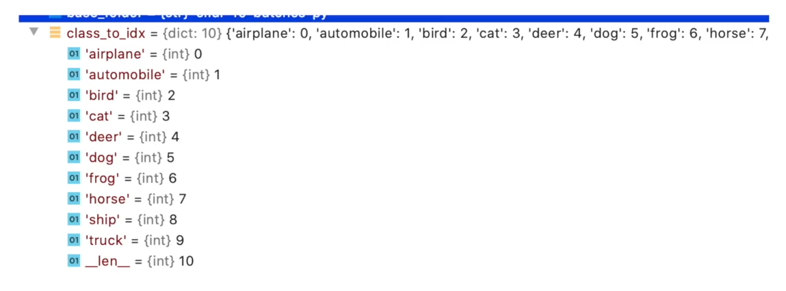

# 1. GPU训练30轮次
```python
import torchvision
import torch
from torch import nn
from torch.utils.data import DataLoader
from torch.utils.tensorboard import SummaryWriter
import time

# 定义训练的设备
#device = torch.device("cpu")
device = torch.device("cuda")   # 使用 GPU 方式一 
#device = torch.device("cuda:0") # 使用 GPU 方式二
#device = torch.device("cuda" if torch.cuda.is_available() else "cpu")

# from model import * 相当于把 model中的所有内容写到这里，这里直接把 model 写在这里
class Tudui(nn.Module):
    def __init__(self):
        super(Tudui, self).__init__()        
        self.model1 = nn.Sequential(
            nn.Conv2d(3,32,5,1,2),  # 输入通道3，输出通道32，卷积核尺寸5×5，步长1，填充2    
            nn.MaxPool2d(2),
            nn.Conv2d(32,32,5,1,2),
            nn.MaxPool2d(2),
            nn.Conv2d(32,64,5,1,2),
            nn.MaxPool2d(2),
            nn.Flatten(),  # 展平后变成 64*4*4 了
            nn.Linear(64*4*4,64),
            nn.Linear(64,10)
        )
        
    def forward(self, x):
        x = self.model1(x)
        return x

# 准备数据集
train_data = torchvision.datasets.CIFAR10("./dataset",train=True,transform=torchvision.transforms.ToTensor(),download=True)       
test_data = torchvision.datasets.CIFAR10("./dataset",train=False,transform=torchvision.transforms.ToTensor(),download=True)       

# length 长度
train_data_size = len(train_data)
test_data_size = len(test_data)
# 如果train_data_size=10，则打印：训练数据集的长度为：10
print("训练数据集的长度：{}".format(train_data_size))
print("测试数据集的长度：{}".format(test_data_size))

# 利用 Dataloader 来加载数据集
train_dataloader = DataLoader(train_data, batch_size=64)        
test_dataloader = DataLoader(test_data, batch_size=64)

# 创建网络模型
tudui = Tudui() 
tudui = tudui.to(device) # 也可以不赋值，直接 tudui.to(device) 


# 损失函数
loss_fn = nn.CrossEntropyLoss() # 交叉熵，fn 是 fuction 的缩写
loss_fn = loss_fn.to(device) # 也可以不赋值，直接loss_fn.to(device)

# 优化器
learning = 0.01  # 1e-2 就是 0.01 的意思
optimizer = torch.optim.SGD(tudui.parameters(),learning)   # 随机梯度下降优化器  

# 设置网络的一些参数
# 记录训练的次数
total_train_step = 0
# 记录测试的次数
total_test_step = 0

# 训练的轮次
epoch = 30

# 添加 tensorboard
writer = SummaryWriter("logs")
start_time = time.time()

for i in range(epoch):
    print("-----第 {} 轮训练开始-----".format(i+1))
    
    # 训练步骤开始
    tudui.train() # 当网络中有dropout层、batchnorm层时，这些层能起作用
    for data in train_dataloader:
        imgs, targets = data            
        imgs = imgs.to(device) # 也可以不赋值，直接 imgs.to(device)
        targets = targets.to(device) # 也可以不赋值，直接 targets.to(device)
        outputs = tudui(imgs)
        loss = loss_fn(outputs, targets) # 计算实际输出与目标输出的差距
        
        # 优化器对模型调优
        optimizer.zero_grad()  # 梯度清零
        loss.backward() # 反向传播，计算损失函数的梯度
        optimizer.step()   # 根据梯度，对网络的参数进行调优
        
        total_train_step = total_train_step + 1
        if total_train_step % 100 == 0:
            end_time = time.time()
            print(end_time - start_time) # 运行训练一百次后的时间间隔
            print("训练次数：{}，Loss：{}".format(total_train_step,loss.item()))  # 方式二：获得loss值
            writer.add_scalar("train_loss",loss.item(),total_train_step)
    
    # 测试步骤开始（每一轮训练后都查看在测试数据集上的loss情况）
    tudui.eval()  # 当网络中有dropout层、batchnorm层时，这些层不能起作用
    total_test_loss = 0
    total_accuracy = 0
    with torch.no_grad():  # 没有梯度了
        for data in test_dataloader: # 测试数据集提取数据
            imgs, targets = data # 数据放到cuda上
            imgs = imgs.to(device) # 也可以不赋值，直接 imgs.to(device)
            targets = targets.to(device) # 也可以不赋值，直接 targets.to(device)
            outputs = tudui(imgs)
            loss = loss_fn(outputs, targets) # 仅data数据在网络模型上的损失
            total_test_loss = total_test_loss + loss.item() # 所有loss
            accuracy = (outputs.argmax(1) == targets).sum()
            total_accuracy = total_accuracy + accuracy
            
    print("整体测试集上的Loss：{}".format(total_test_loss))
    print("整体测试集上的正确率：{}".format(total_accuracy/test_data_size))
    writer.add_scalar("test_loss",total_test_loss,total_test_step)
    writer.add_scalar("test_accuracy",total_accuracy/test_data_size,total_test_step)  
    total_test_step = total_test_step + 1
    
    torch.save(tudui, "./model/tudui_{}.pth".format(i)) # 保存每一轮训练后的结果
    #torch.save(tudui.state_dict(),"tudui_{}.path".format(i)) # 保存方式二         
    print("模型已保存")
    
writer.close()
```
```
Files already downloaded and verified
Files already downloaded and verified
训练数据集的长度：50000
测试数据集的长度：10000
-----第 1 轮训练开始-----
5.685762882232666
训练次数：100，Loss：2.2807211875915527
6.8356146812438965
训练次数：200，Loss：2.2813711166381836
7.945774078369141
训练次数：300，Loss：2.2436840534210205
9.072552680969238
训练次数：400，Loss：2.139457941055298
10.142128705978394
训练次数：500，Loss：1.9927244186401367
11.256510734558105
训练次数：600，Loss：2.020139217376709
12.32331919670105
训练次数：700，Loss：1.9936145544052124
整体测试集上的Loss：305.39513182640076
整体测试集上的正确率：0.29249998927116394
模型已保存
-----第 2 轮训练开始-----
14.885101795196533
训练次数：800，Loss：1.8381659984588623
15.946402072906494
训练次数：900，Loss：1.8096566200256348
17.04418158531189
训练次数：1000，Loss：1.8778941631317139
18.129207611083984
训练次数：1100，Loss：1.943365216255188
19.237319469451904
训练次数：1200，Loss：1.6915777921676636
20.327224731445312
训练次数：1300，Loss：1.6145961284637451
21.416797161102295
训练次数：1400，Loss：1.6929054260253906
22.50489115715027
训练次数：1500，Loss：1.7844973802566528
整体测试集上的Loss：288.42822670936584
整体测试集上的正确率：0.33959999680519104
模型已保存
-----第 3 轮训练开始-----
25.12572717666626
训练次数：1600，Loss：1.7492048740386963
26.190120220184326
训练次数：1700，Loss：1.6514606475830078
27.24756360054016
训练次数：1800，Loss：1.9523682594299316
28.325439929962158
训练次数：1900，Loss：1.6749478578567505
29.425256729125977
训练次数：2000，Loss：1.8842331171035767
30.521796941757202
训练次数：2100，Loss：1.498270034790039
31.60054850578308
训练次数：2200，Loss：1.479935646057129
32.69549083709717
训练次数：2300，Loss：1.7259459495544434
整体测试集上的Loss：261.9053739309311
整体测试集上的正确率：0.3955000042915344
模型已保存
-----第 4 轮训练开始-----
35.35346078872681
训练次数：2400，Loss：1.7560359239578247
36.50753092765808
训练次数：2500，Loss：1.3551620244979858
37.62624526023865
训练次数：2600，Loss：1.583783745765686
38.73269581794739
训练次数：2700，Loss：1.6835883855819702
39.81805419921875
训练次数：2800，Loss：1.5066486597061157
40.89897561073303
训练次数：2900，Loss：1.6178346872329712
41.978501081466675
训练次数：3000，Loss：1.3419572114944458
43.079394578933716
训练次数：3100，Loss：1.5225186347961426
整体测试集上的Loss：253.58813428878784
整体测试集上的正确率：0.4153999984264374
模型已保存
-----第 5 轮训练开始-----
45.72289848327637
训练次数：3200，Loss：1.3623679876327515
46.82145309448242
训练次数：3300，Loss：1.4360203742980957
47.88934278488159
训练次数：3400，Loss：1.5007973909378052
48.98452544212341
训练次数：3500，Loss：1.5463669300079346
50.044403076171875
训练次数：3600，Loss：1.6122682094573975
51.145737409591675
训练次数：3700，Loss：1.3164969682693481
52.224546670913696
训练次数：3800，Loss：1.2721624374389648
53.316651582717896
训练次数：3900，Loss：1.4059081077575684
整体测试集上的Loss：243.6600570678711
整体测试集上的正确率：0.43849998712539673
模型已保存
-----第 6 轮训练开始-----
55.939093828201294
训练次数：4000，Loss：1.3896945714950562
57.10062837600708
训练次数：4100，Loss：1.4203869104385376
58.1853346824646
训练次数：4200，Loss：1.5092504024505615
59.27726936340332
训练次数：4300，Loss：1.2549546957015991
60.38215517997742
训练次数：4400，Loss：1.1557636260986328
61.462907552719116
训练次数：4500，Loss：1.3356294631958008
62.57123851776123
训练次数：4600，Loss：1.4316595792770386
整体测试集上的Loss：233.62617886066437
整体测试集上的正确率：0.45909997820854187
模型已保存
-----第 7 轮训练开始-----
65.19007658958435
训练次数：4700，Loss：1.2923930883407593
66.32417273521423
训练次数：4800，Loss：1.514396071434021
67.48048806190491
训练次数：4900，Loss：1.3450605869293213
68.62122654914856
训练次数：5000，Loss：1.4084830284118652
69.71917247772217
训练次数：5100，Loss：0.9838876724243164
70.81213164329529
训练次数：5200，Loss：1.2724872827529907
71.89973473548889
训练次数：5300，Loss：1.24579656124115
73.00568556785583
训练次数：5400，Loss：1.3361798524856567
整体测试集上的Loss：224.09909868240356
整体测试集上的正确率：0.4838999807834625
模型已保存
-----第 8 轮训练开始-----
75.59451961517334
训练次数：5500，Loss：1.1921392679214478
76.7000367641449
训练次数：5600，Loss：1.2488406896591187
77.77421236038208
训练次数：5700，Loss：1.1721949577331543
78.86560225486755
训练次数：5800，Loss：1.2595291137695312
79.94558382034302
训练次数：5900，Loss：1.3135168552398682
81.05635809898376
训练次数：6000，Loss：1.5763839483261108
82.18682670593262
训练次数：6100，Loss：0.9930293560028076
83.2471137046814
训练次数：6200，Loss：1.078225016593933
整体测试集上的Loss：212.63363873958588
整体测试集上的正确率：0.5137999653816223
模型已保存
-----第 9 轮训练开始-----
85.80370163917542
训练次数：6300，Loss：1.3991423845291138
86.89490747451782
训练次数：6400，Loss：1.1313153505325317
87.96531939506531
训练次数：6500，Loss：1.629166841506958
89.07308554649353
训练次数：6600，Loss：1.0727297067642212
90.15298676490784
训练次数：6700，Loss：1.082014799118042
91.23814225196838
训练次数：6800，Loss：1.1563323736190796
92.33663129806519
训练次数：6900，Loss：1.1622871160507202
93.4073634147644
训练次数：7000，Loss：0.9779142141342163
整体测试集上的Loss：203.43007349967957
整体测试集上的正确率：0.5370000004768372
模型已保存
-----第 10 轮训练开始-----
96.12465476989746
训练次数：7100，Loss：1.284026861190796
97.21656942367554
训练次数：7200，Loss：1.000484824180603
98.30963373184204
训练次数：7300，Loss：1.09619140625
99.4168176651001
训练次数：7400，Loss：0.843334436416626
100.56277847290039
训练次数：7500，Loss：1.2291951179504395
101.66866254806519
训练次数：7600，Loss：1.2535988092422485
102.83877515792847
训练次数：7700，Loss：0.9017428755760193
103.93982768058777
训练次数：7800，Loss：1.237086534500122
整体测试集上的Loss：195.0189254283905
整体测试集上的正确率：0.560699999332428
模型已保存
-----第 11 轮训练开始-----
106.55706119537354
训练次数：7900，Loss：1.4266151189804077
107.71211099624634
训练次数：8000，Loss：1.1279882192611694
108.82028222084045
训练次数：8100，Loss：1.0164259672164917
109.90560793876648
训练次数：8200，Loss：1.326285719871521
111.01533007621765
训练次数：8300，Loss：1.2919878959655762
112.09464716911316
训练次数：8400，Loss：1.1172809600830078
113.18349170684814
训练次数：8500，Loss：1.238521695137024
114.26246976852417
训练次数：8600，Loss：0.9506199359893799
整体测试集上的Loss：189.5619250535965
整体测试集上的正确率：0.5791000127792358
模型已保存
-----第 12 轮训练开始-----
116.91842579841614
训练次数：8700，Loss：1.2369173765182495
117.99103927612305
训练次数：8800，Loss：1.364282250404358
119.09814977645874
训练次数：8900，Loss：1.0267009735107422
120.21280121803284
训练次数：9000，Loss：1.1791435480117798
121.33650541305542
训练次数：9100，Loss：1.088217854499817
122.4616470336914
训练次数：9200，Loss：1.0550415515899658
123.55414509773254
训练次数：9300，Loss：1.1007109880447388
整体测试集上的Loss：185.11176592111588
整体测试集上的正确率：0.5916999578475952
模型已保存
-----第 13 轮训练开始-----
126.1269052028656
训练次数：9400，Loss：0.9525507688522339
127.21744632720947
训练次数：9500，Loss：1.326805830001831
128.30660438537598
训练次数：9600，Loss：1.1132607460021973
129.3770444393158
训练次数：9700，Loss：1.107414960861206
130.55656147003174
训练次数：9800，Loss：0.9924419522285461
131.65843152999878
训练次数：9900，Loss：0.9918938279151917
132.75958061218262
训练次数：10000，Loss：0.9259409308433533
133.84795117378235
训练次数：10100，Loss：0.9180102944374084
整体测试集上的Loss：181.06443816423416
整体测试集上的正确率：0.6044999957084656
模型已保存
-----第 14 轮训练开始-----
136.49927639961243
训练次数：10200，Loss：0.8106740117073059
137.60312509536743
训练次数：10300，Loss：0.9383634924888611
138.7491099834442
训练次数：10400，Loss：1.1004360914230347
139.85301280021667
训练次数：10500，Loss：0.7797534465789795
140.99656891822815
训练次数：10600，Loss：0.9295462965965271
142.11146521568298
训练次数：10700，Loss：0.7535973787307739
143.27931904792786
训练次数：10800，Loss：0.8077783584594727
144.41241145133972
训练次数：10900，Loss：0.9719076752662659
整体测试集上的Loss：177.12851840257645
整体测试集上的正确率：0.6136999726295471
模型已保存
-----第 15 轮训练开始-----
147.15464234352112
训练次数：11000，Loss：1.2142902612686157
148.30661296844482
训练次数：11100，Loss：0.8816019892692566
149.50865268707275
训练次数：11200，Loss：1.0662524700164795
150.67739176750183
训练次数：11300，Loss：1.1508761644363403
151.86311507225037
训练次数：11400，Loss：0.7579834461212158
153.0713450908661
训练次数：11500，Loss：1.0883594751358032
154.2581102848053
训练次数：11600，Loss：0.9534128308296204
155.4750611782074
训练次数：11700，Loss：0.89979088306427
整体测试集上的Loss：173.94284933805466
整体测试集上的正确率：0.6227999925613403
模型已保存
-----第 16 轮训练开始-----
158.27037262916565
训练次数：11800，Loss：0.9032186269760132
159.4713671207428
训练次数：11900，Loss：0.9124546647071838
160.67075204849243
训练次数：12000，Loss：0.8445446491241455
161.83198595046997
训练次数：12100，Loss：0.955165684223175
162.96881914138794
训练次数：12200，Loss：0.9986395239830017
164.14015531539917
训练次数：12300，Loss：0.9039932489395142
165.3250858783722
训练次数：12400，Loss：0.8506217002868652
166.47599816322327
训练次数：12500，Loss：0.6279873251914978
整体测试集上的Loss：172.14941000938416
整体测试集上的正确率：0.6277999877929688
模型已保存
-----第 17 轮训练开始-----
169.21585369110107
训练次数：12600，Loss：0.7518970966339111
170.3824064731598
训练次数：12700，Loss：0.9215213656425476
171.5670850276947
训练次数：12800，Loss：0.8257154226303101

```
```
172.7262568473816
训练次数：12900，Loss：1.0514277219772339
173.88416504859924
训练次数：13000，Loss：0.989711582660675
175.0773892402649
训练次数：13100，Loss：0.6482387185096741
176.22362112998962
训练次数：13200，Loss：0.770613968372345
整体测试集上的Loss：170.60762631893158
整体测试集上的正确率：0.6316999793052673
模型已保存
-----第 18 轮训练开始-----
178.91316437721252
训练次数：13300，Loss：0.9861776232719421
180.09528851509094
训练次数：13400，Loss：0.7526777386665344
181.2844262123108
训练次数：13500，Loss：0.8348026275634766
182.45123887062073
训练次数：13600，Loss：1.4109115600585938
183.62940311431885
训练次数：13700，Loss：0.7218388915061951
184.82756924629211
训练次数：13800，Loss：0.972119927406311
186.01035046577454
训练次数：13900，Loss：0.6937052607536316
187.19038343429565
训练次数：14000，Loss：0.7990372180938721
整体测试集上的Loss：168.84090358018875
整体测试集上的正确率：0.6358000040054321
模型已保存
-----第 19 轮训练开始-----
189.9926517009735
训练次数：14100，Loss：1.0224566459655762
191.18131160736084
训练次数：14200，Loss：0.8821209073066711
192.36730790138245
训练次数：14300，Loss：0.8973230123519897
193.5643389225006
训练次数：14400，Loss：0.9536952376365662
194.80951523780823
训练次数：14500，Loss：0.8836072087287903
196.0265154838562
训练次数：14600，Loss：1.071815013885498
197.24265241622925
训练次数：14700，Loss：0.8254064321517944
198.45570874214172
训练次数：14800，Loss：1.2353284358978271
整体测试集上的Loss：168.32685685157776
整体测试集上的正确率：0.6360999941825867
模型已保存
-----第 20 轮训练开始-----
201.18919134140015
训练次数：14900，Loss：0.6770450472831726
202.36627554893494
训练次数：15000，Loss：0.8657706379890442
203.52704691886902
训练次数：15100，Loss：0.7141180634498596
204.7052822113037
训练次数：15200，Loss：0.9444342851638794
205.86877846717834
训练次数：15300，Loss：0.6069492101669312
207.05544352531433
训练次数：15400，Loss：0.8864141702651978
208.22029948234558
训练次数：15500，Loss：0.9243060946464539
209.3724765777588
训练次数：15600，Loss：0.771957516670227
整体测试集上的Loss：168.21677833795547
整体测试集上的正确率：0.6384999752044678
模型已保存
-----第 21 轮训练开始-----
212.11495280265808
训练次数：15700，Loss：0.7191241979598999
213.31386590003967
训练次数：15800，Loss：0.9433155655860901
214.48469805717468
训练次数：15900，Loss：0.9915865063667297
215.691748380661
训练次数：16000，Loss：0.8580103516578674
216.85657501220703
训练次数：16100，Loss：0.7295430302619934
218.0546896457672
训练次数：16200，Loss：0.9427600502967834
219.23864316940308
训练次数：16300，Loss：0.6932554244995117
220.4110939502716
训练次数：16400，Loss：0.6746671199798584
整体测试集上的Loss：168.7458095550537
整体测试集上的正确率：0.6385999917984009
模型已保存
-----第 22 轮训练开始-----
223.20479941368103
训练次数：16500，Loss：0.8732750415802002
224.390287399292
训练次数：16600，Loss：0.9297986626625061
225.5694763660431
训练次数：16700，Loss：0.9048570990562439
226.78037357330322
训练次数：16800，Loss：0.76099693775177
227.9262249469757
训练次数：16900，Loss：0.6679417490959167
229.11014795303345
训练次数：17000，Loss：1.181579828262329
230.29246425628662
训练次数：17100，Loss：0.6620275974273682
231.493239402771
训练次数：17200，Loss：0.664097249507904
整体测试集上的Loss：169.8609937429428
整体测试集上的正确率：0.637499988079071
模型已保存
-----第 23 轮训练开始-----
234.27106308937073
训练次数：17300，Loss：0.8724012970924377
235.45661783218384
训练次数：17400，Loss：0.9425235390663147
236.64662623405457
训练次数：17500，Loss：0.7269912958145142
237.86503314971924
训练次数：17600，Loss：0.7194119691848755
239.01475381851196
训练次数：17700，Loss：0.7852820754051208
240.1758153438568
训练次数：17800，Loss：0.7733107805252075
241.3398380279541
训练次数：17900，Loss：0.8076053261756897
整体测试集上的Loss：170.6863653063774
整体测试集上的正确率：0.6371999979019165
模型已保存
-----第 24 轮训练开始-----
244.07902574539185
训练次数：18000，Loss：0.8552568554878235
245.25485038757324
训练次数：18100，Loss：0.5549949407577515
246.44470381736755
训练次数：18200，Loss：0.8132153153419495
247.62908339500427
训练次数：18300，Loss：0.6714959144592285
248.79626488685608
训练次数：18400，Loss：0.6672235131263733
249.95225954055786
训练次数：18500，Loss：0.800999641418457
251.13182163238525
训练次数：18600，Loss：0.5262686610221863
252.3044810295105
训练次数：18700，Loss：0.7499000430107117
整体测试集上的Loss：171.33498692512512
整体测试集上的正确率：0.6376999616622925
模型已保存
-----第 25 轮训练开始-----
255.06015586853027
训练次数：18800，Loss：0.7402669191360474
256.21373891830444
训练次数：18900，Loss：0.5978196263313293
257.404180765152
训练次数：19000，Loss：0.6754338145256042
258.59692668914795
训练次数：19100，Loss：0.5589580535888672
259.7701075077057
训练次数：19200，Loss：0.531922459602356
260.9389097690582
训练次数：19300，Loss：0.7425826787948608
262.1200385093689
训练次数：19400，Loss：0.8776072859764099
263.30342960357666
训练次数：19500，Loss：0.6360160112380981
整体测试集上的Loss：171.71832472085953
整体测试集上的正确率：0.637499988079071
模型已保存
-----第 26 轮训练开始-----
266.00391364097595
训练次数：19600，Loss：0.8082662224769592
267.1639335155487
训练次数：19700，Loss：0.6162960529327393
268.3373336791992
训练次数：19800，Loss：0.876618504524231
269.5011901855469
训练次数：19900，Loss：0.9085995554924011
270.68650460243225
训练次数：20000，Loss：0.8501061797142029
271.9259281158447
训练次数：20100，Loss：0.8174670934677124
273.12516808509827
训练次数：20200，Loss：1.0724962949752808
274.32264852523804
训练次数：20300，Loss：0.6343507170677185
整体测试集上的Loss：172.47045278549194
整体测试集上的正确率：0.6394000053405762
模型已保存
-----第 27 轮训练开始-----
277.1573736667633
训练次数：20400，Loss：0.6540669798851013
278.33781147003174
训练次数：20500，Loss：0.5897015929222107
279.5300703048706
训练次数：20600，Loss：0.4914679527282715
280.6773886680603
训练次数：20700，Loss：0.7035619616508484
281.8361291885376
训练次数：20800，Loss：0.5401226878166199
282.99849557876587
训练次数：20900，Loss：0.6221712231636047
284.17470717430115
训练次数：21000，Loss：0.8537976741790771
285.3701333999634
训练次数：21100，Loss：0.7092658877372742
整体测试集上的Loss：173.46831703186035
整体测试集上的正确率：0.6399999856948853
模型已保存
-----第 28 轮训练开始-----
288.0989239215851
训练次数：21200，Loss：0.8174431324005127
289.24120450019836
训练次数：21300，Loss：0.68904709815979
290.4222309589386
训练次数：21400，Loss：0.7744821906089783
291.613312959671
训练次数：21500，Loss：0.5719355940818787
292.80280566215515
训练次数：21600，Loss：0.6388695240020752
294.0078239440918
训练次数：21700，Loss：0.8393858671188354
295.1911723613739
训练次数：21800，Loss：0.6933169364929199
整体测试集上的Loss：173.1854910850525
整体测试集上的正确率：0.6428999900817871
模型已保存
-----第 29 轮训练开始-----
297.9738895893097
训练次数：21900，Loss：0.4256139099597931
299.17603182792664
训练次数：22000，Loss：0.6538084149360657
300.3422214984894
训练次数：22100，Loss：0.8267297744750977
301.52275681495667
训练次数：22200，Loss：0.42121270298957825
302.7328658103943
训练次数：22300，Loss：0.5014783143997192
303.91381192207336
训练次数：22400，Loss：0.7099611759185791
305.09802865982056
训练次数：22500，Loss：0.8721457719802856
306.2816848754883
训练次数：22600，Loss：0.3300861120223999
整体测试集上的Loss：174.15364342927933
整体测试集上的正确率：0.6452999711036682
模型已保存
-----第 30 轮训练开始-----
309.065292596817
训练次数：22700，Loss：0.733674168586731
310.248877286911
训练次数：22800，Loss：0.6733675003051758
311.45992732048035
训练次数：22900，Loss：0.7449073791503906
312.6487421989441
训练次数：23000，Loss：0.6279532313346863
313.82962799072266
训练次数：23100，Loss：0.5574349761009216
315.03411650657654
训练次数：23200，Loss：0.6098644733428955
316.20984983444214
训练次数：23300，Loss：0.7981359362602234
317.3920772075653
训练次数：23400，Loss：0.5183050036430359
整体测试集上的Loss：174.22026354074478
整体测试集上的正确率：0.6488999724388123
模型已保存

```
# 2. 验证狗是否识别
① 完整的模型验证(测试，demo)套路，利用已经训练好的模型，然后给它提供输入。
```python
import torchvision
from PIL import Image
from torch import nn
import torch

image_path = "imgs/dog.png"
image = Image.open(image_path) # PIL类型的Image
image = image.convert("RGB")  # 4通道的RGBA转为3通道的RGB图片
print(image)

transform = torchvision.transforms.Compose([torchvision.transforms.Resize((32,32)),   
                                            torchvision.transforms.ToTensor()])

image = transform(image)
print(image.shape)

class Tudui(nn.Module):
    def __init__(self):
        super(Tudui, self).__init__()        
        self.model1 = nn.Sequential(
            nn.Conv2d(3,32,5,1,2),
            nn.MaxPool2d(2),
            nn.Conv2d(32,32,5,1,2),
            nn.MaxPool2d(2),
            nn.Conv2d(32,64,5,1,2),
            nn.MaxPool2d(2),
            nn.Flatten(),
            nn.Linear(64*4*4,64),
            nn.Linear(64,10)
        )
        
    def forward(self, x):
        x = self.model1(x)
        return x

model = torch.load("model/tudui_29.pth",map_location=torch.device('cpu')) # GPU上训练的东西映射到CPU上    
print(model)
image = torch.reshape(image,(1,3,32,32)) # 转为四维，符合网络输入需求
model.eval()
with torch.no_grad():  # 不进行梯度计算，减少内存计算
    output = model(image)
output = model(image)
print(output)
print(output.argmax(1)) # 概率最大类别的输出
```
```
<PIL.Image.Image image mode=RGB size=307x173 at 0x1A23417EDA0>
torch.Size([3, 32, 32])
Tudui(
  (model1): Sequential(
    (0): Conv2d(3, 32, kernel_size=(5, 5), stride=(1, 1), padding=(2, 2))
    (1): MaxPool2d(kernel_size=2, stride=2, padding=0, dilation=1, ceil_mode=False)
    (2): Conv2d(32, 32, kernel_size=(5, 5), stride=(1, 1), padding=(2, 2))
    (3): MaxPool2d(kernel_size=2, stride=2, padding=0, dilation=1, ceil_mode=False)
    (4): Conv2d(32, 64, kernel_size=(5, 5), stride=(1, 1), padding=(2, 2))
    (5): MaxPool2d(kernel_size=2, stride=2, padding=0, dilation=1, ceil_mode=False)
    (6): Flatten(start_dim=1, end_dim=-1)
    (7): Linear(in_features=1024, out_features=64, bias=True)
    (8): Linear(in_features=64, out_features=10, bias=True)
  )
)
tensor([[ 1.3921, -5.8952,  6.7765,  2.6106,  3.3179,  6.3351, -5.1229,  3.0367,
         -8.6725, -5.5459]], grad_fn=<AddmmBackward0>)
tensor([2])

```
# 3. 验证飞机是否识别
```python
import torchvision
from PIL import Image
from torch import nn
import torch

image_path = "imgs/plane.png"
image = Image.open(image_path) # PIL类型的Image
image = image.convert("RGB")  # 4通道的RGBA转为3通道的RGB图片
print(image)

transform = torchvision.transforms.Compose([torchvision.transforms.Resize((32,32)),   
                                            torchvision.transforms.ToTensor()])

image = transform(image)
print(image.shape)

class Tudui(nn.Module):
    def __init__(self):
        super(Tudui, self).__init__()        
        self.model1 = nn.Sequential(
            nn.Conv2d(3,32,5,1,2),
            nn.MaxPool2d(2),
            nn.Conv2d(32,32,5,1,2),
            nn.MaxPool2d(2),
            nn.Conv2d(32,64,5,1,2),
            nn.MaxPool2d(2),
            nn.Flatten(),
            nn.Linear(64*4*4,64),
            nn.Linear(64,10)
        )
        
    def forward(self, x):
        x = self.model1(x)
        return x

model = torch.load("model/tudui_29.pth",map_location=torch.device('cpu')) # GPU上训练的东西映射到CPU上    
print(model)
image = torch.reshape(image,(1,3,32,32)) # 转为四维，符合网络输入需求
model.eval()
with torch.no_grad():  # 不进行梯度计算，减少内存计算
    output = model(image)
output = model(image)
print(output)
print(output.argmax(1)) # 概率最大类别的输出
```
```
<PIL.Image.Image image mode=RGB size=245x181 at 0x1A236055908>
torch.Size([3, 32, 32])
Tudui(
  (model1): Sequential(
    (0): Conv2d(3, 32, kernel_size=(5, 5), stride=(1, 1), padding=(2, 2))
    (1): MaxPool2d(kernel_size=2, stride=2, padding=0, dilation=1, ceil_mode=False)
    (2): Conv2d(32, 32, kernel_size=(5, 5), stride=(1, 1), padding=(2, 2))
    (3): MaxPool2d(kernel_size=2, stride=2, padding=0, dilation=1, ceil_mode=False)
    (4): Conv2d(32, 64, kernel_size=(5, 5), stride=(1, 1), padding=(2, 2))
    (5): MaxPool2d(kernel_size=2, stride=2, padding=0, dilation=1, ceil_mode=False)
    (6): Flatten(start_dim=1, end_dim=-1)
    (7): Linear(in_features=1024, out_features=64, bias=True)
    (8): Linear(in_features=64, out_features=10, bias=True)
  )
)
tensor([[ 3.9218,  1.2536,  1.1701,  0.1064,  2.2779, -4.4623,  0.0393, -4.2867,
          2.3805, -2.1321]], grad_fn=<AddmmBackward0>)
tensor([0])

```

