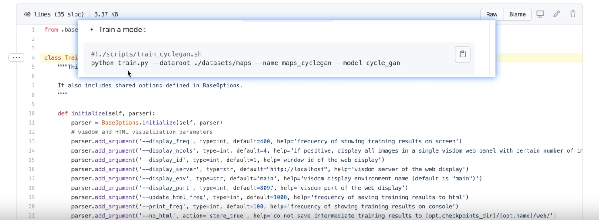

# 1. parser.add_argument
① 像运行Tensorboar一样，在Terminal终端，可以命令运行.py文件。

② 如下图所示，Terminal终端运行.py文件时，--变量 后面的值是给变量进行赋值，赋值后再在.py文件中运行。例如 ./datasets/maps 是给前面的dataroot赋值，maps_cyclegan是给前面的name赋值，cycle_gan是给前面的model赋值。

③ required表示必须需要指定参数，default表示有默认的参数了。Terminal终端命令语句，如果不对该默认变量新写入，直接调用默认的参数；如果对该默认变量新写入，则默认的参数被新写入的参数覆盖。

